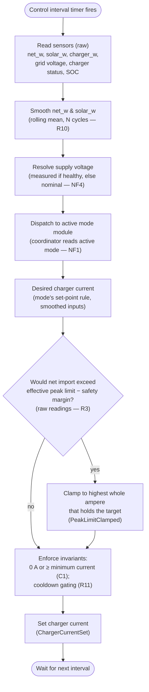

# Control cycle

The coordinator spine that every use-case plugs into. This is the loop the integration runs
on a timer; each use-case supplies a **mode module** that the loop dispatches to, and each
resolution rule supplies a lookup the loop or a mode consumes. This document is authoritative
for the order of operations in one control cycle and for the invariants that hold regardless of
which mode is active.

Follows the flow-document standard: **Purpose → Trigger → Domain events → Mermaid diagram →
Steps → Edge cases → Requirements satisfied**.

---

## Purpose

Run the [coordinator](system-overview.md#ubiquitous-language) once per [control
interval](system-overview.md#ubiquitous-language): read the sensors, smooth the power readings,
ask the [active mode](system-overview.md#ubiquitous-language) module for a desired charger
current, clamp that current with peak protection, and set it. The coordinator executes the
active mode and never chooses it (NF1); mode choice belongs to the [profile](system-overview.md#ubiquitous-language)
(see `resolution-rules.md`, Auto mode-selection). All inputs and outputs cross `sc_` wrapper
entities (NF3); see `entity-catalog.md` for their bindings.

## Trigger

A timer firing every control interval (configurable via `input_number.sc_control_interval_s`,
default 10 s). The cycle is otherwise stateless between firings except for the rolling
smoothing window and the rapid-cycling timers, which persist across cycles.

## Domain events produced

- `SensorsRead` — past-tense — the cycle has captured a fresh raw reading of every input
  wrapper; signals the start of one cycle's processing.
- `PeakLimitClamped` — the peak-protection step reduced the mode's desired current to keep
  net import at or below the [effective peak limit](system-overview.md#ubiquitous-language)
  minus the [safety margin](system-overview.md#ubiquitous-language); signals that peak
  protection, not the mode, decided the set-point this cycle.
- `ChargerCurrentSet` — the cycle has written the final charger current to the charger
  wrapper; signals the end of one cycle and the value applied.

## Diagram

## Steps

1. **Read sensors (raw).** The coordinator reads each input through its `sc_` wrapper (NF3):
   net grid import, solar power, charger power, the measured grid voltage, charger status, and
   state of charge. These are [raw values](system-overview.md#ubiquitous-language) — the most
   recent, unsmoothed readings (the measured grid voltage is resolved into the
   [supply voltage](system-overview.md#ubiquitous-language) in step 3). Produces `SensorsRead`.
2. **Smooth the power readings (R10).** The coordinator pushes this cycle's raw `net_w` and
   `solar_w` into a rolling window of the last *N* samples (configurable, default 4) and
   recomputes the [smoothed value](system-overview.md#ubiquitous-language) of each. Smoothed
   values feed charging-rate decisions; the raw values are retained for peak protection. A
   spike lasting a single cycle does not move the smoothed value; a change sustained across the
   full window does, within the following cycle.
3. **Resolve the supply voltage (NF4).** The coordinator selects the [supply
   voltage](system-overview.md#ubiquitous-language) used for all amperes↔watts conversions this
   cycle: the measured grid voltage when a healthy reading is available, otherwise the
   configurable nominal voltage (default 230 V). Using the live value keeps current-derived
   thresholds (e.g. the minimum charging current) correct as grid voltage drifts.
4. **Dispatch to the active mode module (NF1).** The coordinator reads the active mode from
   `input_select.sc_active_mode` and calls the matching module, passing the smoothed readings
   and the resolved voltage. The module returns a **desired charger current** using its own
   set-point rule (defined in the mode use-case — UC01–UC04; e.g. the `Off` module returns
   0 A). The coordinator contains no logic that chooses or changes the mode.
5. **Apply the peak-protection clamp (R3).** Using the **raw** readings (not the smoothed
   ones, to avoid lag), the coordinator checks whether the desired current would push net
   import above the effective peak limit minus the safety margin. If so, it reduces the current
   to the highest whole ampere that keeps net import at or below that target, within the same
   cycle, and emits `PeakLimitClamped`. The effective peak limit itself is resolved by
   `resolution-rules.md` (it rises to the maximum peak only under deadline urgency, R5/C3).
6. **Enforce the invariants.** The final current obeys C1 — it is either 0 A or at least the
   [minimum charging current](system-overview.md#ubiquitous-language), never in between — and
   the rapid-cycling invariant (R11): once charging has stopped it does not restart until the
   mode-specific cooldown has fully elapsed, and a cooldown in progress always runs to
   completion. (Start/stop and cooldown durations are mode-specific and defined in each mode
   use-case; the coordinator only upholds the invariant.)
7. **Set the charger current.** The coordinator writes the final current to the charger
   through its `sc_` wrapper (NF3) and emits `ChargerCurrentSet`, then waits for the next
   interval.

## Edge cases

- **No healthy supply-voltage reading.** Conversions fall back to the configurable nominal
  voltage (default 230 V) for the cycle (NF4); the cycle still completes.
- **Peak breach persists.** A momentary breach only triggers a clamp, not a stop. The charger
  drops to 0 A only when it is already at the minimum charging current *and* net import has
  exceeded the target continuously for a configurable grace period (default 2 minutes, R3); the
  rapid-cycling cooldown then governs any restart (R11).
- **Mode switched mid-operation.** Switching the active mode resets all hold and cooldown
  timers so the incoming mode starts fresh (R11); the next cycle dispatches to the new module.
- **Smoothing window not yet full.** At start-up or after a restart the rolling mean is taken
  over the samples available so far until the window fills.
- **Mode requests a current below the minimum.** The invariant in step 6 resolves it to 0 A or
  the minimum per the mode's own rule (C1); the coordinator never emits an in-between value.

## Requirements satisfied

- **R3** — CapTar peak protection (the clamp in step 5, on raw readings).
- **R10** — Sensor smoothing (the rolling mean in step 2; peak protection exempt, step 5).
- **R11** — Rapid-cycling prevention (the cooldown/min-current invariant in step 6).
- **NF4** — Voltage-aware power conversion (voltage resolution in step 3).

Upholds but does not home: **NF1** (coordinator executes, never chooses the mode — homed in
`requirements.md`; mode choice in `resolution-rules.md`) and **NF3** (all I/O via `sc_`
wrappers — bindings in `entity-catalog.md`). **C1** and **C3** are enforced as invariants in
steps 5–6.
