# Control cycle

The coordinator spine that every use-case plugs into. This is the loop the integration runs
on a timer; each use-case supplies a **mode module** that the loop dispatches to, and each
resolution rule supplies a lookup the loop or a mode consumes. This document is authoritative
for the order of operations in one control cycle and for the invariants that hold regardless of
which mode is active.

Follows the flow-document standard: **Purpose → Trigger → Domain events → Mermaid diagram →
Steps → Edge cases → Requirements satisfied**.

---

## Purpose

Run the [coordinator](system-overview.md#ubiquitous-language) once per [control
interval](system-overview.md#ubiquitous-language): read the sensors, smooth the power readings,
ask the [active mode](system-overview.md#ubiquitous-language) module for a desired charger
current, raise that current under deadline urgency, clamp it with peak protection, and set it.
The coordinator executes the active mode and never chooses it (NF1); mode choice belongs to the
[profile](system-overview.md#ubiquitous-language) (see `resolution-rules.md`, Auto
mode-selection). The deadline-urgency response (also `resolution-rules.md`) is likewise a
coordinator-applied, profile-keyed rule rather than mode logic (NF2) — see
[UC05](use-cases/UC05-guarantee-ready-by-departure.md) for the goal it serves. All inputs and
outputs cross an adapter role (NF3); see `entity-catalog.md` for their bindings.

## Trigger

A timer firing every control interval (configurable via `input_number.sc_control_interval_s`,
default 10 s). The cycle is otherwise stateless between firings except for the rolling
smoothing window and the rapid-cycling timers, which persist across cycles.

## Domain events produced

- `SensorsRead` — past-tense — the cycle has captured a fresh raw reading through every input
  adapter role; signals the start of one cycle's processing.
- `DeadlineUrgencyEngaged` / `DeadlineUrgencyReverted` — the deadline-urgency response
  (`resolution-rules.md`) started or stopped raising the current toward the required current.
  Emitted by this coordinator (steps 5/9) only under `Manual`, where the dispatched mode never
  changes; under `Auto` the equivalent transition is Auto mode-selection escalating to or
  reverting from `Captar` (`resolution-rules.md`), not this coordinator. See
  [UC05](use-cases/UC05-guarantee-ready-by-departure.md) for the goal this serves and the state
  model these belong to.
- `PeakLimitClamped` — the peak-protection step reduced the desired current (the mode's own, or
  as raised by the deadline-urgency response) to keep net import at or below the [effective peak
  limit](system-overview.md#ubiquitous-language) minus the
  [safety margin](system-overview.md#ubiquitous-language); signals that peak protection, not the
  mode, decided the set-point this cycle.
- `SupplyCeilingClamped` — the grid-supply-ceiling step reduced the current to keep net grid
  import below the [grid supply ceiling](system-overview.md#ubiquitous-language) minus the
  [grid safety offset](system-overview.md#ubiquitous-language); signals that the hard
  fuse-protection limit (C4), not the mode or peak protection, decided the set-point.
- `ChargerCurrentSet` — the cycle has written the final charger current through the charger
  current adapter role; signals the end of one cycle and the value applied.
- `DeadlineUnreachableNotified` — the final current set this cycle is still below the required
  current (`resolution-rules.md`) even after every clamp; the System notified the user the
  deadline is unreachable (see UC05).

## Diagram

```mermaid
flowchart TD
    Timer(["Control interval timer fires"]) --> Read["Read sensors (raw)<br/>net_w, solar_w, charger_w,<br/>grid voltage, charger status, SOC"]
    Read --> Smooth["Smooth net_w & solar_w<br/>(rolling mean, N cycles — R10)"]
    Smooth --> Volt["Resolve supply voltage<br/>(measured if healthy, else nominal — NF4)"]
    Volt --> Dispatch["Dispatch to active mode module<br/>(coordinator reads active mode — NF1)"]
    Dispatch --> Desired["Desired charger current<br/>(mode's set-point rule, smoothed inputs)"]
    Desired --> Urgency{"Required current > desired current?<br/>(resolution-rules.md — R5)"}
    Urgency -->|yes| Raise["Raise per the active profile's<br/>deadline-urgency response,<br/>capped at maximum current (C1)<br/>(DeadlineUrgencyEngaged)"]
    Urgency -->|no| Peak
    Raise --> Peak{"Would net import exceed<br/>effective peak limit − safety margin?<br/>(raw readings — R3;<br/>skipped if Power disables it, R17)"}
    Peak -->|yes| Clamp["Clamp to highest whole ampere<br/>that holds the target<br/>(PeakLimitClamped)"]
    Peak -->|no| Ceiling
    Clamp --> Ceiling{"Would net import exceed<br/>grid supply ceiling − safety offset?<br/>(raw readings — C4, always)"}
    Ceiling -->|yes| CeilingClamp["Clamp so net import stays below<br/>ceiling − safety offset<br/>(SupplyCeilingClamped)"]
    Ceiling -->|no| Invariant
    CeilingClamp --> Invariant["Enforce invariants:<br/>0 A or ≥ minimum current (C1);<br/>cooldown gating (R11)"]
    Invariant --> Set["Set charger current<br/>(ChargerCurrentSet; DeadlineUrgencyReverted<br/>if urgency lifted; DeadlineUnreachableNotified<br/>if still short of the required current)"]
    Set --> Wait(["Wait for next interval"])
```

## Steps

1. **Read sensors (raw).** The coordinator reads each input through its adapter role (NF3):
   net grid import, solar power, charger power, the measured grid voltage, charger status, and
   state of charge. These are [raw values](system-overview.md#ubiquitous-language) — the most
   recent, unsmoothed readings (the measured grid voltage is resolved into the
   [supply voltage](system-overview.md#ubiquitous-language) in step 3). Produces `SensorsRead`.
2. **Smooth the power readings (R10).** The coordinator pushes this cycle's raw `net_w` and
   `solar_w` into a rolling window of the last *N* samples (configurable, default 4) and
   recomputes the [smoothed value](system-overview.md#ubiquitous-language) of each. Smoothed
   values feed charging-rate decisions; the raw values are retained for peak protection. A
   spike lasting a single cycle does not move the smoothed value; a change sustained across the
   full window does, within the following cycle.
3. **Resolve the supply voltage (NF4).** The coordinator selects the [supply
   voltage](system-overview.md#ubiquitous-language) used for all amperes↔watts conversions this
   cycle: the measured grid voltage when a healthy reading is available, otherwise the
   configurable nominal voltage (default 230 V). Using the live value keeps current-derived
   thresholds (e.g. the minimum charging current) correct as grid voltage drifts.
4. **Dispatch to the active mode module (NF1).** The coordinator reads the active mode from
   `input_select.sc_active_mode` and calls the matching module, passing the smoothed readings
   and the resolved voltage. The module returns a **desired charger current** using its own
   set-point rule (defined in the mode use-case — UC01–UC04; e.g. the `Off` module returns
   0 A). The coordinator contains no logic that chooses or changes the mode.
5. **Apply the deadline-urgency response (R5).** The coordinator computes the [required
   current](system-overview.md#ubiquitous-language) (`resolution-rules.md`) and compares it to
   the desired current from step 4. Under `Auto`,
   urgency was already detected and resolved upstream by Auto mode-selection (`resolution-rules.md`,
   row 2 — evaluated against the non-escalated baseline mode, not the dispatched one), which
   escalated the active mode to `Captar` before this cycle's dispatch; `Captar`'s own set-point
   rule already requests the maximum charging current, so this step is a no-op for `Auto` and
   does not itself detect or emit anything. Under `Manual`, the dispatched mode never changes, so
   this step performs the detection itself: when the required current exceeds the desired current
   from step 4, the coordinator raises the desired current directly to the required current,
   capped at the maximum charging current (C1), and emits `DeadlineUrgencyEngaged`. Either way the
   raised value is bounded, not decided, by the peak clamp in step 6, and this step never modifies
   the dispatched mode's own logic (NF2) — it adjusts only the value the mode returned.
6. **Apply the peak-protection clamp (R3).** Using the **raw** readings (not the smoothed
   ones, to avoid lag), the coordinator checks whether step 5's current would push net
   import above the effective peak limit minus the safety margin. If so, it reduces the current
   to the highest whole ampere that keeps net import at or below that target, within the same
   cycle, and emits `PeakLimitClamped`. The effective peak limit itself is resolved by
   `resolution-rules.md` (it rises to the maximum peak only under deadline urgency, R5/C3). This
   clamp is active in every mode except when `Power` mode has its peak-protection option disabled
   (R17); the grid supply ceiling clamp in step 7 still applies in that case.
7. **Apply the grid supply ceiling clamp (C4).** Regardless of mode — and even when the step 6
   peak clamp was skipped — the coordinator reduces the current, using **raw** readings (not
   smoothed, to avoid lag), so that net grid import stays below the
   [grid supply ceiling](system-overview.md#ubiquitous-language) minus the
   [grid safety offset](system-overview.md#ubiquitous-language) (converted to amperes via the
   resolved supply voltage). This is the hard fuse-protection limit and the one clamp `Power`
   mode cannot switch off; it emits `SupplyCeilingClamped` when it engages.
8. **Enforce the invariants.** The final current obeys C1 — it is either 0 A or at least the
   [minimum charging current](system-overview.md#ubiquitous-language), never in between — and
   the rapid-cycling invariant (R11): once charging has stopped it does not restart until the
   mode-specific cooldown has fully elapsed, and a cooldown in progress always runs to
   completion. (Start/stop and cooldown durations are mode-specific and defined in each mode
   use-case; the coordinator only upholds the invariant.)
9. **Set the charger current.** The coordinator writes the final current to the charger
   through its adapter role (NF3) and emits `ChargerCurrentSet`, then waits for the next
   interval. Under `Manual`, if the response in step 5 was raising the current but the required
   current no longer exceeds the dispatched mode's own desired current, it stops raising the
   current and this step emits `DeadlineUrgencyReverted` (under `Auto`, the equivalent revert is
   Auto mode-selection falling through to row 3 or 4 — emitted there, `resolution-rules.md`, not
   here). Regardless of profile, if the required current (step 5) still exceeds this final
   current even after every clamp, the System also emits `DeadlineUnreachableNotified` and
   notifies the user.

## Edge cases

- **No healthy supply-voltage reading.** Conversions fall back to the configurable nominal
  voltage (default 230 V) for the cycle (NF4); the cycle still completes.
- **Peak breach persists.** A momentary breach only triggers a clamp, not a stop. The charger
  drops to 0 A only when it is already at the minimum charging current *and* net import has
  exceeded the target continuously for a configurable grace period (default 2 minutes, R3); the
  rapid-cycling cooldown then governs any restart (R11).
- **Mode switched mid-operation.** Switching the active mode resets all hold and cooldown
  timers so the incoming mode starts fresh (R11); the next cycle dispatches to the new module.
- **Deadline urgency reverts mid-operation.** Because the required current (step 5) is
  recomputed from scratch every cycle, a change in conditions (SOC catching up, the deadline
  receding, the deadline resolving to "no deadline") stops the response raising the current on
  the very next cycle, with no dedicated timer — mirroring the Auto mode-selection revert
  (`resolution-rules.md`).
- **Smoothing window not yet full.** At start-up or after a restart the rolling mean is taken
  over the samples available so far until the window fills.
- **Mode requests a current below the minimum.** The invariant in step 8 resolves it to 0 A or
  the minimum per the mode's own rule (C1); the coordinator never emits an in-between value.
- **Grid supply ceiling reached.** The charger is clamped down — to 0 A if necessary — so net
  grid import stays below the grid supply ceiling minus the grid safety offset and the main fuse
  cannot trip (C4). This applies even in `Power` mode with peak protection disabled, where it is
  the only active clamp.

## Requirements satisfied

- **R3** — CapTar peak protection (the clamp in step 6, on raw readings).
- **R5** — Departure deadline guarantee (the response applied in step 5, using the
  required-current computation in `resolution-rules.md`; the deadline-unreachable notification
  in step 9).
- **R10** — Sensor smoothing (the rolling mean in step 2; peak protection exempt, step 6).
- **R11** — Rapid-cycling prevention (the cooldown/min-current invariant in step 8).
- **NF4** — Voltage-aware power conversion (voltage resolution in step 3).

Upholds but does not home: **NF1** (coordinator executes, never chooses the mode — homed in
`requirements.md`; mode choice in `resolution-rules.md`), **NF2** (the deadline-urgency response
adjusts only the current a mode returns, under either profile, without altering that mode's own
logic — homed in `requirements.md`), and **NF3** (all I/O via adapter roles — bindings in
`entity-catalog.md`). **C1**, **C3**, and **C4** (grid supply ceiling clamp, step 7) are enforced
as invariants in steps 6–8.
