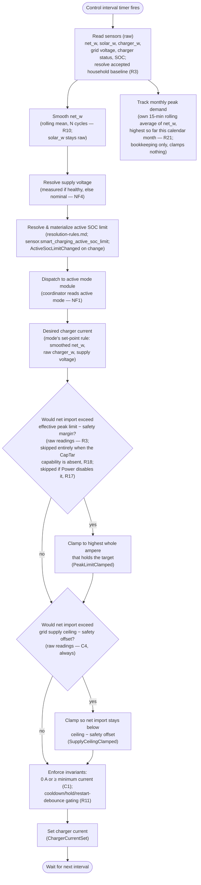

# Control cycle

The coordinator spine that every use-case plugs into. This is the loop the integration runs
on a timer; each use-case supplies a **mode module** that the loop dispatches to, and each
resolution rule supplies a lookup the loop or a mode consumes. This document is authoritative
for the order of operations in one control cycle and for the invariants that hold regardless of
which mode is active.

Follows the flow-document standard: **Purpose → Trigger → Domain events → Mermaid diagram →
Steps → Edge cases → Requirements satisfied**.

---

## Purpose

Run the [coordinator](system-overview.md#ubiquitous-language) once per [control
interval](system-overview.md#ubiquitous-language): read the sensors, smooth the net grid power
reading, ask the [active mode](system-overview.md#ubiquitous-language) module for a desired
charger current, clamp that current with peak protection, and set it — while, alongside those
steps, keeping the [monthly peak demand](system-overview.md#ubiquitous-language) up to date
(R21). The coordinator executes the
active mode and never chooses it (NF1); mode choice belongs to the [profile](system-overview.md#ubiquitous-language)
(see `resolution-rules.md`, Auto mode-selection). All inputs and outputs cross an adapter role
(NF3); see `entity-catalog.md` for their bindings.

## Trigger

A timer firing every control interval (configurable via `control_interval_s`,
default 10 s). The cycle carries no decision state between firings; a handful of named flags and
accumulators do persist across cycles — e.g. the rolling smoothing window, the monthly peak
demand together with its own separate 15-minute window (R21), the rapid-cycling
timers, the has-charged flag and restart-debounce timer (R11), the step-up/reserve context
and the deadline-urgency latch both threaded in step 4 (R5), the last accepted [household
baseline](system-overview.md#ubiquitous-language) together with the two previous cycles' set
charger currents that R3's deferral cases key on, and the
[missed-deadline hold](system-overview.md#ubiquitous-language) (R5, `resolution-rules.md`) — each
homed in the rule or use-case that defines its lifecycle.

## Domain events produced

- `SensorsRead` — past-tense — the cycle has captured a fresh raw reading through every input
  adapter role and resolved this cycle's accepted
  [household baseline](system-overview.md#ubiquitous-language) from them (R3); signals the start
  of one cycle's processing.
- `ActiveSocLimitChanged` — the resolved [active SOC limit](system-overview.md#ubiquitous-language)
  (`resolution-rules.md`, Active SOC limit table) differs from the value resolved on the prior
  cycle; the coordinator materializes the resolved value read-only as
  `sensor.smart_charging_active_soc_limit` and emits this event when it changes. Consumed by
  [UC09](use-cases/UC09-sync-charge-limit-with-car.md) as the single trigger to sync the vehicle's
  own charge limit; it subsumes the cause-specific step-up / solar-reserve transitions into one
  consumer contract (ADR-0011).
- `PeakLimitClamped` — the peak-protection step reduced the mode's desired current to keep
  net import at or below the [effective peak limit](system-overview.md#ubiquitous-language)
  minus the [safety margin](system-overview.md#ubiquitous-language); signals that peak
  protection, not the mode, decided the set-point this cycle. Never emitted when the CapTar
  [capability](system-overview.md#ubiquitous-language) is absent, since step 5 does not run at
  all then (R18).
- `SupplyCeilingClamped` — the grid-supply-ceiling step reduced the current to keep net grid
  import below the [grid supply ceiling](system-overview.md#ubiquitous-language) minus the
  [grid safety offset](system-overview.md#ubiquitous-language); signals that the hard
  fuse-protection limit (C4), not the mode or peak protection, decided the set-point.
- `ChargerCurrentSet` — the cycle has written the final charger current through the charger
  current adapter role; signals the end of one cycle and the value applied.

## Diagram

```mermaid
flowchart TD
    Timer(["Control interval timer fires"]) --> Read["Read sensors (raw)<br/>net_w, solar_w, charger_w,<br/>grid voltage, charger status, SOC;<br/>resolve accepted household baseline (R3)"]
    Read --> Smooth["Smooth net_w<br/>(rolling mean, N cycles — R10;<br/>solar_w stays raw)"]
    Read --> PeakTrack["Track monthly peak demand<br/>(own 15-min rolling average of net_w,<br/>highest so far this calendar month — R21;<br/>bookkeeping only, clamps nothing)"]
    Smooth --> Volt["Resolve supply voltage<br/>(measured if healthy, else nominal — NF4)"]
    Volt --> SocLimit["Resolve & materialize active SOC limit<br/>(resolution-rules.md; sensor.smart_charging_active_soc_limit;<br/>ActiveSocLimitChanged on change)"]
    SocLimit --> Dispatch["Dispatch to active mode module<br/>(coordinator reads active mode — NF1)"]
    Dispatch --> Desired["Desired charger current<br/>(mode's set-point rule: smoothed net_w,<br/>raw charger_w, supply voltage)"]
    Desired --> Peak{"Would net import exceed<br/>effective peak limit − safety margin?<br/>(raw readings — R3;<br/>skipped entirely when the CapTar<br/>capability is absent, R18;<br/>skipped if Power disables it, R17)"}
    Peak -->|yes| Clamp["Clamp to highest whole ampere<br/>that holds the target<br/>(PeakLimitClamped)"]
    Peak -->|no| Ceiling
    Clamp --> Ceiling{"Would net import exceed<br/>grid supply ceiling − safety offset?<br/>(raw readings — C4, always)"}
    Ceiling -->|yes| CeilingClamp["Clamp so net import stays below<br/>ceiling − safety offset<br/>(SupplyCeilingClamped)"]
    Ceiling -->|no| Invariant
    CeilingClamp --> Invariant["Enforce invariants:<br/>0 A or ≥ minimum current (C1);<br/>cooldown/hold/restart-debounce gating (R11)"]
    Invariant --> Set["Set charger current<br/>(ChargerCurrentSet)"]
    Set --> Wait(["Wait for next interval"])
```

## Steps

1. **Read sensors (raw).** The coordinator reads each input through its adapter role (NF3):
   net grid import, solar power, charger power, the measured grid voltage, charger status, and
   state of charge. These are [raw values](system-overview.md#ubiquitous-language) — the most
   recent, unsmoothed readings (the measured grid voltage is resolved into the
   [supply voltage](system-overview.md#ubiquitous-language) in step 3). This cycle's raw net
   import also feeds the bookkeeping side-branch in *Monthly peak demand tracking* below.
   The net import and charger power readings also resolve this cycle's accepted [household
   baseline](system-overview.md#ubiquitous-language), subject to R3's two deferral cases — here,
   every cycle and regardless of which [capabilities](system-overview.md#ubiquitous-language) are
   declared, rather than inside the CapTar-gated step 5 that consumes it, since the diagnostic
   readouts that also read it (`solar_surplus_w`, `entity-catalog.md`) are gated on the solar
   capability instead and must still resolve on an installation with no CapTar.
   Produces `SensorsRead`.
2. **Smooth the net grid power reading (R10).** The coordinator pushes this cycle's raw `net_w`
   into a rolling window of the last *N* samples (configurable, default 4) and recomputes its
   [smoothed value](system-overview.md#ubiquitous-language). The smoothed value feeds
   charging-rate decisions; the raw value is retained for peak protection. A spike lasting a
   single cycle does not move the smoothed value; a change sustained across the full window
   does, within the following cycle. `solar_w` is deliberately not smoothed: no charging-rate step
   of this cycle consumes it, since [solar surplus](system-overview.md#ubiquitous-language) is
   `charger_w − net_w` (R10). Step 1 reads it every cycle solely to surface it as an attribute of
   `sensor.smart_charging_adapter_readings` (ADR-0021), so it stays a raw reading throughout.
3. **Resolve the supply voltage (NF4).** The coordinator selects the [supply
   voltage](system-overview.md#ubiquitous-language) used for all amperes↔watts conversions this
   cycle: the measured grid voltage when a healthy reading is available, otherwise the
   configurable nominal voltage (default 230 V). Using the live value keeps current-derived
   thresholds (e.g. the minimum charging current) correct as grid voltage drifts.
4. **Resolve the active SOC limit, then dispatch to the active mode module (R7, NF1).** First the
   coordinator resolves the [active SOC limit](system-overview.md#ubiquitous-language) in force
   this cycle via `resolution-rules.md`'s Active SOC limit table (solar-reserve cap → solar
   step-up → default), which keys on the active profile and the step-up/reserve context the
   coordinator threads across cycles (UC06/UC07); it surfaces the resolved value read-only as
   `sensor.smart_charging_active_soc_limit` and emits `ActiveSocLimitChanged` when it differs from
   the prior cycle's (consumed by [UC09](use-cases/UC09-sync-charge-limit-with-car.md)). That
   resolution is homed in `resolution-rules.md` (R7); this step only fixes *when* in the cycle it
   is resolved, materialized, and change-detected. Immediately after it, and for the same reason, the
   coordinator updates the [missed-deadline hold](system-overview.md#ubiquitous-language) and the
   urgency latch (R5, `resolution-rules.md`, which is authoritative for the engage, handback and
   clear conditions of both): after the
   active SOC limit is resolved, since their conditions compare against that resolved value, and
   before the mode and peak decisions below, which consume whether deadline urgency is in effect.
   Both are threaded across cycles rather than recomputed from scratch — urgency, once engaged, is
   left in effect until its handback test clears it, since re-asking the engage test on a cycle
   already charging at the escalated rate would revert it immediately (R5, UC05). The handback test
   compares against the [baseline mode](system-overview.md#ubiquitous-language)'s own desired
   current, so that mode's set-point is evaluated here as part of the update rather than being
   read off the dispatch below — in every case, since the update precedes dispatch under both
   profiles, and not only under `Auto`, where the baseline is additionally a *different* mode from
   the one about to be dispatched. The dispatched mode's own desired current, produced further down
   this step, is never what urgency is judged by. The evaluation is a query and never advances the
   baseline mode's own state or timers (R5, `resolution-rules.md`, authoritative).
   Then the coordinator determines the resolved
   active mode — the `select.smart_charging_mode` selection under `Manual`, or `Auto`'s selection
   (`resolution-rules.md`, whose *Target met* row compares against this resolved active SOC limit) under
   `Auto` — calls the matching module, passing the smoothed `net_w` alongside the raw readings and
   the resolved voltage, and surfaces the resolved value read-only as
   `sensor.smart_charging_active_mode`. The module returns a [desired charger
   current](system-overview.md#ubiquitous-language) using its
   own set-point rule (defined in the mode use-case — UC01–UC04; e.g. the `Off` module returns
   0 A). The coordinator contains no logic that chooses
   or changes the mode — this includes deadline urgency (R5): under `Auto`, escalating to `Captar`
   is Auto mode-selection's own decision (`resolution-rules.md`), made before this step reads the
   active mode; under `Manual` the active mode never changes, and this step never adjusts what a
   mode requests either (NF2) — see step 5.
5. **Apply the peak-protection clamp (R3) — when the CapTar capability is present.** This step is
   skipped in its entirety when the CapTar [capability](system-overview.md#ubiquitous-language) is
   absent (R18): no clamp engages in any mode, no effective peak limit is consulted, and no
   `PeakLimitClamped` is emitted; net import is then bounded by step 6 alone. Otherwise, using the **raw** readings (not the smoothed
   ones, to avoid lag), the coordinator checks whether the desired current would push net
   import above the effective peak limit minus the safety margin. If so, it reduces the current
   to the highest whole ampere that keeps net import at or below that target, within the same
   cycle, and emits `PeakLimitClamped`. The [household
   baseline](system-overview.md#ubiquitous-language) this check solves around is resolved in step 1
   and is not unconditionally this cycle's reading: R3 names two cases in which the most recently
   accepted reading stands instead — a reading taken after the System set a charger current
   differing from the previous cycle's (never two cycles running), and a reading that would
   increase headroom and has not yet held for 2 consecutive cycles. A breaching increase is
   therefore deferred by at most a single cycle, and step 6 below is unaffected either way — it
   always uses this cycle's own raw readings. R3 is authoritative for both cases and their bounds.
   The effective peak limit itself is resolved by
   `resolution-rules.md` (it rises to the maximum peak only under deadline urgency, R5/C3) —
   this is the *only* lever deadline urgency has under `Manual`: raising the ceiling lets a
   mode whose own request was previously clamped (e.g. `Captar`, `Power`) draw more, up to
   whatever it already requests; it never raises what a mode requests in the first place. This
   clamp is active in every mode except when `Power` mode has its peak-protection option
   disabled (R17); the grid supply ceiling clamp in step 6 still applies in that case, as it does
   when this whole step is skipped for an absent CapTar capability.
6. **Apply the grid supply ceiling clamp (C4).** Regardless of mode *and* regardless of any
   declared capability — and so also whenever the step 5 peak clamp was skipped, whether because
   `Power` disabled it or because the CapTar capability is absent — the coordinator reduces the current, using **raw** readings (not
   smoothed, to avoid lag), so that net grid import stays below the
   [grid supply ceiling](system-overview.md#ubiquitous-language) minus the
   [grid safety offset](system-overview.md#ubiquitous-language) (converted to amperes via the
   resolved supply voltage). This is the hard fuse-protection limit, the one clamp `Power`
   mode cannot switch off, and the only clamp every installation always has whatever its
   capabilities; it emits `SupplyCeilingClamped` when it engages.
7. **Enforce the invariants.** The final current obeys C1 — it is either 0 A or at least the
   [minimum charging current](system-overview.md#ubiquitous-language), never in between — and
   the rapid-cycling invariant (R11): once charging has stopped it does not restart until the
   mode-specific cooldown has fully elapsed, a cooldown in progress always runs to completion —
   across a switch of the active mode included (edge case below),
   and, for a mode's own stop condition, current holds at the minimum for a mode-specific period
   before actually cutting to 0 A (the post-surplus hold, R1/R2; the peak-breach grace period, R3,
   in every mode it can stop — the solar modes at the minimum current during grid fallback/`Hold`,
   `Captar`, and `Power` while it respects the peak — edge case below). A running cooldown survives
   a switch of the active mode; only the hold and restart-debounce timers reset on one (edge case
   below). In the solar modes only, once the has-charged flag is set for the
   connection, a restart from `Idle` additionally waits out the
   [restart debounce](system-overview.md#ubiquitous-language) period once the mode's start
   condition is newly met — but a resume straight from `Cooldown`, where the start condition is
   already met the moment the cooldown elapses, is not subject to this wait, since it never waits
   in `Idle`. (Start/stop, hold, cooldown, and restart-debounce durations are mode-specific and
   defined in each mode use-case; the coordinator only upholds the invariant.)
8. **Set the charger current.** The coordinator writes the final current to the charger
   through its adapter role (NF3) and emits `ChargerCurrentSet`, then waits for the next
   interval.

## Monthly peak demand tracking (R21)

Alongside the numbered steps, every cycle updates the [monthly peak
demand](system-overview.md#ubiquitous-language) from the same raw net-import reading step 1
took. This is deliberately **not** one of the numbered steps: it is bookkeeping, not a
control decision — nothing in the cycle's set-point or clamp path reads its result, which is
consumed only later, and indirectly, when `resolution-rules.md` resolves the effective peak
limit for step 5.

- It maintains its **own** rolling 15-minute average of net import, separate from and longer
  than step 2's R10 smoothing window. The two never substitute for each other: step 2's value
  drives the charging rate, this one drives nothing but the billing figure.
- The value it keeps is the highest such 15-minute average seen so far in the current calendar
  month. At a month boundary the tracking starts afresh on the new month's own readings, with
  its window emptied so no previous-month sample carries over (R21).
- It runs on every cycle whatever the active mode, and whatever the declared
  [capabilities](system-overview.md#ubiquitous-language) — including when the CapTar capability
  is absent and step 5 is skipped entirely, in which case the value is still tracked and
  surfaced (`sensor.smart_charging_monthly_peak_kw`) but no charging decision consults it.
- It always holds this self-tracked figure alone. The optional [external monthly-peak
  reading](system-overview.md#ubiquitous-language) is a separate input that never overwrites it;
  the two are merged only where the effective peak limit's monthly-peak-demand operand is
  resolved (R3, `resolution-rules.md`).

## Edge cases

- **No healthy supply-voltage reading.** Conversions fall back to the configurable nominal
  voltage (default 230 V) for the cycle (NF4); the cycle still completes.
- **Peak breach persists** (CapTar capability present only). A momentary breach only triggers a clamp, not a stop. The charger
  drops to 0 A only when it is already at the minimum charging current *and* net import has
  exceeded the target continuously for a configurable grace period (default 2 minutes, R3); the
  rapid-cycling cooldown then governs any restart (R11).
- **Mode switched mid-operation.** Switching the active mode resets the hold and restart-debounce
  timers so the incoming mode starts fresh (R11) — a debounce already under way in `Solar` does not
  carry over into `SolarOnly`'s different start threshold, or vice versa; the next cycle dispatches
  to the new module. A **cooldown already running is not reset**: it runs to completion for the
  duration fixed when charging stopped, and blocks the incoming mode from starting until it
  elapses. The asymmetry is deliberate and follows from what each timer gates. A hold is a period
  spent *charging* at the minimum current and a debounce only postpones a start, so resetting
  either can never bring a start forward — neither can produce the start/stop churn R11 exists to
  prevent. A cooldown is the one timer that stands between a stop and the next start, and the car's
  charging-error protection is a property of the charger, not of which mode the system has selected:
  restarting one cycle after a stop is equally hard on the car whether `Solar` or `Captar` asks for
  it. Resetting on a mode switch would therefore defeat the guarantee precisely where mode switches
  are routine and system-initiated — under `Auto`, whose deadline-urgency escalation and revert
  (`resolution-rules.md`) are decided per cycle, so a household near the urgency
  threshold could bounce `Solar`↔`Captar` and restart immediately after every stop, with no user
  action involved. R5's urgency latch removes the most acute form of that bouncing but not the
  general case — the mode can still change for reasons other than urgency. The accepted cost is the mirror image: an urgency escalation can be held off for
  the remainder of a running cooldown (at most `Captar`'s 10 minutes), a bounded delay to R5's
  best-effort guarantee rather than a breach of R11's Must-priority hardware protection. This
  matches the has-charged flag, the other piece of state a mode switch leaves untouched: it is
  scoped to the connection, not the active mode, so switching between `Solar` and `SolarOnly`
  does not grant a fresh, undebounced first start; only its debounce *timer* resets.
- **Smoothing window not yet full.** At start-up or after a restart the rolling mean is taken
  over the samples available so far until the window fills.
- **Coordinator restart.** Restart-after-power-loss persistence of internal bookkeeping is not
  catalogued — it is "how", not "what" (`entity-catalog.md`) — but this cycle's own timers,
  including the has-charged flag and any running hold, cooldown, or restart-debounce timer, are
  deliberately not required to survive one, consistent with `resolution-rules.md`'s
  missed-deadline hold making the same choice. A connected car is therefore treated as a fresh
  first start after a restart, with no restart debounce, even if it had charged before the
  restart. The [monthly peak demand](system-overview.md#ubiquitous-language) is the one
  deliberate exception, and a "what" rather than a "how": the peak already recorded for the
  month in progress must survive a restart, because a value that began again from 0 kW would
  misstate what CapTar bills for that month (R21). Its own 15-minute window is not preserved and
  rebuilds after a restart, exactly as the smoothing-window edge case above describes.
- **Mode requests a current below the minimum.** The invariant in step 7 resolves it to 0 A or
  the minimum per the mode's own rule (C1); the coordinator never emits an in-between value.
- **Grid supply ceiling reached.** The charger is clamped down — to 0 A if necessary — so net
  grid import stays below the grid supply ceiling minus the grid safety offset and the main fuse
  cannot trip (C4). This applies even in `Power` mode with peak protection disabled, and on an
  installation without the CapTar capability (R18) — in both of which it is the only active clamp.

## Requirements satisfied

- **R3** — CapTar peak protection (the clamp in step 5, on raw readings; the step is skipped
  entirely while the CapTar capability is absent, R18).
- **R10** — Sensor smoothing (the rolling mean in step 2; peak protection exempt, step 5).
- **R11** — Rapid-cycling prevention (the cooldown/min-current/hold-before-stop/restart-debounce invariant in step 7).
- **R21** — Monthly peak demand tracking (the per-cycle bookkeeping in *Monthly peak demand
  tracking* above; runs whatever the declared capabilities, unlike step 5's clamp).
- **NF4** — Voltage-aware power conversion (voltage resolution in step 3).

Partially satisfies [R18](requirements.md#r18--configurable-installation-capabilities) — the
clamp-skip half of AC5 (step 5 is skipped entirely, not merely widened, while the CapTar
capability is absent, so net import is bounded only by the grid supply ceiling clamp, C4, step 6).

Upholds but does not home: **NF1** (coordinator executes, never chooses the mode — homed in
`requirements.md`; mode choice, including deadline urgency's `Auto` escalation, in
`resolution-rules.md`), **NF2** (the coordinator never adjusts what a mode requests; deadline
urgency's `Manual` lever only widens the peak clamp in step 5 — homed in `requirements.md`), and
**NF3** (all I/O via adapter roles — bindings in `entity-catalog.md`). **C1**, **C3**, and **C4**
(grid supply ceiling clamp, step 6) are enforced as invariants in steps 5–7. **R7** (active SOC
limit) is homed in `resolution-rules.md` (the resolution table) and applied by
[UC09](use-cases/UC09-sync-charge-limit-with-car.md); this document only fixes *when* in the cycle
the resolved value is materialized (`sensor.smart_charging_active_soc_limit`, step 4) and
change-detected to emit `ActiveSocLimitChanged`. **R5** (departure deadline guarantee) is homed in
`resolution-rules.md` and [UC05](use-cases/UC05-guarantee-ready-by-departure.md); this document
supplies the peak clamp (step 5) that realizes its `Manual` lever, unchanged from normal operation,
and fixes where in the cycle the missed-deadline hold is updated (step 4) — not what it means.
