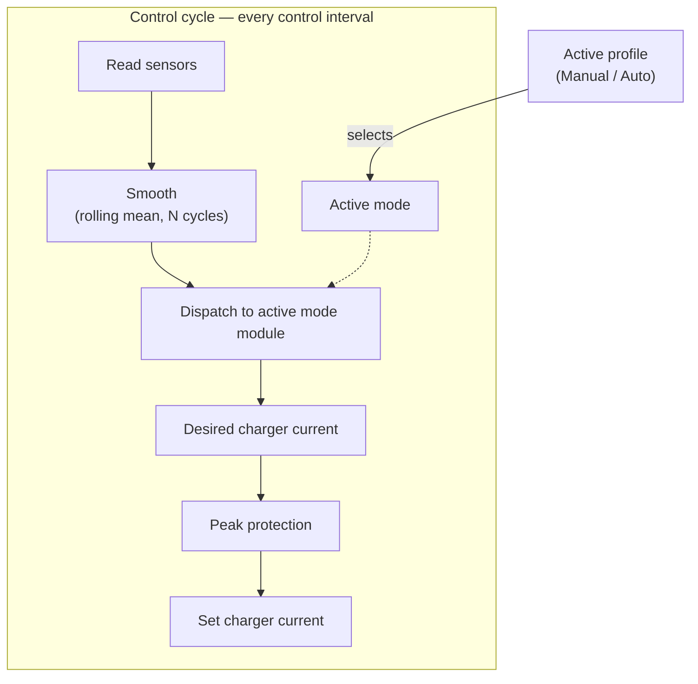

# Smart Charging v3 — System Overview

This document sets the context for the smart charging integration: the hardware it controls, the people it serves, the problem it solves, the goals it pursues, how its pieces fit together, the shared vocabulary used across every analysis document, and what is explicitly out of scope.

It is the first document in the analysis layer. The Ubiquitous Language glossary below is authoritative: every domain term used in `requirements.md` and the flow documents must be defined here first.

---

## Hardware context

The integration is hardware-agnostic. It controls any charger and EV — and, when present, a solar installation — through a set of **configurable parameters**; no specific make or model is assumed. A solar installation is **optional**: it is declared through the solar capability (see `capability` in the glossary, R18), and an installation without solar simply runs the non-solar modes (`Captar` — where the CapTar capability is also present — `Power`, and `Off`). This release targets single-phase installations, so all power and current calculations assume single-phase voltage (Amperes convert to watts as `A × V`, where `V` is the supply voltage — the measured grid voltage when a healthy reading is available, otherwise a configurable nominal voltage, default 230 V); three-phase support is deferred.

The parameters the system reasons over:

| Parameter              | Meaning                                             | Relevant constraint                                                                                                                                                                                                                                |
|------------------------|-----------------------------------------------------|----------------------------------------------------------------------------------------------------------------------------------------------------------------------------------------------------------------------------------------------------|
| Grid supply ceiling    | Maximum current the whole-house connection can draw | The charger shares this ceiling with all household load.                                                                                                                                                                                           |
| Charger current range  | The minimum and maximum charging current set-point  | Set-point ranges from the minimum (default 6 A, the IEC 61851 floor — see C1) to the configured maximum; below the minimum is not usable.                                                                                                          |
| EV battery capacity    | Usable battery capacity of the connected car        | Feeds the deadline energy calculation; configured to match the actual car.                                                                                                                                                                         |
| Solar inverter ceiling | Maximum power the solar inverter can deliver        | Solar surplus available to the charger never exceeds this ceiling, which is why the effective peak limit is capped at the inverter ceiling — there is no benefit to allowing a higher monthly peak than the most the solar system can ever offset. |

**Reference setup (example only).** The figures used throughout these documents are grounded in one concrete installation, but they are illustrative defaults, not architectural assumptions: single-phase 230 V / 40 A grid connection; charger with a 6–32 A range (7.4 kW); ~75 kWh EV battery; 4 kW solar inverter ceiling. Where a later document cites a number like "4 kW" or "6 A", read it as "the configured value, which in the reference setup is 4 kW / 6 A".

---

## Stakeholders

Three roles drive the design. All three are currently filled by the same person, but they are kept separate because their concerns — **convenience**, **cost**, and **maintainability** — can pull in different directions, and naming them makes those trade-offs explicit.

| Stakeholder                  | Needs                                                                                             | Concerns                                                                                                                 |
|------------------------------|---------------------------------------------------------------------------------------------------|--------------------------------------------------------------------------------------------------------------------------|
| **EV driver**                | The car charged to its active SOC limit before departure; a reminder if it was left unplugged.    | Car not ready on time; charging stops unexpectedly.                                                                      |
| **Household energy manager** | Electricity cost minimised; solar surplus fully used; the CapTar monthly peak kept under control. | A monthly peak spike; low-tariff periods missed; unnecessary grid charging; wasted solar surplus.                        |
| **System maintainer**        | Observable behaviour; easy to debug; safe to deploy changes.                                      | Silent failures (wrong sensor value, automation not firing); hard-to-trace logic; breakage after Home Assistant updates. |

---

## Problem statement

Charging an EV without intelligence draws power from the grid at full speed regardless of solar production, electricity tariff, or monthly peak demand. This maximises both cost and CapTar impact: solar surplus is exported instead of self-consumed, expensive high-tariff energy is bought even when low-tariff periods are available, and every uncontrolled charging session can raise the monthly peak that the capacity tariff bills against.

The smart charging system must charge the car at the lowest possible cost while still guaranteeing it reaches its active SOC limit before the configured departure time.

---

## Goals

1. **Maximise solar self-consumption** — solar is always the cheapest source and is used before any grid power.
2. **Keep the monthly peak (CapTar) under control** — avoid raising the billed peak demand through unnecessary charging spikes.
3. **Prefer low-tariff timing when the system opportunistically tops up from the grid** — under the `Auto` profile, the system times its own overnight top-up charging to low-tariff periods (when the low-tariff flag is active) over high-tariff periods; a manually selected `Captar` session is the user's own timing choice and charges regardless of tariff (R4), and the deadline-urgency escalation (goal 4) charges regardless of tariff by design.
4. **Meet the departure deadline whenever physically possible** — pursued only while the deadline [capability](#ubiquitous-language) is present (R18); the car reaches its active SOC limit by the configured departure time, raising the peak the system is willing to create (and accepting high-tariff cost) as needed — but only up to the effective peak limit. CapTar peak protection is the hard ceiling: if even the maximum permitted rate cannot make the deadline, the system charges as fast as that ceiling allows rather than breaching the peak. Under `Auto`, the system also escalates current draw to the maximum charging current, so "whenever physically possible" is closest to true there; under `Manual` the raised peak is the only lever, so meeting the deadline depends on how much current the user's own chosen mode already requests.

These goals are ordered by preference but bounded by goal 4: cost optimisation never overrides the deadline guarantee. That guarantee is itself bounded by the effective peak limit — during urgency the limit rises to the configured maximum peak, and charging current escalates up to it (less the safety margin) but never beyond. Its strength is therefore configurable: the maximum peak sets how aggressively the system may chase the deadline, trading CapTar cost against deadline confidence.

---

## How it fits together

At runtime the integration is a single control loop. The **active profile** decides *which mode* is active; the **coordinator** then executes that mode on every control cycle — reading sensors, smoothing them, asking the active mode module for a desired charger current, and finally clamping that current with peak protection before applying it. Every input and output crosses an adapter role (see `adapter role`, NF3), which is what keeps the integration hardware-agnostic.

This is the orientation map; `control-cycle.md` details the loop and the use-cases (`use-cases/`) detail each mode module.

```mermaid
flowchart TD
    Profile["Active profile<br/>(Manual / Auto)"] -->|selects| Mode["Active mode"]
    subgraph Cycle["Control cycle — every control interval"]
        direction TB
        Read["Read sensors"] --> Smooth["Smooth<br/>(rolling mean, N cycles)"]
        Smooth --> Dispatch["Dispatch to active mode module"]
        Mode -.-> Dispatch
        Dispatch --> Desired["Desired charger current"]
        Desired --> Peak["Peak protection"]
        Peak --> Set["Set charger current"]
    end
```

---

## Ubiquitous Language

Shared vocabulary for all analysis documents. Every domain term used in requirements or flows must be defined here. Entries are grouped thematically: domain concepts first, then entity-naming conventions.

### Domain concepts

**`solar surplus`** — Solar power available to the charger after all other household consumption, computed as `charger_w − net_w` where `net_w` is net grid import (positive = importing, negative = exporting); a positive surplus means solar is feeding the charger. Unit: watts (W).

**`net import`** — Net power flowing from the grid into the house, equal to `net_w`; positive means importing from the grid, negative means exporting to the grid. Unit: watts (W).

**`supply voltage`** — The single-phase voltage used to convert between amperes and watts (`watts = A × supply voltage`): the measured grid voltage when a healthy reading is available, otherwise a configurable nominal voltage (default 230 V). Using the live value keeps current-derived thresholds (e.g. the minimum charging current) accurate as grid voltage drifts. Unit: volts (V).

**`monthly peak demand`** — The highest 15-minute average net import recorded so far in the current calendar month; the value CapTar bills against and one operand of the effective peak limit. Resets at the start of each month. Unit: kilowatts (kW).

**`maximum peak`** — The highest monthly peak demand the system is ever willing to create, a configurable parameter (reference setup: 4 kW, defaulting to the solar inverter ceiling from the Hardware context — there is no benefit to a peak higher than the most solar can ever offset). It is the upper operand of the effective peak limit and the single ceiling that deadline urgency may raise the limit to. Unit: kilowatts (kW).

**`effective peak limit`** — The ceiling on net import that charging keeps a safety margin below and must never exceed. Normally `min(monthly_peak_demand, maximum_peak)`, so ordinary charging never raises the billed monthly peak beyond what is already incurred. During deadline urgency the limit rises to the maximum peak, allowing the deadline to push the monthly peak up to — but never beyond — that ceiling (see R5). Unit: kilowatts (kW).

**`peak headroom`** — The additional charging current the charger may draw before net import would reach the safety target (`effective peak limit − safety margin`); expressed in amperes for set-point calculations. Unit: amperes (A).

**`maximum permitted rate`** — The highest charger current deliverable in a control cycle once the coordinator's peak-protection clamp (R3) has fitted the requested current to the peak headroom under whichever effective peak limit is currently in force, further bounded by the minimum/maximum charging current (C1) and the grid-supply-ceiling clamp (C4) — except while `Power` mode's own peak-protection option is disabled, when the peak clamp does not run at all and only C1/C4 bound it. During deadline urgency (R5), raising the effective peak limit to the maximum peak raises this rate; the deadline-unreachable notification (R5) fires once per occasion — not on every cycle the condition holds — when the required current would exceed it, and likewise when a [missed-deadline hold](#ubiquitous-language) engages; it re-arms once the condition clears ([`DeadlineUnreachableCleared`](#ubiquitous-language)). Unit: amperes (A).

**`required current`** — The current the System would need to sustain, from now until the departure deadline, to close the projected gap to the active SOC limit — computed from the EV battery capacity (R15), current state of charge, the active SOC limit, and the time remaining (`resolution-rules.md`). Deadline urgency (R5) is in effect for as long as this exceeds the baseline mode's own desired current; the deadline-unreachable notification (R5) fires once per occasion — not on every cycle the condition holds — when it exceeds the maximum permitted rate, and re-arms once the condition clears ([`DeadlineUnreachableCleared`](#ubiquitous-language)). No required current is computed while a [missed-deadline hold](#ubiquitous-language) is in effect — urgency is then pinned on and the deadline is unreachable by definition. Unit: amperes (A).

**`time to full charge`** — An estimate of how long charging would take, from now, to reach the active SOC limit at the charger's current applied rate — computed from the EV battery capacity (R15), current state of charge, the active SOC limit, and the charger's current set-point (`charger_current`). Unavailable while `charger_current` is 0 A (no rate to project from); zero once state of charge is already at or above the active SOC limit. A dashboard-only readout (R19); unlike [required current](#ubiquitous-language) it does not drive any control decision and carries no urgency semantics — a slow current simply yields a longer estimate, never a deadline escalation. Unit: minutes (min).

**`safety margin`** — A configurable buffer (default 250 W) held in reserve below the effective peak limit; the charger targets `effective peak limit − safety margin` rather than the limit itself, so measurement noise and control-loop response lag cannot push the real 15-minute net import past the billed peak. A larger margin trades a little charging speed for stronger peak-breach protection. Unit: watts (W).

**`grid supply ceiling`** — The maximum current the whole-house grid connection can carry before its main fuse trips (configurable, `grid_supply_ceiling_a`; reference setup: 40 A single-phase — see Hardware context). The charger shares this ceiling with all other household load, so the charger current is always clamped to keep net grid import below `grid supply ceiling − grid safety offset` (see `grid safety offset`). Unlike the effective peak limit — a billing concern that `Power` mode may be configured to ignore — the grid supply ceiling is a hard safety limit enforced in *every* mode; it is the one bound `Power` mode cannot disable (R17, C4). Unit: amperes (A).

**`grid safety offset`** — A configurable buffer (amperes) held in reserve below the grid supply ceiling; the coordinator clamps the charger so net grid import stays below `grid supply ceiling − grid safety offset` rather than at the ceiling itself, so a sudden swing in the rest of the house's net draw cannot trip the main fuse before the next control cycle reacts. A larger offset is recommended when a solar installation or a home battery is present, since their output can change quickly (e.g. a passing cloud cutting solar) and make net import jump. Configured via `grid_safety_offset_a`. Unit: amperes (A).

**`CapTar`** — Capacity tariff; the Belgian distribution-grid billing component charged on the highest 15-minute average net import (monthly peak demand) rather than total energy, which is why every avoidable peak directly raises the bill.

**`coordinator`** — The single control loop at the heart of the integration. Each control cycle it reads sensors, smooths them, dispatches to the active mode module for a desired charger current, applies peak protection, and sets the charger current. It executes whichever mode is active and contains no logic for *choosing* the mode (NF1); choosing is the profile's responsibility. Detailed in `control-cycle.md`.

**`control cycle`** — One iteration of the coordinator loop: read sensors, smooth, dispatch to the active mode module, apply peak protection, set charger current. Runs every control interval (configurable, default 10 s).

**`control interval`** — The time between consecutive control cycles, configured via `control_interval_s` (default 10 s); every duration expressed as a number of control cycles resolves to `n × control_interval` seconds at runtime.

**`active SOC limit`** — The charge-limit target in effect at a given moment, resolved in priority order: (1) the solar-reserve cap (configurable, default 60 %) when the `Auto` profile is active, the home-day flag is set, the sun is below the horizon, and the next-day solar forecast exceeds its threshold (default 12 kWh), and neither of R9's two deadline preconditions blocks it (no deadline resolved for tomorrow, no [missed-deadline hold](#ubiquitous-language) in effect), (2) the solar step-up value (configurable range, default ceiling `max_solar_soc` 100 %) when a step-up is in effect, otherwise (3) the default `number.smart_charging_soc_limit_override` (configurable, default 80 %). Row 1 never applies under `Manual`. Unit: percent (%).

**`ActiveSocLimitChanged`** — A domain event: the resolved [active SOC limit](#ubiquitous-language) changed value between control cycles — the single value the [coordinator](#ubiquitous-language) resolves each cycle (`resolution-rules.md`, Active SOC limit table) differs from the value it resolved on the prior cycle, whatever the cause. It fires on the materialized diagnostic entity `sensor.smart_charging_active_soc_limit` (`entity-catalog.md`) and is consumed by [UC09](use-cases/UC09-sync-charge-limit-with-car.md) as the single trigger to write the new value to the vehicle while it is connected at home — subsuming the cause-specific transitions `SolarStepUpApplied` / `SolarStepUpCleared` (UC06), `SolarReserveCapEngaged` / `SolarReserveCapLifted` (UC07), and a default-limit edit into one consumer contract, so the consumer subscribes once rather than to every cause (ADR-0011). Distinct from `ActiveSocLimitReached` (state of charge *reached* the limit); this event fires when the limit *value itself* changes.

**`solar forecast`** — The predicted solar energy yield for the next day, read from a configured forecast sensor (NF3); compared against a configurable threshold to decide whether the solar-reserve cap applies. Unit: kilowatt-hours (kWh).

**`solar step-up`** — The mechanism that raises the active SOC limit by a configurable step (default 5 percentage points, up to `max_solar_soc`) when solar charging is active and SOC comes within a configurable threshold (default 2 %) of the current limit, so abundant solar is stored rather than exported. Unit: percentage points (pp).

**`low-tariff flag`** — The boolean flag indicating that grid energy is currently at the low tariff, used instead of a hard-coded schedule to keep the system tariff-agnostic. It comes from an optional signal the installation provides via the `low_tariff` adapter role: when the mapped entity does not already report on/off, a user-supplied state-translation table lists which raw states count as low tariff, with every other raw state resolving to not-low-tariff. On a single-tariff installation the signal is omitted and the flag is treated as always active. Consumed by the `Auto` profile's mode selection (R16) to time when it opportunistically runs `Captar` for cost-efficient overnight grid top-up; `Captar` mode itself does not read this flag (R4).

**`urgency`** — Deadline urgency; the condition where the car cannot reach its active SOC limit by the configured departure time at the current charger output, triggering an escalation of charging current (accepting high tariff if needed) up to — but not beyond — the effective peak limit, which itself rises to the maximum peak during urgency. In effect whenever the required current exceeds the baseline mode's own desired current, and also for as long as a [missed-deadline hold](#ubiquitous-language) is in effect (`resolution-rules.md`). Can only arise while the [deadline capability](#ubiquitous-language) is present (R18). See R5.

**`DeadlineUnreachableNotified`** — A domain event: the departure deadline cannot be met even at the [maximum permitted rate](#ubiquitous-language) — the [coordinator](#ubiquitous-language) is in [UC05](use-cases/UC05-guarantee-ready-by-departure.md)'s `Unreachable` state, either because the [required current](#ubiquitous-language) exceeds that rate or because a [missed-deadline hold](#ubiquitous-language) is in effect. It fires on the integration's own event bus, needing no materialized entity, and is consumed as the trigger for R5's deadline-unreachable notification. It is the *onset* event of the pair: it re-fires on every control cycle the condition still holds — so a consumer that starts mid-condition still learns of it, and the payload's required current stays fresh — which is why the once-per-occasion obligation is scoped by its paired [`DeadlineUnreachableCleared`](#ubiquitous-language) rather than by the onset event alone (R5, ADR-0011, ADR-0024).

**`DeadlineUnreachableCleared`** — A domain event: the departure deadline is no longer unreachable — the [coordinator](#ubiquitous-language) has left [UC05](use-cases/UC05-guarantee-ready-by-departure.md)'s `Unreachable` state, whichever exit ended it: the [required current](#ubiquitous-language) falling back within the [maximum permitted rate](#ubiquitous-language), a disconnect, state of charge reaching the [active SOC limit](#ubiquitous-language), the resolved [departure deadline](#ubiquitous-language) becoming "no deadline" (including the [deadline capability](#ubiquitous-language) becoming absent, R18), or — while a [missed-deadline hold](#ubiquitous-language) is in effect — one of the hold's own clear conditions. It fires on the integration's own event bus, needing no materialized entity, and is consumed as the single trigger to re-arm R5's deadline-unreachable notification, so that notice is delivered once **per occasion** rather than once per run (R5, ADR-0024). It is the paired clearing edge of [`DeadlineUnreachableNotified`](#ubiquitous-language) above, which re-fires every cycle the condition holds. A control cycle on which state of charge is unavailable is a *fault* cycle, not an exit: nothing about the deadline is established on it, so the prior state is held and this event does not fire (ADR-0024). Distinct from `DeadlineUrgencyReverted` (urgency ended outright), with which it co-fires on the `Unreachable` → `Normal` exit only: on the `Unreachable` → `Urgent` exit — the deadline reachable again but still at risk — this event fires alone.

**`missed-deadline hold`** — The condition that keeps [urgency](#ubiquitous-language) in effect after a [departure deadline](#ubiquitous-language) has been missed: it engages at the moment a resolved deadline elapses while the car is still connected below its active SOC limit and urgency was in effect on that occasion's own merits on the preceding cycle, and it pins urgency to its `Unreachable` state — time has run out on the deadline, so it is unreachable by definition, and the System charges as hard as `Unreachable`'s levers allow. It reflects that a departure time is a *target*, not a cutoff: the driver may leave a little later. Scoped to the current connected session — one of the two flags the coordinator threads across cycles rather than recomputing (the other being the [solar step-up](#ubiquitous-language)) — and cleared when state of charge is at or above the active SOC limit, when the car disconnects, when the [deadline capability](#ubiquitous-language) becomes absent (R18), or, as a backstop, when the following occurrence elapses; the ordinary next-occurrence resolution then governs again. A car that connects only *after* a deadline has already elapsed, with urgency never having engaged for it, is never held. `resolution-rules.md` is authoritative for the engage/clear conditions. See R5.

**`departure deadline`** — The moment by which the car must reach its active SOC limit: the **next occurrence** of the resolved departure time still ahead of the current time. The departure time *for a given calendar date* is resolved in priority order — an external departure-time sensor, then a public-holiday or home-day override, then the per-day-of-week default — and the deadline is today's occurrence for as long as that moment is still ahead of now, otherwise the same priority order re-evaluated for tomorrow's date (`resolution-rules.md`). By default weekends, public holidays, and home days have no departure time; when neither today's still-future occurrence nor tomorrow's resolves a departure time, no deadline applies at all. This resolution always rolls forward and never yields a moment in the past; a deadline that elapses with the car still short of its active SOC limit is handled by the [missed-deadline hold](#ubiquitous-language) (R5), which suspends what urgency does with the resolved deadline without changing the resolution itself. Resolved only while the [deadline capability](#ubiquitous-language) is present (R18); while it is absent none of these inputs exists and no deadline is ever resolved. See R14.

**`departure window`** — The current occurrence of the [departure deadline](#ubiquitous-language) that the plug-in reminder (R12) tracks for de-dup purposes — i.e. the *next departure time* (R12, R14), whichever day it falls on. Two reminder evaluations concern the *same* departure window as long as the next departure time has not changed; it changes once that departure time passes (so the following day's resolved deadline becomes the next one) or when the resolved deadline itself is updated (e.g. an external sensor changing). A [missed-deadline hold](#ubiquitous-language) never affects this window: the hold applies only while the car is connected, whereas the reminder fires only while it is disconnected, so the window keeps rolling forward on the ordinary resolution regardless. This is what the reminder's de-dup rule re-arms against on a connect/disconnect cycle, independently of the calendar day boundary.

**`charger status`** — The normalised charger connection state exposed via the `charger_status` adapter role, translated from the charger's raw states to one of three canonical values: `disconnected` (no vehicle), `connected` (plugged in, not drawing current), `charging` (plugged in and drawing current).

**`smoothed value`** — A sensor reading averaged over the last *N* control cycles (configurable, default 4) — a rolling mean of `net_w` or `solar_w` — used for charging-current decisions to reject transient spikes; peak protection deliberately bypasses smoothing and uses raw readings to avoid lag.

**`raw value`** — An unsmoothed, most-recent sensor reading; used by peak protection (R3) so a peak breach cannot persist for up to one smoothing window.

**`grid fallback`** — In Solar mode, charging at the minimum charging current using grid power when solar surplus alone cannot sustain it; permitted in Solar mode, explicitly excluded in SolarOnly mode.

**`amp-step rounding`** — How the System converts a continuous ideal charging current into a whole-ampere set-point each cycle: **round down** (floor to the highest whole ampere that keeps net import at or below the target, leaving any fractional-amp surplus unused), **round up** (ceiling to the next whole ampere, using all available surplus and accepting a small net grid import — bounded to less than one amp-step — to fill the gap), or **round to nearest** (switch to whichever whole ampere is closer to the ideal value, using a configurable midpoint, default 50%; when the ideal value sits exactly at the midpoint this can toggle the set-point between the two amp steps from one cycle to the next — an accepted "pendel" edge case, not actively dampened). `Solar` mode always rounds up (R1, fixed, not configurable). `SolarOnly` mode's strategy is configurable, default round down (R2).

**`solar start threshold`** — The smoothed [solar surplus](#ubiquitous-language) level at or above which a solar mode may start charging (and, below which the post-surplus hold begins). Configured per solar mode by a separate config value each: `solar_start_threshold_w`, default 150 W in `Solar`; `solar_only_start_threshold_w`, default 1300 W in `SolarOnly` — the latter chosen so the minimum charging current can be met from solar alone. See R1, R2. Unit: watts (W).

**`post-surplus hold`** — The period for which the charger holds at the minimum charging current after smoothed solar surplus falls below the solar start threshold, riding out brief cloud cover before charging stops; if surplus recovers to the start threshold within the period the hold is cancelled. Shared by both solar modes with mode-specific durations: `solar_hold_min` (default 5 minutes) in `Solar`, `solar_only_hold_min` (default 1 minute, deliberately shorter) in `SolarOnly`. In `SolarOnly` this hold is the one bounded exception to the mode's zero-grid-import guarantee — while holding, any shortfall between available solar and the minimum charging current is drawn from the grid, but only for the hold period (R2); in `Solar`, holding at the minimum charging current on grid power is unremarkable, since `Solar` already accepts grid top-up via grid fallback. A mode-specific instance of the R11 hold-before-stop mechanism. See R1, R2, R11. Unit: minutes (min).

**`solar-mode cooldown`** — The rapid-cycling cooldown applied after solar charging stops (configurable, `solar_cooldown_min`, default 2 minutes), shared by `Solar` and `SolarOnly`; charging does not restart until it has fully elapsed. A mode-specific instance of the R11 cooldown. See R11. Unit: minutes (min).

**`charging mode` (mode)** — The concrete behaviour the coordinator executes at a given moment: `Solar`, `SolarOnly`, `Captar`, `Power`, or `Off`. A set provided by the integration; which of them are *available* depends on the installation's capabilities (see `capability`, R18). The coordinator reads the active mode and dispatches to the matching module; it contains no logic for *choosing* the mode (NF1).

**`capability`** — An installation characteristic — a piece of hardware, a billing arrangement, or a declared household policy — declared by configuration, that determines which modes and behaviours are available. This release recognises three: the **solar capability** (a solar PV installation is present, `solar_available`, default present), the **CapTar capability** (the installation bills against a capacity tariff, `captar_available`, default present), and the **deadline capability** (the household wants the system to manage departure deadlines at all, `deadline_available`, default present). When the solar capability is absent, the `Solar` and `SolarOnly` modes, the solar SOC step-up, and the solar-reserve cap are all unavailable, and the `Auto` profile never selects a solar mode. When the CapTar capability is absent, the `Captar` mode is unavailable for manual selection and is never chosen by the `Auto` profile. When the deadline capability is absent, no departure deadline is ever resolved, so deadline urgency, the plug-in reminder, and the departure-time configuration surface all fall away. `Power` and `Off` remain available regardless of any capability. The concept is extensible so further capabilities (e.g. a home battery) can be added later, each gating the modes and behaviours that depend on it, without changing existing modes (NF2). See R18.

**`deadline capability`** — The [capability](#ubiquitous-language) declaring that the household wants the system to manage departure deadlines (`deadline_available`, default present). While it is present the system behaves as described throughout these documents. While it is absent no [departure deadline](#ubiquitous-language) exists: the departure-time inputs are neither offered nor required (R14), [urgency](#ubiquitous-language) never engages and no unreachable-deadline notification is ever sent (R5), the plug-in reminder never fires (R12), both of the solar-reserve cap's deadline preconditions — no deadline resolved for tomorrow, and no [missed-deadline hold](#ubiquitous-language) in effect — are always satisfied (R9), and the departure-time rows are absent from the runtime dashboard (R19). Distinct from a day whose resolved departure time happens to be "no deadline" (R14), which leaves the whole deadline configuration surface in place. See R18.

**`active mode`** — The mode currently in effect. The resolved value in effect is exposed as the diagnostic readout `sensor.smart_charging_active_mode` (equal to the `Manual` selection under `Manual`, to `Auto`'s choice under `Auto`); under `Manual` the user selects it directly via `select.smart_charging_mode`.

**`profile`** — An extensible, higher-level strategy that determines which mode is active over time. A profile is defined by (at least) three independent behaviours: (1) **mode selection** — how the active mode is chosen from observable conditions, (2) **SOC-limit coordination** — whether it raises the active SOC limit via a solar step-up (R8) or lowers it via the solar-reserve cap and, with it, declines to select a mode for opportunistic overnight top-up (R9), and (3) **mode-escalation levers** — which modes, if any, departure-deadline urgency (R5) may escalate to (distinct from the peak-limit lever available under every profile, see R5). This release ships two built-in profiles, each a fixed combination of the three: `Manual` (the user selects the active mode directly; neither steps up nor lowers the SOC limit; no mode-escalation levers — see [`Manual` profile](#ubiquitous-language)) and `Auto` (selects from `resolution-rules.md`; steps up per R8 and coordinates the reserve cap per R9; escalates to `Captar`/`Power` per R16 — see [`Auto` profile](#ubiquitous-language)). The concept is deliberately designed so additional profiles can be added later — recombining these behaviours differently — and, in future, so users could define their own profiles with custom behaviour. A profile *sets* the active mode; it is not itself a mode. Selected via `select.smart_charging_profile`. NF1 holds: profiles decide the mode, the coordinator only executes it.

**`Manual` profile** — The built-in profile under which the active mode is whatever the user (or an external source) sets directly via `select.smart_charging_mode` (NF1); the system makes no automatic mode changes. Its SOC-limit coordination never engages (no solar step-up, R8; the solar-reserve cap never applies, R9 — the active SOC limit always resolves as if no coordination were in effect), and it has no mode-escalation levers — the peak-limit raise (R5) remains the only means of meeting a departure deadline.

**`Auto` profile** — The built-in profile that automatically selects the active mode over time from observable conditions (time of day, low-tariff flag, solar availability and forecast, CapTar availability, SOC, departure deadline, home-day flag, per R16), coordinates the active SOC limit via the solar step-up (R8) and solar-reserve cap (R9), and escalates between modes when circumstances demand it — for example, switching from `Solar` to `Captar` when deadline urgency requires grid charging that solar surplus alone cannot satisfy.

**`home-day flag`** — A boolean flag indicating the car will be home during the next day's daylight hours (e.g. a work-from-home day, weekend, or holiday), so it could absorb solar then. While set it enables the solar-reserve cap. Held on the owned `switch.smart_charging_home_day` and reset each day; how it is set — a manual input, a notification prompt, or an external calendar/presence source — is deliberately left open (R13).

**`solar-reserve cap`** — A configurable lower overnight active SOC limit (default 60 %) that the `Auto` profile applies while the sun is down when the home-day flag is set and the next-day solar forecast exceeds a configurable threshold (default 12 kWh), reserving battery room for the following day's solar. This is `Auto`'s own coordination decision (R9, R16): it lowers the active SOC limit and, separately, declines to select a mode for opportunistic overnight grid top-up. It applies only while `Auto` is the active profile — under `Manual` the cap never engages — and the mode `Auto` selects does not itself evaluate the home-day flag or forecast; it simply charges to whichever active SOC limit is currently resolved.

**`minimum charging current`** — The lowest current the charger may be set to other than 0 A (configurable, default 6 A — the IEC 61851 floor; reference setup: 6 A); enforced by C1.

**`maximum charging current`** — The highest current the charger may be set to (configurable, default 32 A; reference setup: 32 A), the upper bound of the charger current range; the set-point never exceeds it (C1). Unit: amperes (A).

**`Power target current`** — The user-configured charging current requested while `Power` mode is active (configurable, default 10 A, constrained to the minimum–maximum charging current range); `Power` requests this current directly, irrespective of solar surplus or the low-tariff flag. See R17. Unit: amperes (A).

**`sun is down`** — The condition `sun.sun` state equals `below_horizon`.

**`adapter role`** — An internal, code-level abstraction through which charging logic reads or writes one piece of hardware I/O (e.g. charger current, EV state of charge, solar power) — not a Home Assistant entity itself. Each role is mapped once, during config flow, to the user's real upstream `entity_id`; charging logic reads and writes only the role, never a raw device or third-party entity directly, so replacing the underlying charger or vehicle requires re-mapping only the affected role. See NF3.

**`configuration flow`** — The guided sequence of steps through which the installation's [adapter role](#ubiquitous-language) mappings, its declared [capabilities](#ubiquitous-language), and its install-time thresholds and defaults are captured when the integration is first set up, and amended afterwards — one path for the mappings and capability declarations, another for the thresholds and defaults. Each step groups the fields of a single concern: the mappings every installation needs together with the capability declarations, one step per capability declared present, a step for the vehicle charge-limit mapping when that optional mapping is elected, and finally the fields no capability gates — the ungated mappings and the ungated thresholds and defaults, each in a step of their own; a capability declared absent contributes no step, so its fields are never presented. Broader than [install-time configuration](#ubiquitous-language), which classifies catalogued `config`-role entities only — the flow's own fields are config-entry data or options values and role mappings ([ADR-0005](../adl/0005-config-entry-structure-and-interval.md)) — and distinct from the runtime dashboard (R19), which presents only [runtime configuration](#ubiquitous-language) and never these fields. See R20, [UC12](use-cases/UC12-configure-installation-through-guided-flow.md).

**`install-time configuration`** — A `config`-role entity that describes an installation constraint or a fixed policy choice, set once during installation and rarely revisited afterward; reachable only through the integration's configuration flow, not through the runtime dashboard (R19). Distinct from a config-entry **data** or **options** value (ADR-0005) — e.g. the grid supply ceiling, minimum/maximum charging current, or a declared capability — which describes the same kind of set-once-and-rarely-revisited value but is not a catalogued entity at all and carries no install-time/runtime classification of its own; and distinct from mapping an [adapter role](system-overview.md#ubiquitous-language) to its upstream entity, which also happens once during setup but is a code-level binding, likewise not a catalogued `config` or `state` entity.

**`runtime configuration`** — A `config`-role entity, or a `state`-role entity the user sets directly (e.g. the active mode selector, the home-day flag), that expresses what the household currently wants and is adjusted routinely as circumstances change (e.g. active profile, active mode, default SOC limit, departure times, home-day flag); every such entity is presented on the runtime dashboard (R19).

### Entity naming convention

**entity naming** — The integration's **owned control and diagnostic** entities are native Home Assistant platform entities under the `smart_charging_` prefix, following `<native_domain>.smart_charging_<descriptive_name>` (e.g. `select.smart_charging_profile`, `number.smart_charging_soc_limit_override`, `sensor.smart_charging_active_mode`) — created and fully managed by the integration per [ADR-0004](../adl/0004-owned-vs-mapped-entities.md). Per [ADR-0005](../adl/0005-config-entry-structure-and-interval.md), every declared capability and install-time threshold/default — including the control interval — is **not** an entity at all: it is a config-entry data or options value, identified in `entity-catalog.md` by a config key rather than an entity id. Two runtime user-set values remain an open question under a separate ADR-0004 follow-up and keep the legacy `input_*` `sc_`-prefixed helper-entity form for now (e.g. `input_number.sc_solar_reserve_soc`), following `<domain>.sc_<descriptive_name>`. Either prefix prevents collisions with unrelated helpers and makes every smart-charging entity findable in the Home Assistant UI. Neither extends to hardware I/O: a raw upstream entity (e.g. `sensor.tesla_batterijniveau`) is never referenced directly by charging logic, but is reached through an `adapter role`, not a literal wrapper entity.

---

## Out of scope

- **User-defined custom profiles** — letting users author their own profiles by recombining the profile concept's behaviours (mode selection, SOC-limit coordination, mode-escalation levers) is a future extension. The mode/profile model is designed to make it possible, but no authoring mechanism is provided this release.
- **EV battery-capacity lookup** — a built-in database (vendor/model/variant → capacity) or external API to populate battery capacity automatically is deferred; for now capacity is configured or read from a sensor (R15).
- **Three-phase support** — all calculations assume single-phase this release (see Hardware context); three-phase is deferred.
- **Home battery integration** — deferred. The capability model (R18) is deliberately designed to accommodate a future home-battery capability, but no battery-aware behaviour ships this release.
