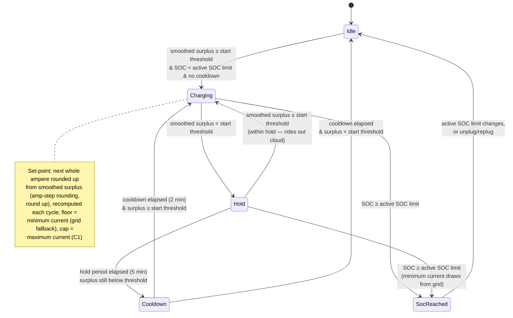

# UC01 — Charge from solar surplus

**Primary actor:** Household energy manager

**Stakeholders & interests:**

- Household energy manager — wants every watt of solar surplus self-consumed by the car rather than exported, accepting a small, bounded grid top-up (less than one amp-step) so no surplus is left unused.
- EV driver — wants the car charging whenever free solar is available, and not left idle through brief cloud cover.

**Scope / level:** sea-level (single goal: charge the car from solar surplus while `Solar` mode is active)

## Preconditions

- `Solar` is the [active mode](../system-overview.md#ubiquitous-language).
- The solar [capability](../system-overview.md#ubiquitous-language) is present (R18).
- The car is connected at home ([charger status](../system-overview.md#ubiquitous-language) is `connected` or `charging`).
- State of charge is below the [active SOC limit](../system-overview.md#ubiquitous-language) (resolved per `resolution-rules.md`).

## Trigger

A [control cycle](../system-overview.md#ubiquitous-language) observes that smoothed [solar surplus](../system-overview.md#ubiquitous-language) has reached at least the [solar start threshold](../system-overview.md#ubiquitous-language) (default 150 W). Here *smoothed* solar surplus rides on the smoothed [net import](../system-overview.md#ubiquitous-language) (`control-cycle.md` step 2), consistent with the `solar surplus` formula `charger_w − net_w`.

## Main success scenario

1. **Given** `Solar` mode is active, the car is connected at home, state of charge is below the active SOC limit, and no solar-mode cooldown is in effect.
2. **When** smoothed solar surplus reaches at least the solar start threshold (default 150 W), **then** the System starts charging within one control cycle.
3. **And** the System sets the charger current by rounding up to the next whole ampere ([amp-step rounding](../system-overview.md#ubiquitous-language), round up — fixed for `Solar`, not configurable), so all available solar surplus is used and a bounded net grid import (less than one amp-step) fills the gap, recomputing this set-point each following control cycle so it re-tracks the available surplus, bounded by the minimum and [maximum charging current](../system-overview.md#ubiquitous-language) (C1).

## Alternate flows

**2a — Blocked by cooldown** — branches from step 2.
Given a [solar-mode cooldown](../system-overview.md#ubiquitous-language) is still running after a previous stop (R11)
When smoothed solar surplus reaches the start threshold
Then the System does not start charging until the cooldown has fully elapsed, then starts on the next qualifying cycle.

**3a — Grid fallback (surplus below the minimum charging current)** — branches from step 3.
Given the System is charging in `Solar` mode
When smoothed solar surplus is at or above the start threshold but below the [minimum charging current](../system-overview.md#ubiquitous-language) (expressed as power)
Then the System holds the charger at the minimum charging current and draws the shortfall from the grid ([grid fallback](../system-overview.md#ubiquitous-language)), accepting a small positive net grid import.

**3b — Post-surplus hold (ride out cloud cover)** — branches from step 3.
Given the System is charging in `Solar` mode
When smoothed solar surplus falls below the start threshold (default 150 W)
Then the System holds the charger at the minimum charging current for the [post-surplus hold](../system-overview.md#ubiquitous-language) period (default 5 minutes)
And if smoothed surplus returns to at least the start threshold within that period, the System resumes normal solar charging (the hold is cancelled)
And if the hold period elapses with surplus still below the start threshold, the System stops charging (0 A) and starts the solar-mode cooldown (R11).

## Exception flows

**Peak / grid-ceiling clamp overrides the solar set-point.**
Given the System has computed a solar set-point
When the peak-protection clamp (R3) or the grid-supply-ceiling clamp (C4) in `control-cycle.md` would be exceeded on raw readings
Then the coordinator reduces (or, on a sustained breach at the minimum current, stops) the charger current — the clamp decides the set-point this cycle, not the solar rule.

**State of charge reaches the active SOC limit.**
Given the System is charging in `Solar` mode
When state of charge reaches the active SOC limit
Then the System stops charging (0 A) and does not resume above that limit until the active SOC limit changes or the car is unplugged and replugged (R7).

## Postconditions

- While surplus sustains at least the minimum charging current, net grid import stays bounded to less than one amp-step (the amp-step rounding gap, apart from a single-cycle transient) — solar is used as fully as possible, not exported, at the cost of a small, bounded grid top-up.
- During grid fallback or the post-surplus hold, the charger is at the minimum charging current and a positive net grid import is accepted (potentially larger than one amp-step, since the whole minimum current may need to come from the grid).
- The charger current is only ever 0 A or between the minimum and maximum charging current (C1).
- Charging never resumes above the active SOC limit (R7).

## State model

The set-point rule for the charging states is a **direct per-cycle computation**: each cycle the
System rounds the ideal current up to the next whole ampere (amp-step rounding, round up — fixed for
`Solar`) so all available smoothed surplus is used, flooring at the minimum charging current (grid
fallback) and capping at the maximum charging current (C1). Recomputing this set-point every cycle
re-tracks the available surplus as it changes, keeping net import bounded to less than one amp-step
outside grid fallback and the post-surplus hold (R1). The
`stateDiagram-v2` below is authoritative for the state set. All thresholds/timers are configurable
(defaults shown). The peak-protection (R3) and grid-supply-ceiling (C4) clamps are applied by the
coordinator *after* the mode returns its desired current and are not repeated here.
A disconnect (charger status leaving `connected`/`charging`) breaks the "car connected"
precondition and exits this use-case's scope from any state, returning to Idle; on disconnect
the active SOC limit resets to the default and any solar step-up is cleared (R7), which is why
the diagram does not draw a disconnect edge from every state.

| State | Set-point | Leaves when |
| --- | --- | --- |
| Idle | 0 A | smoothed surplus ≥ start threshold, SOC < active SOC limit, no cooldown → Charging |
| Charging | next whole ampere rounded up from smoothed surplus (amp-step rounding, round up), floored at minimum current (grid fallback) | surplus < start threshold → Hold · SOC ≥ active SOC limit → SocReached |
| Hold | minimum charging current | surplus ≥ start threshold → Charging · hold period (5 min) elapsed → Cooldown · SOC ≥ active SOC limit → SocReached |
| Cooldown | 0 A | cooldown (2 min) elapsed → Charging if surplus ≥ start threshold else Idle |
| SocReached | 0 A | active SOC limit changes, or car unplugged/replugged → Idle |

## Domain events produced

- `SolarChargingStarted` — the System began charging from solar surplus (Idle/Cooldown → Charging).
- `GridFallbackEngaged` — (fires within the `Charging` state on a set-point condition, not a state transition) surplus fell below the minimum charging current; the System is holding at minimum current with grid shortfall.
- `PostSurplusHoldStarted` — surplus fell below the start threshold; the System entered the hold to ride out cloud cover.
- `SolarChargingStopped` — the System stopped charging (0 A) after the hold period elapsed and started the cooldown.
- `ActiveSocLimitReached` — state of charge reached the active SOC limit; charging stopped and will not resume above the limit (R7).

## Diagram

## Requirements satisfied

- **R1** — Solar-first charging (start threshold, amp-step rounding round-up set-point using all available surplus, grid fallback, post-surplus hold).

Inherited from the shared mechanism (referenced, not restated): the active-SOC-limit resolution and reset (R7, `resolution-rules.md`), the rapid-cycling cooldown/min-current invariant (R11) and the peak-protection (R3) and grid-supply-ceiling (C4) clamps (`control-cycle.md`), voltage-aware conversion (NF4), and the solar capability gate (R18).

## Relationships

- **Sibling [UC02](UC02-charge-from-solar-only.md)** (`SolarOnly`) — both use amp-step rounding, but `Solar` always rounds up (fixed), whereas `SolarOnly`'s strategy is configurable (default round down); `SolarOnly` also has no grid fallback and no post-surplus hold; a solar step-up in effect is preserved when switching between the two (R7).
- **Peer [UC06](UC06-store-abundant-solar.md)**, not an extension — while charging in a solar mode, UC06 may write a higher active SOC limit into the shared `resolution-rules.md` lookup (R7 priority row 2) to store abundant surplus (R8); this use-case's own set-point logic just reads whatever value is currently resolved there, unaware of who set it.
- Runs on the `control-cycle.md` coordinator spine and consumes the active-SOC-limit rule in `resolution-rules.md`.
