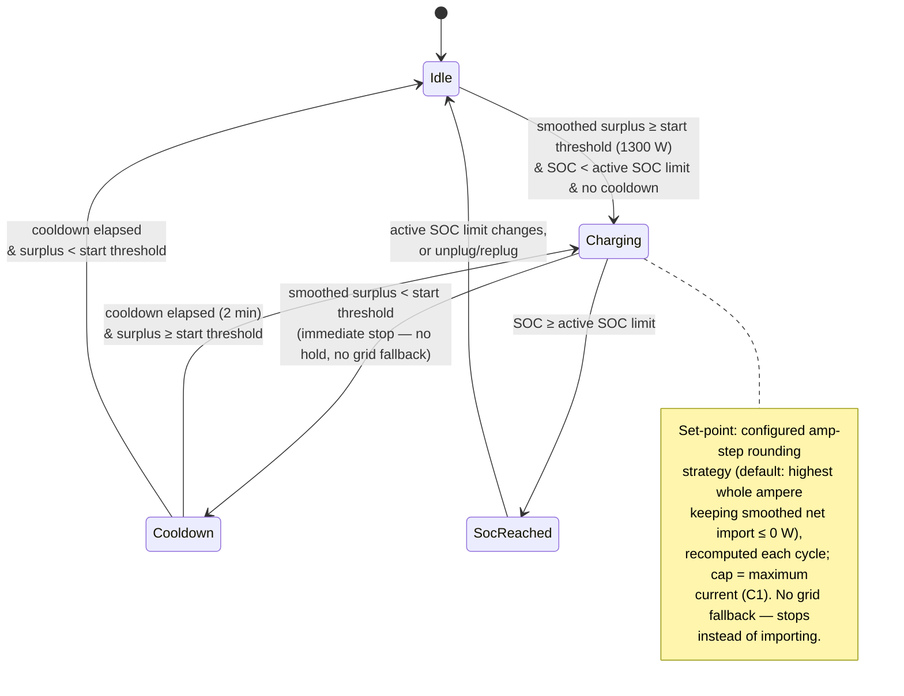

# UC02 — Charge from solar only

**Primary actor:** Household energy manager

**Stakeholders & interests:**

- Household energy manager — wants the car charged strictly from solar surplus, with zero grid import attributable to charging under the default rounding strategy, even if that means the car sometimes charges slowly or not at all.
- EV driver — accepts that charging pauses the moment solar can no longer cover it, in exchange for a guaranteed all-solar session.

**Scope / level:** sea-level (single goal: charge the car exclusively from solar surplus while `SolarOnly` mode is active)

## Preconditions

- `SolarOnly` is the [active mode](../system-overview.md#ubiquitous-language).
- The solar [capability](../system-overview.md#ubiquitous-language) is present (R18).
- The car is connected at home ([charger status](../system-overview.md#ubiquitous-language) is `connected` or `charging`).
- State of charge is below the [active SOC limit](../system-overview.md#ubiquitous-language) (resolved per `resolution-rules.md`).

## Trigger

A [control cycle](../system-overview.md#ubiquitous-language) observes that smoothed [solar surplus](../system-overview.md#ubiquitous-language) has reached at least the [solar start threshold](../system-overview.md#ubiquitous-language) (default 1300 W for `SolarOnly`, chosen so the [minimum charging current](../system-overview.md#ubiquitous-language) can be met from solar alone). Here *smoothed* solar surplus rides on the smoothed [net import](../system-overview.md#ubiquitous-language) (`control-cycle.md` step 2), consistent with the `solar surplus` formula `charger_w − net_w`.

## Main success scenario

1. **Given** `SolarOnly` mode is active, the car is connected at home, state of charge is below the active SOC limit, and no solar-mode cooldown is in effect.
2. **When** smoothed solar surplus reaches at least the solar start threshold (default 1300 W), **then** the System starts charging within one control cycle.
3. **And** the System converts the smoothed solar surplus into a whole-ampere set-point using the configured [amp-step rounding](../system-overview.md#ubiquitous-language) strategy — default `round down` (the highest whole ampere that keeps smoothed net grid import at or below 0 W, solar-only, never importing) — recomputing this set-point each following control cycle so it re-tracks the available surplus, bounded by the minimum and [maximum charging current](../system-overview.md#ubiquitous-language) (C1).

## Alternate flows

**2a — Blocked by cooldown** — branches from step 2.
Given a [solar-mode cooldown](../system-overview.md#ubiquitous-language) is still running after a previous stop (R11)
When smoothed solar surplus reaches the start threshold
Then the System does not start charging until the cooldown has fully elapsed, then starts on the next qualifying cycle.

**3a — Surplus falls below the start threshold (immediate stop, no hold, no grid fallback)** — branches from step 3.
Given the System is charging in `SolarOnly` mode
When smoothed solar surplus falls below the start threshold (default 1300 W) — so the surplus can no longer sustain the minimum charging current from solar alone
Then the System stops charging (0 A) within one control cycle and starts the solar-mode cooldown (R11)
And the System never holds at the minimum charging current on grid power ([grid fallback](../system-overview.md#ubiquitous-language) is excluded in `SolarOnly`) and never runs a [post-surplus hold](../system-overview.md#ubiquitous-language) (which is `Solar`-only) — the two behaviours that distinguish the sibling UC01.

**3b — Round-up strategy configured** — branches from step 3.
Given the amp-step rounding strategy is configured to `round up`
When the System computes the set-point
Then the System rounds up to the next whole ampere so all available solar surplus is used, accepting a bounded net grid import (less than one amp-step) to fill the gap
And `SolarOnly`'s strict zero-grid-import postcondition does not hold under this configuration — the household energy manager has deliberately traded strict zero-import for full solar utilization.

**3c — Round-to-nearest strategy configured (pendel)** — branches from step 3.
Given the amp-step rounding strategy is configured to `round to nearest`
When the smoothed solar surplus sits between two amp steps
Then the System rounds to whichever whole ampere is closer to the ideal value, using the configured rounding midpoint (default 50 %)
And if surplus hovers at the midpoint from one cycle to the next, the set-point may oscillate between the two amp steps — an accepted "pendel" edge case, not actively dampened.

## Exception flows

**Coordinator clamps still bound the set-point.**
Given the System has computed a solar-only set-point
When the peak-protection clamp (R3) or the grid-supply-ceiling clamp (C4) in `control-cycle.md` is applied on raw readings
Then the coordinator may only reduce (never raise) the charger current — but because `SolarOnly` keeps net grid import at or below 0 W under the default `round down` strategy (or bounded to less than one amp-step under `round up`/`nearest`), neither clamp normally engages, since both act on materially positive net import.

**State of charge reaches the active SOC limit.**
Given the System is charging in `SolarOnly` mode
When state of charge reaches the active SOC limit
Then the System stops charging (0 A) and does not resume above that limit until the active SOC limit changes or the car is unplugged and replugged (R7).

## Postconditions

- Under the default `round down` strategy, net grid import stays at or below 0 W while surplus sustains charging (apart from a single-cycle transient) — solar is self-consumed, never imported; the car is never charged from the grid (R2).
- Under `round up` or `round to nearest`, net grid import while surplus sustains charging stays bounded to less than one amp-step — a deliberate, configured trade-off, not the default.
- There is no grid fallback and no post-surplus hold: when smoothed surplus falls below the start threshold, the System stops within one control cycle.
- The charger current is only ever 0 A or between the minimum and maximum charging current (C1).
- Charging never resumes above the active SOC limit (R7).

## State model

The set-point rule for the charging state is a **direct per-cycle computation**: each cycle the
System converts smoothed surplus into a whole-ampere set-point using the configured amp-step
rounding strategy (default `round down` — the highest whole ampere that keeps smoothed net grid
import at or below 0 W; `round up` accepts a bounded grid top-up instead; `round to nearest` can
toggle between the two nearest amp steps), capping at the maximum charging current (C1). Unlike
UC01, where rounding is fixed to `round up`, this strategy is configurable here. It differs from
UC01 in the two omitted behaviours: there is **no grid fallback** (the floor at the minimum
charging current is sustained only from solar, because the start threshold is chosen to cover it —
when surplus falls below the threshold the System stops rather than importing) and **no post-surplus
hold** (the stop is immediate). The `stateDiagram-v2` below is authoritative for the state set. All
thresholds/timers are configurable (defaults shown). The peak-protection (R3) and
grid-supply-ceiling (C4) clamps are applied by the coordinator *after* the mode returns its desired
current and are not repeated here.
A disconnect (charger status leaving `connected`/`charging`) breaks the "car connected"
precondition and exits this use-case's scope from any state, returning to Idle; on disconnect
the active SOC limit resets to the default and any solar step-up is cleared (R7), which is why
the diagram does not draw a disconnect edge from every state.

| State | Set-point | Leaves when |
| --- | --- | --- |
| Idle | 0 A | smoothed surplus ≥ start threshold, SOC < active SOC limit, no cooldown → Charging |
| Charging | whole ampere from configured amp-step rounding strategy (default: highest ampere keeping smoothed net import ≤ 0 W; no grid fallback) | surplus < start threshold → Cooldown · SOC ≥ active SOC limit → SocReached |
| Cooldown | 0 A | cooldown (2 min) elapsed → Charging if surplus ≥ start threshold else Idle |
| SocReached | 0 A | active SOC limit changes, or car unplugged/replugged → Idle |

## Domain events produced

- `SolarOnlyChargingStarted` — the System began charging exclusively from solar surplus (Idle/Cooldown → Charging).
- `SolarOnlyChargingStopped` — smoothed surplus fell below the start threshold; the System stopped charging (0 A) immediately (no hold) and started the solar-mode cooldown.
- `ActiveSocLimitReached` — state of charge reached the active SOC limit; charging stopped and will not resume above the limit (R7).

## Diagram

## Requirements satisfied

- **R2** — Solar-only charging (start threshold default 1300 W, configurable amp-step rounding strategy — default `round down` keeping net import ≤ 0 W — immediate stop with no post-surplus hold, never charged from the grid under the default strategy).

Inherited from the shared mechanism (referenced, not restated): the active-SOC-limit resolution and reset (R7, `resolution-rules.md`), the rapid-cycling cooldown/min-current invariant (R11) and the peak-protection (R3) and grid-supply-ceiling (C4) clamps (`control-cycle.md`), voltage-aware conversion (NF4), and the solar capability gate (R18).

## Relationships

- **Sibling [UC01](UC01-charge-from-solar-surplus.md)** (`Solar`) — both use amp-step rounding, but `Solar` always rounds up (fixed), whereas `SolarOnly`'s strategy is configurable (default round down); UC01 also adds grid fallback and the post-surplus hold, whereas `SolarOnly` has neither; a solar step-up in effect is preserved when switching between the two solar modes (R7).
- **May be superseded by the coordinator's deadline-urgency response** (`resolution-rules.md`, `control-cycle.md` step 5) when the departure deadline is at risk — this mode's own set-point rule above is never itself modified (NF2). `SolarOnly` is a deliberate `Manual`-only, near-zero-grid intent (bounded to less than one amp-step even under the `round up`/`nearest` rounding strategy) — it is never Auto-selected (Auto mode-selection, `resolution-rules.md`) — so the coordinator, not this mode, is what supplies any sustained grid charging a deadline requires; this use-case never adds grid charging of its own. See [UC05](UC05-guarantee-ready-by-departure.md) for the goal this serves.
- **Extended by [UC06](UC06-store-abundant-solar.md)** — while charging in a solar mode, UC06 may step up the active SOC limit to store abundant surplus (R8).
- Runs on the `control-cycle.md` coordinator spine and consumes the active-SOC-limit rule in `resolution-rules.md`.
