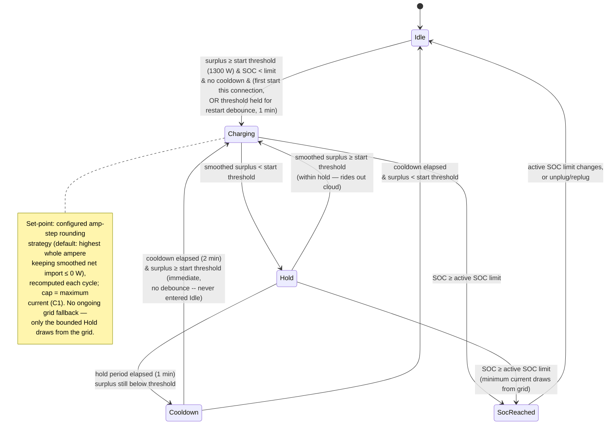

# UC02 — Charge from solar only

**Primary actor:** Household energy manager

**Stakeholders & interests:**

- Household energy manager — wants the car charged from solar surplus, with zero grid import attributable to sustained charging under the default rounding strategy, even if that means the car sometimes charges slowly or not at all — accepting only a brief, bounded grid draw while riding out a passing cloud.
- EV driver — accepts that charging stops if solar surplus doesn't return within the bounded post-surplus hold, in exchange for a session that is otherwise all-solar.

**Scope / level:** sea-level (single goal: charge the car exclusively from solar surplus while `SolarOnly` mode is active)

## Preconditions

- `SolarOnly` is the [active mode](../system-overview.md#ubiquitous-language).
- The solar [capability](../system-overview.md#ubiquitous-language) is present (R18).
- The car is connected at home ([charger status](../system-overview.md#ubiquitous-language) is `connected` or `charging`).
- State of charge is below the [active SOC limit](../system-overview.md#ubiquitous-language) (resolved per `resolution-rules.md`).

## Trigger

A [control cycle](../system-overview.md#ubiquitous-language) observes that smoothed [solar surplus](../system-overview.md#ubiquitous-language) has reached at least the [solar start threshold](../system-overview.md#ubiquitous-language) (default 1300 W for `SolarOnly`, chosen so the [minimum charging current](../system-overview.md#ubiquitous-language) can be met from solar alone). Here *smoothed* solar surplus rides on the smoothed [net import](../system-overview.md#ubiquitous-language) (`control-cycle.md` step 2), consistent with the `solar surplus` formula `charger_w − net_w`.

## Main success scenario

1. **Given** `SolarOnly` mode is active, the car is connected at home, state of charge is below the active SOC limit, and no solar-mode cooldown is in effect.
2. **When** smoothed solar surplus reaches at least the solar start threshold (default 1300 W), **then** the System starts charging within one control cycle — immediately, on the connection's very first start (2b covers every later start).
3. **And** the System converts the smoothed solar surplus into a whole-ampere set-point using the configured [amp-step rounding](../system-overview.md#ubiquitous-language) strategy — default `round down` (the highest whole ampere that keeps smoothed net grid import at or below 0 W, solar-only, never importing) — recomputing this set-point each following control cycle so it re-tracks the available surplus, bounded by the minimum and [maximum charging current](../system-overview.md#ubiquitous-language) (C1).

## Alternate flows

**2a — Blocked by cooldown** — branches from step 2.
Given a [solar-mode cooldown](../system-overview.md#ubiquitous-language) is still running after a previous stop (R11)
When smoothed solar surplus reaches the start threshold
Then the System does not start charging until the cooldown has fully elapsed, then proceeds to step 2 or 2b depending on whether surplus is still at or above the start threshold once it does.

**2b — Restart debounce (every start after the connection's first)** — branches from step 2.
Given the [has-charged flag](../system-overview.md#ubiquitous-language) is already set for this connection (i.e. this is not the very first time `Solar` or `SolarOnly` has started charging since the car connected) and the System is `Idle`, waiting for the start threshold to be met
When smoothed solar surplus reaches the start threshold
Then the System does not start charging immediately; the start threshold must hold continuously for the [restart debounce](../system-overview.md#ubiquitous-language) period (default 1 minute, shared with sibling UC01) before charging actually resumes — a single-cycle blip does not restart charging only to immediately need to stop again
And if surplus drops back below the start threshold before the debounce period elapses, the System remains `Idle` and the debounce timer resets; it starts again once surplus next reaches the threshold
And this debounce does **not** apply when a cooldown elapses with surplus already at or above the start threshold — that resumes charging immediately (step 2), since the System never actually waited in `Idle`.

**3a — Surplus falls below the start threshold (bounded hold, then stop; no ongoing grid fallback)** — branches from step 3.
Given the System is charging in `SolarOnly` mode
When smoothed solar surplus falls below the start threshold (default 1300 W) — so the surplus can no longer sustain the minimum charging current from solar alone
Then the System holds the charger at the minimum charging current for the [post-surplus hold](../system-overview.md#ubiquitous-language) period (default 1 minute, `solar_only_hold_min`), drawing any shortfall from the grid for that bounded period — the one exception to this mode's zero-grid-import guarantee (R2)
And if smoothed surplus returns to at least the start threshold within that period, the System resumes normal solar-only charging (the hold is cancelled)
And if the hold period elapses with surplus still below the start threshold, the System stops charging (0 A) and starts the solar-mode cooldown (R11)
And unlike sibling UC01, the System never runs an ongoing [grid fallback](../system-overview.md#ubiquitous-language) — the hold above is the only, time-bounded circumstance in which `SolarOnly` draws from the grid; there is no sustained fallback state.

**3b — Round-up strategy configured** — branches from step 3.
Given the amp-step rounding strategy is configured to `round up`
When the System computes the set-point
Then the System rounds up to the next whole ampere so all available solar surplus is used, accepting a bounded net grid import (less than one amp-step) to fill the gap
And `SolarOnly`'s strict zero-grid-import postcondition does not hold under this configuration — the household energy manager has deliberately traded strict zero-import for full solar utilization.

**3c — Round-to-nearest strategy configured (pendel)** — branches from step 3.
Given the amp-step rounding strategy is configured to `round to nearest`
When the smoothed solar surplus sits between two amp steps
Then the System rounds to whichever whole ampere is closer to the ideal value, using the configured rounding midpoint (default 50 %)
And if surplus hovers at the midpoint from one cycle to the next, the set-point may oscillate between the two amp steps — an accepted "pendel" edge case, not actively dampened.

## Exception flows

**Coordinator clamps still bound the set-point.**
Given the System has computed a solar-only set-point
When the peak-protection clamp (R3) or the grid-supply-ceiling clamp (C4) in `control-cycle.md` is applied on raw readings
Then the coordinator may only reduce (never raise) the charger current. While `Charging`, `SolarOnly` keeps net grid import at or below 0 W under the default `round down` strategy (or bounded to less than one amp-step under `round up`/`nearest`), so neither clamp normally engages there, since both act on materially positive net import. While `Hold`, net import can be materially positive (up to the whole minimum charging current drawn from the grid), so either clamp can engage during the hold the same way it can during `Solar`'s grid fallback (UC01).

**State of charge reaches the active SOC limit.**
Given the System is charging in `SolarOnly` mode
When state of charge reaches the active SOC limit
Then the System stops charging (0 A) and does not resume above that limit until the active SOC limit changes or the car is unplugged and replugged (R7).

## Postconditions

- Under the default `round down` strategy, net grid import stays at or below 0 W while surplus sustains charging (apart from a single-cycle transient) — solar is self-consumed, never imported; the only exception is the bounded post-surplus hold (default 1 minute, see below).
- Under `round up` or `round to nearest`, net grid import while surplus sustains charging stays bounded to less than one amp-step — a deliberate, configured trade-off, not the default.
- There is no ongoing grid fallback: when smoothed surplus falls below the start threshold, the System holds at the minimum charging current — drawing any shortfall from the grid — only for the bounded post-surplus hold period (default 1 minute), then stops if surplus has not recovered.
- The charger current is only ever 0 A or between the minimum and maximum charging current (C1).
- Charging never resumes above the active SOC limit (R7).
- After the connection's first start, charging never resumes from `Idle` on a start threshold crossing that doesn't hold for at least the restart debounce period (default 1 minute); a resume directly from `Cooldown` (threshold already met when cooldown elapsed) is exempt from this latency, since it never waited in `Idle`.

## State model

The set-point rule for the charging state is a **direct per-cycle computation**: each cycle the
System converts smoothed surplus into a whole-ampere set-point using the configured amp-step
rounding strategy (default `round down` — the highest whole ampere that keeps smoothed net grid
import at or below 0 W; `round up` accepts a bounded grid top-up instead; `round to nearest` can
toggle between the two nearest amp steps), capping at the maximum charging current (C1). Unlike
UC01, where rounding is fixed to `round up`, this strategy is configurable here. It differs from
UC01 in one respect: there is **no ongoing grid fallback** (while charging, the floor at the
minimum charging current is sustained only from solar, because the start threshold is chosen to
cover it) — but like UC01, it does hold at the minimum charging current for a bounded
[post-surplus hold](../system-overview.md#ubiquitous-language) period (default 1 minute,
deliberately shorter than `Solar`'s 5 minutes) when surplus dips below the start threshold,
drawing any shortfall from the grid only for that bounded window, before stopping if surplus has
not recovered — the one exception to this mode's otherwise strict zero-grid-import guarantee (R2,
R11). The `stateDiagram-v2` below is authoritative for the state set. All
thresholds/timers are configurable (defaults shown). The peak-protection (R3) and
grid-supply-ceiling (C4) clamps are applied by the coordinator *after* the mode returns its desired
current and are not repeated here.
A disconnect (charger status leaving `connected`/`charging`) breaks the "car connected"
precondition and exits this use-case's scope from any state, returning to Idle; on disconnect
the active SOC limit resets to the default, any solar step-up is cleared (R7), and the
[has-charged flag](../system-overview.md#ubiquitous-language) is cleared (R11) — the next
connection is a fresh session's first start — which is why the diagram does not draw a
disconnect edge from every state.

`Idle → Charging` carries one further guard, the [restart debounce](../system-overview.md#ubiquitous-language)
(R11, shared with sibling UC01): before the has-charged flag is first set, `Idle` starts
charging as soon as the start threshold is met, with no debounce, and sets the flag. Once the
flag is set, every later `Idle → Charging` additionally requires the start threshold to hold
continuously for the restart debounce period (default 1 minute) — but this only matters when
the System actually reaches `Idle` and waits: `Cooldown → Charging` (below) already resumes
immediately when the threshold is met the moment cooldown elapses, without ever passing through
`Idle`.

| State | Set-point | Leaves when |
| --- | --- | --- |
| Idle | 0 A | smoothed surplus ≥ start threshold, SOC < active SOC limit, no cooldown → Charging, immediately if the has-charged flag is not yet set, else once the threshold has held for the restart debounce period (default 1 min) |
| Charging | whole ampere from configured amp-step rounding strategy (default: highest ampere keeping smoothed net import ≤ 0 W; no ongoing grid fallback) | surplus < start threshold → Hold · SOC ≥ active SOC limit → SocReached |
| Hold | minimum charging current (grid-drawn shortfall accepted, bounded to this period) | surplus ≥ start threshold → Charging · hold period (1 min) elapsed → Cooldown · SOC ≥ active SOC limit → SocReached |
| Cooldown | 0 A | cooldown (2 min) elapsed → Charging, immediately, if surplus ≥ start threshold; else → Idle (has-charged flag already set, so the restart debounce above applies to the next start) |
| SocReached | 0 A | active SOC limit changes, or car unplugged/replugged → Idle (has-charged flag already set, so the restart debounce above applies to the next start) |

## Domain events produced

- `SolarOnlyChargingStarted` — the System began charging exclusively from solar surplus (Idle/Cooldown → Charging).
- `RestartDebounceStarted` — (fires within the `Idle` state; not a state transition, since `Idle` is unchanged) the start threshold was newly met while the has-charged flag was already set; the System begins waiting out the restart debounce period before actually starting. Shared with sibling UC01's `Solar` mode.
- `PostSurplusHoldStarted` — smoothed surplus fell below the start threshold; the System entered the hold to ride out cloud cover, drawing any shortfall from the grid for the bounded hold period. Shared with sibling UC01's `Solar` mode (same event name, mode-specific duration and grid-import semantics carried in the event's own mode context, not in the name).
- `SolarOnlyChargingStopped` — the System stopped charging (0 A) after the hold period elapsed with surplus still below the start threshold, and started the solar-mode cooldown.
- `ActiveSocLimitReached` — state of charge reached the active SOC limit; charging stopped and will not resume above the limit (R7).

## Diagram

```mermaid
stateDiagram-v2
    [*] --> Idle
    Idle --> Charging: surplus ≥ start threshold (1300 W) & SOC < limit<br/>& no cooldown & (first start this connection,<br/>OR threshold held for restart debounce, 1 min)
    Charging --> Hold: smoothed surplus < start threshold
    Hold --> Charging: smoothed surplus ≥ start threshold<br/>(within hold — rides out cloud)
    Hold --> Cooldown: hold period elapsed (1 min)<br/>surplus still below threshold
    Charging --> SocReached: SOC ≥ active SOC limit
    Hold --> SocReached: SOC ≥ active SOC limit<br/>(minimum current draws from grid)
    Cooldown --> Charging: cooldown elapsed (2 min)<br/>& surplus ≥ start threshold (immediate,<br/>no debounce -- never entered Idle)
    Cooldown --> Idle: cooldown elapsed<br/>& surplus < start threshold
    SocReached --> Idle: active SOC limit changes,<br/>or unplug/replug
    note right of Charging
        Set-point: configured amp-step rounding
        strategy (default: highest whole ampere
        keeping smoothed net import ≤ 0 W),
        recomputed each cycle; cap = maximum
        current (C1). No ongoing grid fallback —
        only the bounded Hold draws from the grid.
    end note
```

## Requirements satisfied

- **R2** — Solar-only charging (start threshold default 1300 W, configurable amp-step rounding strategy — default `round down` keeping net import ≤ 0 W — bounded post-surplus hold (default 1 minute) before stopping, never charged from the grid under the default strategy outside that bounded hold).

Inherited from the shared mechanism (referenced, not restated): the active-SOC-limit resolution and reset (R7, `resolution-rules.md`), the rapid-cycling cooldown/min-current/restart-debounce invariant (R11) and the peak-protection (R3) and grid-supply-ceiling (C4) clamps (`control-cycle.md`), voltage-aware conversion (NF4), and the solar capability gate (R18).

## Relationships

- **Sibling [UC01](UC01-charge-from-solar-surplus.md)** (`Solar`) — both use amp-step rounding, but `Solar` always rounds up (fixed), whereas `SolarOnly`'s strategy is configurable (default round down); both hold at the minimum charging current on a post-surplus hold before stopping, but `SolarOnly`'s hold is shorter (default 1 minute vs. 5) and is the one bounded exception to its zero-grid-import guarantee, whereas `Solar` also has an ongoing grid fallback that `SolarOnly` lacks; both also share the same restart-debounce mechanism and has-charged flag, since a solar step-up in effect — like the has-charged flag — is preserved when switching between the two solar modes (R7).
- **Peer [UC06](UC06-store-abundant-solar.md)**, not an extension — while charging in a solar mode, UC06 may write a higher active SOC limit into the shared `resolution-rules.md` lookup (R7 priority row 2) to store abundant surplus (R8); this use-case's own set-point logic just reads whatever value is currently resolved there, unaware of who set it.
- Runs on the `control-cycle.md` coordinator spine and consumes the active-SOC-limit rule in `resolution-rules.md`.
