# UC03 — Charge cost-efficiently from the grid

**Primary actor:** Household energy manager

**Stakeholders & interests:**

- Household energy manager — wants the car topped up from the grid only when it is cheapest (while the low-tariff flag is active) and never in a way that raises the billed [monthly peak demand](../system-overview.md#ubiquitous-language), so grid energy cost and CapTar impact are both minimised.
- EV driver — accepts that baseline grid charging waits for low tariff, trusting the departure deadline (UC05) to override that policy whenever the car would otherwise not be ready in time.

**Scope / level:** sea-level (single goal: top the car up cost-efficiently from the grid while `Captar` mode is active)

## Preconditions

- `Captar` is the [active mode](../system-overview.md#ubiquitous-language). (`Captar` is available regardless of the solar [capability](../system-overview.md#ubiquitous-language) — R18.)
- The car is connected at home ([charger status](../system-overview.md#ubiquitous-language) is `connected` or `charging`).
- State of charge is below the [active SOC limit](../system-overview.md#ubiquitous-language) (resolved per `resolution-rules.md`).

## Trigger

A [control cycle](../system-overview.md#ubiquitous-language) observes that the [low-tariff flag](../system-overview.md#ubiquitous-language) is active while the car is connected at home and state of charge is below the active SOC limit, and the [solar-reserve cap](../system-overview.md#ubiquitous-language) is not suppressing grid charging (R9).

## Main success scenario

1. **Given** `Captar` mode is active, the car is connected at home, state of charge is below the active SOC limit, no `Captar` cooldown is in effect, and the solar-reserve cap is not suppressing grid charging.
2. **When** the low-tariff flag is active, **then** the System starts grid charging within one control cycle.
3. **And** the System requests the [maximum charging current](../system-overview.md#ubiquitous-language) — charging as fast as the grid allows during the low-tariff window — which the R3 peak clamp (`control-cycle.md`) fits on raw readings to the available [peak headroom](../system-overview.md#ubiquitous-language), so [net import](../system-overview.md#ubiquitous-language) stays at or below the [effective peak limit](../system-overview.md#ubiquitous-language) (resolved per `resolution-rules.md`) minus the [safety margin](../system-overview.md#ubiquitous-language), bounded by the minimum and maximum charging current (C1). Any [solar surplus](../system-overview.md#ubiquitous-language) reduces net import and is self-consumed first, so the grid supplies only the remainder.

## Alternate flows

**2a — Blocked by cooldown** — branches from step 2.
Given a `Captar`-mode cooldown is still running after a previous stop (R11, default 10 minutes)
When the low-tariff flag is active
Then the System does not start charging until the cooldown has fully elapsed, then starts on the next qualifying cycle.

**2b — Low-tariff flag inactive (baseline does not charge)** — branches from step 2.
Given `Captar` mode is active and the car is connected at home below the active SOC limit
When the low-tariff flag is inactive
Then the System keeps the charger at 0 A (the baseline cost policy charges only at low tariff), unless the departure deadline is at risk — in which case UC05 supersedes this policy (see Relationships).

**3a — Suppressed by the solar-reserve cap** — branches from step 3.
Given the solar-reserve cap is active (R9, homed in UC07)
When the low-tariff flag is active
Then the System suppresses baseline low-tariff grid charging (0 A); only a departure deadline (R5, UC05) may charge, and only up to — never beyond — the cap.

## Exception flows

**Peak / grid-ceiling clamp bounds or stops the set-point.**
Given the System has requested a `Captar` set-point
When the peak-protection clamp (R3) or the grid-supply-ceiling clamp (C4) in `control-cycle.md` would be exceeded on raw readings — for example household load leaves less than the minimum charging current of headroom
Then the coordinator reduces the charger current — or, on a sustained breach at the minimum charging current, stops it and starts the `Captar` cooldown (R11) — so the clamp decides the set-point this cycle, not the mode.

**State of charge reaches the active SOC limit.**
Given the System is charging in `Captar` mode
When state of charge reaches the active SOC limit
Then the System stops charging (0 A) and does not resume above that limit until the active SOC limit changes or the car is unplugged and replugged (R7).

## Postconditions

- While the low-tariff flag is active and headroom permits, the charger draws grid power up to the peak headroom, keeping net import at or below the effective peak limit minus the safety margin — so baseline grid charging never raises the billed [monthly peak demand](../system-overview.md#ubiquitous-language) beyond what is already incurred (R3, C3).
- While the low-tariff flag is inactive and no departure deadline forces charging, the charger is at 0 A (R4 baseline).
- The charger current is only ever 0 A or between the minimum and maximum charging current (C1).
- Charging never resumes above the active SOC limit (R7).

## State model

The set-point rule for the charging state is simple: the `Captar` module **requests the maximum
charging current** while the low-tariff flag is active, and the R3 peak clamp (`control-cycle.md`) fits
that request on **raw** readings to the available [peak headroom](../system-overview.md#ubiquitous-language)
— the highest whole ampere that keeps net import at or below the effective peak limit minus the safety
margin, floored at the minimum and capped at the maximum charging current (C1). Realising the
absolute-headroom bound in the raw-reading clamp rather than in the mode is what makes `Captar`'s
effective control law raw-based, unlike the solar modes' smoothed convergence toward 0 W (UC01/UC02).
Because the clamp acts on net import, any solar production is netted off first and self-consumed, with
the grid supplying only the remainder. The `stateDiagram-v2` below is authoritative for the state set.
All thresholds/timers are configurable (defaults shown). The peak-protection (R3) and
grid-supply-ceiling (C4) clamps and the effective-peak-limit resolution are applied by the shared
mechanism and are referenced, not repeated, here.
A disconnect (charger status leaving `connected`/`charging`) breaks the "car connected" precondition
and exits this use-case's scope from any state, returning to Idle; on disconnect the active SOC limit
resets to the default (R7), which is why the diagram does not draw a disconnect edge from every state.

| State | Set-point | Leaves when |
| --- | --- | --- |
| Idle | 0 A | low-tariff flag active & SOC < active SOC limit & no cooldown & cap not suppressing → Charging |
| Charging | maximum current requested; R3 clamp fits it (raw) to the peak headroom — net import ≤ effective peak limit − safety margin | low-tariff flag inactive, or solar-reserve cap becomes active → Cooldown · sustained clamp breach at the minimum charging current (R3/C4 stop → R11 cooldown, `control-cycle.md`) → Cooldown · SOC ≥ active SOC limit → SocReached |
| Cooldown | 0 A | `Captar` cooldown (10 min) elapsed → Charging if charging conditions hold, else Idle |
| SocReached | 0 A | active SOC limit changes, or car unplugged/replugged → Idle |

## Domain events produced

- `LowTariffChargingStarted` — the System began cost-efficient grid charging while the low-tariff flag was active (Idle/Cooldown → Charging).
- `LowTariffChargingStopped` — the low-tariff flag went inactive (or the solar-reserve cap became active); the System stopped charging (0 A) and started the `Captar` cooldown (R11).
- `ActiveSocLimitReached` — state of charge reached the active SOC limit; charging stopped and will not resume above the limit (R7).

## Diagram

```mermaid
stateDiagram-v2
    [*] --> Idle
    Idle --> Charging: low-tariff flag active & SOC < active SOC limit<br/>& no cooldown & solar-reserve cap not suppressing
    Charging --> Cooldown: low-tariff flag inactive,<br/>or solar-reserve cap becomes active (R9)
    Charging --> Cooldown: sustained clamp breach at<br/>minimum current (R3/C4 stop → R11 cooldown)
    Charging --> SocReached: SOC ≥ active SOC limit
    Cooldown --> Charging: cooldown elapsed (10 min)<br/>& charging conditions hold
    Cooldown --> Idle: cooldown elapsed<br/>& charging conditions not held
    SocReached --> Idle: active SOC limit changes,<br/>or unplug/replug
    note right of Charging
        Set-point: request maximum current; the R3 peak
        clamp fits it (raw) to the peak headroom — net
        import ≤ effective peak limit − safety margin;
        floor = minimum current, cap = maximum current
        (C1). Solar is netted off first.
    end note
```

## Requirements satisfied

- **R4** — Cost-efficient grid charging (low-tariff-gated baseline, peak-headroom set-point up to the effective peak limit minus the safety margin, 0 A default when no baseline condition permits charging).

Inherited from the shared mechanism (referenced, not restated): the active-SOC-limit resolution and reset (R7, `resolution-rules.md`), the effective-peak-limit resolution (`resolution-rules.md`), the peak-protection (R3, C3) and grid-supply-ceiling (C4) clamps and the rapid-cycling cooldown/min-current invariant (R11) (`control-cycle.md`), sensor smoothing (R10), and voltage-aware conversion (NF4). The solar-reserve-cap suppression of low-tariff grid charging (R9) is homed in UC07 and referenced here.

## Relationships

- **Extended by [UC05](UC05-guarantee-ready-by-departure.md)** when the departure deadline is at risk. R5 supersedes the low-tariff-only baseline — permitting high-tariff grid charging and raising the effective peak limit up to the [maximum peak](../system-overview.md#ubiquitous-language) — to the lowest level that still meets the deadline. Under the `Auto` profile this override is carried by escalating to `Captar` (Auto mode-selection row 2, `resolution-rules.md`). The deadline logic lives in UC05, not here.
- **Selected by the `Auto` profile** for cost-efficient overnight grid top-up (Auto mode-selection row 4) and as the escalation target for deadline urgency (row 2); `Auto` reverts to a solar mode once grid charging is no longer required (`resolution-rules.md`).
- **Suppressed by [UC07](UC07-reserve-capacity-for-tomorrow.md)** — while the solar-reserve cap is active (R9), baseline low-tariff grid charging is suppressed so battery room is reserved for tomorrow's solar.
- Runs on the `control-cycle.md` coordinator spine and consumes the active-SOC-limit and effective-peak-limit rules in `resolution-rules.md`.
