# UC03 — Charge from the grid in Captar mode

**Primary actor:** Household energy manager

**Stakeholders & interests:**

- Household energy manager — wants grid charging, whenever it runs, to charge as fast as possible without ever raising the billed [monthly peak demand](../system-overview.md#ubiquitous-language); when the timing of that charging is theirs to choose (the `Auto` profile), they also want it to prefer low-tariff periods, but that timing preference is a separate concern from how fast `Captar` itself charges.
- EV driver — accepts that a manually selected `Captar` session charges immediately at whatever tariff is in effect, trusting the departure deadline (UC05) to override this policy whenever the car would otherwise not be ready in time.

**Scope / level:** sea-level (single goal: charge the car from the grid up to the CapTar-respecting peak limit while `Captar` mode is active)

## Preconditions

- `Captar` is the [active mode](../system-overview.md#ubiquitous-language). (`Captar` is available regardless of the solar [capability](../system-overview.md#ubiquitous-language) — R18.)
- The car is connected at home ([charger status](../system-overview.md#ubiquitous-language) is `connected` or `charging`).
- State of charge is below the [active SOC limit](../system-overview.md#ubiquitous-language) (resolved per `resolution-rules.md`).

## Trigger

A [control cycle](../system-overview.md#ubiquitous-language) observes that `Captar` mode is active while the car is connected at home and state of charge is below the active SOC limit.

## Main success scenario

1. **Given** `Captar` mode is active, the car is connected at home, state of charge is below the active SOC limit, and no `Captar` cooldown is in effect.
2. **When** a control cycle runs, **then** the System starts grid charging within one control cycle.
3. **And** the System requests the [maximum charging current](../system-overview.md#ubiquitous-language) — charging as fast as the grid allows — which the R3 peak clamp (`control-cycle.md`) fits on raw readings to the available [peak headroom](../system-overview.md#ubiquitous-language), so [net import](../system-overview.md#ubiquitous-language) stays at or below the [effective peak limit](../system-overview.md#ubiquitous-language) (resolved per `resolution-rules.md`) minus the [safety margin](../system-overview.md#ubiquitous-language), bounded by the minimum and maximum charging current (C1). Any [solar surplus](../system-overview.md#ubiquitous-language) reduces net import and is self-consumed first, so the grid supplies only the remainder.

## Alternate flows

**2a — Blocked by cooldown** — branches from step 2.
Given a `Captar`-mode cooldown is still running after a previous stop (R11, default 10 minutes)
When a control cycle runs
Then the System does not start charging until the cooldown has fully elapsed, then starts on the next qualifying cycle.

## Exception flows

**Peak / grid-ceiling clamp bounds or stops the set-point.**
Given the System has requested a `Captar` set-point
When the peak-protection clamp (R3) or the grid-supply-ceiling clamp (C4) in `control-cycle.md` would be exceeded on raw readings — for example household load leaves less than the minimum charging current of headroom
Then the coordinator reduces the charger current — or, on a sustained R3 breach at the minimum charging current, stops it and starts the `Captar` cooldown (R11); a C4 breach clamps down (to 0 A if necessary) without starting a cooldown — so the clamp decides the set-point this cycle, not the mode.

**State of charge reaches the active SOC limit.**
Given the System is charging in `Captar` mode
When state of charge reaches the active SOC limit — whether the plain default, a stepped-up value, or a value `Auto` has lowered via the solar-reserve cap (R9) — the resolution is the same to `Captar`
Then the System stops charging (0 A) and does not resume above that limit until the active SOC limit changes or the car is unplugged and replugged (R7).

## Postconditions

- While `Captar` mode is active, the car is connected below the active SOC limit, and headroom permits, the charger draws grid power up to the peak headroom, keeping net import at or below the effective peak limit minus the safety margin — so grid charging never raises the billed [monthly peak demand](../system-overview.md#ubiquitous-language) beyond what is already incurred (R3, C3).
- The charger current is only ever 0 A or between the minimum and maximum charging current (C1).
- Charging never resumes above the active SOC limit (R7).

## State model

`Captar`'s charging law is tariff-independent and reserve-cap-independent: the mode requests the
maximum charging current whenever its connection, SOC, and cooldown conditions hold — it never
reads the [low-tariff flag](../system-overview.md#ubiquitous-language), the home-day flag, or the
solar forecast. Timing grid charging to
low-tariff periods, and reserving capacity for tomorrow's solar, are entirely the `Auto` profile's
job (R16, Auto mode-selection row 4 and the active-SOC-limit resolution in `resolution-rules.md`):
`Auto` chooses *when* to select `Captar` and, independently, what the active SOC limit currently
is; `Captar` itself, once selected — whether by `Auto` or manually — always charges the same way
to whichever limit it is given.
The R3 peak clamp (`control-cycle.md`) fits the maximum-current request on **raw** readings to the
available [peak headroom](../system-overview.md#ubiquitous-language) — the highest whole ampere
that keeps net import at or below the effective peak limit minus the safety margin, floored at the
minimum and capped at the maximum charging current (C1). Realising the absolute-headroom bound in
the raw-reading clamp rather than in the mode is what makes `Captar`'s effective control law
raw-based, unlike the solar modes' smoothed convergence toward 0 W (UC01/UC02). Because the clamp
acts on net import, any solar production is netted off first and self-consumed, with the grid
supplying only the remainder. The `stateDiagram-v2` below is authoritative for the state set. All
thresholds/timers are configurable (defaults shown). The peak-protection (R3) and
grid-supply-ceiling (C4) clamps and the effective-peak-limit resolution are applied by the shared
mechanism and are referenced, not repeated, here.
A disconnect (charger status leaving `connected`/`charging`) breaks the "car connected" precondition
and exits this use-case's scope from any state, returning to Idle; on disconnect the active SOC limit
resets to the default (R7), which is why the diagram does not draw a disconnect edge from every state.

| State | Set-point | Leaves when |
| --- | --- | --- |
| Idle | 0 A | SOC < active SOC limit & no cooldown → Charging |
| Charging | maximum current requested; R3 clamp fits it (raw) to the peak headroom — net import ≤ effective peak limit − safety margin | sustained R3 breach at the minimum charging current (stop → R11 cooldown, `control-cycle.md`) → Cooldown · SOC ≥ active SOC limit → SocReached |
| Cooldown | 0 A | `Captar` cooldown (10 min) elapsed → Charging if charging conditions hold, else Idle |
| SocReached | 0 A | active SOC limit changes, or car unplugged/replugged → Idle |

## Domain events produced

- `CaptarChargingStarted` — the System began grid charging in `Captar` mode (Idle/Cooldown → Charging).
- `CaptarChargingStopped` — a sustained R3 breach at the minimum charging current forced a stop; the System stopped charging (0 A) and started the `Captar` cooldown (R11).
- `ActiveSocLimitReached` — state of charge reached the active SOC limit; charging stopped and will not resume above the limit (R7).

## Diagram

```mermaid
stateDiagram-v2
    [*] --> Idle
    Idle --> Charging: SOC < active SOC limit & no cooldown
    Charging --> Cooldown: sustained R3 breach at<br/>minimum current (stop → R11 cooldown)
    Charging --> SocReached: SOC ≥ active SOC limit
    Cooldown --> Charging: cooldown elapsed (10 min)<br/>& charging conditions hold
    Cooldown --> Idle: cooldown elapsed<br/>& charging conditions not held
    SocReached --> Idle: active SOC limit changes,<br/>or unplug/replug
    note right of Charging
        Set-point: request maximum current; the R3 peak
        clamp fits it (raw) to the peak headroom — net
        import ≤ effective peak limit − safety margin;
        floor = minimum current, cap = maximum current
        (C1). Solar is netted off first. Tariff-independent.
    end note
```

## Requirements satisfied

- **R4** — Captar mode grid charging (charges to the peak-headroom set-point whenever active and its own conditions hold, independent of tariff; 0 A default when no condition permits charging).

Inherited from the shared mechanism (referenced, not restated): the active-SOC-limit resolution and reset (R7, `resolution-rules.md` — which `Auto` may lower via the solar-reserve cap, R9, UC07), the effective-peak-limit resolution (`resolution-rules.md`), the peak-protection (R3, C3) and grid-supply-ceiling (C4) clamps and the rapid-cycling cooldown/min-current invariant (R11) (`control-cycle.md`), sensor smoothing (R10), and voltage-aware conversion (NF4).

## Relationships

- **Timed and bounded by the `Auto` profile**: `Auto` selects `Captar` for cost-efficient overnight top-up only while the low-tariff flag is active and its own solar-reserve conditions (R9, UC07) do not hold (Auto mode-selection row 4, `resolution-rules.md`), and as the escalation target for deadline urgency (row 2); `Auto` also independently lowers the active SOC limit via the solar-reserve cap when those conditions do hold (R7). Both the timing preference and the reserve coordination live in `Auto`, not in this use-case — once selected, `Captar` charges the same way regardless of who or what selected it, and regardless of why the active SOC limit is set where it is.
- Runs on the `control-cycle.md` coordinator spine and consumes the active-SOC-limit and effective-peak-limit rules in `resolution-rules.md`.
