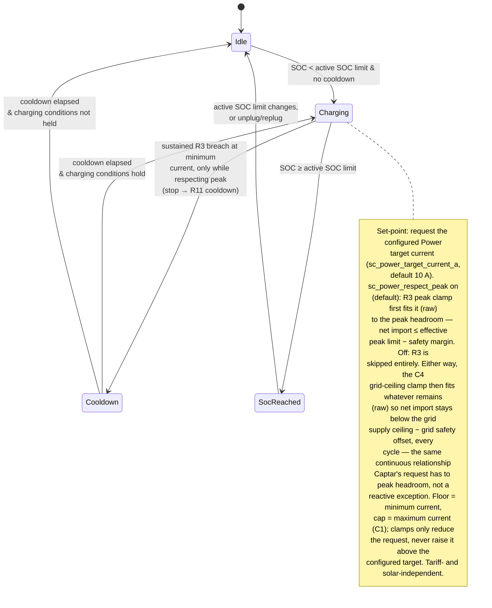

# UC04 — Charge at a user-set current

**Primary actor:** EV driver

**Stakeholders & interests:**

- EV driver — wants direct control over the charging rate, from a quick top-up to full speed, by dialing in a current themselves rather than letting solar surplus, tariff, or cost optimisation decide it.
- Household energy manager — accepts the cost impact of a manually selected `Power` session, but wants the option to keep CapTar peak protection in force during it so it cannot raise the billed [monthly peak demand](../system-overview.md#ubiquitous-language); when they choose to disable that protection, they still expect the grid-supply-ceiling (C4) to be respected so the main fuse is never at risk.

**Scope / level:** sea-level (single goal: charge the car at the configured [Power target current](../system-overview.md#ubiquitous-language) while `Power` mode is active)

## Preconditions

- `Power` is the [active mode](../system-overview.md#ubiquitous-language). (`Power` is available regardless of either the solar or CapTar [capability](../system-overview.md#ubiquitous-language) — R18.)
- The car is connected at home ([charger status](../system-overview.md#ubiquitous-language) is `connected` or `charging`).
- State of charge is below the [active SOC limit](../system-overview.md#ubiquitous-language) (resolved per `resolution-rules.md`).

## Trigger

A [control cycle](../system-overview.md#ubiquitous-language) observes that `Power` mode is active while the car is connected at home and state of charge is below the active SOC limit.

## Main success scenario

1. **Given** `Power` mode is active, the car is connected at home, state of charge is below the active SOC limit, and no `Power`-mode cooldown is in effect.
2. **When** a control cycle runs, **then** the System starts charging within one control cycle.
3. **And** the System requests the configured [Power target current](../system-overview.md#ubiquitous-language) (`sc_power_target_current_a`, default 10 A) — ignoring [solar surplus](../system-overview.md#ubiquitous-language) and the [low-tariff flag](../system-overview.md#ubiquitous-language) entirely. When the peak-protection option (`sc_power_respect_peak`) is enabled (default), the R3 peak clamp (`control-cycle.md`) fits this request on raw readings to the available [peak headroom](../system-overview.md#ubiquitous-language), so [net import](../system-overview.md#ubiquitous-language) stays at or below the [effective peak limit](../system-overview.md#ubiquitous-language) (resolved per `resolution-rules.md`) minus the [safety margin](../system-overview.md#ubiquitous-language). In every case — with or without the R3 clamp — the grid-supply-ceiling clamp (C4), which `Power` mode can never disable, then fits whatever current remains on raw readings so net import stays below the [grid supply ceiling](../system-overview.md#ubiquitous-language) minus the [grid safety offset](../system-overview.md#ubiquitous-language). This is the same continuous, every-cycle relationship the R3 clamp has to `Captar`'s (UC03) request — not a reactive override for an unusual case — so the current the charger actually draws tracks available grid capacity cycle by cycle, shrinking as other household load rises and recovering as that load falls. Either clamp can only reduce the request, never raise it above the configured target, and the request is always bounded by the minimum and maximum charging current (C1).

## Alternate flows

**2a — Blocked by cooldown** — branches from step 2.
Given a `Power`-mode cooldown is still running after a previous stop (R11)
When a control cycle runs
Then the System does not start charging until the cooldown has fully elapsed, then starts on the next qualifying cycle.

**3a — Peak protection disabled** — branches from step 3.
Given the peak-protection option (`sc_power_respect_peak`) is off
When the System requests the configured Power target current
Then the R3 peak clamp is skipped entirely and net import may exceed the effective peak limit, raising the monthly peak demand — bounded only by the grid-supply-ceiling clamp (C4) and the minimum/maximum charging current (C1).

## Exception flows

**Peak / grid-ceiling clamp bounds or stops the set-point.**
Given the System has requested the configured Power target current in `Power` mode
When the peak-protection clamp (R3, only while `sc_power_respect_peak` is on) or the grid-supply-ceiling clamp (C4, always, applied after R3 on whatever current R3 leaves) in `control-cycle.md` would be exceeded on raw readings — for example household load leaves less than the minimum charging current of headroom
Then the coordinator reduces the charger current — or, on a sustained R3 breach at the minimum charging current, stops it and starts the `Power`-mode cooldown (R11); a C4 breach clamps down (to 0 A if necessary) without starting a cooldown — so the clamp decides the set-point this cycle, not the mode. This is the normal, every-cycle shape of `Power`'s delivered current, not an unusual case: only the sustained-stop branch at the minimum charging current is exceptional.

**State of charge reaches the active SOC limit.**
Given the System is charging in `Power` mode
When state of charge reaches the active SOC limit — the plain default, or a leftover solar step-up or solar-reserve cap (R9) from before `Power` was selected (see Relationships: `Power`'s own logic never puts either in effect, whether selected under `Manual` or via `Auto`'s deadline-urgency exception)
Then the System stops charging (0 A) and does not resume above that limit until the active SOC limit changes or the car is unplugged and replugged (R7).

## Postconditions

- While `Power` mode is active, the car is connected below the active SOC limit, and headroom permits, the charger draws at the configured Power target current.
- When the peak-protection option is enabled, net import stays at or below the effective peak limit minus the safety margin, so a `Power` session never raises the billed [monthly peak demand](../system-overview.md#ubiquitous-language) beyond what is already incurred (R3, C3). When disabled, net import may exceed that limit but never the grid supply ceiling minus the grid safety offset (C4).
- The charger current is only ever 0 A or between the minimum and maximum charging current (C1); the configured target current itself is always within that same range.
- Charging never resumes above the active SOC limit (R7).

## State model

`Power`'s charging law is the simplest of the modes: it requests the configured [Power target
current](../system-overview.md#ubiquitous-language) whenever its connection, SOC, and cooldown
conditions hold, unconditionally — it never reads smoothed inputs, the low-tariff flag, the
home-day flag, or the solar forecast. Unlike `Captar` (UC03), which always requests the maximum
charging current, `Power`'s requested current is itself a user-configured value (default 10 A) —
the mode does not decide how fast to charge, the user does. The only configurable branch is
whether the R3 peak clamp applies at all, via `sc_power_respect_peak` (default on); the
grid-supply-ceiling clamp (C4) always applies regardless of that option, and neither clamp — nor
the target current itself — can ever exceed the maximum charging current (C1). The configured
target current is a ceiling on what `Power` *requests*. The ceiling on what it *delivers* each
cycle is different: C4, always, and R3 as well when enabled. That relationship holds continuously,
every cycle — the same way `Captar`'s (UC03) delivered current continuously tracks the R3
peak-headroom clamp — not a reactive correction reserved for an unusual spike in household load.
Choosing to run `Power` at all, what target current to set, and whether to accept its cost/peak
impact are entirely the user's own intent: `Power` is reachable only under the `Manual` profile
and is otherwise never selected by `Auto` (`resolution-rules.md`, Auto mode-selection), except
for the deliberate deadline-urgency carve-out when the CapTar capability is absent
([UC05](UC05-guarantee-ready-by-departure.md), R5, R18). The `stateDiagram-v2`
below is authoritative for the state set. All thresholds/timers are configurable (defaults shown).
The peak-protection (R3) and grid-supply-ceiling (C4) clamps and the effective-peak-limit
resolution are applied by the shared mechanism and are referenced, not repeated, here.
A disconnect (charger status leaving `connected`/`charging`) breaks the "car connected" precondition
and exits this use-case's scope from any state, returning to Idle; on disconnect the active SOC limit
resets to the default (R7), which is why the diagram does not draw a disconnect edge from every state.

| State | Set-point | Leaves when |
| --- | --- | --- |
| Idle | 0 A | SOC < active SOC limit & no cooldown → Charging |
| Charging | configured Power target current requested; if `sc_power_respect_peak` is on, the R3 clamp first fits it (raw) to the peak headroom — net import ≤ effective peak limit − safety margin; either way, the C4 clamp then fits whatever remains (raw) so net import stays below the grid supply ceiling minus the grid safety offset, every cycle; floored at the minimum and capped at the maximum charging current (C1) in every case — the clamps never raise the request above the configured target | sustained R3 breach at the minimum charging current, only while respecting peak (stop → R11 cooldown, `control-cycle.md`) → Cooldown · SOC ≥ active SOC limit → SocReached |
| Cooldown | 0 A | `Power`-mode cooldown elapsed → Charging if charging conditions hold, else Idle |
| SocReached | 0 A | active SOC limit changes, or car unplugged/replugged → Idle |

## Domain events produced

- `PowerChargingStarted` — the System began charging in `Power` mode at the configured target current (Idle/Cooldown → Charging).
- `PowerChargingStopped` — a sustained R3 breach at the minimum charging current forced a stop (only while respecting peak); the System stopped charging (0 A) and started the `Power`-mode cooldown (R11).
- `ActiveSocLimitReached` — state of charge reached the active SOC limit; charging stopped and will not resume above the limit (R7).

## Diagram

## Requirements satisfied

- **R17** — Power mode (charges at the configurable Power target current — default 10 A — regardless of solar surplus or the low-tariff flag; the configurable peak-protection option; C1 bounds always hold; the active SOC limit still applies).

Inherited from the shared mechanism (referenced, not restated): the active-SOC-limit resolution and reset (R7, `resolution-rules.md` — which `Auto` may lower via the solar-reserve cap, R9, UC07, though `Power` itself is Manual-only), the effective-peak-limit resolution (`resolution-rules.md`), the peak-protection (R3, C3) and grid-supply-ceiling (C4) clamps and the rapid-cycling cooldown/min-current invariant (R11) (`control-cycle.md`), and voltage-aware conversion (NF4). R10 sensor smoothing does not shape `Power`'s own set-point rule (it always requests the configured target current, unaffected by smoothed readings), but still governs the raw/smoothed split the R3 clamp relies on. `Power`'s availability regardless of either capability (R18, Preconditions) is realized in `entity-catalog.md`'s `select.smart_charging_mode` selector note, not in a mode-specific mechanism doc.

## Relationships

- **Manual-only, with one deadline-driven exception**: `Power` is a deliberate, user-directed charging-rate choice that conflicts with `Auto`'s cost/deadline balancing, so it is reachable only under the `Manual` profile and `Auto` otherwise never selects it (Auto mode-selection, `resolution-rules.md`) — except as a best-effort deadline-urgency escalation when the CapTar capability is absent ([UC05](UC05-guarantee-ready-by-departure.md), R5, R18).
- Runs on the `control-cycle.md` coordinator spine and consumes the active-SOC-limit and effective-peak-limit rules in `resolution-rules.md`.
