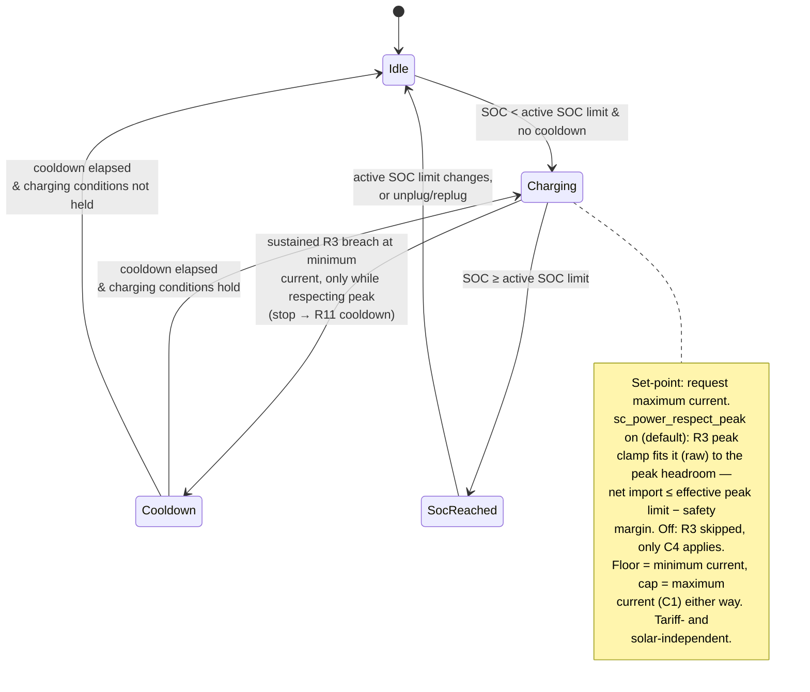

# UC04 — Charge at maximum power

**Primary actor:** EV driver

**Stakeholders & interests:**

- EV driver — wants the car charged as fast as possible right now, regardless of solar surplus or the [low-tariff flag](../system-overview.md#ubiquitous-language), for the times convenience outweighs cost.
- Household energy manager — accepts the cost impact of a manually selected `Power` session, but wants the option to keep CapTar peak protection in force during it so an impulsive full-speed charge cannot raise the billed [monthly peak demand](../system-overview.md#ubiquitous-language); when they choose to disable that protection, they still expect the grid-supply-ceiling (C4) to be respected so the main fuse is never at risk.

**Scope / level:** sea-level (single goal: charge the car at the maximum charging current while `Power` mode is active)

## Preconditions

- `Power` is the [active mode](../system-overview.md#ubiquitous-language). (`Power` is available regardless of the solar [capability](../system-overview.md#ubiquitous-language) — R18.)
- The car is connected at home ([charger status](../system-overview.md#ubiquitous-language) is `connected` or `charging`).
- State of charge is below the [active SOC limit](../system-overview.md#ubiquitous-language) (resolved per `resolution-rules.md`).

## Trigger

A [control cycle](../system-overview.md#ubiquitous-language) observes that `Power` mode is active while the car is connected at home and state of charge is below the active SOC limit.

## Main success scenario

1. **Given** `Power` mode is active, the car is connected at home, state of charge is below the active SOC limit, and no `Power`-mode cooldown is in effect.
2. **When** a control cycle runs, **then** the System starts charging within one control cycle.
3. **And** the System requests the [maximum charging current](../system-overview.md#ubiquitous-language) — ignoring [solar surplus](../system-overview.md#ubiquitous-language) and the [low-tariff flag](../system-overview.md#ubiquitous-language) entirely. When the peak-protection option (`sc_power_respect_peak`) is enabled (default), the R3 peak clamp (`control-cycle.md`) fits this request on raw readings to the available [peak headroom](../system-overview.md#ubiquitous-language), so [net import](../system-overview.md#ubiquitous-language) stays at or below the [effective peak limit](../system-overview.md#ubiquitous-language) (resolved per `resolution-rules.md`) minus the [safety margin](../system-overview.md#ubiquitous-language). In every case the request is bounded by the minimum and maximum charging current (C1) and by the grid-supply-ceiling clamp (C4), which `Power` mode can never disable.

## Alternate flows

**2a — Blocked by cooldown** — branches from step 2.
Given a `Power`-mode cooldown is still running after a previous stop (R11)
When a control cycle runs
Then the System does not start charging until the cooldown has fully elapsed, then starts on the next qualifying cycle.

**3a — Peak protection disabled** — branches from step 3.
Given the peak-protection option (`sc_power_respect_peak`) is off
When the System requests the maximum charging current
Then the R3 peak clamp is skipped entirely and net import may exceed the effective peak limit, raising the monthly peak demand — bounded only by the grid-supply-ceiling clamp (C4) and the minimum/maximum charging current (C1).

## Exception flows

**Peak / grid-ceiling clamp bounds or stops the set-point.**
Given the System has requested the maximum charging current in `Power` mode
When the peak-protection clamp (R3, only while `sc_power_respect_peak` is on) or the grid-supply-ceiling clamp (C4, always) in `control-cycle.md` would be exceeded on raw readings — for example household load leaves less than the minimum charging current of headroom
Then the coordinator reduces the charger current — or, on a sustained R3 breach at the minimum charging current, stops it and starts the `Power`-mode cooldown (R11); a C4 breach clamps down (to 0 A if necessary) without starting a cooldown — so the clamp decides the set-point this cycle, not the mode.

**State of charge reaches the active SOC limit.**
Given the System is charging in `Power` mode
When state of charge reaches the active SOC limit — whether the plain default, a stepped-up value, or a value `Auto` has lowered via the solar-reserve cap (R9); `Power` is Manual-only (see Relationships) so a step-up cannot itself be in effect, but a prior one may not yet have been cleared
Then the System stops charging (0 A) and does not resume above that limit until the active SOC limit changes or the car is unplugged and replugged (R7).

## Postconditions

- While `Power` mode is active, the car is connected below the active SOC limit, and headroom permits, the charger draws at the maximum charging current.
- When the peak-protection option is enabled, net import stays at or below the effective peak limit minus the safety margin, so a `Power` session never raises the billed [monthly peak demand](../system-overview.md#ubiquitous-language) beyond what is already incurred (R3, C3). When disabled, net import may exceed that limit but never the grid supply ceiling minus the grid safety offset (C4).
- The charger current is only ever 0 A or between the minimum and maximum charging current (C1).
- Charging never resumes above the active SOC limit (R7).

## State model

`Power`'s charging law is the simplest of the modes: it requests the maximum charging current
whenever its connection, SOC, and cooldown conditions hold, unconditionally — it never reads
smoothed inputs, the low-tariff flag, the home-day flag, or the solar forecast. The only
configurable branch is whether the R3 peak clamp applies at all, via `sc_power_respect_peak`
(default on); the grid-supply-ceiling clamp (C4) and the C1 floor/cap always apply regardless of
that option. Choosing to run `Power` at all — and whether to accept its cost/peak impact — is
entirely the user's own intent: `Power` is reachable only under the `Manual` profile (`resolution-rules.md`,
Auto mode-selection) and is never selected by `Auto`. The `stateDiagram-v2` below is authoritative
for the state set. All thresholds/timers are configurable (defaults shown). The peak-protection
(R3) and grid-supply-ceiling (C4) clamps and the effective-peak-limit resolution are applied by
the shared mechanism and are referenced, not repeated, here.
A disconnect (charger status leaving `connected`/`charging`) breaks the "car connected" precondition
and exits this use-case's scope from any state, returning to Idle; on disconnect the active SOC limit
resets to the default (R7), which is why the diagram does not draw a disconnect edge from every state.

| State | Set-point | Leaves when |
| --- | --- | --- |
| Idle | 0 A | SOC < active SOC limit & no cooldown → Charging |
| Charging | maximum current requested; if `sc_power_respect_peak` is on, the R3 clamp fits it (raw) to the peak headroom — net import ≤ effective peak limit − safety margin; if off, only the C4 clamp applies; floored at the minimum and capped at the maximum charging current (C1) in every case | sustained R3 breach at the minimum charging current, only while respecting peak (stop → R11 cooldown, `control-cycle.md`) → Cooldown · SOC ≥ active SOC limit → SocReached |
| Cooldown | 0 A | `Power`-mode cooldown elapsed → Charging if charging conditions hold, else Idle |
| SocReached | 0 A | active SOC limit changes, or car unplugged/replugged → Idle |

## Domain events produced

- `PowerChargingStarted` — the System began charging in `Power` mode (Idle/Cooldown → Charging).
- `PowerChargingStopped` — a sustained R3 breach at the minimum charging current forced a stop (only while respecting peak); the System stopped charging (0 A) and started the `Power`-mode cooldown (R11).
- `ActiveSocLimitReached` — state of charge reached the active SOC limit; charging stopped and will not resume above the limit (R7).

## Diagram

## Requirements satisfied

- **R17** — Power mode (charges at the maximum charging current regardless of solar surplus or the low-tariff flag; the configurable peak-protection option; C1 bounds always hold; the active SOC limit still applies).

Inherited from the shared mechanism (referenced, not restated): the active-SOC-limit resolution and reset (R7, `resolution-rules.md` — which `Auto` may lower via the solar-reserve cap, R9, UC07, though `Power` itself is Manual-only), the effective-peak-limit resolution (`resolution-rules.md`), the peak-protection (R3, C3) and grid-supply-ceiling (C4) clamps and the rapid-cycling cooldown/min-current invariant (R11) (`control-cycle.md`), and voltage-aware conversion (NF4). R10 sensor smoothing does not shape `Power`'s own set-point rule (it always requests the maximum current, unaffected by smoothed readings), but still governs the raw/smoothed split the R3 clamp relies on.

## Relationships

- **Extended by [UC05](UC05-guarantee-ready-by-departure.md)** when the departure deadline is at risk, and `sc_power_respect_peak` is on. R5 permits raising the effective peak limit up to the [maximum peak](../system-overview.md#ubiquitous-language) — to the lowest level that still meets the deadline — which widens the peak headroom `Power` can draw into; deadline urgency never raises the active SOC limit (R7). When peak protection is off, `Power` is already unconstrained by the effective peak limit, so R5's peak-raising has no further effect — only the C4 ceiling still bounds it. `Power` is never an `Auto`-selected escalation target (Auto mode-selection selects `Captar` for that, `resolution-rules.md`); this extension applies only to a manually selected `Power` session. The deadline logic lives in UC05, not here.
- **Manual-only**: `Power` is a deliberate, strictly-charge-now user intent that conflicts with `Auto`'s cost/deadline balancing, so it is reachable only under the `Manual` profile — `Auto` never selects it (Auto mode-selection, `resolution-rules.md`).
- Runs on the `control-cycle.md` coordinator spine and consumes the active-SOC-limit and effective-peak-limit rules in `resolution-rules.md`.
