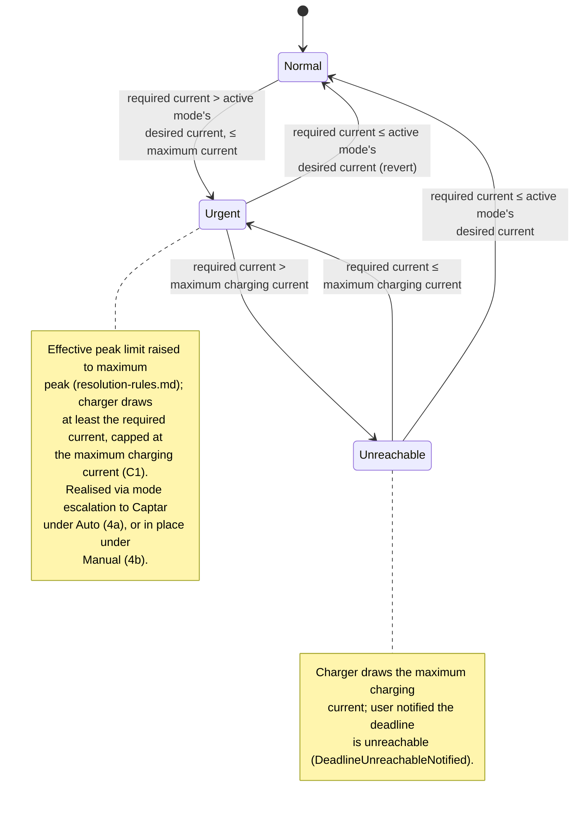

# UC05 — Guarantee the car is ready by departure

**Primary actor:** EV driver

**Stakeholders & interests:**

- EV driver — wants confidence the car reaches its active SOC limit by departure even if that means charging at high tariff or a higher monthly peak, and an unmistakable warning on the rare occasion even that cannot save the deadline.
- Household energy manager — accepts that cost optimisation and peak protection step aside during urgency, but only as far as needed to meet the deadline, and never beyond the configured maximum peak.

**Scope / level:** sea-level, but cross-cutting — this is the `«extend»` use-case (UML terminology). It modifies [UC01](UC01-charge-from-solar-surplus.md) (`Solar`), [UC02](UC02-charge-from-solar-only.md) (`SolarOnly`), [UC03](UC03-charge-from-grid-within-captar-limit.md) (`Captar`), and [UC04](UC04-charge-at-a-user-set-current.md) (`Power`) rather than running as an independent charging session — it has no charging mode of its own.

## Preconditions

- One of UC01, UC02, UC03, or UC04 is the active mode's own use-case in progress: the car is connected at home ([charger status](../system-overview.md#ubiquitous-language) is `connected` or `charging`) and state of charge is below the [active SOC limit](../system-overview.md#ubiquitous-language) (resolved per `resolution-rules.md`).
- A [departure deadline](../system-overview.md#ubiquitous-language) is resolved for today — not "no deadline" (`resolution-rules.md`).

## Trigger

A [control cycle](../system-overview.md#ubiquitous-language) determines that, at the charger current the active mode has just requested for this cycle, the projected charge by the departure deadline would fall short of the active SOC limit — [deadline urgency](../system-overview.md#ubiquitous-language) (R5) — computed from the EV battery capacity (R15), current state of charge, the active SOC limit, and the time remaining until the deadline.

## Main success scenario

1. **Given** a departure deadline is resolved for today, the car is connected at home below the active SOC limit, and the active mode (UC01, UC02, UC03, or UC04) has computed its own desired current for this cycle.
2. **When** a control cycle determines that charging at that desired current from now until the departure deadline would not reach the active SOC limit, **then** the System is in deadline urgency (R5) and computes the lowest charger current that would close the gap in time, using the EV battery capacity, current state of charge, the active SOC limit, and the time remaining.
3. **And** the System raises the [effective peak limit](../system-overview.md#ubiquitous-language) ceiling to the [maximum peak](../system-overview.md#ubiquitous-language) (`resolution-rules.md`), so peak protection cannot block the required current; the coordinator's peak clamp (`control-cycle.md`) still targets the [safety margin](../system-overview.md#ubiquitous-language) below whichever ceiling is now in force, so the achieved peak is only ever as high as the required current actually makes it, never dictated by the raised ceiling alone.
4. **And** the System ensures the charger draws at least the required current whenever it exceeds the active mode's own desired current — permitting high-tariff charging — bounded above by the [maximum charging current](../system-overview.md#ubiquitous-language) (C1), so the car reaches the active SOC limit by the deadline.

## Alternate flows

**4a — Auto profile realises the override by mode escalation** — branches from step 4.
Given the `Auto` profile is active and deadline urgency (step 2) holds
When the next control cycle runs
Then Auto mode-selection (`resolution-rules.md`, row 2) switches the active mode to `Captar` instead of overriding the current active mode's desired current directly; `Captar`'s own set-point rule already requests the maximum charging current ([UC03](UC03-charge-from-grid-within-captar-limit.md)), so the raised effective peak limit (step 3) is what supplies the extra headroom the deadline needs.

**4b — Manual profile realises the override in place** — branches from step 4.
Given the `Manual` profile is active and deadline urgency (step 2) holds
When a control cycle runs
Then the System overrides the currently active mode's own desired current in place, without changing which mode is active, as described in step 4.

## Exception flows

**Even the maximum charging current cannot meet the deadline.**
Given deadline urgency is in effect (step 2) and the required current computed there exceeds the maximum charging current
When the System applies the override
Then the System charges at the maximum charging current — bounded further only by the grid-supply-ceiling clamp (C4) — and notifies the user that the departure deadline is unreachable at the current rate.

## Postconditions

- While deadline urgency holds, the delivered charger current is at least the required current computed for that cycle, bounded above by the maximum charging current (C1); high-tariff charging is permitted for as long as urgency holds.
- The effective peak limit in force is the maximum peak while urgency holds (`resolution-rules.md`); net import still stays at or below that ceiling minus the safety margin (C3) — the coordinator's peak-protection clamp (`control-cycle.md`) is never bypassed.
- The active SOC limit itself is never raised by this override (R7) — a lower limit already in force (e.g. the solar-reserve cap, R9) still bounds how far charging accelerates.
- When even the maximum charging current cannot close the projected gap, the System charges at the maximum charging current and has sent the user a notification that the deadline is unreachable.
- Once deadline urgency no longer holds, the override lifts and the extended use-case's own cost policy governs the requested current again from the next control cycle.

## State model

Deadline urgency is itself a re-evaluated-every-cycle condition, not a value the System stores between cycles (mirrors the Auto mode-selection escalation/revert pattern in `resolution-rules.md`): each cycle the System recomputes whether the active mode's own desired current would meet the deadline, so a change in conditions (SOC catching up, the deadline receding, the deadline resolving to "no deadline") reverts the override on the very next cycle without any dedicated timer. The three states below describe this observable behaviour; the `stateDiagram-v2` is authoritative for the state set.

- **Normal** — no override; the active mode's own set-point rule governs, and the effective peak limit resolves normally (`min(monthly peak demand, maximum peak)`).
- **Urgent** — the required current exceeds the active mode's own desired current but is at or below the maximum charging current; the override in step 4 (realised per 4a/4b) applies and the effective peak limit is raised to the maximum peak.
- **Unreachable** — the required current exceeds the maximum charging current; the System charges at the maximum charging current and has notified the user.

A disconnect (charger status leaving `connected`/`charging`) breaks the "car connected" precondition and exits this use-case's scope from any state, returning to Normal on reconnect; the active SOC limit resets to the default at that point (R7), independently of this use-case. Reaching the active SOC limit, or the departure deadline resolving to "no deadline," also returns the System to Normal from any state, since urgency is only ever defined relative to a deadline that still applies.

| State | Effect on charger current | Leaves when |
| --- | --- | --- |
| Normal | Active mode's own desired current, unmodified | required current > active mode's desired current, and ≤ maximum charging current → Urgent · required current > maximum charging current → Unreachable |
| Urgent | At least the required current, capped at the maximum charging current; effective peak limit raised to the maximum peak | required current ≤ active mode's desired current → Normal (revert) · required current > maximum charging current → Unreachable |
| Unreachable | Maximum charging current; user notified | required current ≤ maximum charging current → Urgent · required current ≤ active mode's desired current → Normal |

## Domain events produced

- `DeadlineUrgencyEngaged` — the projected charge at the active mode's own desired current would miss the active SOC limit by the departure deadline; the override (Urgent) takes effect (Normal → Urgent).
- `DeadlineUrgencyReverted` — the active mode's own desired current would now meet the deadline unaided; the override lifts (Urgent/Unreachable → Normal).
- `DeadlineUnreachableNotified` — the required current exceeds the maximum charging current; the System charged at the maximum charging current and notified the user (Urgent → Unreachable, or re-fires while remaining in Unreachable).

## Diagram

## Requirements satisfied

- **R5** — Departure deadline guarantee (urgency detection, current escalation to the lowest sufficient rate, high-tariff permission, raising the effective peak limit up to the maximum peak, never raising the active SOC limit, and the deadline-unreachable notification).

Inherited from the shared mechanism (referenced, not restated): the departure-deadline resolution (R14) and the effective-peak-limit resolution (`resolution-rules.md`), the active-SOC-limit resolution (R7, which this use-case never raises), the peak-protection (R3, C3) and grid-supply-ceiling (C4) clamps (`control-cycle.md`), and the EV battery capacity configuration parameter (R15, `requirements.md`) that feeds the deadline calculation.

## Relationships

- **Extends [UC01](UC01-charge-from-solar-surplus.md), [UC02](UC02-charge-from-solar-only.md), [UC03](UC03-charge-from-grid-within-captar-limit.md), and [UC04](UC04-charge-at-a-user-set-current.md)** — each of those use-cases documents its own "Extended by UC05" relationship; this document is the single home for the urgency-escalation logic they all defer to, so it is never duplicated per mode.
- **Realised differently by profile**: under `Auto`, via the mode-selection escalation to `Captar` and its automatic revert (`resolution-rules.md`, Auto mode-selection rows 2–4); under `Manual`, by directly overriding the active mode's own desired current in place (this document, step 4b). Both paths are bounded by the same maximum charging current (C1) and the same raised effective peak limit ceiling.
- **Never raises the active SOC limit (R7)** — including a solar-reserve cap (R9) `Auto` may have applied; urgency only accelerates toward whichever limit is already resolved.
- Consumes the departure-deadline and effective-peak-limit rules in `resolution-rules.md`, and runs on the `control-cycle.md` coordinator spine (its override is applied to the desired current the dispatched mode module returns, before the peak-protection clamp).
