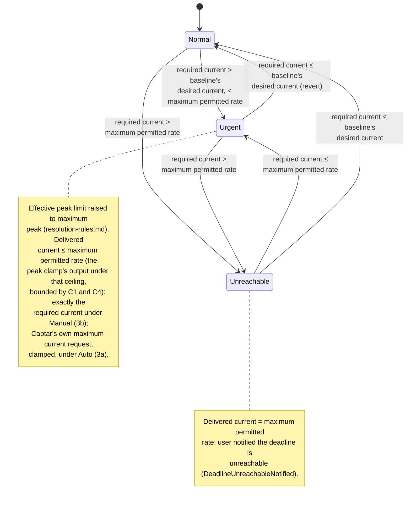

# UC05 — Guarantee the car is ready by departure

**Primary actor:** EV driver

**Stakeholders & interests:**

- EV driver — wants confidence the car reaches its active SOC limit by departure even if that means charging at high tariff or a higher monthly peak, and an unmistakable warning on the rare occasion even that cannot save the deadline.
- Household energy manager — accepts that cost optimisation and peak protection step aside during urgency, but only as far as needed to meet the deadline, and never beyond the configured maximum peak.

**Scope / level:** sea-level (single EV-driver goal), realized as a coordinator-applied, profile-keyed rule rather than a mode's own behaviour. The coordinator (`control-cycle.md`, step 5) applies `resolution-rules.md`'s Deadline-urgency response rule to whichever mode is currently dispatched — [UC01](UC01-charge-from-solar-surplus.md) (`Solar`), [UC02](UC02-charge-from-solar-only.md) (`SolarOnly`), [UC03](UC03-charge-from-grid-within-captar-limit.md) (`Captar`), or [UC04](UC04-charge-at-a-user-set-current.md) (`Power`) — without ever modifying that mode's own set-point logic (NF2). This document has no charging mode of its own.

## Preconditions

- The car is connected at home ([charger status](../system-overview.md#ubiquitous-language) is `connected` or `charging`), state of charge is below the [active SOC limit](../system-overview.md#ubiquitous-language) (resolved per `resolution-rules.md`), and the dispatched mode has computed its own desired current for this cycle (`control-cycle.md`, step 4). The **baseline mode** — the mode that would be active absent this response (`resolution-rules.md`) — is the dispatched mode itself under `Manual`, or whichever mode Auto mode-selection's rows 3–5 would otherwise select under `Auto`.
- A [departure deadline](../system-overview.md#ubiquitous-language) is resolved for today — not "no deadline" (`resolution-rules.md`).

## Trigger

A [control cycle](../system-overview.md#ubiquitous-language)'s [required current](../system-overview.md#ubiquitous-language) computation (`resolution-rules.md`) exceeds the baseline mode's own desired current for this cycle — [deadline urgency](../system-overview.md#ubiquitous-language) (R5).

## Main success scenario

1. **Given** a departure deadline is resolved for today, the car is connected at home below the active SOC limit, and the dispatched mode has computed its own desired current for this cycle.
2. **When** the control cycle's required-current computation (`resolution-rules.md`) exceeds the baseline mode's own desired current, **then** the System is in deadline urgency (R5).
3. **And** the coordinator raises the effective peak limit ceiling to the [maximum peak](../system-overview.md#ubiquitous-language) (`resolution-rules.md`), raising the [maximum permitted rate](../system-overview.md#ubiquitous-language), and applies the active profile's deadline-urgency response (`resolution-rules.md`; `control-cycle.md`, step 5) — never modifying the dispatched mode's own logic (NF2).
4. **And** the car reaches the active SOC limit by the deadline whenever the required current is at or below the maximum permitted rate.

## Alternate flows

**3a — `Auto` profile is active** — branches from step 3.
Given the `Auto` profile is active
When deadline urgency (step 2) holds
Then the deadline is met via `Auto`'s mode-selection escalation to `Captar` (`resolution-rules.md`) — which, because `Captar` always requests the maximum charging current, may draw more current than strictly required to close the gap.

**3b — `Manual` profile is active** — branches from step 3.
Given the `Manual` profile is active
When deadline urgency (step 2) holds
Then the deadline is met using exactly the lowest current that closes the gap — the coordinator raises the dispatched mode's own desired current directly, without changing which mode is active (`resolution-rules.md`).

## Exception flows

**The required current exceeds the maximum permitted rate.**
Given deadline urgency is in effect (step 2) and the required current computed there exceeds the maximum permitted rate (step 3) — even with the effective peak limit raised to the maximum peak
When the coordinator applies the response (3a or 3b)
Then the System delivers the maximum permitted rate — bounded by C1 and C4, never bypassing the peak-protection clamp (C3) — and notifies the user that the departure deadline is unreachable at the current rate.

## Postconditions

- While deadline urgency holds, the delivered charger current is at least the dispatched mode's own desired current and, whenever achievable, at least the required current computed for that cycle — bounded above by the maximum permitted rate (the peak clamp's output under the raised ceiling, itself bounded by C1 and C4); high-tariff charging is permitted for as long as urgency holds.
- The effective peak limit in force is the maximum peak while urgency holds (`resolution-rules.md`); net import still stays at or below that ceiling minus the safety margin (C3), and this response never bypasses the coordinator's peak-protection clamp (`control-cycle.md`), regardless of which profile is active. The one exception is `Power` mode with its own peak-protection option disabled ([UC04](UC04-charge-at-a-user-set-current.md)), where that clamp does not run at all — by the mode's own configuration, not by this response — and only the grid-supply-ceiling clamp (C4) bounds delivery, as it would without urgency.
- The active SOC limit itself is never raised by this response (R7) — a lower limit already in force (e.g. the solar-reserve cap, R9) still bounds how far charging accelerates.
- When the required current exceeds the maximum permitted rate, the System delivers the maximum permitted rate and has sent the user a notification that the deadline is unreachable.
- Once deadline urgency no longer holds, the response stops raising the current and the dispatched mode's own set-point rule governs again from the next control cycle.

## State model

Deadline urgency is itself a re-evaluated-every-cycle condition, not a value the System stores between cycles (mirrors the Auto mode-selection escalation/revert pattern in `resolution-rules.md`): each cycle the coordinator recomputes the required current and the maximum permitted rate, so a change in conditions (SOC catching up, the deadline receding, the deadline resolving to "no deadline," or a sudden jump in the required current) can move the System directly between any two states on the very next cycle, without a dedicated timer. The three states below describe this observable behaviour; the `stateDiagram-v2` is authoritative for the state set and its transitions.

- **Normal** — the required current is at or below the baseline mode's own desired current; the response does not raise the current, and the effective peak limit resolves normally (`min(monthly peak demand, maximum peak)`).
- **Urgent** — the required current exceeds the baseline mode's own desired current but is at or below the maximum permitted rate; the response applies (3a/3b) and the effective peak limit is raised to the maximum peak. Under `Manual` (3b), the delivered current is exactly the required current — the lowest rate that closes the gap. Under `Auto`'s `Captar` escalation (3a), the delivered current is `Captar`'s own maximum-current request as clamped to the maximum permitted rate, which can exceed the required current. The comparison always uses the baseline mode, never `Captar`'s own (already-maximum) desired current once escalated — otherwise urgency would look satisfied the instant it engages and revert every cycle.
- **Unreachable** — the required current exceeds the maximum permitted rate; the System delivers the maximum permitted rate and has notified the user.

A disconnect (charger status leaving `connected`/`charging`) breaks the "car connected" precondition and exits this use-case's scope from any state, returning to Normal on reconnect; the active SOC limit resets to the default at that point (R7), independently of this use-case. Reaching the active SOC limit, or the departure deadline resolving to "no deadline," also returns the System to Normal from any state, since urgency is only ever defined relative to a deadline that still applies.

| State | Delivered current | Leaves when |
| --- | --- | --- |
| Normal | Dispatched mode's own desired current, unmodified | required current > baseline's desired current, ≤ maximum permitted rate → Urgent · required current > maximum permitted rate → Unreachable |
| Urgent | Required current (`Manual`, 3b) or `Captar`'s maximum-current request clamped to the maximum permitted rate (`Auto`, 3a) — either way ≤ maximum permitted rate; effective peak limit raised to the maximum peak | required current ≤ baseline's desired current → Normal (revert) · required current > maximum permitted rate → Unreachable |
| Unreachable | Maximum permitted rate; user notified | required current ≤ maximum permitted rate → Urgent · required current ≤ baseline's desired current → Normal |

## Domain events produced

- `DeadlineUrgencyEngaged` — the required current now exceeds the baseline mode's own desired current; the response (Urgent) takes effect (Normal → Urgent). Emitted by the coordinator (`control-cycle.md` step 5) under `Manual`; under `Auto` this is Auto mode-selection escalating to `Captar` (`resolution-rules.md`), not the coordinator.
- `DeadlineUrgencyReverted` — the baseline mode's own desired current now meets or exceeds the required current; the response lifts (Urgent/Unreachable → Normal). Emitted by the coordinator (`control-cycle.md` step 9) under `Manual`; under `Auto` this is Auto mode-selection falling through to row 3 or 4 (`resolution-rules.md`), not the coordinator.
- `DeadlineUnreachableNotified` — the required current exceeds the maximum permitted rate; the System delivered the maximum permitted rate and notified the user (Normal/Urgent → Unreachable, or re-fires while remaining in Unreachable). Emitted by the coordinator, `control-cycle.md` step 9, regardless of profile.

## Diagram

## Requirements satisfied

- **R5** — Departure deadline guarantee (urgency detection; current escalation to exactly the lowest sufficient rate under the `Manual` response (3b); high-tariff permission; raising the effective peak limit up to the maximum peak; never raising the active SOC limit; and the deadline-unreachable notification, triggered against the maximum permitted rate).

Inherited from the shared mechanism (referenced, not restated): the required-current computation and the profile-keyed deadline-urgency response (`resolution-rules.md`), applied by the coordinator (`control-cycle.md`, step 5); the departure-deadline resolution (R14) and the effective-peak-limit resolution (`resolution-rules.md`); the active-SOC-limit resolution (R7, which this response never raises); the peak-protection (R3, C3) and grid-supply-ceiling (C4) clamps (`control-cycle.md`); and the EV battery capacity configuration parameter (R15, `requirements.md`) that feeds the required-current computation.

## Relationships

- **Realized by the coordinator, not by extending a mode.** `control-cycle.md` step 5 applies `resolution-rules.md`'s Deadline-urgency response rule to whichever mode is dispatched (UC01–UC04); none of those modes' own set-point logic is ever modified (NF2). This is the single home for the urgency-escalation goal — the response mechanism is never duplicated per mode.
- **Realized differently by profile, with different cost-minimality**: under `Manual`, the coordinator raises the dispatched mode's own desired current to exactly the required current — the lowest rate that closes the gap (`resolution-rules.md`, 3b). Under `Auto`, via the mode-selection escalation to `Captar` and its automatic revert (`resolution-rules.md`, Auto mode-selection rows 2–4); because `Captar`'s own set-point rule always requests the maximum charging current, this realization delivers up to the maximum permitted rate rather than the exact required current — a deliberate trade of cost-minimality for reusing `Captar`'s existing rule instead of a bespoke rate-limited mode. Both paths are bounded by the same maximum permitted rate (C1, C4, and the raised effective peak limit) and never raise the active SOC limit (R7).
- **Never raises the active SOC limit (R7)** — including a solar-reserve cap (R9) `Auto` may have applied; urgency only accelerates toward whichever limit is already resolved.
- Consumes the required-current, departure-deadline, and effective-peak-limit rules in `resolution-rules.md`, and runs on the `control-cycle.md` coordinator spine (step 5, between dispatch and the peak-protection clamp).
