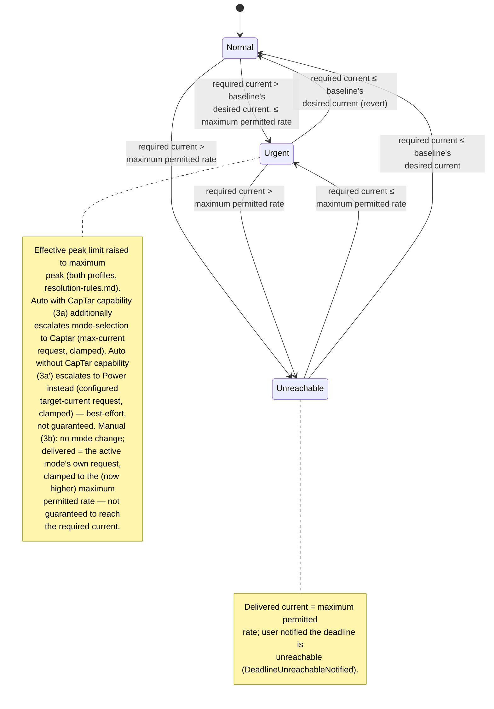

# UC05 — Guarantee the car is ready by departure

**Primary actor:** EV driver

**Stakeholders & interests:**

- EV driver — wants confidence the car reaches its active SOC limit by departure even if that means charging at high tariff or a higher monthly peak, and an unmistakable warning on the rare occasion even that cannot save the deadline.
- Household energy manager — accepts that cost optimisation and peak protection step aside during urgency, but only as far as needed to meet the deadline, and never beyond the configured maximum peak.

**Scope / level:** sea-level (single EV-driver goal), realized entirely through two existing resolution rules rather than a mode's own behaviour or a dedicated coordinator step: the effective-peak-limit raise (`resolution-rules.md`) — available under every profile — and, only under `Auto`, mode-selection escalating to `Captar` when the CapTar [capability](../system-overview.md#ubiquitous-language) is present, or to `Power` when it is absent (`resolution-rules.md`, row 2). Neither lever ever touches [UC01](UC01-charge-from-solar-surplus.md), [UC02](UC02-charge-from-solar-only.md), [UC03](UC03-charge-from-grid-within-captar-limit.md), or [UC04](UC04-charge-at-a-user-set-current.md)'s own set-point logic (NF2). This document has no charging mode of its own.

## Preconditions

- The car is connected at home ([charger status](../system-overview.md#ubiquitous-language) is `connected` or `charging`), state of charge is below the [active SOC limit](../system-overview.md#ubiquitous-language) (resolved per `resolution-rules.md`), and the dispatched mode has computed its own desired current for this cycle (`control-cycle.md`, step 4). The **baseline mode** — the mode that would be active absent any deadline-driven mode escalation — is the dispatched mode itself under `Manual` (which never escalates the mode), or whichever mode Auto mode-selection's rows 3–5 would otherwise select under `Auto`.
- A [departure deadline](../system-overview.md#ubiquitous-language) is resolved for today — not "no deadline" (`resolution-rules.md`).

## Trigger

A [control cycle](../system-overview.md#ubiquitous-language)'s [required current](../system-overview.md#ubiquitous-language) computation (`resolution-rules.md`) exceeds the baseline mode's own desired current for this cycle — [deadline urgency](../system-overview.md#ubiquitous-language) (R5).

## Main success scenario

1. **Given** a departure deadline is resolved for today, the car is connected at home below the active SOC limit, and the dispatched mode has computed its own desired current for this cycle.
2. **When** the control cycle's required-current computation (`resolution-rules.md`) exceeds the baseline mode's own desired current, **then** the System is in deadline urgency (R5).
3. **And** the coordinator raises the effective peak limit ceiling to the [maximum peak](../system-overview.md#ubiquitous-language) (`resolution-rules.md`) — the lever available under every profile — so a mode whose own request was being held back by the normal ceiling (e.g. `Captar`, `Power`) can draw more, up to whatever it already requests; a mode whose own request never depended on peak headroom (e.g. `Solar`, `SolarOnly`) draws no differently.
4. **And** the car reaches the active SOC limit by the deadline whenever the dispatched mode's own request, once unclamped by the raised ceiling, is at or above the required current.

## Alternate flows

**3a — `Auto` profile is active, CapTar capability present** — branches from step 3.
Given the `Auto` profile is active, deadline urgency (step 2) holds, and the CapTar capability is present
When the next control cycle runs
Then Auto mode-selection additionally escalates the active mode to `Captar` (`resolution-rules.md`, row 2), whose own set-point rule always requests the maximum charging current — `Auto`'s second lever, giving it a real chance of meeting the deadline even when the mode it would otherwise run (e.g. `Solar`) requests far less than required.

**3a′ — `Auto` profile is active, CapTar capability absent** — branches from step 3.
Given the `Auto` profile is active, deadline urgency (step 2) holds, and the CapTar capability is absent (R18)
When the next control cycle runs
Then Auto mode-selection escalates the active mode to `Power` instead of `Captar` (`resolution-rules.md`, row 2) — a deliberate, deadline-only exception to `Power` otherwise never being Auto-selected. Unlike `Captar`'s maximum-current request, `Power` requests only its configured [Power target current](../system-overview.md#ubiquitous-language) (R17), so this is a best-effort measure, not a guarantee: it may still leave the deadline unmet.

**3b — `Manual` profile is active** — branches from step 3.
Given the `Manual` profile is active and deadline urgency (step 2) holds
When a control cycle runs
Then the active mode never changes and its own set-point logic is never touched (NF2) — the raised ceiling from step 3 is the only lever available. Whether the deadline is met depends entirely on the active mode's own appetite for current once unclamped: a manually selected `Captar` or `Power` session can now draw much more; a manually selected `Solar` or `SolarOnly` session draws no differently at all, since its own request never depended on peak headroom.

## Exception flows

**The required current exceeds the maximum permitted rate.**
Given deadline urgency is in effect (step 2), and — even with the ceiling raised (step 3) and, under `Auto`, the escalation to `Captar` (3a, CapTar capability present) or `Power` (3a′, CapTar capability absent) — the resulting [maximum permitted rate](../system-overview.md#ubiquitous-language) is still below the required current
When a control cycle runs
Then the System delivers the maximum permitted rate and notifies the user that the departure deadline is unreachable at the current rate.

## Postconditions

- While deadline urgency holds, the delivered charger current is the dispatched mode's own request (under `Auto` with the CapTar capability present, `Captar`'s own maximum-current request; under `Auto` without the CapTar capability, `Power`'s own configured target-current request; under `Manual`, whichever mode is active), clamped to the maximum permitted rate under the raised ceiling — bounded above by that rate (itself bounded by C1 and C4); high-tariff charging is permitted for as long as urgency holds.
- The effective peak limit in force is the maximum peak while urgency holds (`resolution-rules.md`); net import still stays at or below that ceiling minus the safety margin (C3) — this lever never bypasses the coordinator's peak-protection clamp (`control-cycle.md`), it only widens the target the clamp fits to. The one exception is `Power` mode with its own peak-protection option disabled ([UC04](UC04-charge-at-a-user-set-current.md)), where that clamp does not run at all — by the mode's own configuration, not by this lever — and only the grid-supply-ceiling clamp (C4) bounds delivery, as it would without urgency.
- The active SOC limit itself is never raised by either lever (R7) — a lower limit already in force (e.g. a solar step-up not yet reset) still bounds how far charging accelerates. The solar-reserve cap (R9) never applies here: it is mutually exclusive with a departure deadline resolved for tomorrow ([UC07](UC07-reserve-capacity-for-tomorrow.md)).
- When the required current exceeds the maximum permitted rate even with every available lever, the System delivers the maximum permitted rate and has sent the user a notification that the deadline is unreachable.
- Once deadline urgency no longer holds, the effective peak limit resolves normally again and, under `Auto`, mode-selection falls through to row 3 or 4.

## State model

Deadline urgency is itself a re-evaluated-every-cycle condition, not a value the System stores between cycles (mirrors the Auto mode-selection escalation/revert pattern in `resolution-rules.md`): each cycle the coordinator recomputes the required current and the maximum permitted rate, so a change in conditions (SOC catching up, the deadline receding, the deadline resolving to "no deadline," or a sudden jump in the required current) can move the System directly between any two states on the very next cycle, without a dedicated timer. The three states below describe this observable behaviour; the `stateDiagram-v2` is authoritative for the state set and its transitions.

- **Normal** — the required current is at or below the baseline mode's own desired current; the effective peak limit resolves normally (`min(monthly peak demand, maximum peak)`), and, under `Auto`, mode-selection is unaffected by urgency.
- **Urgent** — the required current exceeds the baseline mode's own desired current but is at or below the maximum permitted rate; the effective peak limit is raised to the maximum peak (both profiles). Under `Auto` with the CapTar capability present (3a), mode-selection additionally escalates to `Captar`, so the delivered current is `Captar`'s own maximum-current request, clamped to the maximum permitted rate. Under `Auto` without the CapTar capability (3a′), mode-selection instead escalates to `Power`, so the delivered current is `Power`'s own configured target-current request, clamped to the maximum permitted rate — a best-effort second lever, not guaranteed to reach the required current the way `Captar`'s maximum-current request is. Under `Manual` (3b), the active mode never changes; the delivered current is that mode's own request, clamped to the (now higher) maximum permitted rate — which may or may not reach the required current, since `Manual` has no second lever at all. The comparison that detects this state always uses the baseline mode, never the escalated mode's own desired current — otherwise urgency would look satisfied the instant it engages and revert every cycle.
- **Unreachable** — the required current exceeds the maximum permitted rate even with every available lever; the System delivers the maximum permitted rate and has notified the user.

A disconnect (charger status leaving `connected`/`charging`) breaks the "car connected" precondition and exits this use-case's scope from any state, returning to Normal on reconnect; the active SOC limit resets to the default at that point (R7), independently of this use-case. Reaching the active SOC limit, or the departure deadline resolving to "no deadline," also returns the System to Normal from any state, since urgency is only ever defined relative to a deadline that still applies.

| State | Delivered current | Leaves when |
| --- | --- | --- |
| Normal | Dispatched mode's own desired current, unmodified | required current > baseline's desired current, ≤ maximum permitted rate → Urgent · required current > maximum permitted rate → Unreachable |
| Urgent | `Captar`'s maximum-current request clamped to the maximum permitted rate (`Auto` with CapTar capability, 3a) — or `Power`'s configured target-current request, clamped likewise, best-effort (`Auto` without CapTar capability, 3a′) — or the active mode's own request, clamped to the (raised) maximum permitted rate, not guaranteed to reach the required current (`Manual`, 3b) | required current ≤ baseline's desired current → Normal (revert) · required current > maximum permitted rate → Unreachable |
| Unreachable | Maximum permitted rate; user notified | required current ≤ maximum permitted rate → Urgent · required current ≤ baseline's desired current → Normal |

## Domain events produced

These events mark this use-case's own state transitions; they correspond to the
effective-peak-limit rule's row switching (both profiles) and, under `Auto`, Auto mode-selection's
row 2 switching (`resolution-rules.md`) — there is no dedicated coordinator step, since the peak
clamp (`control-cycle.md`, step 5) already varies with whichever ceiling is currently in force.

- `DeadlineUrgencyEngaged` — the required current now exceeds the baseline mode's own desired current; the effective peak limit raises to the maximum peak and, under `Auto`, mode-selection escalates to `Captar` (CapTar capability present) or `Power` (absent) (Normal → Urgent).
- `DeadlineUrgencyReverted` — the baseline mode's own desired current now meets or exceeds the required current; the effective peak limit resolves normally and, under `Auto`, mode-selection falls through to row 3 or 4 (Urgent/Unreachable → Normal).
- `DeadlineUnreachableNotified` — the required current exceeds the maximum permitted rate even with every available lever; the System notified the user (Normal/Urgent → Unreachable, or re-fires while remaining in Unreachable).

## Diagram

## Requirements satisfied

- **R5** — Departure deadline guarantee (urgency detection; the effective-peak-limit raise shared by both profiles; `Auto`'s additional mode-selection escalation to `Captar` (CapTar capability present) or `Power` (absent, R18); high-tariff permission; never raising the active SOC limit; and the deadline-unreachable notification, triggered against the maximum permitted rate).

Inherited from the shared mechanism (referenced, not restated): the required-current computation, the effective-peak-limit resolution, and Auto mode-selection (all `resolution-rules.md`); the departure-deadline resolution (R14); the active-SOC-limit resolution (R7, which neither lever raises); the peak-protection (R3, C3) and grid-supply-ceiling (C4) clamps (`control-cycle.md`); and the EV battery capacity configuration parameter (R15, `requirements.md`) that feeds the required-current computation.

## Relationships

- **Realized entirely by two existing resolution rules, not by a mode or a dedicated coordinator step.** The effective-peak-limit raise and Auto mode-selection's escalation to `Captar` or `Power` (both `resolution-rules.md`) are consumed by the coordinator's existing peak clamp (`control-cycle.md`, step 5) exactly as they would be for any other reason the ceiling or the active mode changed — no new coordinator logic was needed, and none of UC01–UC04's own set-point logic is ever modified (NF2).
- **`Auto` always has two levers; `Manual` has one.** Under `Auto`: the peak-limit raise, plus mode-selection escalating to `Captar` when the CapTar capability is present, or to `Power` when it is absent (`resolution-rules.md`, Auto mode-selection rows 2–4, with automatic revert, R18). `Captar`'s own set-point rule always requests the maximum charging current, so `Auto` with the CapTar capability reliably delivers close to the maximum permitted rate whenever the deadline is at risk; `Power`'s own set-point rule requests only its configured target current (R17), so `Auto` without the CapTar capability has a second lever too, just a best-effort one — not guaranteed to reach the required current. Under `Manual`: only the peak-limit raise — the active mode's own logic is never touched, so meeting the deadline depends entirely on whether that mode already requests enough current once unclamped. This is why `Auto` meets more deadlines than `Manual` can, and why `Auto` with the CapTar capability meets more than `Auto` without it; a session in `Solar` or `SolarOnly`, whose own request never depends on peak headroom, gets no benefit from this use-case at all under `Manual` and is more likely to end in the Unreachable state there.
- **Never raises the active SOC limit (R7)** — urgency only accelerates toward whichever limit is already resolved. **Mutually exclusive with [UC07](UC07-reserve-capacity-for-tomorrow.md)'s solar-reserve cap (R9)**: a departure deadline resolved for tomorrow is a precondition against the cap engaging at all, so this use-case's deadline urgency and that cap are never both in force for the same day.
- Consumes the required-current, departure-deadline, effective-peak-limit, and Auto mode-selection rules in `resolution-rules.md`, and runs on the existing peak clamp in the `control-cycle.md` coordinator spine.
