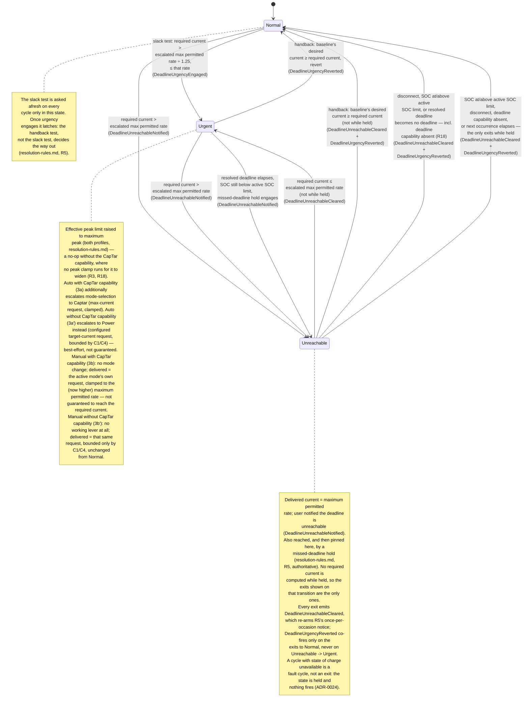

# UC05 — Guarantee the car is ready by departure

**Primary actor:** EV driver

**Stakeholders & interests:**

- EV driver — wants confidence the car reaches its active SOC limit by departure even if that means charging at high tariff or a higher monthly peak, and an unmistakable warning on the rare occasion even that cannot save the deadline.
- Household energy manager — accepts that cost optimisation and peak protection step aside during urgency, but only as far as needed to meet the deadline, and never beyond the configured maximum peak.

**Scope / level:** sea-level (single EV-driver goal), realized entirely through two existing resolution rules rather than a mode's own behaviour or a dedicated coordinator step: the effective-peak-limit raise (`resolution-rules.md`) — available under every profile, though a no-op while the CapTar capability is absent, since no peak clamp then runs for it to widen (R3, R18) — and, only under `Auto`, mode-selection escalating to `Captar` when the CapTar [capability](../system-overview.md#ubiquitous-language) is present, or to `Power` when it is absent (`resolution-rules.md`, Auto mode-selection's *Deadline urgency* row). Neither lever ever touches [UC01](UC01-charge-from-solar-surplus.md), [UC02](UC02-charge-from-solar-only.md), [UC03](UC03-charge-from-grid-within-captar-limit.md), or [UC04](UC04-charge-at-a-user-set-current.md)'s own set-point logic (NF2). This document has no charging mode of its own.

## Preconditions

- The car is connected at home ([charger status](../system-overview.md#ubiquitous-language) is `connected` or `charging`), state of charge is below the [active SOC limit](../system-overview.md#ubiquitous-language) (resolved per `resolution-rules.md`), and the dispatched mode has computed its own desired current for this cycle (`control-cycle.md`, step 4). The [baseline mode](../system-overview.md#ubiquitous-language) — the dispatched mode itself under `Manual` (which never escalates the mode), or whichever mode Auto mode-selection's baseline rows would otherwise select under `Auto` (`resolution-rules.md`) — is what urgency later hands back to, not what it is judged against on the way in.
- The [deadline capability](../system-overview.md#ubiquitous-language) is present (R18). When it is absent this use-case never applies at all — no deadline is ever resolved, so urgency cannot arise.
- A [departure deadline](../system-overview.md#ubiquitous-language) is resolved — not "no deadline" (`resolution-rules.md`). That deadline is the next occurrence still ahead of now, so it may fall later today or on the following day (e.g. an overnight session plugged in at 22:00 for a 06:00 departure), and the time remaining to it is always positive. The one situation in which this use-case applies to a deadline *not* ahead of now is a [missed-deadline hold](../system-overview.md#ubiquitous-language) (`resolution-rules.md`, R5), where the deadline this use-case is still pursuing is the one that has just elapsed; the hold requires no resolved deadline of its own.

## Trigger

A [control cycle](../system-overview.md#ubiquitous-language)'s [required current](../system-overview.md#ubiquitous-language) computation (`resolution-rules.md`) exceeds the [escalated maximum permitted rate](../system-overview.md#ubiquitous-language) reduced by the [deadline urgency margin](../system-overview.md#ubiquitous-language) of 25% — the **slack test**: escalating any later would no longer meet the deadline — [deadline urgency](../system-overview.md#ubiquitous-language) (R5). Urgency also stays in effect while a [missed-deadline hold](../system-overview.md#ubiquitous-language) is in effect (exception flow below), but a hold can only be entered from urgency, so it is never itself the trigger.

## Main success scenario

1. **Given** a departure deadline is resolved (its next occurrence still ahead of now), the car is connected at home below the active SOC limit, and the dispatched mode has computed its own desired current for this cycle.
2. **When** the control cycle's required-current computation (`resolution-rules.md`) exceeds the escalated maximum permitted rate reduced by the deadline urgency margin — i.e. the time needed to close the gap at that rate, plus a quarter of itself, no longer fits in the time remaining — **then** the System enters deadline urgency (R5), and stays in it until the handback test clears it (step 5). What the baseline mode happens to be requesting on this cycle does not enter this decision: urgency's levers are warranted by risk to the deadline, not by the ordinary policy being idle.
3. **And** the coordinator raises the effective peak limit ceiling to the [maximum peak](../system-overview.md#ubiquitous-language) (`resolution-rules.md`) — the lever available under every profile — so a mode whose own request was being held back by the normal ceiling (e.g. `Captar`, `Power`) can draw more, up to whatever it already requests; a mode whose own request never depended on peak headroom (e.g. `Solar`, `SolarOnly`) draws no differently. This lever only has an effect while the CapTar capability is present (R18): without it there is no peak clamp for the raise to widen (R3), so the raise is a no-op (3b′).
4. **And** the car reaches the active SOC limit by the deadline whenever the dispatched mode's own request, once unclamped by the raised ceiling — or, without the CapTar capability, as it already stood unclamped by R3 — is at or above the required current.
5. **And** urgency ends — the **handback** — on the first cycle at which the baseline mode's own desired current is at or above the required current: the ordinary policy will now meet the deadline unaided, so the levers have nothing left to add. State of charge reaching the active SOC limit satisfies this trivially (the required current is then zero). A disconnect, the deadline resolving to "no deadline", or the deadline capability becoming absent (R18) end it as well. Urgency is **not** re-derived from step 2's slack test each cycle: charging at the escalated rate closes the gap faster than the deadline approaches, so re-deriving it would revert urgency on the very next cycle and cycle the charger on and off.

## Alternate flows

**3a — `Auto` profile is active, CapTar capability present** — branches from step 3.
Given the `Auto` profile is active, deadline urgency (step 2) holds, and the CapTar capability is present
When the next control cycle runs
Then Auto mode-selection additionally escalates the active mode to `Captar` (`resolution-rules.md`, Auto mode-selection's *Deadline urgency* row), whose own set-point rule always requests the maximum charging current — `Auto`'s second lever, giving it a real chance of meeting the deadline even when the mode it would otherwise run (e.g. `Solar`) requests far less than required.

**3a′ — `Auto` profile is active, CapTar capability absent** — branches from step 3.
Given the `Auto` profile is active, deadline urgency (step 2) holds, and the CapTar capability is absent (R18)
When the next control cycle runs
Then Auto mode-selection escalates the active mode to `Power` instead of `Captar` (`resolution-rules.md`, Auto mode-selection's *Deadline urgency* row) — a deliberate, deadline-only exception to `Power` otherwise never being Auto-selected. Unlike `Captar`'s maximum-current request, `Power` requests only its configured [Power target current](../system-overview.md#ubiquitous-language) (R17), so this is a best-effort measure, not a guarantee: it may still leave the deadline unmet.

**3b — `Manual` profile is active, CapTar capability present** — branches from step 3.
Given the `Manual` profile is active, deadline urgency (step 2) holds, and the CapTar capability is present
When a control cycle runs
Then the active mode never changes and its own set-point logic is never touched (NF2) — the raised ceiling from step 3 is the only lever available. Whether the deadline is met depends entirely on the active mode's own appetite for current once unclamped: a manually selected `Captar` or `Power` session can now draw much more; a manually selected `Solar` or `SolarOnly` session draws no differently at all, since its own request never depended on peak headroom.

**3b′ — `Manual` profile is active, CapTar capability absent** — branches from step 3.
Given the `Manual` profile is active, deadline urgency (step 2) holds, and the CapTar capability is absent (R18)
When a control cycle runs
Then the active mode never changes and its own set-point logic is never touched (NF2), and the raised ceiling from step 3 changes nothing either: the peak-protection clamp does not run at all on such an installation (R3, `control-cycle.md`, step 5), so nothing was clamped by R3 for the raise to unclamp. `Manual` therefore has **no** working lever here — the active mode's own request already stood unclamped by R3, bounded only by C1 and the grid-supply-ceiling clamp (C4), typically a far higher ceiling than R3's thresholds would have imposed. Whether the deadline is met depends entirely on the active mode's own request, exactly as it would outside urgency; the delivered current is unchanged by this use-case.

## Exception flows

**The required current exceeds the escalated maximum permitted rate.**
Given a departure deadline is resolved and — even with the ceiling raised (step 3) and, under `Auto`, the escalation to `Captar` (3a, CapTar capability present) or `Power` (3a′, CapTar capability absent) — the [escalated maximum permitted rate](../system-overview.md#ubiquitous-language) is still below the required current. Urgency is necessarily already in effect (step 2): this threshold is strictly above the slack test's, so it cannot be crossed without crossing that one first
When a control cycle runs
Then the System delivers the maximum permitted rate and notifies the user that the departure deadline is unreachable at the current rate, **and** no further notification is sent for the same occasion — however many further cycles it stays unreachable — until the System has left `Unreachable` (emitting `DeadlineUnreachableCleared`) and the deadline later becomes unreachable again (R5).

**The departure deadline is reached while the car is still short of the active SOC limit.**
Given deadline urgency is in effect (step 2, in either the `Urgent` or `Unreachable` state) and state of charge is still below the active SOC limit
When the resolved departure time is reached
Then a [missed-deadline hold](../system-overview.md#ubiquitous-language) engages (`resolution-rules.md`, R5, authoritative for its engage and clear conditions) and the deadline is now unreachable by definition, time having run out on it: the System enters `Unreachable` (from `Urgent`, emitting `DeadlineUnreachableNotified`) or remains there (if already `Unreachable`), with exactly that state's own behaviour, for as long as the car stays connected below the active SOC limit. No required current is computed while the hold is in effect, so the deadline's own resolution rolling forward to the next occurrence (R14, unchanged) cannot end the hold. It clears only once state of charge is at or above the active SOC limit, on disconnect, when the deadline capability becomes absent (R18), or — as a backstop — when the following occurrence elapses in turn (Postconditions, State model below); whichever of those ends it leaves `Unreachable` and so emits `DeadlineUnreachableCleared` alongside `DeadlineUrgencyReverted`, and the ordinary resolution then governs again from the next cycle. No further unreachable notification is sent for this occasion while the hold lasts. Recording or announcing that a deadline was actually *missed*, beyond this unreachable notification, remains out of scope.

## Postconditions

- While deadline urgency holds, the delivered charger current is the dispatched mode's own request (under `Auto` with the CapTar capability present, `Captar`'s own maximum-current request; under `Auto` without the CapTar capability, `Power`'s own configured target-current request; under `Manual`, whichever mode is active), clamped to the maximum permitted rate under the raised ceiling — bounded above by that rate (itself bounded by C1 and C4); high-tariff charging is permitted for as long as urgency holds.
- The effective peak limit in force is the maximum peak while urgency holds (`resolution-rules.md`); net import still stays at or below that ceiling minus the safety margin (C3) — this lever never bypasses the coordinator's peak-protection clamp (`control-cycle.md`), it only widens the target the clamp fits to. There are two cases in which that clamp does not run at all, and in which only the grid-supply-ceiling clamp (C4) bounds delivery, as it would without urgency (C3): the CapTar [capability](../system-overview.md#ubiquitous-language) is absent (R18, R3), in every mode — in which case the raise itself is a no-op, since there is no clamp for it to widen (3b′ below); or `Power` mode has its own peak-protection option disabled ([UC04](UC04-charge-at-a-user-set-current.md)), in that mode alone — by the mode's own configuration, not by this lever.
- The active SOC limit itself is never raised by either lever (R7) — a lower limit already in force (e.g. a solar step-up not yet reset) still bounds how far charging accelerates. The solar-reserve cap (R9) is never in force here: a departure deadline resolved for tomorrow and a missed-deadline hold are each a precondition against the cap engaging (`resolution-rules.md`, the active-SOC-limit table's *Solar-reserve cap* row; [UC07](UC07-reserve-capacity-for-tomorrow.md)) — which is what "mutually exclusive" means between the two. A cap already in force when either arises lifts from the next cycle, so the active SOC limit may *rise* at that point; that is R9's own priority rule, not these levers reaching into R7.
- When the required current exceeds the maximum permitted rate even with every available lever, the System delivers the maximum permitted rate and has sent the user **exactly one** notification that the deadline is unreachable for this occasion — no further notification for the same occasion, and the next one only after the System has left `Unreachable` (emitting `DeadlineUnreachableCleared`, which re-arms the notice) and the deadline becomes unreachable again (R5).
- Once urgency has engaged and the deadline then elapses with the car still below the active SOC limit, a missed-deadline hold keeps the System in `Unreachable`; it never steps down merely because the deadline's own resolution has moved on to the next occurrence. Only state of charge reaching the active SOC limit, a disconnect, the deadline capability becoming absent (R18), or the following occurrence elapsing in turn ends it (exception flow above, State model below).
- Once deadline urgency no longer holds, the effective peak limit resolves normally again and, under `Auto`, mode-selection falls through to its *Solar session* or *Overnight top-up* row.
- Whether the unreachable-deadline notification above is actually sent depends further on the notifications [capability](../system-overview.md#ubiquitous-language) and its own [per-notification enable toggle](../system-overview.md#ubiquitous-language) (`deadline_notice_enabled`, default on) — conjunctive gating, exactly as R12's reminder ([UC10](UC10-remind-to-plug-in.md)) and R13's prompt ([UC08](UC08-plan-tomorrow-home-day.md)) are gated. Every postcondition above other than the send itself — the state model, the levers, the peak limit, the active SOC limit, and `Unreachable`'s own "exactly one notification" bookkeeping — holds unchanged whichever way this gating falls; only the send is suppressed (R18 AC10/AC11).

## State model

Deadline urgency is **entered** by a per-cycle test and then **latched**: each cycle the coordinator recomputes the required current and the escalated maximum permitted rate, and while the System is in `Normal` the slack test decides afresh whether to engage; once engaged, it is the handback test — not the slack test — that decides whether to leave. The latch exists because the two tests are not each other's inverse: charging at the escalated rate drives the required current down below the slack threshold within a single cycle, so a System that re-asked the slack test each cycle would revert immediately, stop charging, drift back over the threshold and re-engage, cycling the charger at the control-cycle rate. The boundary *between* `Urgent` and `Unreachable`, by contrast, is re-evaluated every cycle and needs no latch, since both sides of it are already inside urgency. Within those rules a change in conditions (SOC catching up, the baseline mode starting to charge, the deadline resolving to "no deadline," or a sudden jump in the required current) still moves the System between states on the very next cycle, without a dedicated timer. The three states below describe this observable behaviour; the `stateDiagram-v2` is authoritative for the state set and its transitions.

**The [missed-deadline hold](../system-overview.md#ubiquitous-language) is a second piece of remembered state, on top of the urgency latch** (`resolution-rules.md`, R5, which defines it and is authoritative): the System remembers, for the current connected session, whether deadline urgency was in effect on its own merits on the cycle before the resolved deadline elapsed. That one remembered fact is what distinguishes a deadline this session was actively pursuing and then missed — which stays `Unreachable` — from a session that merely *began* after some earlier deadline had already elapsed, which never engaged urgency for it and so resolves forward to the next occurrence from `Normal` as usual. It is deliberately the narrowest possible piece of session history, and it is cleared once state of charge is at or above the active SOC limit, on disconnect, when the deadline capability becomes absent (R18), or when the following occurrence elapses in turn.

- **Normal** — urgency has not engaged: the required current is at or below the escalated maximum permitted rate reduced by the deadline urgency margin, or it has since been handed back to the baseline mode. The effective peak limit resolves normally (`resolution-rules.md`, the effective-peak-limit rule's *Normal* row), and, under `Auto`, mode-selection is unaffected by urgency.
- **Urgent** — urgency has engaged (the slack test fired) and has not been handed back, and the required current is at or below the escalated maximum permitted rate; the effective peak limit is raised to the maximum peak (both profiles). Under `Auto` with the CapTar capability present (3a), mode-selection additionally escalates to `Captar`, so the delivered current is `Captar`'s own maximum-current request, clamped to the maximum permitted rate. Under `Auto` without the CapTar capability (3a′), mode-selection instead escalates to `Power`, so the delivered current is `Power`'s own configured target-current request, clamped to the maximum permitted rate — a best-effort second lever, not guaranteed to reach the required current the way `Captar`'s maximum-current request is. Under `Manual` with the CapTar capability present (3b), the active mode never changes; the delivered current is that mode's own request, clamped to the (now higher) maximum permitted rate — which may or may not reach the required current, since `Manual` has no second lever at all. Under `Manual` without the CapTar capability (3b′), the maximum permitted rate does not rise — the peak clamp does not run, so the raise is a no-op — and the delivered current is that mode's own request bounded only by C1 and C4, exactly as in `Normal`; `Manual` has no working lever at all there. Two things keep this state stable rather than reverting the cycle after it engages: the latch, which means the slack test is not re-asked once it has fired; and the handback comparison using the baseline mode, never the escalated mode's own desired current.
- **Unreachable** — the required current exceeds the escalated maximum permitted rate even with every available lever, **or** a missed-deadline hold is in effect (in which case no required current is computed at all and the state is pinned here); either way the System delivers everything its available levers yield, bounded above by the maximum permitted rate, and has notified the user. Under `Manual` that can be considerably less — a manually selected `Solar` session after dark still draws nothing (3b), and without the CapTar capability `Manual` reaches this state on exactly the delivery it would have made anyway, since it has no working lever (3b′). **Every** exit from this state — whichever of the exits below ends it — emits `DeadlineUnreachableCleared` (Domain events produced), which is what scopes the notification's once-per-occasion behaviour (R5) to the occasion rather than to how long the System has been running. A cycle on which state of charge is unavailable is not an exit at all but a fault cycle that holds this state (below).

A disconnect (charger status leaving `connected`/`charging`) breaks the "car connected" precondition and exits this use-case's scope from any state, returning to Normal on reconnect; the active SOC limit resets to the default at that point (R7), independently of this use-case. Reaching the active SOC limit also returns the System to Normal from any state. The departure deadline resolving to "no deadline" likewise returns it to Normal — for whatever reason it resolves that way, the deadline capability becoming absent (R18) being one such reason among the R14 resolution's own — since urgency is only ever defined relative to a deadline that still applies — **except** while a missed-deadline hold is in effect, which is anchored to the occurrence already missed rather than to whatever resolves next, and so survives it. Each of these, when it ends the `Unreachable` state, emits `DeadlineUnreachableCleared` alongside `DeadlineUrgencyReverted`; when it merely ends `Urgent`, only `DeadlineUrgencyReverted` fires.

**State of charge becoming unavailable is deliberately not one of those exits.** Such a cycle is a *fault* cycle: with no state of charge there is no required current to compute, so the cycle establishes nothing about the deadline and the System holds whichever state it was already in — it neither leaves `Unreachable` nor emits `DeadlineUnreachableCleared`, because a clear on a cycle that established nothing would re-arm the notification and then re-notify on the next healthy cycle (ADR-0024). The state is resolved again on the first cycle that reads a state of charge: unchanged if the deadline is still unreachable, or a genuine exit — with its events — if it is not. A *disconnect* is different in kind: it ends the connected session and the use-case's own precondition, so it is a real exit and does clear.

The deadline being reached does not, on its own, move the System toward Normal. While the car remains connected below the active SOC limit and urgency was already in effect for that occurrence, the missed-deadline hold pins the System to Unreachable at the maximum permitted rate, since a departure time is a target, not a cutoff (`resolution-rules.md`, R5). The only exits are then state of charge reaching the active SOC limit, a disconnect, the deadline capability becoming absent (R18), or the following occurrence elapsing in turn — all returning to Normal — after which the ordinary resolution governs again. Entering the hold from Urgent is an ordinary Urgent → Unreachable transition and emits `DeadlineUnreachableNotified` with its usual semantics; no notification rule changes here.

| State | Delivered current | Leaves when |
| --- | --- | --- |
| Normal | Dispatched mode's own desired current, unmodified | required current > escalated max permitted rate ÷ 1.25 and ≤ that rate → Urgent (`DeadlineUrgencyEngaged`) · required current > escalated max permitted rate → Unreachable (`DeadlineUnreachableNotified`) |
| Urgent | `Captar`'s maximum-current request clamped to the maximum permitted rate (`Auto` with CapTar capability, 3a) — or `Power`'s configured target-current request, clamped likewise, best-effort (`Auto` without CapTar capability, 3a′) — or the active mode's own request, clamped to the (raised) maximum permitted rate, not guaranteed to reach the required current (`Manual` with CapTar capability, 3b) — or, without the CapTar capability, that same request bounded only by C1 and C4, unchanged from `Normal` because the raise is a no-op with no peak clamp to widen (`Manual`, 3b′) | handback: baseline's desired current ≥ required current → Normal (revert) (`DeadlineUrgencyReverted`) · required current > escalated max permitted rate → Unreachable (`DeadlineUnreachableNotified`) · the resolved deadline elapses with SOC still below the active SOC limit → Unreachable (missed-deadline hold engages) (`DeadlineUnreachableNotified`) |
| Unreachable | Maximum permitted rate; user notified | required current ≤ escalated max permitted rate → Urgent (`DeadlineUnreachableCleared`) · handback: baseline's desired current ≥ required current → Normal (`DeadlineUnreachableCleared` + `DeadlineUrgencyReverted`) · a disconnect, state of charge reaching the active SOC limit, or the resolved deadline becoming "no deadline" (including the deadline capability becoming absent, R18) → Normal (`DeadlineUnreachableCleared` + `DeadlineUrgencyReverted`) · **while a missed-deadline hold is in effect, the two required-current exits and the "no deadline" exit do not apply** (no required current is computed, and the hold is anchored to the occurrence already missed): the only exits are then state of charge reaching the active SOC limit, a disconnect, the deadline capability becoming absent (R18), or the following occurrence elapsing in turn → Normal (`DeadlineUnreachableCleared` + `DeadlineUrgencyReverted`) · a cycle on which state of charge is unavailable is a fault cycle, not an exit: the state is held and no event fires (prose above, ADR-0024) |

## Domain events produced

These events mark this use-case's own state transitions; they correspond to the
effective-peak-limit rule's row switching (both profiles) and, under `Auto`, Auto mode-selection's
*Deadline urgency* row switching (`resolution-rules.md`) — there is no dedicated coordinator step, since the peak
clamp (`control-cycle.md`, step 5) already varies with whichever ceiling is currently in force.

- `DeadlineUrgencyEngaged` — the slack test has fired: the required current now exceeds the escalated maximum permitted rate reduced by the deadline urgency margin; the effective peak limit raises to the maximum peak and, under `Auto`, mode-selection escalates to `Captar` (CapTar capability present) or `Power` (absent) (Normal → Urgent).
- `DeadlineUrgencyReverted` — urgency no longer holds: the handback test has cleared it — the baseline mode's own desired current now meets or exceeds the required current — or a missed-deadline hold has cleared (`resolution-rules.md`). It fires the same way whatever ended urgency, a disconnect from plain `Urgent` included; the effective peak limit resolves normally and, under `Auto`, mode-selection falls through to its *Solar session* or *Overnight top-up* row (Urgent/Unreachable → Normal).
- `DeadlineUnreachableNotified` — the required current exceeds the escalated maximum permitted rate even with every available lever, or a missed-deadline hold has just engaged; the System has entered `Unreachable` (Normal/Urgent → Unreachable, or re-fires while remaining in Unreachable). This event marks the state transition, not the send: it fires the same way whether or not the notification it triggers is actually delivered, since that delivery is a separate, further-gated step (Postconditions above, R18 AC10/AC11).
- `DeadlineUnreachableCleared` — the deadline is no longer unreachable: the System has left the `Unreachable` state, whichever exit ended it (State model table) — the required current falling back within the escalated maximum permitted rate (→ Urgent, or → Normal when the handback test also clears), a disconnect, state of charge reaching the active SOC limit, or the resolved deadline becoming "no deadline" (including the deadline capability becoming absent, R18); or, while a missed-deadline hold is in effect, whichever of the hold's own clear conditions ends it. It is the paired clearing edge of `DeadlineUnreachableNotified` above, which re-fires every cycle the condition holds, so the R5 notification is delivered **once per occasion** and re-arms for the next one (ADR-0024) (Unreachable → Urgent/Normal). A cycle on which state of charge is unavailable is a fault cycle rather than an exit: nothing about the deadline is established, the prior state is held and this event does **not** fire (State model above, ADR-0024).
  - **Relationship to `DeadlineUrgencyReverted`:** the two **co-fire** on the `Unreachable` → `Normal` exit, where urgency ends outright. Only `DeadlineUnreachableCleared` fires on `Unreachable` → `Urgent`, where the deadline stops being unreachable while remaining at risk — the exit `DeadlineUrgencyReverted`, which fires only on the `→ Normal` edge, cannot cover. Conversely, only `DeadlineUrgencyReverted` fires on `Urgent` → `Normal`, where the System was never in `Unreachable`. The two are therefore not interchangeable: one marks the urgency level, the other the unreachable condition's own boundary.

## Diagram

```mermaid
stateDiagram-v2
    [*] --> Normal
    Normal --> Urgent: slack test: required current ><br/>escalated max permitted rate ÷ 1.25,<br/>≤ that rate<br/>(DeadlineUrgencyEngaged)
    Normal --> Unreachable: required current ><br/>escalated max permitted rate<br/>(DeadlineUnreachableNotified)
    Urgent --> Normal: handback: baseline's desired<br/>current ≥ required current, revert<br/>(DeadlineUrgencyReverted)
    Urgent --> Unreachable: required current ><br/>escalated max permitted rate<br/>(DeadlineUnreachableNotified)
    Urgent --> Unreachable: resolved deadline elapses,<br/>SOC still below active SOC limit,<br/>missed-deadline hold engages<br/>(DeadlineUnreachableNotified)
    Unreachable --> Urgent: required current ≤<br/>escalated max permitted rate<br/>(not while held)<br/>(DeadlineUnreachableCleared)
    Unreachable --> Normal: handback: baseline's desired<br/>current ≥ required current<br/>(not while held)<br/>(DeadlineUnreachableCleared +<br/>DeadlineUrgencyReverted)
    Unreachable --> Normal: disconnect, SOC at/above active<br/>SOC limit, or resolved deadline<br/>becomes no deadline — incl. deadline<br/>capability absent (R18)<br/>(DeadlineUnreachableCleared +<br/>DeadlineUrgencyReverted)
    Unreachable --> Normal: SOC at/above active SOC limit,<br/>disconnect, deadline capability absent,<br/>or next occurrence elapses —<br/>the only exits while held<br/>(DeadlineUnreachableCleared +<br/>DeadlineUrgencyReverted)
    note right of Normal
        The slack test is asked afresh on every
        cycle only in this state. Once urgency
        engages it latches: the handback test,
        not the slack test, decides the way out
        (resolution-rules.md, R5).
    end note
    note right of Urgent
        Effective peak limit raised to maximum
        peak (both profiles, resolution-rules.md) —
        a no-op without the CapTar capability, where
        no peak clamp runs for it to widen (R3, R18).
        Auto with CapTar capability (3a) additionally
        escalates mode-selection to Captar (max-current
        request, clamped). Auto without CapTar capability
        (3a′) escalates to Power instead (configured
        target-current request, bounded by C1/C4) —
        best-effort, not guaranteed. Manual with CapTar
        capability (3b): no mode change; delivered =
        the active mode's own request, clamped to the
        (now higher) maximum permitted rate — not
        guaranteed to reach the required current.
        Manual without CapTar capability (3b′): no
        working lever at all; delivered = that same
        request, bounded only by C1/C4, unchanged
        from Normal.
    end note
    note right of Unreachable
        Delivered current = maximum permitted
        rate; user notified the deadline is
        unreachable (DeadlineUnreachableNotified).
        Also reached, and then pinned here, by a
        missed-deadline hold (resolution-rules.md,
        R5, authoritative). No required current is
        computed while held, so the exits shown on
        that transition are the only ones.
        Every exit emits DeadlineUnreachableCleared,
        which re-arms R5's once-per-occasion notice;
        DeadlineUrgencyReverted co-fires only on the
        exits to Normal, never on Unreachable -> Urgent.
        A cycle with state of charge unavailable is a
        fault cycle, not an exit: the state is held and
        nothing fires (ADR-0024).
    end note
```

## Requirements satisfied

- **R5** — Departure deadline guarantee (the slack test that engages urgency, judged against the escalated maximum permitted rate and the 25% deadline urgency margin rather than against the baseline mode; the latch and the handback test that ends it; the effective-peak-limit raise shared by both profiles, and its being a no-op — leaving `Manual` with no lever — while the CapTar capability is absent (R18, 3b′); `Auto`'s additional mode-selection escalation to `Captar` (CapTar capability present) or `Power` (absent, R18); high-tariff permission; never raising the active SOC limit; the missed-deadline hold that keeps urgency in effect past a missed deadline until the active SOC limit is reached or the car disconnects; and the deadline-unreachable notification, triggered against the escalated maximum permitted rate and delivered once per occasion, re-armed by `DeadlineUnreachableCleared` on every exit from `Unreachable`; delivery of that notification is itself further gated on the notifications capability and `deadline_notice_enabled`, Postconditions above).

Partially satisfies [R18](../requirements.md#r18--configurable-installation-capabilities) — the
R5 portion of AC7 (no unreachable-deadline notification is ever sent while the deadline
capability is absent, since this use-case's own precondition above requires it present and no
urgency can arise without it), and the R5 portion of AC10 (the deadline-unreachable notice is
undeliverable while the notifications capability is absent) and of AC11 (`deadline_notice_enabled`
gates it further, on top of the capability, defaulting on) — both realized by the Postconditions
bullet above.

Inherited from the shared mechanism (referenced, not restated): the deadline-capability gate on this use-case as a whole and the CapTar-capability branch within it (R18); the required-current computation, the missed-deadline hold, the effective-peak-limit resolution, and Auto mode-selection (all `resolution-rules.md`); the departure-deadline resolution (R14); the active-SOC-limit resolution (R7, which neither lever raises); the peak-protection (R3, C3) and grid-supply-ceiling (C4) clamps (`control-cycle.md`); and the EV battery capacity configuration parameter (R15, `requirements.md`) that feeds the required-current computation.

## Relationships

- **Realized entirely by two existing resolution rules, not by a mode or a dedicated coordinator step.** The effective-peak-limit raise and Auto mode-selection's escalation to `Captar` or `Power` (both `resolution-rules.md`) are consumed by the coordinator's existing peak clamp (`control-cycle.md`, step 5) exactly as they would be for any other reason the ceiling or the active mode changed — no new coordinator logic was needed, and none of UC01–UC04's own set-point logic is ever modified (NF2).
- **`Auto` always has a working lever; `Manual` has one only while the CapTar capability is present.** Under `Auto`: the peak-limit raise, plus mode-selection escalating to `Captar` when the CapTar capability is present, or to `Power` when it is absent (`resolution-rules.md`, Auto mode-selection's *Deadline urgency* row, reverting to its baseline rows, R18). `Captar`'s own set-point rule always requests the maximum charging current, so `Auto` with the CapTar capability has two working levers and reliably delivers close to the maximum permitted rate whenever the deadline is at risk; without the capability the peak-limit raise is a no-op (R3 does not run), so `Auto` is left with the escalation to `Power` alone, and `Power`'s own set-point rule requests only its configured target current (R17) — a best-effort lever, not guaranteed to reach the required current, though bounded only by C1 and C4 rather than by any peak clamp. Under `Manual` with the CapTar capability: only the peak-limit raise — the active mode's own logic is never touched, so meeting the deadline depends entirely on whether that mode already requests enough current once unclamped. Under `Manual` without it: **no** working lever at all (3b′) — the raise has no clamp to widen, so this use-case changes nothing the active mode would not already have delivered. This is why `Auto` meets more deadlines than `Manual` can, and why `Auto` with the CapTar capability meets more than `Auto` without it; a session in `Solar` or `SolarOnly`, whose own request never depends on peak headroom, gets no benefit from this use-case at all under `Manual` and is more likely to end in the Unreachable state there.
- **Never raises the active SOC limit (R7)** — urgency only accelerates toward whichever limit is already resolved. **Mutually exclusive with [UC07](UC07-reserve-capacity-for-tomorrow.md)'s solar-reserve cap (R9)**: a departure deadline resolved for tomorrow *and* a missed-deadline hold are each a precondition against the cap engaging at all (`resolution-rules.md`, the active-SOC-limit table's *Solar-reserve cap* row) — those two preconditions are exactly what the shorthand "mutually exclusive" covers. They deliberately leave the cap untroubled by a deadline resolved for *today* and still ahead of now, which is not competing for tomorrow's reserve.
- Consumes the required-current, departure-deadline, effective-peak-limit, and Auto mode-selection rules in `resolution-rules.md`, and runs on the existing peak clamp in the `control-cycle.md` coordinator spine.
