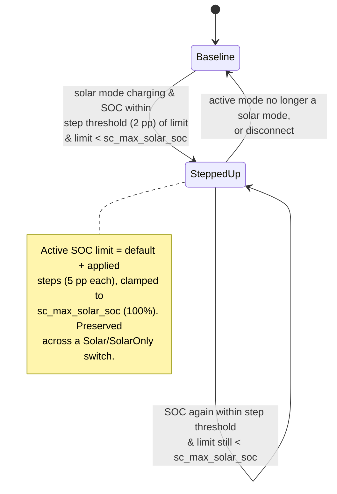

# UC06 — Store abundant solar by stepping up the limit

**Primary actor:** Household energy manager

**Stakeholders & interests:**

- Household energy manager — wants abundant solar surplus stored in the car rather than exported once the car is close to its current target, without having to raise the default SOC limit permanently.
- EV driver — benefits from a fuller battery on days with abundant sun, without any change to how or when charging starts.

**Scope / level:** sea-level (single goal: raise the ceiling a solar session charges toward), realized entirely as a modifier to the [active SOC limit](../system-overview.md#ubiquitous-language) resolution (`resolution-rules.md`, R7 priority row 2). This use-case never charges the car itself and has no charger-current logic of its own — [UC01](UC01-charge-from-solar-surplus.md) and [UC02](UC02-charge-from-solar-only.md) do the actual charging; this use-case only ever moves the ceiling they charge toward.

## Preconditions

- The `Auto` [profile](../system-overview.md#ubiquitous-language) is active (R8/R16) — under `Manual`, no step-up ever applies, regardless of which solar mode is selected.
- The solar [capability](../system-overview.md#ubiquitous-language) is present (R18).
- The [active mode](../system-overview.md#ubiquitous-language) is a solar mode (`Solar` or `SolarOnly`) and it is charging (per [UC01](UC01-charge-from-solar-surplus.md) or [UC02](UC02-charge-from-solar-only.md)).
- The [active SOC limit](../system-overview.md#ubiquitous-language) (resolved per `resolution-rules.md`) is below the configured maximum (`sc_max_solar_soc`, default 100%).

## Trigger

A [control cycle](../system-overview.md#ubiquitous-language) observes that state of charge has come within a configurable threshold (default 2 pp) of the active SOC limit while a solar mode is charging.

## Main success scenario

1. **Given** a solar mode is charging and the active SOC limit is below the configured maximum (`sc_max_solar_soc`, default 100%).
2. **When** state of charge comes within the step threshold (default 2 pp) of the active SOC limit, **then** the System raises the active SOC limit by the configured step (default 5 pp) — a [solar step-up](../system-overview.md#ubiquitous-language).
3. **And** the raised value is clamped to `sc_max_solar_soc` (default 100%) — a step that would overshoot it clamps to the maximum instead.
4. **And** the resolved active SOC limit change takes effect on the next control cycle, so the in-progress solar session ([UC01](UC01-charge-from-solar-surplus.md) or [UC02](UC02-charge-from-solar-only.md)) keeps charging toward the new, higher ceiling rather than stopping at the old one.

## Alternate flows

**2a — Maximum already reached** — branches from step 2.
Given the active SOC limit already equals `sc_max_solar_soc` (a prior step clamped to it)
When state of charge comes within the step threshold of the active SOC limit
Then the System applies no further step — the limit cannot rise beyond the configured maximum.

**4a — Switching between `Solar` and `SolarOnly`** — branches from step 4.
Given a solar step-up is in effect
When the active mode switches from `Solar` to `SolarOnly` or vice versa
Then the step-up is preserved unchanged — switching between the two solar modes is not a reset (R7).

## Exception flows

**Active mode leaves solar charging.**
Given a solar step-up is in effect
When the active mode is no longer a solar mode (e.g. `Auto` escalates to `Captar` under deadline urgency, or the user manually switches to `Captar`, `Power`, or `Off`)
Then the System clears the step-up and the active SOC limit returns to the default limit (R7) — this use-case is the one that applies that reset.

**Car disconnects.**
Given a solar step-up is in effect
When the car is unplugged
Then the active SOC limit resets to the default limit and the step-up is cleared, per the shared disconnect rule (R7) — not re-litigated here.

## Postconditions

- While a step-up is in effect, the active SOC limit equals the default limit plus the applied steps, clamped to `sc_max_solar_soc`.
- A step-up persists unchanged across a switch between `Solar` and `SolarOnly` (R7).
- A step-up is cleared, and the active SOC limit returns to the default limit, the moment the active mode is no longer a solar mode, or on disconnect (R7).
- This use-case never changes the charger current itself — it only changes the ceiling that [UC01](UC01-charge-from-solar-surplus.md)/[UC02](UC02-charge-from-solar-only.md)'s own set-point logic charges toward.

## State model

A light state model (two states): whether a solar step-up is currently in effect. The `stateDiagram-v2` below is authoritative for the state set. All thresholds are configurable (defaults shown).

| State | Active SOC limit | Leaves when |
| --- | --- | --- |
| Baseline | The default limit (or the solar-reserve cap, R9, if that applies — R7 priority 1) | A solar mode is charging, SOC comes within the step threshold of the limit, and the limit is below `sc_max_solar_soc` → SteppedUp |
| SteppedUp | Default limit + applied steps, clamped to `sc_max_solar_soc` | Another step applies (self-loop, gated by the maximum clamp) · active mode is no longer a solar mode → Baseline · disconnect → Baseline |

A disconnect or a mode change away from a solar mode returns the System to Baseline from SteppedUp at any step count; switching between `Solar` and `SolarOnly` is a self-loop in SteppedUp, not an exit (R7).

## Domain events produced

- `SolarStepUpApplied` — the active SOC limit rose by one step (Baseline → SteppedUp, or a further step within SteppedUp).
- `SolarStepUpCleared` — the active mode left solar charging (or the car disconnected); the step-up was cleared and the active SOC limit returned to the default limit (SteppedUp → Baseline).

## Diagram

## Requirements satisfied

- **R8** — Solar SOC step-up (trigger on threshold proximity, step size, maximum clamp).

Inherited from the shared mechanism (referenced, not restated): the active-SOC-limit resolution and lifecycle (R7, `resolution-rules.md`, priority row 2 — this use-case is the one that applies the row-2 value and its reset), the solar-reserve cap's higher priority (R9, R7 priority row 1), and the solar capability gate (R18).

## Relationships

- **Peer to [UC01](UC01-charge-from-solar-surplus.md) and [UC02](UC02-charge-from-solar-only.md), not an extension of either.** "Extends" would imply this use-case inserts optional behaviour into UC01/UC02's own scenario steps; it does not. UC06 is a separate, mode-agnostic policy that writes one row of the shared active-SOC-limit lookup (`resolution-rules.md`, R7 priority row 2). UC01 and UC02 each *read* that resolved value as part of their own set-point rule (e.g. "SOC ≥ active SOC limit → SocReached") the same way they already read the default limit or the solar-reserve cap — UC06 changing which value is currently in that slot is invisible to their own scenario logic. Neither charging use-case's amp-step rounding, grid fallback, or post-surplus hold changes because of UC06.
- **Neither the coordinator nor a mode module owns this — it lives in the shared resolution-rules.md lookup layer.** `control-cycle.md`'s numbered steps (sensor read, smoothing, dispatch, clamps) never mention the active SOC limit; per its step 4, the active mode module reads and consumes the resolved value as part of its own set-point rule — it has no opinion on why the limit is where it is, the same way UC03/UC04's own set-point rules consult the effective peak limit `resolution-rules.md` resolves for them. UC06 only ever changes what the active-SOC-limit lookup currently returns — like the R7 priority-1 solar-reserve-cap row, it is evaluated fresh every control cycle without being one of the coordinator's own numbered steps or belonging to any single mode module.
