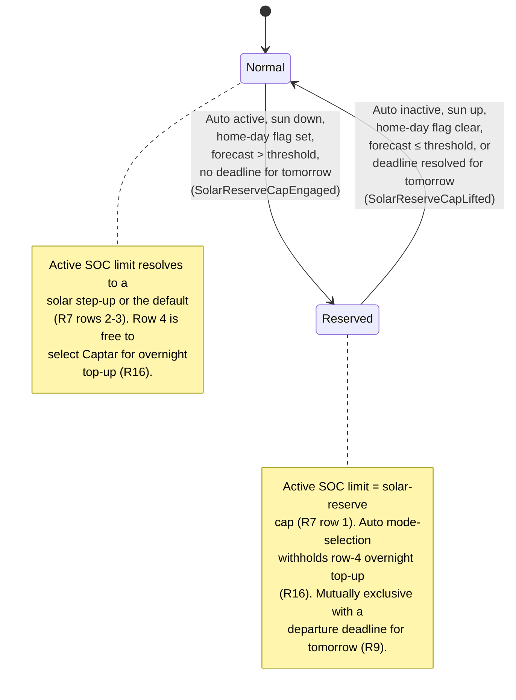

# UC07 — Reserve capacity for tomorrow's solar

**Primary actor:** Household energy manager

**Stakeholders & interests:**

- Household energy manager — wants tonight's overnight grid top-up skipped when tomorrow's solar
  can fill the battery instead, so solar self-consumption stays high and unnecessary grid cost
  (and CapTar exposure) is avoided.
- EV driver — wants a departure deadline resolved for tomorrow to always take priority over this
  reserve policy; when no such deadline exists, accepts a lower overnight limit in exchange for it
  being refilled by solar the next day.

**Scope / level:** sea-level (a single `Auto`-profile coordination goal), realized entirely
through two existing resolution rules rather than a mode's own behaviour or a dedicated
coordinator step: the active-SOC-limit rule's row 1 (`resolution-rules.md`) and Auto
mode-selection's row 4 (`resolution-rules.md`). Neither lever touches
[UC01](UC01-charge-from-solar-surplus.md), [UC02](UC02-charge-from-solar-only.md), or
[UC03](UC03-charge-from-grid-within-captar-limit.md)'s own set-point logic (NF2) — whichever mode
`Auto` selects simply charges to whichever active SOC limit is currently resolved. This document
has no charging mode of its own.

## Preconditions

- The car is connected at home ([charger status](../system-overview.md#ubiquitous-language) is
  `connected` or `charging`).
- The `Auto` profile is active.
- The [home-day flag](../system-overview.md#ubiquitous-language) is set for tomorrow — sourced
  from UC08's evening prompt or an external source (calendar, presence) per NF3.
- The next-day [solar forecast](../system-overview.md#ubiquitous-language) exceeds its configured
  threshold (default 12 kWh).
- No [departure deadline](../system-overview.md#ubiquitous-language) is resolved for tomorrow
  (`resolution-rules.md`, R14, evaluated one day ahead) — if one is, the deadline takes priority
  and this use case does not apply.

## Trigger

The [sun goes down](../system-overview.md#ubiquitous-language) while the preconditions above
hold — or, if the sun is already down, the moment the last of the preconditions becomes true.

## Main success scenario

1. **Given** the car is connected at home, the `Auto` profile is active, the home-day flag is set
   for tomorrow, the next-day solar forecast exceeds its threshold, and no departure deadline is
   resolved for tomorrow.
2. **When** the sun is down, **then** the active-SOC-limit rule's row 1 (`resolution-rules.md`,
   R7) resolves the active SOC limit to the [solar-reserve cap](../system-overview.md#ubiquitous-language)
   (default 60%) instead of any solar step-up or the default limit.
3. **And** Auto mode-selection's row 4 (`resolution-rules.md`, R16) does not match, so `Auto` does
   not select a mode for the sake of opportunistic overnight grid top-up — the same `Auto`
   decision that lowered the limit in step 2 also withholds baseline overnight charging.
4. **And** the next morning, once the sun is up, the cap lifts (Postconditions) and the active SOC
   limit resolves normally again — so whichever solar mode `Auto` now selects charges from the
   reserved headroom up to that normal (uncapped) limit, which is the reserve's purpose: tonight's
   grid top-up was skipped so tomorrow's solar has genuine room to fill.

## Alternate flows

**1a — `Manual` profile is active** — branches from step 1.
Given the `Manual` profile is active, regardless of the home-day flag or the solar forecast
When a control cycle runs
Then the active-SOC-limit rule's row 1 never matches and Auto mode-selection does not run at all
(R16 does not apply under `Manual`) — the active SOC limit resolves as if this use-case were not
coordinating it, and the user's manually selected mode is never second-guessed.

## Exception flows

None — resolving the active SOC limit to the solar-reserve cap and withholding baseline overnight
charging cannot themselves fail; the only way the goal is not achieved is a precondition not
holding, which is covered by 1a and the Postconditions reset. A departure deadline for tomorrow
becoming resolved while the cap is already active is not an exception either — it is simply the
"no departure deadline" precondition ceasing to hold, handled the same way as any other
precondition lapsing (Postconditions).

## Postconditions

- While the cap is active, the active SOC limit in force is the solar-reserve cap (not the
  default or any solar step-up), and `Auto` has not started a mode for baseline overnight grid
  top-up.
- While the cap is active, no departure deadline is resolved for tomorrow. If one becomes
  resolved on a later cycle (e.g. an external sensor sets one, or the home-day override is
  reconfigured away from "no deadline"), it takes priority: the cap lifts on the very next control
  cycle, the same as any other precondition ceasing to hold.
- When the sun comes up, the `Auto` profile is no longer active, or a departure deadline becomes
  resolved for tomorrow, the cap lifts on the next control cycle: the active-SOC-limit rule falls
  through to row 2 (solar step-up) or row 3 (default), and Auto mode-selection is no longer
  withheld by row 4's reserve condition — the reserved headroom is then available for a solar mode
  to fill (step 4).

## State model

The reserve decision is itself a re-evaluated-every-cycle condition, not a value the System
stores between cycles (mirrors deadline urgency's Normal/Urgent pattern in
[UC05](UC05-guarantee-ready-by-departure.md)): each cycle the coordinator re-checks the profile,
the sun position, the home-day flag, the forecast, and tomorrow's departure-deadline resolution,
so a change in any of them moves the System directly between the two states below on the very
next cycle.

- **Normal** — the active-SOC-limit rule's row 1 does not match; the limit resolves to a solar
  step-up or the default (R7), and Auto mode-selection's row 4 is free to select `Captar` for
  overnight top-up (R16).
- **Reserved** — the `Auto` profile is active, the sun is down, the home-day flag is set, the
  forecast exceeds its threshold, and no departure deadline is resolved for tomorrow; the limit
  resolves to the solar-reserve cap (R7 row 1) and Auto mode-selection's row 4 is withheld (R16).
  A departure deadline resolved for tomorrow is mutually exclusive with this state (R9): it never
  arises here, and if one becomes resolved, the System leaves Reserved on the same cycle.

| State | Active SOC limit | Leaves when |
| --- | --- | --- |
| Normal | Solar step-up or default (R7 rows 2–3) | `Auto` active, sun down, home-day flag set, forecast above threshold, and no departure deadline resolved for tomorrow → Reserved |
| Reserved | Solar-reserve cap (R7 row 1) | `Auto` no longer active, sun up, home-day flag clear, forecast at/below threshold, or a departure deadline becomes resolved for tomorrow → Normal |

## Domain events produced

These events mark the reserve decision's own transitions; there is no dedicated coordinator step,
since they correspond to the active-SOC-limit rule's row 1 and Auto mode-selection's row 4 in
`resolution-rules.md` switching in and out.

- `SolarReserveCapEngaged` — the sun is down, the home-day flag and solar-forecast preconditions
  hold, and no departure deadline is resolved for tomorrow: the active SOC limit resolves to the
  solar-reserve cap and `Auto` withholds baseline overnight grid top-up (Normal → Reserved).
- `SolarReserveCapLifted` — the sun comes up, the home-day flag is no longer set, the forecast no
  longer exceeds its threshold, the `Auto` profile is no longer active, or a departure deadline
  becomes resolved for tomorrow: the active SOC limit resolves normally again and Auto
  mode-selection's row 4 is re-enabled (Reserved → Normal).

## Diagram

## Requirements satisfied

- **R9** — Solar-reserve overnight cap (the cap's activation conditions, including that no
  departure deadline is resolved for tomorrow; resolving the active SOC limit to the solar-reserve
  cap while the sun is down; withholding `Auto`'s own opportunistic overnight grid top-up;
  inapplicability under `Manual`; the mutual exclusivity with a departure deadline resolved for
  tomorrow; and the reset when the sun rises, `Auto` is no longer active, or such a deadline
  appears).

Inherited from the shared mechanism (referenced, not restated): the active-SOC-limit resolution
(R7, `resolution-rules.md`) and Auto mode-selection (R16, `resolution-rules.md`); the
departure-deadline resolution (R14, `resolution-rules.md`), evaluated one day ahead as this
use-case's precondition; the required-current and EV-battery-capacity computations that feed
deadline urgency elsewhere (R5, R15, `resolution-rules.md`); and the home-day flag itself, set by
[UC08](UC08-plan-tomorrow-home-day.md) or an external source (NF3).

## Relationships

- **Consumes the home-day flag set by [UC08](UC08-plan-tomorrow-home-day.md)** (the evening prompt)
  or an external source (calendar, presence) per NF3 — this use-case only reads the flag, it never
  sets it.
- **Mutually exclusive with [UC05](UC05-guarantee-ready-by-departure.md).** A departure deadline
  resolved for tomorrow (R14) is itself a precondition against this use-case engaging at all —
  whichever applies, the deadline takes priority, so the reserve cap and deadline urgency never
  hold at the same time for the same day. Neither use-case restates the other's mechanism — they
  share the R14 departure-deadline resolution as the switch between them.
- **Realized entirely by two existing resolution rules, not by a mode.** Whichever solar or
  overnight mode `Auto` selects — [UC01](UC01-charge-from-solar-surplus.md),
  [UC02](UC02-charge-from-solar-only.md), or [UC03](UC03-charge-from-grid-within-captar-limit.md) —
  simply charges to whichever active SOC limit is currently resolved (R7); none of them evaluate
  the home-day flag or solar forecast themselves.
- **Never applies under `Manual`** (1a) — mirrors R16's "no automatic changes under `Manual`": the
  user's own mode choice is not second-guessed by this policy.
