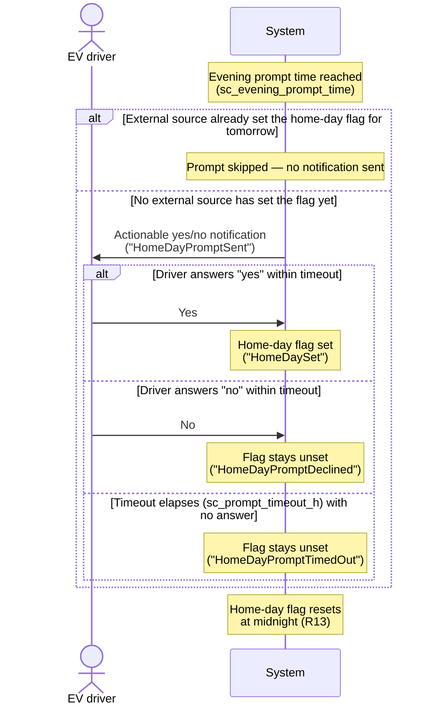

# UC08 — Plan tomorrow's home day (evening prompt)

**Primary actor:** EV driver

**Stakeholders & interests:**

- EV driver — wants a quick, low-effort way to tell the system the car will be home tomorrow, without having to configure an external calendar or presence source.
- Household energy manager — relies on an accurate [home-day flag](../system-overview.md#ubiquitous-language) each evening, since it is what lets `Auto` plan the solar-reserve cap (R9) for the next day; a flag left unset when it should be set means solar the next day cannot be reserved for, while a flag wrongly set means overnight charging is capped when it did not need to be.

**Scope / level:** sea-level (single EV-driver goal). This use-case is one of two ways the [home-day flag](../system-overview.md#ubiquitous-language) can be set — the other being an external source such as a calendar or presence sensor (R9, R13) — and it defers to that external source when it has already acted. It only ever sets the flag; it never itself decides the solar-reserve cap or evaluates the solar forecast — that coordination is [UC07](UC07-reserve-capacity-for-tomorrow.md)'s job.

## Preconditions

- The evening prompt is enabled (`sc_evening_prompt_enabled` is on).
- No external source has already set the [home-day flag](../system-overview.md#ubiquitous-language) for tomorrow.

## Trigger

The configured evening prompt time is reached (`sc_evening_prompt_time`, default 18:00).

## Main success scenario

1. **Given** the evening prompt is enabled and no external source has already set the home-day flag for tomorrow.
2. **When** the configured evening prompt time is reached, **then** the System sends the EV driver an actionable yes/no notification asking whether the car will be home tomorrow.
3. **And** the EV driver answers "yes" within the configured timeout (`sc_prompt_timeout_h`, default 2 hours).
4. **Then** the System sets the home-day flag for tomorrow.

## Alternate flows

**3a — Driver answers "no"** — branches from step 3.
Given the notification from step 2 is pending
When the EV driver answers "no" within the timeout
Then the System leaves the home-day flag unset for tomorrow.

## Exception flows

**No answer within the timeout.**
Given the notification from step 2 is pending
When the configured timeout (`sc_prompt_timeout_h`) elapses with no answer
Then the System treats the lack of an answer as "no" and leaves the home-day flag unset for tomorrow.

**External source already set the flag.**
Given an external source has already set the home-day flag for tomorrow before the configured prompt time is reached
When the configured prompt time is reached
Then the System skips this use-case entirely for the evening — no notification is sent, and the externally-set flag is left as is (not overridden).

## Postconditions

- The home-day flag reflects the EV driver's answer: set if "yes" was given within the timeout, unset if "no" was given, the timeout elapsed with no answer, or the prompt was skipped because an external source had already set it.
- The home-day flag resets to unset each day at midnight (R13), independently of this use-case, so the prompt starts fresh every evening.
- Setting the flag has no further effect within this use-case — whether and how the flag changes overnight charging is entirely [UC07](UC07-reserve-capacity-for-tomorrow.md)'s concern (R9).

## State model

The prompt lifecycle for a single evening, re-armed at midnight when the home-day flag resets (R13):

- **Not sent** — the prompt time has not yet been reached for this evening, or the prompt was skipped because an external source had already set the flag.
- **Pending** — the notification has been sent and the System is waiting for an answer, up to the configured timeout.
- **Answered-yes** — the EV driver answered "yes" within the timeout; the home-day flag is set for tomorrow.
- **Answered-no** — the EV driver answered "no" within the timeout; the home-day flag stays unset.
- **Timed-out** — the timeout elapsed with no answer; treated the same as answered-no (flag stays unset).

Answered-yes, answered-no, and timed-out are all terminal for the evening; the cycle returns to Not sent only when the home-day flag resets at midnight and the next evening's prompt time is reached.

## Domain events produced

- `HomeDayPromptSent` — the notification was sent to the EV driver (Not sent → Pending).
- `HomeDaySet` — the EV driver answered "yes" within the timeout; the home-day flag is now set for tomorrow (Pending → Answered-yes).
- `HomeDayPromptDeclined` — the EV driver answered "no" within the timeout; the home-day flag stays unset (Pending → Answered-no).
- `HomeDayPromptTimedOut` — the timeout elapsed with no answer; the home-day flag stays unset (Pending → Timed-out).

## Diagram

## Requirements satisfied

- **R13** — Home-day evening prompt: sending the actionable yes/no notification at the configured time when enabled; skipping the prompt when an external source has already set the flag; setting the flag on "yes"; treating no answer within the timeout as "no"; the flag resetting each day at midnight.

Inherited from the shared mechanism (referenced, not restated): the home-day flag's role in the solar-reserve cap (R9, [UC07](UC07-reserve-capacity-for-tomorrow.md)) and in the departure home-day override (R14, `resolution-rules.md`).

## Relationships

- **Sets the home-day flag UC07 consumes.** [UC07](UC07-reserve-capacity-for-tomorrow.md) reads the home-day flag this use-case sets (or leaves unset) to decide, alongside the next-day solar forecast, whether to apply the solar-reserve cap (R9) — this use-case has no visibility into that decision and does not itself evaluate the forecast.
- **One of two flag sources, and the deferential one (R9).** The home-day flag can also be set by an external source such as a calendar or presence sensor (`home_day_external`, `entity-catalog.md`). When that external source has already set the flag for tomorrow, this use-case skips its prompt entirely for the evening rather than asking redundantly or overriding the external value.
- Also feeds the departure home-day override (R14, `resolution-rules.md`), which reads the same flag to decide whether a home day's departure-time override applies — a downstream consumer of the flag, not something this use-case coordinates directly.
