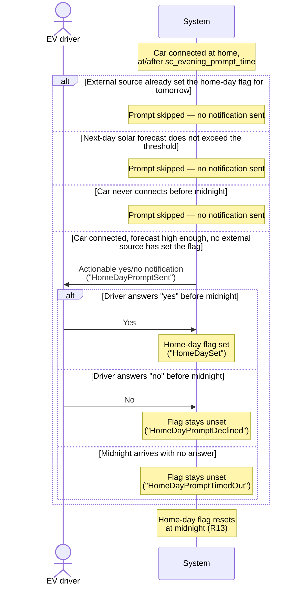

# UC08 — Plan tomorrow's home day (evening prompt)

**Primary actor:** EV driver

**Stakeholders & interests:**

- EV driver — wants a quick, low-effort way to tell the system the car will be home tomorrow, without having to configure an external calendar or presence source, and without being asked when the answer would not matter (e.g. the car is away, or tomorrow's forecast is too low to reserve for).
- Household energy manager — relies on an accurate [home-day flag](../system-overview.md#ubiquitous-language) each evening, since it is what lets `Auto` plan the solar-reserve cap (R9) for the next day; a flag left unset when it should be set means solar the next day cannot be reserved for, while a flag wrongly set means overnight charging is capped when it did not need to be.

**Scope / level:** sea-level (single EV-driver goal). This use-case is one mechanism that can satisfy R13's home-day indication — the other being an external source such as a calendar or presence sensor — and it defers to that external source when it has already acted. It reads the next-day solar-forecast yield and threshold (R9) only to decide whether asking would matter; it never itself decides the solar-reserve cap — that coordination remains [UC07](UC07-reserve-capacity-for-tomorrow.md)'s job, evaluated independently and possibly against an updated forecast reading.

## Preconditions

- The evening prompt is enabled (`sc_evening_prompt_enabled` is on).
- The next-day solar-forecast yield (`solar_forecast`) exceeds the configured threshold (`sc_solar_forecast_threshold_kwh`, default 12 kWh) — the same threshold R9's solar-reserve cap uses. This gate is scoped to R9 only: it does not check R9's other preconditions (`Auto` active, no departure deadline resolved for tomorrow), and it does not consider R14's home-day departure override, which also depends on this flag. A home day with a low forecast is expected to be indicated through an external source (R13) instead; if none is configured, R14's home-day override simply does not apply that day, and the day-of-week default departure time is used.
- No external source has already set the [home-day flag](../system-overview.md#ubiquitous-language) for tomorrow.

## Trigger

Each evening, the car is connected at home (`charger_status` is `connected` or `charging`) at or after the configured evening prompt time (`sc_evening_prompt_time`, default 18:00) — either because it was already connected when that time arrived, or because it connects afterward, provided this happens before midnight.

## Main success scenario

1. **Given** the evening prompt is enabled, the next-day solar forecast exceeds the threshold, and no external source has already set the home-day flag for tomorrow.
2. **When** the car is connected at home at or after the configured evening prompt time, and before midnight, **then** the System sends the EV driver an actionable yes/no notification asking whether the car will be home tomorrow.
3. **And** the EV driver answers "yes" before midnight.
4. **Then** the System sets the home-day flag for tomorrow.

## Alternate flows

**1a — External source already set the flag** — branches from step 1 (preconditions).
Given an external source has already set the home-day flag for tomorrow before the trigger condition is met
When the trigger condition would otherwise be met
Then the System skips this use-case entirely for the evening — no notification is sent, and the externally-set flag is left as is (not overridden). The goal (the flag being correctly resolved for tomorrow) is still met, just via the other source.

**1b — Forecast too low to matter** — branches from step 1 (preconditions).
Given the next-day solar-forecast yield does not exceed the configured threshold
When the trigger condition would otherwise be met
Then the System skips this use-case entirely for the evening — no notification is sent. R9's cap would not activate regardless of the driver's answer; the flag stays unset, which also means R14's home-day departure override does not apply that day (day-of-week default departure time is used instead) unless an external source has set the flag.

**1c — Car never connects before midnight** — branches from the Trigger (the other preconditions in step 1 hold, but the trigger condition never fires).
Given the evening prompt is enabled, the forecast exceeds the threshold, and no external source has set the flag
When the car has not connected at home by midnight
Then the System never sends the notification for that evening; the home-day flag remains whatever it already was (typically unset), the same outcome as if the driver had answered "no".

**3a — Driver answers "no"** — branches from step 3.
Given the notification from step 2 is pending
When the EV driver answers "no" before midnight
Then the System leaves the home-day flag unset for tomorrow.

## Exception flows

**No answer before midnight.**
Given the notification from step 2 is pending
When midnight arrives with no answer
Then the System treats the lack of an answer as "no" and leaves the home-day flag unset for tomorrow.

## Postconditions

- When this use-case's prompt runs (i.e. none of the skip conditions applied), the home-day flag reflects the EV driver's answer: set if "yes" was given before midnight, unset if "no" was given or midnight arrived with no answer.
- When the prompt is skipped — because an external source had already set the flag, the next-day forecast did not exceed the threshold, or the car never connected before midnight — the flag is left exactly as it already was: as the external source resolved it (R9), or unset if nothing else had set it.
- The home-day flag resets to unset each day at midnight (R13), independently of this use-case, so the prompt starts fresh every evening.
- Setting the flag has no further effect within this use-case — whether and how the flag changes overnight charging is entirely [UC07](UC07-reserve-capacity-for-tomorrow.md)'s concern (R9).

## State model

The prompt lifecycle for a single evening, re-armed at midnight when the home-day flag resets (R13):

- **Not sent** — the trigger condition (car connected, at or after prompt time) has not yet been reached for this evening; or the prompt was skipped because an external source had already set the flag, the next-day forecast did not exceed the threshold, or the car never connected before midnight.
- **Pending** — the notification has been sent and the System is waiting for an answer, up to midnight.
- **Answered-yes** — the EV driver answered "yes" before midnight; the home-day flag is set for tomorrow.
- **Answered-no** — the EV driver answered "no" before midnight; the home-day flag stays unset.
- **Timed-out** — midnight arrived with no answer; treated the same as answered-no (flag stays unset).

Not sent (whether never triggered, or skipped for any of the reasons above), answered-yes, answered-no, and timed-out are all terminal for the evening; the cycle returns to Not sent only when the home-day flag resets at midnight and the next evening's trigger condition is evaluated.

## Domain events produced

- `HomeDayPromptSent` — the notification was sent to the EV driver (Not sent → Pending).
- `HomeDaySet` — the EV driver answered "yes" before midnight; the home-day flag is now set for tomorrow (Pending → Answered-yes).
- `HomeDayPromptDeclined` — the EV driver answered "no" before midnight; the home-day flag stays unset (Pending → Answered-no).
- `HomeDayPromptTimedOut` — midnight arrived with no answer; the home-day flag stays unset (Pending → Timed-out).

## Diagram

## Requirements satisfied

- **R13** — Home-day indication: this use-case is one mechanism that satisfies R13 by offering an actionable yes/no evening prompt as a way to set the home-day flag; skipping when an external source has already acted, the forecast doesn't justify asking, or the car never connects before midnight; setting the flag on "yes"; treating no answer by midnight as "no"; the flag resetting each day at midnight.

Inherited from the shared mechanism (referenced, not restated): the home-day flag's role in the solar-reserve cap (R9, [UC07](UC07-reserve-capacity-for-tomorrow.md)) and in the departure home-day override (R14, `resolution-rules.md`). This use-case also reads R9's forecast sensor and threshold as its own precondition for whether to prompt at all — a separate read from UC07's, evaluated at a different time, so the two can observe different forecast values without being inconsistent.

## Relationships

- **Sets the home-day flag UC07 consumes.** [UC07](UC07-reserve-capacity-for-tomorrow.md) reads the home-day flag this use-case sets (or leaves unset) to decide, alongside the next-day solar forecast, whether to apply the solar-reserve cap (R9) — this use-case has no visibility into that decision.
- **One of several flag mechanisms, and the deferential one (R13).** The home-day flag can also be set by an external source such as a calendar or presence sensor (`home_day_external`, `entity-catalog.md`). When that external source has already set the flag for tomorrow, this use-case skips its prompt entirely for the evening rather than asking redundantly or overriding the external value.
- Also feeds the departure home-day override (R14, `resolution-rules.md`), which reads the same flag to decide whether a home day's departure-time override applies — a downstream consumer of the flag, not something this use-case coordinates directly. **This use-case's forecast gate (Precondition 2) is scoped to R9 alone and does not account for R14.** A home day with a low forecast is never prompted for by this mechanism, so R14's home-day override can only apply that day via an external source; without one, the day-of-week default departure time is used instead. This is a deliberate trade-off (fewer, more relevant prompts) rather than an oversight, but it means this use-case is not a complete substitute for an external home-day source when R14's override matters independently of R9.
- **Reads R9's forecast threshold independently of UC07.** This use-case gates its own prompt on the same forecast sensor and threshold R9's cap uses (so the driver is not asked when the cap could never activate), but it reads them at prompt time, not at the cap's own evaluation time — the two reads are independent and may disagree if the forecast changes overnight.
- **Midnight is the only answer deadline — no separate configurable timeout.** This use-case never lets a pending prompt survive past midnight (Main success scenario step 3, Exception flows) — there is no separate, configurable timeout duration to reason about, which also means a "yes" or "no" always lands on the same home day it was asked about. How R9's overnight solar-reserve window ("while the sun is down") relates to the flag's set-vs-reset moment at midnight remains `resolution-rules.md`'s concern, not this use-case's.
