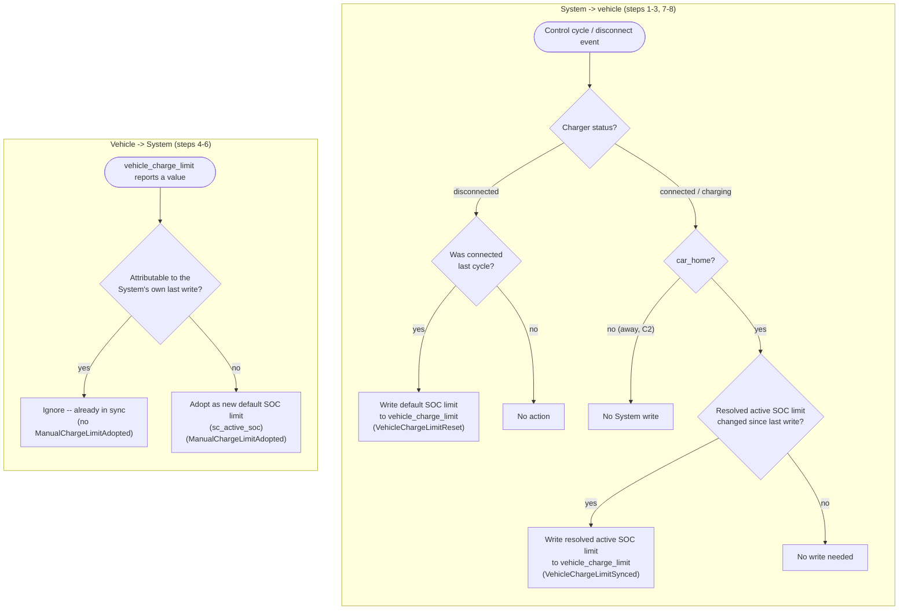

# UC09 — Keep the charge limit in sync with the car

**Primary actor:** EV driver

**Stakeholders & interests:**

- EV driver — wants the vehicle's own charge-limit setting to always reflect whichever active SOC limit the System currently has in force, so the car stops itself at the right point even independently of charger-current control; and wants a change made directly on the car or its app respected as their own intent, not silently overwritten on the next cycle.
- Household energy manager — relies on this sync so that a solar step-up ([UC06](UC06-store-abundant-solar.md)) or the solar-reserve cap ([UC07](UC07-reserve-capacity-for-tomorrow.md)) actually reaches the vehicle, not just the System's internal resolution.

**Scope / level:** sea-level (single goal: keep the vehicle's charge-limit setting synchronised with the System in both directions). This use-case does not resolve the [active SOC limit](../system-overview.md#ubiquitous-language) itself — that is `resolution-rules.md`'s Active SOC limit table, applied by [UC06](UC06-store-abundant-solar.md) and [UC07](UC07-reserve-capacity-for-tomorrow.md) — it only propagates whichever value that table currently resolves to, and, in the other direction, adopts a change the user makes directly on the vehicle. Not a mode use-case: it has no charger-current set-point rule of its own and does not carry a `stateDiagram-v2`.

## Preconditions

- The vehicle exposes a settable charge limit (the `vehicle_charge_limit` adapter role is mapped, R6, NF3). When it is not mapped, this use-case does not apply to that vehicle.
- For a System-initiated write: the car is connected ([charger status](../system-overview.md#ubiquitous-language) is `connected` or `charging`) and `car_home` indicates the car is at home — the latter is the condition C2 gates on.

## Trigger

Any of:

1. A [control cycle](../system-overview.md#ubiquitous-language) observes that the resolved [active SOC limit](../system-overview.md#ubiquitous-language) (`resolution-rules.md`) has changed value while the car is connected at home.
2. The vehicle's charge-limit setting, read through the `vehicle_charge_limit` adapter role, reports a value that is not attributable to the System's own last write to that role.
3. Charger status transitions to `disconnected`, from `connected` or `charging` — a transition that, for this single home charger, only ever happens while `car_home` is true, since the vehicle cannot be plugged into it remotely.

## Main success scenario

**System → vehicle: propagate the resolved active SOC limit**

1. **Given** the car is connected at home (charger status `connected` or `charging`, `car_home` true) and the vehicle exposes a settable charge limit.
2. **When** the resolved active SOC limit (`resolution-rules.md`, Active SOC limit table) changes value on a control cycle — for example a solar step-up ([UC06](UC06-store-abundant-solar.md)) raises it, or the solar-reserve cap ([UC07](UC07-reserve-capacity-for-tomorrow.md)) lowers it — **then** the System writes the new value to the vehicle through the `vehicle_charge_limit` adapter role within one control cycle.
3. **And** the vehicle's own charging behaviour stops it at the newly written state of charge, independently of the charger-current control that [UC01](UC01-charge-from-solar-surplus.md)–[UC05](UC05-guarantee-ready-by-departure.md) apply — an outcome of the write, not a further command issued by the System.

**Vehicle → System: adopt a manual change**

4. **Given** the car is connected at home and the vehicle's charge-limit setting changes.
5. **When** the reported change is not attributable to the System's own last write through `vehicle_charge_limit` (i.e. the user changed it directly in the car or its app, rather than the System's step 2 write reflecting back), **then** the System adopts the new value as the default SOC limit (`sc_active_soc`) rather than overwriting it back on the next cycle.
6. **And** subsequent active-SOC-limit resolution (`resolution-rules.md`) and future System-initiated writes (steps 1–3) use this newly adopted default until the user changes it again, on the vehicle or in the System. When a solar step-up or the solar-reserve cap is in force at the time of the manual change, the *resolved* active SOC limit — not the newly adopted default in isolation — is what the next System-initiated write (step 2) pushes back to the vehicle, since that write always propagates the current row of the Active SOC limit table (`resolution-rules.md`); the manual value is preserved unmodified only while the default itself is the resolved value.

**On disconnect: reset to the default**

7. **Given** the car is connected at home.
8. **When** charger status transitions to `disconnected`, **then** the System writes the default SOC limit (`sc_active_soc`, default 80%) to the vehicle through `vehicle_charge_limit` — mirroring the active-SOC-limit reset the disconnect already triggers (R7).

## Alternate flows

**2a — Away from home** — branches from step 2.
Given the car is connected (charger status `connected` or `charging`) but `car_home` indicates the car is away from home
When the resolved active SOC limit changes
Then the System does not write to the vehicle (C2); the currently resolved value is written the next time the car is confirmed both connected and at home (step 2 of the main flow).

**5a — Manual change made while away from home** — branches from step 5.
Given the vehicle's charge-limit setting changes while `car_home` indicates the car is away
When the change is not attributable to the System's own last write
Then the System still adopts it as the new default SOC limit — C2 restricts only System-initiated writes to the vehicle, not the System's ability to read and adopt a change the user made themselves, wherever the car is.

## Exception flows

**A System write reflects back before it can be distinguished from a manual change.**
Given the System has just written a value to the vehicle through `vehicle_charge_limit` (step 2)
When the vehicle reports that same value back on a subsequent read
Then the System recognises the reported value as attributable to its own last write and does not treat it as a manual change (step 5 does not fire), avoiding a feedback loop between the two directions of this use-case.

**The vehicle does not expose a settable charge limit.**
Given the `vehicle_charge_limit` adapter role is not mapped for the connected vehicle
When the resolved active SOC limit changes, or the vehicle would otherwise be disconnected
Then the System performs no write; the active SOC limit is still enforced only through charger-current control ([UC01](UC01-charge-from-solar-surplus.md)–[UC05](UC05-guarantee-ready-by-departure.md)), and the vehicle's own charge limit (if it has one) is left untouched.

## Postconditions

- While the car is connected at home, the vehicle's charge-limit setting always mirrors whichever active SOC limit is currently resolved (`resolution-rules.md`); a change to the resolved value is reflected on the vehicle within one control cycle.
- Charging stops when the car reaches the active SOC limit — a vehicle-side outcome of the write, not a behaviour this use-case itself commands (charger-current logic belongs to [UC01](UC01-charge-from-solar-surplus.md)–[UC05](UC05-guarantee-ready-by-departure.md)).
- On disconnect, the vehicle's charge limit has been reset to the default SOC limit (default 80%), mirroring the active-SOC-limit reset (R7).
- The vehicle's charge limit is never changed by the System while the car is away from home (C2).
- A change the user makes directly on the vehicle is adopted as the new default SOC limit rather than being overwritten by the System.

## Domain events produced

- `VehicleChargeLimitSynced` — the System wrote the resolved active SOC limit to the vehicle because it changed while the car was connected at home (main flow, step 2).
- `ManualChargeLimitAdopted` — the System adopted a vehicle-initiated charge-limit change as the new default SOC limit (main flow, step 5).
- `VehicleChargeLimitReset` — on disconnect, the System reset the vehicle's charge limit to the default SOC limit (main flow, step 8).

## Diagram

## Requirements satisfied

- **R6** — Configurable SOC limit (bidirectional sync while connected at home; reset to the default on disconnect; never changed while away, C2; a manual vehicle-side change adopted as the new default; charging stops at the active SOC limit as the vehicle's own outcome).

Inherited from the shared mechanism (referenced, not restated): the active-SOC-limit resolution table that this use-case propagates, and its own disconnect reset (R7, `resolution-rules.md`) — UC09 applies that reset to the vehicle's setting but does not itself decide the resolved value.

## Relationships

- **Realizes the write-side of whichever value [UC06](UC06-store-abundant-solar.md) or [UC07](UC07-reserve-capacity-for-tomorrow.md) resolve as the active SOC limit.** UC09 does not compute the active SOC limit — it propagates whichever value the Active SOC limit table in `resolution-rules.md` currently resolves to, and applies that same table's disconnect reset (R7) to the vehicle's own setting.
- Consumes the Active SOC limit table in `resolution-rules.md` for both the value it writes to the vehicle and the default it resets to on disconnect.
- Distinct from [UC01](UC01-charge-from-solar-surplus.md)–[UC05](UC05-guarantee-ready-by-departure.md): those use-cases stop charging by controlling charger current when SOC reaches the active SOC limit; this use-case additionally makes the vehicle itself stop at that SOC, independently of charger-current control (R6).
