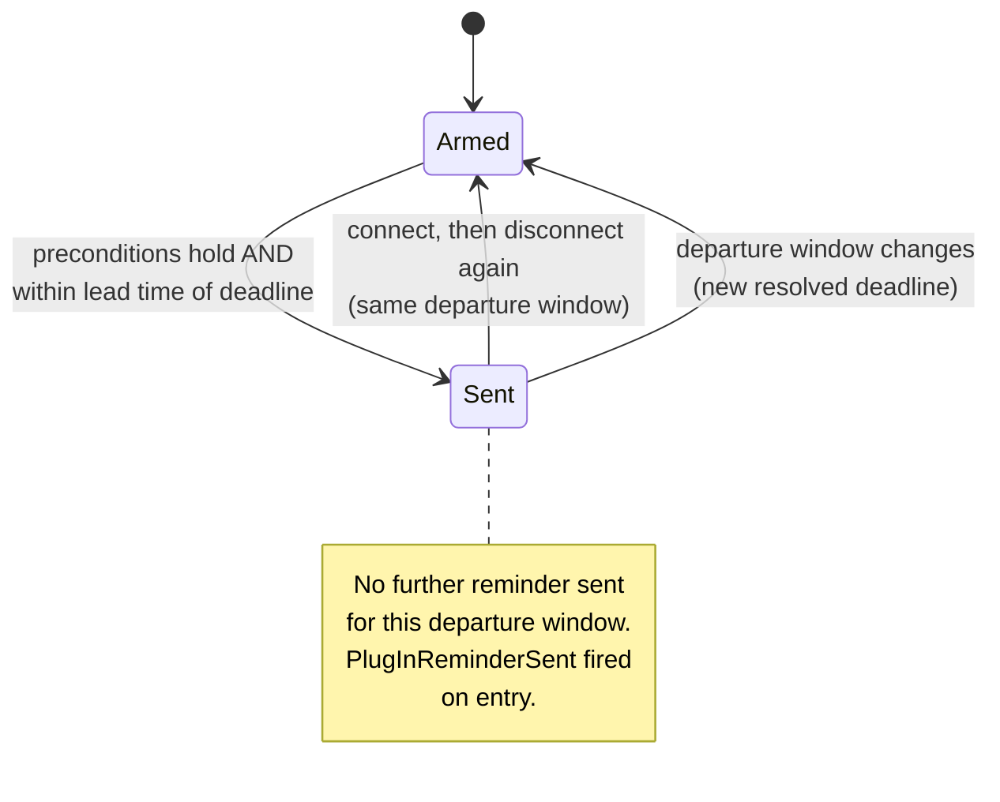

# UC10 — Remind me to plug in

**Primary actor:** EV driver

**Stakeholders & interests:**

- EV driver — wants a timely nudge to plug in whenever the car is left unplugged and would otherwise miss its active SOC limit by departure, but no repeated pestering for a departure the driver has already been warned about.
- Household energy manager — indirectly benefits: a plugged-in car is a car [UC01](UC01-charge-from-solar-surplus.md)–[UC05](UC05-guarantee-ready-by-departure.md) can actually charge, so this reminder protects the deadline guarantee (R5) without this use-case doing any charging itself.

**Scope / level:** sea-level (single EV-driver goal): notify, don't charge. This use-case never sets the active mode or the charger current — it only observes [charger status](../system-overview.md#ubiquitous-language), state of charge, and the resolved [departure deadline](../system-overview.md#ubiquitous-language) (R14), and sends a notification. Whichever charging use-case ends up running once the car is plugged in (UC01–UC05) is entirely independent of this one.

## Preconditions

- The car is home (`car_home`).
- [Charger status](../system-overview.md#ubiquitous-language) is `disconnected`.
- State of charge is below the [active SOC limit](../system-overview.md#ubiquitous-language) (resolved per `resolution-rules.md`, R7).
- A [departure deadline](../system-overview.md#ubiquitous-language) is resolved for today — not "no deadline" (`resolution-rules.md`, R14).

## Trigger

The current time enters the configurable lead time (`input_number.sc_reminder_lead_h`, default 8 hours) before today's resolved departure deadline (R14), while every precondition above still holds — evaluated every control cycle.

## Main success scenario

1. **Given** the car is home, disconnected, below the active SOC limit, and a departure deadline is resolved for today.
2. **When** the current time comes within the configured lead time of that deadline, **then** the System sends a single notification asking the driver to plug in.
3. **And** no further reminder is sent for the same [departure window](../system-overview.md#ubiquitous-language) unless the charger is connected and then disconnected again (a connect/disconnect cycle re-arms the reminder).

## Alternate flows

**3a — Connect/disconnect cycle re-arms the reminder** — branches from step 3.
Given a reminder has already been sent for the current departure window
When charger status transitions from `disconnected` to `connected` and then back to `disconnected`
Then the System is ready to send a reminder again for that same window, subject to every precondition and the trigger still holding.

## Exception flows

**Car already connected.**
Given the car is home and within the lead time of the departure deadline
When charger status is `connected` or `charging`
Then the System sends no reminder — the unmet-need condition does not hold.

**State of charge already at or above the active SOC limit.**
Given the car is home, disconnected, and within the lead time of the departure deadline
When state of charge is at or above the active SOC limit
Then the System sends no reminder — the unmet-need condition does not hold.

**No departure deadline resolved for today.**
Given the car is home, disconnected, and below the active SOC limit
When today's resolved departure deadline is "no deadline" (R14)
Then the System sends no reminder — there is no departure to be ready for.

## Postconditions

- The driver has been notified in time to plug in and let whichever charging use-case is active (UC01–UC05) reach the active SOC limit by the resolved departure deadline.
- No further reminder is sent for the same departure window unless the charger has since gone through a connect/disconnect cycle.
- No reminder is ever sent while the car is connected or already at or above the active SOC limit — the reminder tracks only the genuinely unmet need.

## State model

A light state model tracks only whether a reminder has already fired for the current departure window, so the System does not repeat itself every control cycle while the unmet-need condition continues to hold. The two states below describe this de-dup behaviour; the `stateDiagram-v2` is authoritative for the state set and its transitions.

- **Armed** — no reminder has been sent for the current departure window; each control cycle, the System evaluates the preconditions and trigger and sends a reminder the moment they are all met.
- **Sent** — a reminder has been sent for the current departure window; the System sends no further reminder while in this state, even though the preconditions may continue to hold every cycle.

Transitions:

- Armed → Sent: the preconditions hold and the current time enters the lead time of the departure deadline (the trigger fires).
- Sent → Armed: charger status transitions from `disconnected` to `connected` and back to `disconnected` again (a connect/disconnect cycle), re-arming the reminder for the same departure window.
- Sent → Armed (implicit reset): the resolved departure deadline changes to a new departure window (e.g. the next calendar day), which starts the de-dup tracking over for that new window.

This state is scoped to the EV driver's plug-in decision only; it is unrelated to any charging use-case's own state (UC01–UC05), which starts fresh once the car is actually plugged in.

## Domain events produced

- `PlugInReminderSent` — the System sent the plug-in reminder (Armed → Sent).
- `PlugInReminderRearmed` — a connect/disconnect cycle (or a new departure window) reset the reminder so it can fire again (Sent → Armed).

## Diagram

## Requirements satisfied

- **R12** — Plug-in reminder notification (all three acceptance criteria: the single notification within the configured lead time; the connect/disconnect de-dup rule; and no reminder while already connected or already at/above the active SOC limit).

Inherited from the shared mechanism (referenced, not restated): the departure-deadline resolution (R14, `resolution-rules.md`), the active-SOC-limit resolution (R7, `resolution-rules.md`), and `charger status`'s canonical values (`system-overview.md`).

## Relationships

- **Independent of which charging use-case ends up running.** This use-case only ever notifies; it never sets the active mode or the charger current. Once the driver plugs in, whichever of UC01–UC05 the active profile and conditions select does the actual charging — this use-case has no opinion on which.
- Consumes the departure-deadline resolution rule (R14) shared with [UC05](UC05-guarantee-ready-by-departure.md) — both read the same resolved deadline, `resolution-rules.md`, but for different purposes (UC05 escalates charging; UC10 notifies the driver before the car is even plugged in).
- Consumes the active-SOC-limit resolution rule (R7, `resolution-rules.md`) to determine whether the unmet-need condition holds.
