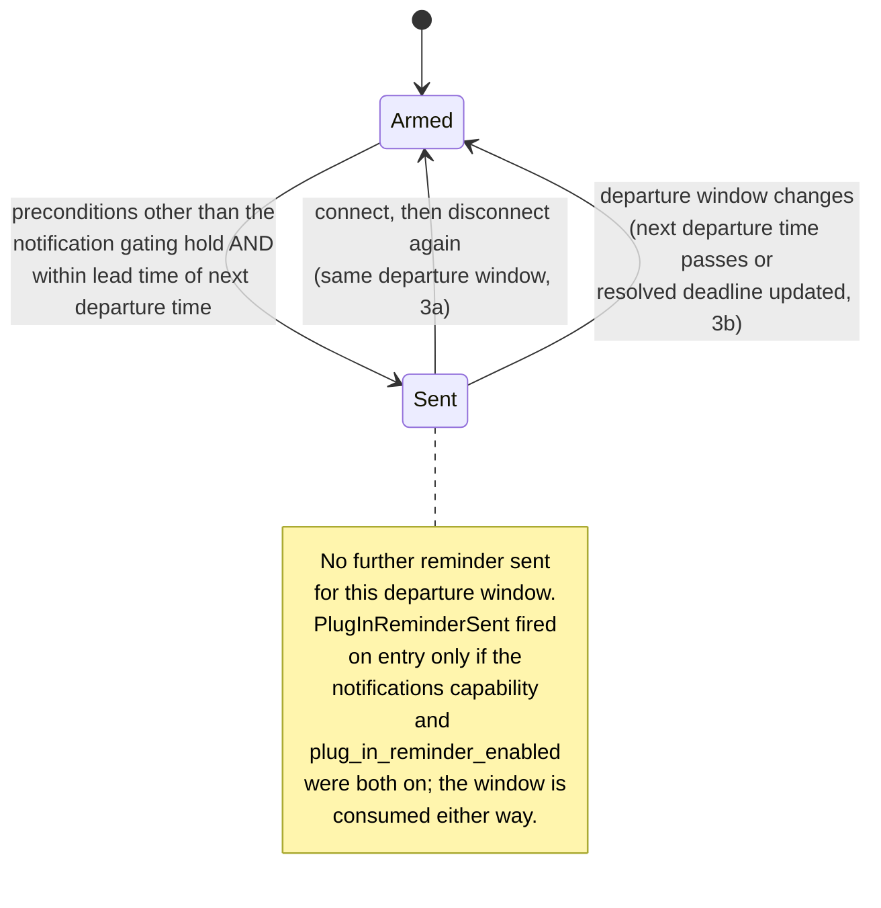

# UC10 — Remind me to plug in

**Primary actor:** EV driver

**Stakeholders & interests:**

- EV driver — wants a timely nudge to plug in whenever the car is left unplugged and would otherwise miss its active SOC limit by departure, but no repeated pestering for a departure the driver has already been warned about.
- Household energy manager — indirectly benefits: a plugged-in car is a car [UC01](UC01-charge-from-solar-surplus.md)–[UC05](UC05-guarantee-ready-by-departure.md) can actually charge, so this reminder protects the deadline guarantee (R5) without this use-case doing any charging itself.

**Scope / level:** sea-level (single EV-driver goal): notify, don't charge. This use-case never sets the active mode or the charger current — it only observes whether the car is home, [charger status](../system-overview.md#ubiquitous-language), state of charge against the [active SOC limit](../system-overview.md#ubiquitous-language), and the next [departure deadline](../system-overview.md#ubiquitous-language) (R14), and sends a notification. Whichever charging use-case ends up running once the car is plugged in (UC01–UC05) is entirely independent of this one.

## Preconditions

- The car is home (`car_home`).
- [Charger status](../system-overview.md#ubiquitous-language) is `disconnected`.
- State of charge is below the [active SOC limit](../system-overview.md#ubiquitous-language) (resolved per `resolution-rules.md`, R7).
- The [deadline capability](../system-overview.md#ubiquitous-language) is present (R18). When it is absent no departure time is ever resolved, so this use-case never applies at all.
- The [notifications capability](../system-overview.md#ubiquitous-language) is present **and** the plug-in reminder's own [per-notification enable toggle](../system-overview.md#ubiquitous-language) (`plug_in_reminder_enabled`, default on) is on (R12, R18). The two gates are conjunctive, per the glossary term: with either one off, no reminder is delivered.
- This notification gating governs delivery only. The reminder-due condition itself is still evaluated every control cycle, and the departure window is still consumed, while either gate is off (see the suppression exception flow below).
- The next departure time is resolved to an actual deadline, not "no deadline" (`resolution-rules.md`'s Departure deadline rule, R14 — which may fall on a later day than today, e.g. an evening reminder ahead of tomorrow's departure).

## Trigger

The current time enters the configurable lead time (`reminder_lead_h`, default 8 hours) before the next departure time (R14), while every precondition above other than the notification gating still holds — evaluated every control cycle.
The notification gating decides only whether the triggered reminder is delivered; it never holds the trigger back.

## Main success scenario

1. **Given** the car is home, disconnected, below the active SOC limit, the next departure time is resolved to an actual deadline, and both the notifications capability and the plug-in reminder's own enable toggle are on (R12, R18).
2. **When** the current time comes within the configured lead time of that departure time, **then** the System sends a single notification asking the driver to plug in.
3. **And** no further reminder is sent for the same [departure window](../system-overview.md#ubiquitous-language) unless the charger is connected and then disconnected again (a connect/disconnect cycle re-arms the reminder).

## Alternate flows

**3a — Connect/disconnect cycle re-arms the reminder** — branches from step 3.
Given a reminder has already been sent for the current departure window
When charger status transitions from `disconnected` to `connected` and then back to `disconnected`
Then the System is ready to send a reminder again for that same window, subject to every precondition and the trigger still holding.

**3b — Next departure time changes** — branches from step 3.
Given a reminder has already been sent for the current departure window
When the next departure time passes (so a later day's resolved deadline becomes the next one) or the resolved deadline is otherwise updated (e.g. an external departure-time sensor changing)
Then the System is ready to send a reminder again for that new departure window, subject to every precondition and the trigger still holding — independently of whether a connect/disconnect cycle (3a) also occurred.

## Exception flows

**Car already connected.**
Given the car is home and within the lead time of the next departure time
When charger status is `connected` or `charging`
Then the System sends no reminder — the car is already in the state this reminder exists to prevent.

**State of charge already at or above the active SOC limit.**
Given the car is home, disconnected, and within the lead time of the next departure time
When state of charge is at or above the active SOC limit
Then the System sends no reminder — there is nothing left for the driver to plug in for.

**Plug-in reminder suppressed by its notification gating.**
Given every precondition other than the notification gating holds — the car is home, disconnected, below the active SOC limit, and within the lead time of the next departure time
When either layer of the conjunctive gating is off — the worked example being the plug-in reminder's [per-notification enable toggle](../system-overview.md#ubiquitous-language) (`plug_in_reminder_enabled`) off even though the notifications capability is present and a notification target is mapped; the notifications capability being absent suppresses delivery identically (R18)
Then the System sends no reminder — the driver's goal is not met by this use-case, by the household's own configuration.
And the System still evaluates the reminder-due condition every control cycle and still exposes it as a readout (`binary_sensor.smart_charging_plug_in_reminder`), so the fact that a reminder is due remains observable while delivery is suppressed.
And the once-per-departure-window rule still runs: the departure window is consumed exactly as if the reminder had been delivered, so re-enabling the suppressed gate part-way through that window releases no reminder for it. The next reminder the driver can receive is the one for a re-armed window (3a or 3b).

**No upcoming departure deadline.**
Given the car is home, disconnected, and below the active SOC limit
When the next departure time resolves to "no deadline" for both dates the resolution rule considers — today's still-future occurrence and tomorrow's (`resolution-rules.md`, R14)
Then the System sends no reminder — there is no departure to be ready for.

## Postconditions

- The driver has been notified in time to plug in and let whichever charging use-case is active (UC01–UC05) reach the active SOC limit by the next departure time.
- No further reminder is sent for the same departure window unless the charger has since gone through a connect/disconnect cycle, or the departure window itself has changed (3b).
- No reminder is ever sent while the car is connected or already at or above the active SOC limit — the reminder tracks only the case where the driver still needs to act.
- No reminder is ever delivered while the notifications capability is absent or the plug-in reminder's own enable toggle is off, and no reminder suppressed that way is ever released later for the same departure window.
- The reminder-due readout (`binary_sensor.smart_charging_plug_in_reminder`) is on whenever a reminder is due — on the main success scenario as well as while delivery is suppressed — so the driver can see the due condition independently of whether a notification was sent.

## State model

A light state model tracks only whether a reminder has already fired for the current departure window, so the System does not repeat itself every control cycle while the preconditions continue to hold. The two states below describe this de-dup behaviour; the `stateDiagram-v2` is authoritative for the state set and its transitions.

- **Armed** — no reminder has been sent for the current departure window; each control cycle, the System evaluates the preconditions and trigger and sends a reminder the moment they are all met.
- **Sent** — the current departure window's one reminder has been used up; the System sends no further reminder while in this state, even though the preconditions may continue to hold every cycle. The window is consumed whether the reminder was actually delivered or was suppressed by either layer of the notification gating being off — which is why re-enabling the suppressed gate mid-window releases nothing.

Transitions:

- Armed → Sent: the preconditions other than the notification gating hold and the current time enters the lead time of the next departure time (the trigger fires). The System delivers the reminder only if the notifications capability is present and the enable toggle is on; either gate being off suppresses delivery but does not hold the state in Armed.
- Sent → Armed (3a): charger status transitions from `disconnected` to `connected` and back to `disconnected` again (a connect/disconnect cycle), re-arming the reminder for the same departure window.
- Sent → Armed (3b): the departure window changes — the next departure time passes and a later day's resolved deadline becomes the next one, or the resolved deadline is otherwise updated — re-arming the reminder for the new window.

This state is scoped to the EV driver's plug-in decision only; it is unrelated to any charging use-case's own state (UC01–UC05), which starts fresh once the car is actually plugged in.

## Domain events produced

- `PlugInReminderSent` — the System sent the plug-in reminder (Armed → Sent). Not produced when the transition happens with delivery suppressed by the enable toggle or an absent notifications capability, since nothing was sent.
- `PlugInReminderRearmed` — a connect/disconnect cycle (or a new departure window) reset the reminder so it can fire again (Sent → Armed).

## Diagram

```mermaid
stateDiagram-v2
    [*] --> Armed
    Armed --> Sent: preconditions other than the<br/>notification gating hold AND<br/>within lead time of next departure time
    Sent --> Armed: connect, then disconnect again<br/>(same departure window, 3a)
    Sent --> Armed: departure window changes<br/>(next departure time passes or<br/>resolved deadline updated, 3b)
    note right of Sent
        No further reminder sent
        for this departure window.
        PlugInReminderSent fired
        on entry only if the
        notifications capability
        and plug_in_reminder_enabled
        were both on; the window is
        consumed either way.
    end note
```

## Requirements satisfied

- **R12** — Plug-in reminder notification, all four acceptance criteria:
  - AC1 — the single notification within the configured lead time of the next departure time.
  - AC2 — delivery gated conjunctively on the notifications capability and the reminder's own enable toggle, with the reminder-due readout and the once-per-window rule still running while the toggle is off.
  - AC3 — the connect/disconnect de-dup rule for the same departure window.
  - AC4 — no reminder while already connected or already at/above the active SOC limit.

Inherited from the shared mechanism (referenced, not restated): the deadline-capability gate on this use-case as a whole (R18); the two-layer conjunctive notification gating and the per-notification enable toggles' defaults (R18 AC11, `system-overview.md`); the departure-deadline resolution and its next-departure-time note (R14, `resolution-rules.md`), the active-SOC-limit resolution (R7, `resolution-rules.md`), and `charger status`'s canonical values (`system-overview.md`).

## Relationships

- **Independent of which charging use-case ends up running.** This use-case only ever notifies; it never sets the active mode or the charger current. Once the driver plugs in, whichever of UC01–UC05 the active profile and conditions select does the actual charging — this use-case has no opinion on which.
- Consumes the departure-deadline resolution rule (R14) shared with [UC05](UC05-guarantee-ready-by-departure.md) — both read the same resolved deadline, `resolution-rules.md`, but for different purposes (UC05 escalates charging; UC10 notifies the driver before the car is even plugged in).
- Consumes the active-SOC-limit resolution rule (R7, `resolution-rules.md`) to determine whether state of charge is still below the limit.
