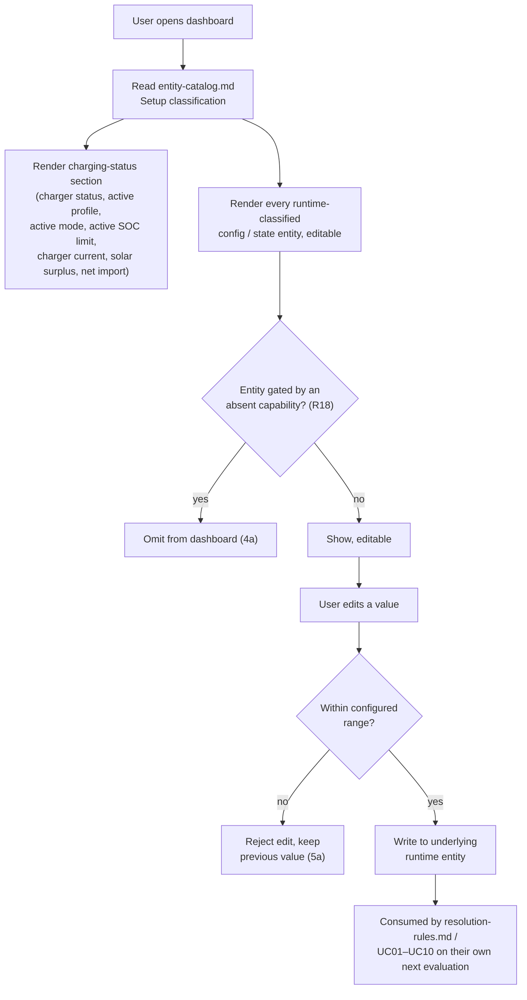

# UC11 — Monitor and manage charging configuration

**Primary actor:** Household energy manager (secondary: EV driver)

**Stakeholders & interests:**

- Household energy manager — wants one place to see whether charging is currently drawing from
  solar or the grid and to adjust the settings the household changes routinely (active profile,
  active mode, default SOC limit, departure times, home-day flag), without hunting through the
  integration's install-time configuration flow.
- EV driver — wants to see charger status and the active SOC limit at a glance, and to be able to
  change the active mode or a departure time directly, without depending on the energy manager.
- System maintainer — wants the dashboard to stay correct as the system evolves: adding a new
  runtime entity to `entity-catalog.md` should make it appear without any dashboard-specific code
  change (R19).

**Scope / level:** sea-level (single user goal): observe and adjust — this use-case never decides
*what* the charging behaviour should be. It only surfaces state that other use-cases already
compute (charger status, active SOC limit, solar surplus, net import) and forwards an edit to the
same [runtime configuration](../system-overview.md#ubiquitous-language) entity a user could set
directly (e.g. `select.smart_charging_mode`); whichever use-case reacts to that entity changing
(UC01–UC10, `resolution-rules.md`) is unaffected by whether the edit came from this dashboard or
from elsewhere. Cross-cutting: it spans every configuration area in `entity-catalog.md`, not one
mode.

## Preconditions

- The integration is installed and its install-time configuration (adapter role mappings, hardware
  parameters) is complete — the dashboard only ever presents [runtime
  configuration](../system-overview.md#ubiquitous-language), never install-time setup (R19).
- The household energy manager or EV driver has access to the Home Assistant UI the dashboard is
  rendered in.

## Trigger

The user opens the runtime dashboard, or changes one of the values shown on it. Unlike the other
use-cases, there is no coordinator-cycle trigger here — this use-case is actor-driven, evaluated
whenever a human looks at or edits the dashboard.

## Main success scenario

1. **Given** the integration is installed and configured.
2. **When** the household energy manager or EV driver opens the runtime dashboard, **then** the
   System displays the current charging status: [charger status](../system-overview.md#ubiquitous-language),
   active profile, active mode, [active SOC limit](../system-overview.md#ubiquitous-language), and
   current charger current.
3. **And** the System displays the current [solar surplus](../system-overview.md#ubiquitous-language)
   and [net import](../system-overview.md#ubiquitous-language), so the household can see whether
   charging is currently drawing from solar or from the grid.
4. **And** the System displays every entity `entity-catalog.md` classifies as [runtime
   configuration](../system-overview.md#ubiquitous-language) (every `config`-role row marked
   runtime, and every `state`-role row the user sets directly, e.g. the active mode selector or the
   home-day flag), each shown and editable in place.
5. **When** the user changes one of the runtime values shown on the dashboard (e.g. the default SOC
   limit, a departure time, the active mode, the home-day flag),
   **then** the System writes the change to the same underlying entity a direct edit would use, and
   whichever use-case or resolution rule reads that entity (`resolution-rules.md`; UC01–UC10) picks
   up the new value within its own next evaluation — this use-case does not itself change charging
   behaviour.

## Alternate flows

**4a — Solar capability absent** — branches from step 4.
Given the solar capability (`sc_solar_available`) is off (R18)
When the System renders the runtime configuration section
Then every solar-dependent runtime entity (e.g. the solar-reserve cap default) is omitted, exactly
as `Solar`/`SolarOnly` are omitted from the active-mode selector under R18 — the dashboard never
shows a runtime control for a behaviour the installation cannot exercise.

**5a — Edited value is out of its configured range** — branches from step 5.
Given the user attempts to set a runtime value outside its configured minimum/maximum (e.g. a
default SOC limit below 50%)
When the System validates the edit
Then the System rejects the edit and the underlying entity keeps its previous value, the same
validation the entity itself enforces however it is edited.

## Exception flows

**An adapter-role reading is unavailable.**
Given one of the values shown in the charging-status section is sourced from an adapter role whose
upstream entity is currently unavailable (e.g. the charger's power sensor)
When the System renders the dashboard
Then the System shows that value as unavailable rather than a stale or fabricated number, and
every other section of the dashboard continues to render normally.

## Postconditions

- Every entity `entity-catalog.md` classifies as runtime configuration is both visible and settable
  from the dashboard; no entity classified as install-time configuration is presented on it —
  install-time configuration remains reachable only through the integration's configuration flow
  (R19).
- The current charging status (charger status, active profile, active mode, active SOC limit,
  current charger current) and the current solar surplus and net import are visible on the
  dashboard whenever it is open.
- A runtime edit made on the dashboard has exactly the same effect as the same edit made directly
  on the underlying entity — this use-case adds no behaviour of its own beyond presenting and
  forwarding.
- Adding a new entity to `entity-catalog.md` and classifying it as runtime makes it appear on the
  dashboard without a dashboard-specific logic change (R19) — the dashboard renders from the
  catalog's classification, not from a hand-maintained list.

## Domain events produced

None. This use-case does not itself decide or change charging behaviour — a runtime edit writes
the same underlying entity a direct edit would, so any domain event that follows (e.g.
`ActiveModeChanged` under `resolution-rules.md`) is produced by whichever use-case or resolution
rule reacts to that entity, not by this one.

## Diagram

## Requirements satisfied

- **R19** — Runtime dashboard (all five acceptance criteria: charging-status display; solar
  surplus/net import display; every runtime entity visible and settable; no install-time entity
  shown; new runtime entities require no dashboard-specific logic change).

Inherited from the shared mechanism (referenced, not restated): the [install-time / runtime
configuration](../system-overview.md#ubiquitous-language) classification and the `Setup` column in
`entity-catalog.md`; the active-SOC-limit resolution (R7) and departure-deadline resolution (R14)
that a runtime edit here ultimately feeds; the solar-capability gating of runtime entities (R18).

## Relationships

- **«include» `entity-catalog.md`'s `Setup` classification.** This use-case does not maintain its
  own list of which entities are runtime — it renders directly from the catalog's classification,
  which is what keeps R19's extensibility criterion true.
- **Downstream of every other use-case for display, upstream of none for behaviour.** The
  charging-status values it shows (charger status, active SOC limit, current charger current) are
  computed by `control-cycle.md` and `resolution-rules.md`; a runtime edit it forwards is consumed
  by whichever of UC01–UC10 or `resolution-rules.md` reads that entity. This use-case neither
  computes charging behaviour nor overrides it.
- Gated by the solar capability (R18) for solar-dependent runtime entities, the same gating
  `select.smart_charging_mode`'s selector already applies (`entity-catalog.md`).
