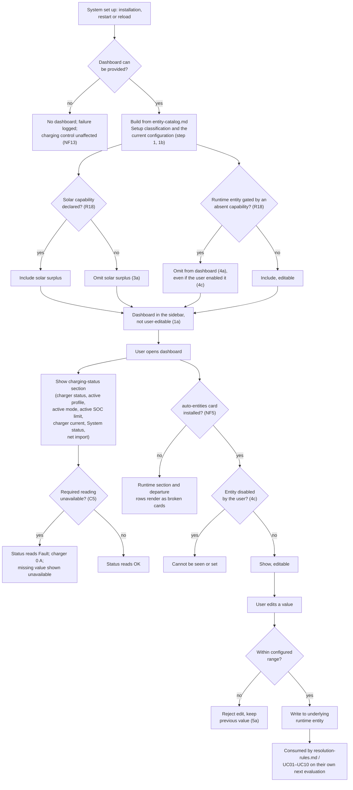

# UC11 — Monitor and manage charging configuration

**Primary actor:** Household energy manager (secondary: EV driver)

**Stakeholders & interests:**

- Household energy manager — wants one place to see whether charging is currently drawing from
  solar or the grid and to adjust the settings the household changes routinely (active profile,
  active mode, default SOC limit, departure times, home-day flag), without hunting through the
  integration's install-time configuration flow.
- EV driver — wants to see charger status and the active SOC limit at a glance, and to be able to
  change the active mode or a departure time directly, without depending on the energy manager.
- System maintainer — wants the dashboard to stay correct as the system evolves: adding a new
  runtime entity to `entity-catalog.md` should make it appear without any dashboard-specific code
  change (R19).

**Scope / level:** sea-level (single user goal): observe and adjust — this use-case never decides
*what* the charging behaviour should be. It only surfaces state that other use-cases already
compute (charger status, active SOC limit, solar surplus, net import) and forwards an edit to the
same [runtime configuration](../system-overview.md#ubiquitous-language) entity a user could set
directly (e.g. `select.smart_charging_mode`); whichever use-case reacts to that entity changing
(UC01–UC10, `resolution-rules.md`) is unaffected by whether the edit came from this dashboard or
from elsewhere. Cross-cutting: it spans every configuration area in `entity-catalog.md`, not one
mode.

## Preconditions

- The integration is installed and its install-time configuration (adapter role mappings, hardware
  parameters) is complete — the dashboard only ever presents [runtime
  configuration](../system-overview.md#ubiquitous-language), never install-time setup (R19).
- The household energy manager or EV driver has access to the Home Assistant UI the dashboard is
  rendered in.

## Trigger

The System is set up — at installation, and again on every
[restart and reload](../system-overview.md#ubiquitous-language) — which provides the dashboard
(step 1); after that, the user opens the runtime dashboard, or changes one of the values shown on
it. Unlike the other use-cases, there is no coordinator-cycle trigger here — past setup, this
use-case is actor-driven, evaluated whenever a human looks at or edits the dashboard.

## Main success scenario

1. **Given** the integration is installed and configured, **when** the System is set up — at
   installation, and again on every [restart and reload](../system-overview.md#ubiquitous-language)
   — **then** the System provides the runtime dashboard, listed in Home Assistant's sidebar, built
   afresh from the installation's current configuration, with no step taken by the user to create
   or add it (R19).
2. **When** the household energy manager or EV driver opens the runtime dashboard, **then** the
   System displays the current charging status: [charger status](../system-overview.md#ubiquitous-language),
   active profile, active mode, [active SOC limit](../system-overview.md#ubiquitous-language),
   current charger current, and the System's status — `OK`, or `Fault` while the System is in
   [fault](../system-overview.md#ubiquitous-language) (C5).
3. **And** the System displays the current [net import](../system-overview.md#ubiquitous-language)
   and — while the solar capability is present (R18, 3a) — the current [solar
   surplus](../system-overview.md#ubiquitous-language), so the household can see whether
   charging is currently drawing from solar or from the grid.
4. **And** the System displays every entity `entity-catalog.md` classifies as [runtime
   configuration](../system-overview.md#ubiquitous-language) (every `config`-role row marked
   runtime, and every `state`-role row the user sets directly, e.g. the active mode selector or the
   home-day flag), each shown and editable in place.
5. **When** the user changes one of the runtime values shown on the dashboard (e.g. the default SOC
   limit, a departure time, the active mode, the home-day flag),
   **then** the System writes the change to the same underlying entity a direct edit would use, and
   whichever use-case or resolution rule reads that entity (`resolution-rules.md`; UC01–UC10) picks
   up the new value within its own next evaluation — this use-case does not itself change charging
   behaviour.

## Alternate flows

**1a — The user tries to edit the dashboard itself** — branches from step 1.
Given the runtime dashboard is shown
When the user tries to change its layout — move, add, remove or restyle a card
Then the System does not accept the change: the dashboard's content is the System's alone (R19).
A user who wants a different layout builds an ordinary dashboard of their own from the same
entities; this one stays as the System built it.

**1b — A change is saved through the configuration flow** — branches from step 1.
Given the runtime dashboard is shown
When the user saves a change through the [configuration
flow](../system-overview.md#ubiquitous-language) — a capability declaration or an adapter-role
mapping, for example — and the reload that saving causes has run
Then the System has rebuilt the dashboard from the changed configuration, and the next time it is
opened it shows that configuration: the solar surplus reading, the departure-time rows and the
active-mode selector's options each follow the capabilities now declared (3a, 4a, 4b) (R19).

**3a — The solar capability is absent** — branches from step 3.
Given the solar [capability](../system-overview.md#ubiquitous-language) (`solar_available`) is off
(R18)
When the System renders the charging-status section
Then the [solar surplus](../system-overview.md#ubiquitous-language) reading is omitted — an
installation without solar produces none — while [net import](../system-overview.md#ubiquitous-language)
and the rest of the charging-status section render normally (R19).

**4a — A capability is absent** — branches from step 4.
Given a [capability](../system-overview.md#ubiquitous-language) that gates a [runtime
configuration](../system-overview.md#ubiquitous-language) entity is off (R18) — today only deadline
management (`deadline_available`)
When the System renders the runtime configuration section
Then every runtime entity that capability gates is omitted: the departure-time rows without the
deadline capability. The dashboard never shows a runtime control for a behaviour the installation
cannot exercise. The solar capability gates no entity in *this* section: the
[solar-reserve cap](../system-overview.md#ubiquitous-language) and every other solar value is a
config-entry setting reached only through the [configuration
flow](../system-overview.md#ubiquitous-language) (R20), never presented here. Its absence reaches
the charging-status section (3a) and the active-mode selector's option list (4b) instead.

**4b — The active-mode selector's own option list is narrower** — branches from step 4, a distinct
mechanism from 4a's row omission.
Given the solar capability (`solar_available`) or the CapTar capability (`captar_available`) is off
(R18)
When the System renders `select.smart_charging_mode`
Then the entity itself is shown, unlike 4a's omitted rows, but its option list excludes
`Solar`/`SolarOnly` (solar capability absent) or `Captar` (CapTar capability absent) — fixed when
the entity is created from the declared capabilities, not re-rendered per capability check on
every dashboard open (ADR-0028).

**4c — The user has enabled or disabled one of the System's entities** — branches from step 4.
Given the user has, outside this dashboard, disabled one of the System's entities, or enabled one
that a capability now absent had disabled
When a later capability change, restart or reload rebuilds the dashboard (step 1, 1b)
Then the rebuilt dashboard finds the entity in the enabled state the user gave it, which R18 keeps
through a capability change, restart or reload until the user changes it again; this use-case
shows that state and does not decide it. A runtime entity the user has disabled can no longer be
seen or set from the dashboard, since it holds no value (R19). One the user has enabled while its
gating capability is absent is still omitted, as 4a omits it: whether the dashboard shows it
follows the capability, not the enabled state (R19). An entity whose enabled state the user has
left alone follows the capabilities, as 4a and 3a describe.

**5a — Edited value is out of its configured range** — branches from step 5.
Given the user attempts to set a runtime value outside its configured minimum/maximum (e.g. a
default SOC limit below 50%)
When the System validates the edit
Then the System rejects the edit and the underlying entity keeps its previous value, the same
validation the entity itself enforces however it is edited.

## Exception flows

**A required reading is unavailable.**
Given a role C5 lists as required on this control cycle is unavailable — for example the grid
net-power meter behind [net import](../system-overview.md#ubiquitous-language) — so the System is in
[fault](../system-overview.md#ubiquitous-language) (C5)
When the user opens the dashboard, or has it open
Then the System's status reads `Fault`.
And the charger current reads the 0 A C5 sets — or reads unavailable, when the charger current is
itself the unavailable role.
And every other value sourced from the unavailable role is shown as unavailable rather than a stale
or fabricated number, while every other section of the dashboard continues to render normally.
The status reads `OK` again once the fault has ended, on the cycle C5 names; whether and when charging then resumes is C5's and the active
mode's, not this use-case's.

**An optional reading is unavailable.**
Given a value shown on the dashboard is sourced from a role C5 does not list as required on this
control cycle, and that role is unavailable
When the user opens the dashboard, or has it open
Then the System shows that value as unavailable, the System's status is not made `Fault` by it —
an optional role is never a fault (C5) — and every other section of the dashboard continues to
render normally.

**The `auto-entities` card is not installed.**
Given the `auto-entities` dashboard card is not installed — the card the runtime configuration
section and the departure-time rows are built on, which Home Assistant does not ship and which the
installation instructions name for installing from HACS (NF5)
When the user opens the dashboard
Then the runtime configuration section and the departure-time rows render as broken cards, so no
runtime value can be set from the dashboard, while the charging-status section, the active-mode
selector and the power readings render normally. Installing the card from HACS restores the
missing sections, with no change to the System.

**The dashboard cannot be provided.**
Given the System cannot provide the runtime dashboard when it is set up (step 1)
When setup runs
Then the dashboard is absent from the sidebar, the failure is recorded in the Home Assistant log,
and the System otherwise finishes setting up and keeps controlling charging as before (NF13).
Every runtime configuration entity can still be set directly, with the same effect (step 5).

## Postconditions

- After every setup — installation, restart or reload — the runtime dashboard is listed in the
  sidebar and reflects the installation's configuration as it stands after that setup; the user
  cannot edit it (1a, 1b, R19), and it is absent only when it cannot be provided (NF13).
- Every entity `entity-catalog.md` classifies as runtime configuration is both visible and settable
  from the dashboard, except those gated by an absent capability (4a, R18) and those the user has
  disabled (4c, R19); no entity classified as
  install-time configuration is presented on it —
  install-time configuration remains reachable only through the integration's configuration flow
  (R19, R20).
- `select.smart_charging_mode` offers only the modes the declared solar and CapTar capabilities
  permit — `Solar`/`SolarOnly` and/or `Captar` absent from its option list precisely when the
  capability declaring them is off, `Power` and `Off` always present (4b, R18).
- The current charging status (charger status, active profile, active mode, active SOC limit,
  current charger current, the System's status) and the current net import are visible on the
  dashboard whenever it is open; the current solar surplus is too, except while the solar
  capability is absent (3a, R18).
- The dashboard rebuilt after a capability change, restart or reload shows each of the System's
  entities according to the enabled state the user gave it and the capabilities declared, as 4c
  describes; keeping that enabled state is R18's, not this use-case's.
- A runtime edit made on the dashboard has exactly the same effect as the same edit made directly
  on the underlying entity — this use-case adds no behaviour of its own beyond presenting and
  forwarding.
- Adding a new entity to `entity-catalog.md` and classifying it as runtime makes it appear on the
  dashboard without a dashboard-specific logic change (R19) — the dashboard renders from the
  catalog's classification, not from a hand-maintained list.

## Domain events produced

None. This use-case does not itself decide or change charging behaviour — a runtime edit writes
the same underlying entity a direct edit would, so any domain event that follows (e.g.
`ActiveSocLimitChanged`, produced by `control-cycle.md` step 4 when the edit changes the
resolved active SOC limit) is produced by whichever mechanism document or use-case reacts to
that entity, not by this one.

## Diagram

```mermaid
flowchart TD
    Setup["System set up: installation,<br/>restart or reload"] --> Build{"Dashboard can<br/>be provided?"}
    Build -- no --> Absent["No dashboard; failure logged;<br/>charging control unaffected (NF13)"]
    Build -- yes --> Catalog["Build from entity-catalog.md<br/>Setup classification and the<br/>current configuration (step 1, 1b)"]
    Catalog --> SolarFilter{"Solar capability<br/>declared? (R18)"}
    SolarFilter -- yes --> Surplus["Include solar surplus"]
    SolarFilter -- no --> OmitSurplus["Omit solar surplus (3a)"]
    Catalog --> Filter{"Runtime entity gated by an<br/>absent capability? (R18)"}
    Filter -- yes --> Omit["Omit from dashboard (4a),<br/>even if the user enabled it (4c)"]
    Filter -- no --> Include["Include, editable"]
    Surplus --> Provided["Dashboard in the sidebar,<br/>not user-editable (1a)"]
    OmitSurplus --> Provided
    Omit --> Provided
    Include --> Provided
    Provided --> Open["User opens dashboard"]
    Open --> Status["Show charging-status section<br/>(charger status, active profile,<br/>active mode, active SOC limit,<br/>charger current, System status,<br/>net import)"]
    Status --> Fault{"Required reading<br/>unavailable? (C5)"}
    Fault -- yes --> ShowFault["Status reads Fault; charger 0 A;<br/>missing value shown unavailable"]
    Fault -- no --> ShowOk["Status reads OK"]
    Open --> Card{"auto-entities card<br/>installed? (NF5)"}
    Card -- no --> Broken["Runtime section and departure<br/>rows render as broken cards"]
    Card -- yes --> Disabled{"Entity disabled<br/>by the user? (4c)"}
    Disabled -- yes --> NoValue["Cannot be seen or set"]
    Disabled -- no --> Show["Show, editable"]
    Show --> Edit["User edits a value"]
    Edit --> Validate{"Within configured<br/>range?"}
    Validate -- no --> Reject["Reject edit, keep<br/>previous value (5a)"]
    Validate -- yes --> Write["Write to underlying<br/>runtime entity"]
    Write --> Downstream["Consumed by resolution-rules.md /<br/>UC01–UC10 on their own next evaluation"]
```

## Requirements satisfied

- **R19** — Runtime dashboard (all eight acceptance criteria: charging-status display, the
  System's status among it; net-import display plus the solar surplus while the solar capability
  is present; every runtime entity visible and settable; any entity gated by an absent capability
  omitted — the departure-time rows (4a) and the solar surplus reading (3a); no install-time entity
  shown; the dashboard present with no user step (step 1); not user-editable and rebuilt on every
  restart and reload (1a, 1b); new runtime entities require no dashboard-specific logic change).

Partially satisfies [R18](../requirements.md#r18--configurable-installation-capabilities) — the
manual-selection half of AC2 and AC5 (the `Solar`/`SolarOnly` and `Captar` modes are not offered by
`select.smart_charging_mode` while the solar/CapTar capability declaring them is absent, 4b and
Postconditions above). This is a distinct mechanism from R19 AC4's entity omission (3a, 4a) —
the selector's option list is fixed at entity creation from the declared capabilities (ADR-0028),
not a per-render decision this use-case makes. `Auto`'s own selection behaviour under the same
absence remains `resolution-rules.md`'s claim, not this one's.

Inherited, referenced rather than restated: what a [fault](../system-overview.md#ubiquitous-language)
is, which roles are required, and when a fault ends (C5), of which this use-case shows only the
status; that a capability change never overrides the user's own choice to enable or disable an
entity (R18, realized outside this use-case, ADR-0028), of which this use-case shows only the
result (4c, under R19 AC3 and AC4); what happens when the dashboard cannot be provided (NF13); that the dashboard's
`auto-entities` card is named in the installation instructions and installable from HACS (NF5);
and, from the shared mechanism, the [install-time / runtime
configuration](../system-overview.md#ubiquitous-language) classification and the `Setup` column in
`entity-catalog.md`; the active-SOC-limit resolution (R7) and departure-deadline resolution (R14)
that a runtime edit here ultimately feeds; the capability gating of runtime entities (R18).

## Relationships

- **«include» `entity-catalog.md`'s `Setup` classification.** This use-case does not maintain its
  own list of which entities are runtime — it renders directly from the catalog's classification,
  which is what keeps R19's extensibility criterion true.
- **Downstream of every other use-case for display, upstream of none for behaviour.** The
  charging-status values it shows (charger status, active SOC limit, current charger current, the
  System's status) are
  computed by `control-cycle.md` and `resolution-rules.md`; a runtime edit it forwards is consumed
  by whichever of UC01–UC10 or `resolution-rules.md` reads that entity. This use-case neither
  computes charging behaviour nor overrides it.
- Gated by the declared capabilities (R18) for the runtime entities each one gates — the
  departure-time rows under the deadline capability, the only gating that reaches the runtime
  configuration section (4a). The same capability declarations also fix
  `select.smart_charging_mode`'s option list, by a distinct mechanism (4b, `entity-catalog.md`).
