# UC12 — Configure the installation through a guided, capability-first flow

**Primary actor:** Household energy manager (secondary: System maintainer, who typically invokes
the reconfigure flow to repair or replace an adapter-role mapping).

**Stakeholders & interests:**

- Household energy manager — wants to complete setup without being asked for fields their
  installation does not need, and without hunting through a flat form for the one field a
  cryptic end-of-form error refers to.
- System maintainer — wants to fix a single broken or replaced [adapter
  role](../system-overview.md#ubiquitous-language) mapping (reconfigure) or revisit a threshold
  (options) without re-entering every other value, and wants the step set to stay correct as
  further [capabilities](../system-overview.md#ubiquitous-language) are added later (R18's own
  extensibility clause).
- EV driver — indirectly served: every other use-case depends on what this one captures, though
  the driver never opens this flow.

**Scope / level:** sea-level (single user goal): complete or amend the installation's config-entry
**data**, config-entry **options**, and [adapter
role](../system-overview.md#ubiquitous-language) mappings
([ADR-0005](../../adl/0005-config-entry-structure-and-interval.md), NF3) — everything else the
system needs before it can run. This is colloquially "setting up the integration," but distinct
from the glossary's narrower [install-time
configuration](../system-overview.md#ubiquitous-language) entity classification, which
`entity-catalog.md` currently has no example row of; every field this use-case presents is instead
a data value, an options value, or a role mapping (see the glossary entry's own distinction).
Cross-cutting precondition for every other use-case (UC01–UC11): none of them can execute before
this one has produced a config entry. Distinct from
[UC11](UC11-monitor-and-manage-charging-configuration.md), which presents only [runtime
configuration](../system-overview.md#ubiquitous-language) and never this flow (R19).

## Preconditions

- The user is adding the integration for the first time (install), has selected Reconfigure on an
  existing config entry (reconfigure), or has opened Configure on an existing config entry
  (options) — Home Assistant's own entry points into the flow, not modeled here.
- For the reconfigure and options flows, a config entry already exists from a prior run of this
  use-case (install, or an earlier reconfigure/options run).

## Trigger

The user starts one of the three flows: install, reconfigure, or options.

## Main success scenario

The install flow is the superset of the other two; 1a/1b below give the reconfigure and options
variants.

1. **Given** the user starts the install flow, **when** the System shows the first step, **then**
   it presents only the four core hardware mappings — charger current, charger status (with its
   connected/charging state lists), net power, charger power — and four enablement decisions: is
   solar installed (solar [capability](../system-overview.md#ubiquitous-language), R18)? does the
   installation bill against a capacity tariff (CapTar capability, R18)? does the household want
   departure deadlines managed at all (deadline capability, R18)? and will a vehicle charge-limit
   entity be mapped (a plain optional-mapping decision, not an R18 capability)?
2. **When** the user submits the first step with valid core mappings, **then** the System advances
   through one step per enablement the user answered "yes" to — solar, then CapTar, then deadline,
   then vehicle charge-limit, in that fixed order — skipping any answered "no" (2a).
3. **Given** solar was declared installed, **when** the System shows the solar step, **then** it
   presents the EV state-of-charge mapping (required by both the solar and CapTar capabilities;
   asked here first) if not already satisfied, the solar-forecast mapping, and only solar's own
   thresholds: the `Solar` and `SolarOnly` start thresholds, the `SolarOnly` rounding strategy and
   midpoint, the post-surplus hold and solar-mode cooldown durations, the solar step-up size,
   trigger gap, and ceiling, and the value the solar-reserve cap seeds together with its forecast
   threshold (3a).
4. **Given** the installation bills against a capacity tariff, **when** the System shows the
   CapTar step, **then** it presents the EV state-of-charge mapping if step 3 did not already
   satisfy it, and the `Captar`-mode cooldown duration.
5. **Given** the household wants departure deadlines managed, **when** the System shows the
   deadline step, **then** it presents the optional external departure-time mapping and the
   plug-in reminder's lead time.
6. **Given** a vehicle charge-limit entity will be mapped, **when** the System shows the
   vehicle-charge-limit step, **then** it presents the vehicle charge-limit mapping together with
   the car-at-home presence mapping it requires — the two are always asked together.
7. **When** the user has completed every step their enablement decisions required, **then** the
   System shows a step for the mappings that apply regardless of any enablement decision — the
   optional grid-voltage, low-tariff, notification-target, EV-battery-capacity-sensor, and external
   home-day mappings — none of which any capability gates.
8. **When** the user submits that step, **then** the System shows a final step for the thresholds
   that apply regardless of any enablement decision: grid safety thresholds (grid supply ceiling,
   grid safety offset, minimum/maximum charging current), the smoothing window, general SOC/peak
   defaults (the values the default SOC limit and Power target current entities are seeded with,
   safety margin, maximum peak, peak grace period, EV battery capacity), the `Power`-mode
   peak-protection option, and the evening home-day prompt fields (8a).
9. **When** the user submits that step with every field valid, **then** the System creates the
   config entry, splitting the submitted values into the data bucket (mappings, capability flags,
   the derived state-translation table) and the options bucket (thresholds, defaults, seed values),
   exactly as today (ADR-0005), and the installation is complete.

## Alternate flows

**1a — Reconfigure flow** — replaces the install flow from the Trigger onward.
Given the user invokes Reconfigure on an existing entry
When the System runs this use-case
Then it presents step 1's fields prefilled from the existing entry; advances through whichever of
steps 3–6 the user's (possibly changed) enablement answers call for, restricted to their mapping
fields only — the EV state-of-charge, solar-forecast, vehicle-charge-limit, and car-at-home-presence
mappings, never a threshold; shows step 7 (the ungated mappings) unchanged; and skips step 8
entirely, since none of its fields are mappings. Submitting updates only the data bucket and
reloads the config entry. A capability answered "no" here that was "yes" before drops that
capability's mapping fields from the data bucket on save; any of its thresholds already stored in
the options bucket are left untouched (changing them is the options flow's job, 1b).

**1b — Options flow** — replaces the install flow from the Trigger onward.
Given the user opens Configure on an existing entry
When the System runs this use-case
Then it skips steps 1–7 entirely — the installation's capabilities are fixed by the existing entry
and changeable only through the reconfigure flow (1a), and none of steps 1–7's fields are
thresholds — and instead shows the threshold-only version of whichever per-capability
step the entry's already-declared capabilities call for (the solar step's thresholds when solar is
installed, the CapTar step's cooldown when CapTar is available, the deadline step's reminder lead
time when deadlines are managed; the vehicle-charge-limit step never appears here, since it has no
threshold fields of its own), followed by step 8's always-applicable thresholds, which here also
includes the control interval (a field the install and reconfigure flows never ask, defaulting it
instead). Submitting updates only the options bucket.

**2a — An enablement decision is "no"** — branches from step 2.
Given the user answered "no" to solar installed, CapTar available, deadline management, or vehicle
charge-limit mapped
When the System advances past step 1
Then the corresponding step (3, 4, 5, or 6 respectively) is skipped entirely; if both solar and
CapTar are answered "no", the EV state-of-charge mapping is never asked at all; if vehicle
charge-limit mapping is declined, neither it nor the car-at-home presence mapping is ever asked.

**3a — Solar-reserve-cap and default-SOC-limit fields seed runtime entities, not thresholds.**
Given the solar-reserve cap value (step 3) and the default SOC limit and Power target current
values (step 8)
When the user later changes any of the three from the runtime dashboard
Then that change updates the corresponding owned runtime entity directly
([UC11](UC11-monitor-and-manage-charging-configuration.md)) — this use-case's own field only sets
each entity's *starting* value at whichever moment this step runs, distinct from an installation
threshold that keeps applying until it is changed again through this flow.

**8a — Peak-protection fields are not gated by the CapTar capability.**
Given the maximum peak, safety margin, peak grace period, and `Power`-mode peak-protection option
When the System shows step 8
Then these are presented regardless of whether the installation bills against a capacity tariff —
the peak-protection clamp (R3) protects the grid connection itself, not only the CapTar bill, so it
applies even when the CapTar capability is absent.

## Exception flows

**A mapped entity is of the wrong domain for its role.**
Given the user selects an entity that does not match a role's required domain (e.g. a `sensor`
where the charger-current role requires a `number`)
When the System validates the step containing that field
Then the System rejects the selection and re-shows the same step so the user can correct it; the
user never reaches a later step with an invalid earlier mapping in place.

**A field required by the current step is left blank.**
Given the user submits a step without a field that step marks required (e.g. the car-at-home
presence mapping in the vehicle-charge-limit step)
When the System validates that step
Then the System rejects the submission and re-shows the same step with an error local to the
missing field — never an error raised only after every later step has also been completed, which
is what this use-case's step structure replaces.

**The user abandons the flow before the final step.**
Given the user closes or cancels the flow at any step before its last
When the flow ends without a final submission
Then no config entry is created (install) or updated (reconfigure/options); every value entered in
the abandoned attempt is discarded, and an existing entry (reconfigure/options) is left exactly as
it was before the flow started.

## Postconditions

- A config entry exists (install) or has been updated (reconfigure/options), split into data and
  options exactly as ADR-0005 already specifies — this use-case changes only how the fields are
  presented, not where they are stored.
- No field belonging to a capability, or to the vehicle-charge-limit mapping, that the user
  declared disabled was ever presented to them.
- The EV state-of-charge mapping, when required by an enabled capability, was asked exactly once,
  never repeated across steps.
- The cross-field requiredness the current implementation enforces only as an end-of-form error
  (EV state-of-charge required when solar or CapTar is declared; the solar-forecast mapping
  required when solar is declared; the car-at-home presence mapping required when a vehicle
  charge-limit is mapped) is, after this use-case, a plain required field local to the one step
  that needs it.
- Every other use-case (UC01–UC11) can execute using the mappings, capabilities, and thresholds
  this use-case captured, with two pre-existing gaps this use-case does not introduce and is out of
  scope to close: `entity-catalog.md`'s `solar_power` adapter role and `power_cooldown_min` option
  each currently have no corresponding field in the implementation to present.

## Domain events produced

None. Completing (or amending) a flow creates or updates a Home Assistant config entry through
Home Assistant's own native mechanism; this use-case introduces no domain-level event of its own,
consistent with how [UC11](UC11-monitor-and-manage-charging-configuration.md) also produces none.

## Diagram

```mermaid
flowchart TD
    subgraph Install["Install flow"]
        I1["Step 1: core mappings +<br/>solar / CapTar / deadline /<br/>vehicle-limit decisions"] --> ID{"Which enablements<br/>are 'yes'?"}
        ID -- solar --> IS["Step 3: solar<br/>mapping + thresholds"]
        ID -- captar --> IC["Step 4: CapTar<br/>mapping + threshold"]
        ID -- deadline --> IDL["Step 5: deadline<br/>mapping + threshold"]
        ID -- vehicle-limit --> IV["Step 6: vehicle-limit<br/>mapping"]
        ID -- "no" branches --> ISkip["Skip that step (2a)"]
        IS --> I7["Step 7: ungated mappings"]
        IC --> I7
        IDL --> I7
        IV --> I7
        ISkip --> I7
        I7 --> I8["Step 8: ungated thresholds"]
        I8 --> ISubmit["Create entry:<br/>split data / options"]
    end

    subgraph Reconfigure["Reconfigure flow (1a)"]
        R1["Step 1 fields, prefilled"] --> RD{"Which enablements<br/>are 'yes'?"}
        RD -- yes branches --> R2["Steps 3-6,<br/>mapping fields only"]
        RD -- "no" branches --> RSkip["Skip that step (2a)"]
        R2 --> R7["Step 7: ungated mappings"]
        RSkip --> R7
        R7 --> RSubmit["Update data bucket only<br/>+ reload entry"]
    end

    subgraph Options["Options flow (1b)"]
        O0["Read entry's already-<br/>declared capabilities"] --> OD{"Which are<br/>already declared?"}
        OD -- solar --> O2["Step 3: solar<br/>thresholds only"]
        OD -- captar --> O3["Step 4: CapTar<br/>threshold only"]
        OD -- deadline --> O4["Step 5: deadline<br/>threshold only"]
        OD -- "off" branches --> OSkip["Skip that step"]
        O2 --> O8["Step 8: ungated thresholds<br/>+ control interval"]
        O3 --> O8
        O4 --> O8
        OSkip --> O8
        O8 --> OSubmit["Update options bucket only"]
    end
```

## Requirements satisfied

Partially satisfies [R18](../requirements.md#r18--configurable-installation-capabilities) —
acceptance criteria that the solar, CapTar, and deadline capabilities are each user-configurable
(AC1, AC4, AC6), and that solar's own inputs are not required to be configured when it is absent
(AC3) — and [R14](../requirements.md#r14--configurable-departure-times) AC1, that the
departure-time inputs are neither offered nor required when the deadline capability is absent. No
requirement yet mandates *how many steps, in what order* — every acceptance criterion above
concerns only whether a capability is configurable and whether its inputs are required, never the
guided presentation this use-case specifies. That presentation gap is what this use-case surfaces;
closing it is a separate requirement, drafted alongside this document.

Referenced, not restated: the data/options split
([ADR-0005](../../adl/0005-config-entry-structure-and-interval.md)) governs where each field this
use-case presents is ultimately stored; [NF3](../requirements.md#nf3--all-device-io-via-adapter-roles)
governs why every mapping field exists at all (adapter roles).

## Relationships

- **«include»** R18's capability model for the solar, CapTar, and deadline branches (steps 3, 4,
  5) — a direct visual realization of which capabilities are declared, not a decision of its own.
  The vehicle-charge-limit step (6) branches on a plain optional-mapping decision this use-case's
  own step design introduces, not an R18 capability.
- **Precedes every other use-case.** UC01–UC11 all depend on a config entry this use-case (or its
  reconfigure/options variants) produces.
- **Distinct from [UC11](UC11-monitor-and-manage-charging-configuration.md)**, which presents only
  [runtime configuration](../system-overview.md#ubiquitous-language) and never this flow (R19).
