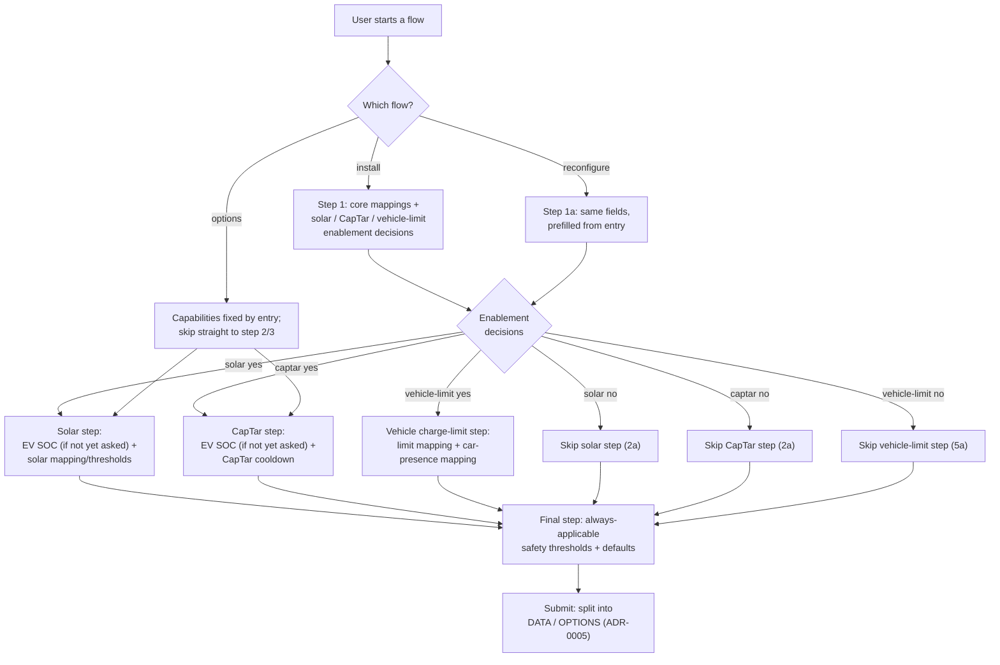

# UC12 — Configure the installation through a guided, capability-first flow

**Primary actor:** Household energy manager (secondary: System maintainer, who typically invokes
the reconfigure flow to repair or replace an adapter-role mapping).

**Stakeholders & interests:**

- Household energy manager — wants to complete setup without being asked for fields their
  installation does not need, and without hunting through a flat form for the one field a
  cryptic end-of-form error refers to.
- System maintainer — wants to fix a single broken or replaced [adapter
  role](../system-overview.md#ubiquitous-language) mapping (reconfigure) or revisit a threshold
  (options) without re-entering every other value, and wants the field set to stay correct as new
  [capabilities](../system-overview.md#ubiquitous-language) are added (NF2).
- EV driver — indirectly served: every other use-case (UC01–UC11) depends on the mappings,
  capabilities, and thresholds this use-case captures, though the driver never opens this flow.

**Scope / level:** sea-level (single user goal): complete or amend the integration's [install-time
configuration](../system-overview.md#ubiquitous-language). Cross-cutting precondition for every
other use-case — none of UC01–UC11 can execute until this use-case has produced a config entry.
Distinct from [UC11](UC11-monitor-and-manage-charging-configuration.md), which presents only
runtime configuration and explicitly treats this flow as a black box (R19).

## Preconditions

- The user is adding the integration for the first time (install), has selected Reconfigure on an
  existing config entry (reconfigure), or has opened Configure on an existing config entry
  (options) — Home Assistant's own entry points into the flow, not modeled here.
- For the reconfigure and options flows, a config entry already exists from a prior run of this
  use-case (install, or an earlier reconfigure/options run).

## Trigger

The user starts one of the three flows: install, reconfigure, or options.

## Main success scenario

The install flow is the superset of the other two; 1a/1b below give the reconfigure and options
variants.

1. **Given** the user starts the install flow, **when** the System shows the first step, **then**
   it presents only the four core hardware mappings — charger current, charger status (with its
   connected/charging state lists), net power, charger power — and three enablement decisions: is
   solar installed (solar [capability](../system-overview.md#ubiquitous-language), R18)? does the
   installation bill against a capacity tariff (CapTar capability, R18)? will a vehicle
   charge-limit entity be mapped?
2. **When** the user submits the first step with valid core mappings, **then** the System advances
   through one step per enablement the user answered "yes" to — solar, then CapTar, then vehicle
   charge-limit, in that fixed order — skipping any answered "no" (2a).
3. **Given** solar was declared installed, **when** the System shows the solar step, **then** it
   presents the EV state-of-charge mapping (required by both the solar and CapTar capabilities;
   asked here first) if not already satisfied, the solar-forecast mapping, and only solar's own
   thresholds: the `Solar` and `SolarOnly` start thresholds, the `SolarOnly` rounding strategy and
   midpoint, the post-surplus hold and solar-mode cooldown durations, the solar step-up size,
   trigger gap, and ceiling, and the solar-reserve cap value and its forecast threshold.
4. **Given** the installation bills against a capacity tariff, **when** the System shows the
   CapTar step, **then** it presents the EV state-of-charge mapping if step 3 did not already
   satisfy it, and the `Captar`-mode cooldown threshold.
5. **Given** a vehicle charge-limit entity will be mapped, **when** the System shows the
   vehicle-charge-limit step, **then** it presents the vehicle charge-limit mapping together with
   the car-presence mapping it requires — the two are always asked together (5a).
6. **When** the user has completed every step their enablement decisions required, **then** the
   System shows one final step for the fields that apply regardless of any enablement decision:
   grid safety thresholds (grid supply ceiling, grid safety offset, minimum/maximum charging
   current), control-loop tuning (smoothing window, default target current), general SOC/peak
   defaults (default SOC limit, safety margin, maximum peak, peak grace period, EV battery
   capacity), the `Power`-mode peak-protection option, the evening home-day prompt fields, and the
   optional grid-voltage, low-tariff, and notification-target mappings.
7. **When** the user submits the final step with every field valid, **then** the System creates
   the config entry, splitting the submitted values into the DATA bucket (mappings, capability
   flags, the derived state-translation table) and the OPTIONS bucket (thresholds/defaults),
   exactly as today (ADR-0005), and the installation is complete.

## Alternate flows

**1a — Reconfigure flow** — branches from step 1.
Given the user invokes Reconfigure on an existing entry
When the System shows the first step
Then it presents the same core mappings and enablement decisions as step 1, prefilled from the
existing entry, followed by the same per-capability steps (3, 4, 5) restricted to their mapping
fields only — no thresholds, since reconfigure never touches the OPTIONS bucket — and no final
step, since none of its fields are mappings. Submitting updates only the DATA bucket and reloads
the config entry.

**1b — Options flow** — branches from step 1.
Given the user opens Configure on an existing entry
When the System shows the first step
Then it skips the core-mapping/enablement-decision step entirely — the installation's declared
capabilities are fixed by the existing entry and changeable only through the reconfigure flow
(1a) — and instead shows the threshold-only version of whichever per-capability step the entry's
already-declared capabilities call for (the solar step's thresholds when solar is installed, the
CapTar step's cooldown when CapTar is available; the vehicle-charge-limit step never appears here,
since it has no threshold fields of its own), followed by the final always-applicable-thresholds
step (6). Submitting updates only the OPTIONS bucket.

**2a — An enablement decision is "no"** — branches from step 2.
Given the user answered "no" to solar installed, CapTar available, or vehicle charge-limit mapped
When the System advances past step 1
Then the corresponding step (3, 4, or 5 respectively) is skipped entirely; if both solar and
CapTar are answered "no", the EV state-of-charge mapping is never asked at all.

**5a — Vehicle charge-limit not mapped** — branches from step 5 (a specialization of 2a).
Given the user answered "no" to mapping a vehicle charge-limit entity
When the System advances past step 1
Then neither the vehicle charge-limit mapping nor the car-presence mapping is ever asked.

## Exception flows

**A mapped entity is of the wrong domain for its role.**
Given the user selects an entity that does not match a role's required domain (e.g. a `sensor`
where the charger-current role requires a `number`)
When the System validates the step containing that field
Then the System rejects the selection and re-shows the same step with the invalid selection
cleared; the user never reaches a later step with an invalid earlier mapping in place.

## Postconditions

- A config entry exists (install) or has been updated (reconfigure/options), split into DATA and
  OPTIONS exactly as ADR-0005 already specifies — this use-case changes only how the fields are
  presented, not where they are stored.
- No field belonging to a capability, or to the vehicle-charge-limit mapping, that the user
  declared disabled was ever presented to them.
- The EV state-of-charge mapping, when required by an enabled capability, was asked exactly once,
  never repeated across steps.
- The requiredness that `_ev_soc_missing_error`, `_solar_forecast_missing_error`, and
  `_car_home_missing_error` enforce today as end-of-form, cross-field validation is, after this
  use-case, a plain required field local to the one step that needs it — the same installation
  constraint, surfaced as visible step structure instead of a validation error raised only after
  the full form is submitted.
- Every other use-case (UC01–UC11) can execute using the mappings, capabilities, and thresholds
  this use-case captured.

## Domain events produced

None. Completing (or amending) a flow creates or updates a Home Assistant config entry through
Home Assistant's own native mechanism; this use-case introduces no domain-level event of its own,
consistent with how [UC11](UC11-monitor-and-manage-charging-configuration.md) also produces none.

## Diagram

## Requirements satisfied

None yet. No existing requirement mandates a guided, capability-first config-flow presentation —
this use-case surfaces that gap; a requirement covering it is being drafted separately (split from
#592, alongside this use-case).

Referenced, not restated: [R18](../requirements.md#r18--configurable-installation-capabilities)'s
capability model determines which steps this use-case shows (the solar and CapTar branching); the
[install-time configuration](../system-overview.md#ubiquitous-language) classification and the
DATA/OPTIONS split ([ADR-0005](../../adl/0005-config-entry-structure-and-interval.md)) govern where
each field this use-case presents is ultimately stored; [NF3](../requirements.md#nf3--all-device-io-via-adapter-roles)
governs why every mapping field exists at all (adapter roles).

## Relationships

- **«include»** R18's capability model — this use-case's branching structure is a direct visual
  realization of which capabilities are declared, not a decision of its own.
- **Precedes every other use-case.** UC01–UC11 all depend on a config entry this use-case (or its
  reconfigure/options variants) produces; none of them can execute before it.
- **Distinct from [UC11](UC11-monitor-and-manage-charging-configuration.md)**, which presents only
  [runtime configuration](../system-overview.md#ubiquitous-language) and explicitly excludes
  everything this use-case covers (R19).
