# UC12 — Configure the installation through a guided, topic-based flow

**Primary actor:** Household energy manager (secondary: System maintainer, who typically invokes
the reconfigure flow to repair or replace an adapter-role mapping).

**Stakeholders & interests:**

- Household energy manager — wants to complete setup without being asked for fields their
  installation does not need, and without hunting through a flat form for the one field a
  cryptic end-of-form error refers to.
- System maintainer — wants to fix a single broken or replaced [adapter
  role](../system-overview.md#ubiquitous-language) mapping (reconfigure) or revisit a threshold
  (options) without re-entering every other value, and wants the step set to stay correct as
  further [capabilities](../system-overview.md#ubiquitous-language) are added later (R18's own
  extensibility clause).
- EV driver — indirectly served: every other use-case depends on what this one captures, though
  the driver never opens this flow.

**Scope / level:** sea-level (single user goal): complete or amend the installation's config-entry
**data**, config-entry **options**, and [adapter
role](../system-overview.md#ubiquitous-language) mappings
([ADR-0005](../../adl/0005-config-entry-structure-and-interval.md), NF3) — everything else the
system needs before it can run. This is colloquially "setting up the integration," but distinct
from the glossary's narrower [install-time
configuration](../system-overview.md#ubiquitous-language) entity classification, which
`entity-catalog.md` currently has no example row of; every field this use-case presents is instead
a data value, an options value, or a role mapping (see the glossary entry's own distinction).
Cross-cutting precondition for every other use-case (UC01–UC11): none of them can execute before
this one has produced a config entry. Distinct from
[UC11](UC11-monitor-and-manage-charging-configuration.md), which presents only [runtime
configuration](../system-overview.md#ubiquitous-language) and never this flow (R19).

## Preconditions

- The user is adding the integration for the first time (install), has selected Reconfigure on an
  existing config entry (reconfigure), or has opened Configure on an existing config entry
  (options) — Home Assistant's own entry points into the flow, not modeled here.
- For the reconfigure and options flows, a config entry already exists from a prior run of this
  use-case (install, or an earlier reconfigure/options run).

## Trigger

The user starts one of the three flows: install, reconfigure, or options.

## Main success scenario

### The step model

The flow is nine steps, each grouping the fields of **one installation topic**, in this fixed
order:

| # | Step | Gate |
| --- | --- | --- |
| 1 | core | none — always shown |
| 2 | grid | none — always shown |
| 3 | ev_charger | none — always shown |
| 4 | vehicle | none — always shown |
| 5 | power | none — always shown |
| 6 | captar | the CapTar [capability](../system-overview.md#ubiquitous-language) (R18) |
| 7 | solar | the solar capability (R18) |
| 8 | deadline | the [deadline capability](../system-overview.md#ubiquitous-language) (R18) |
| 9 | notifications | the [notifications capability](../system-overview.md#ubiquitous-language) (R18) |

Every step has, at most, two halves: a **mapping half** (adapter-role mappings, their
state-translation tables, and the capability declarations — config-entry *data*) and a **threshold
half** (thresholds, defaults, and seed values — config-entry *options*), per
[ADR-0005](../../adl/0005-config-entry-structure-and-interval.md). Which halves a given flow shows
is what distinguishes the three flows: install shows both halves of every step it reaches,
reconfigure shows only mapping halves (1a), and options shows only threshold halves (1b). Two steps
have only one half — `captar` and `power` are threshold-only, so neither appears in the reconfigure
flow at all.

The step ids (`core`, `grid`, `ev_charger`, …) are structural labels for the flow's own steps, not
ubiquitous-language terms; the glossary defines the concepts each step captures, not the steps.

### The install flow, step by step

The install flow is the superset of the other two; 1a/1b below give the reconfigure and options
variants.

1. **Given** the user starts the install flow, **when** the System shows the `core` step, **then**
   it presents the four [capability](../system-overview.md#ubiquitous-language) declarations
   (R18) — is solar installed? does the installation bill against a capacity tariff? does the
   household want departure deadlines managed at all? does the household want the System to send
   notifications at all? — together with the smoothing window (R10). The solar, CapTar, and
   deadline declarations each default to *present*, per R18's default-present rule; the
   notifications declaration deliberately departs from that rule and defaults to *absent* (see
   "Requirements satisfied" for why), so a household that accepts the defaults is offered steps
   6–8 but not the `notifications` step.
   It does not present the [control interval](../system-overview.md#ubiquitous-language), which the
   install flow defaults rather than asks (1b).
2. **When** the user submits the `core` step, **then** the System shows the `grid` step, presenting
   the net-power mapping, the optional grid-voltage mapping, the optional low-tariff mapping (with
   its own state-translation table when the mapped entity does not already report on/off), the
   [supply voltage](../system-overview.md#ubiquitous-language) fallback used when the grid-voltage
   mapping is absent (NF4), the [grid supply ceiling](../system-overview.md#ubiquitous-language),
   and the [grid safety offset](../system-overview.md#ubiquitous-language) (C4). The
   supply-voltage fallback sits on this step, beside the grid-voltage mapping it substitutes for,
   rather than on the `ev_charger` step: both are the same "Installation area" concern in
   `entity-catalog.md`, and one topic per step means the measured value and its fallback are
   asked together.
3. **When** the user submits the `grid` step, **then** the System shows the `ev_charger` step,
   presenting the charger-current mapping, the charger-status mapping with its connected and
   charging state lists, the charger-power mapping, and the
   [minimum](../system-overview.md#ubiquitous-language) and
   [maximum charging current](../system-overview.md#ubiquitous-language) (C1).
4. **When** the user submits the `ev_charger` step, **then** the System shows the `vehicle` step —
   always, gated by nothing — presenting the EV state-of-charge mapping, the optional
   EV-battery-capacity sensor mapping, the EV battery capacity value (R15), the optional vehicle
   charge-limit mapping together with the car-at-home presence mapping it conditionally requires
   (4a), and the value the SOC-limit-override entity is seeded with (4b).
5. **When** the user submits the `vehicle` step, **then** the System shows the `power` step,
   presenting the value the [Power target current](../system-overview.md#ubiquitous-language)
   entity is seeded with (4b) and the `Power`-mode cooldown duration (R11); it then advances through
   the capability-gated steps 6–9 in that fixed
   order, skipping any capability the user declared absent (5a).
6. **Given** the installation bills against a capacity tariff, **when** the System shows the
   `captar` step, **then** it presents the `Captar`-mode cooldown duration (R11), the `Power`-mode
   peak-protection option (R17), and the
   peak-protection thresholds — [safety margin](../system-overview.md#ubiquitous-language),
   [maximum peak](../system-overview.md#ubiquitous-language), [peak
   floor](../system-overview.md#ubiquitous-language), and peak-breach grace period (R3) — all of
   which this step model gates on the CapTar capability, a deliberate change from the previous step
   model (5b). The peak-protection option sits here, not on the ungated `power` step, because it
   switches the very clamp those thresholds tune: gating the thresholds but not their on/off switch
   would split one topic across two steps.
7. **Given** solar was declared installed, **when** the System shows the `solar` step, **then** it
   presents the solar-production and solar-forecast mappings and solar's own thresholds: the
   `Solar` and `SolarOnly` start thresholds, the `SolarOnly` rounding strategy and midpoint, the
   `Solar` and `SolarOnly` post-surplus hold durations, the solar-mode cooldown duration, the
   restart debounce duration, the solar step-up size, trigger gap, and ceiling, and the value the
   [solar-reserve cap](../system-overview.md#ubiquitous-language) is seeded with (4b) together with
   its forecast threshold.
8. **Given** the household wants departure deadlines managed, **when** the System shows the
   `deadline` step, **then** it presents the optional external departure-time mapping, the external
   home-day mapping (5c), and the plug-in reminder's lead time (R12).
9. **Given** the household wants notifications sent, **when** the user has completed every gated
   step among 6–8 their capability declarations required, **then** the System shows the
   `notifications` step, presenting the notification-target mapping, the evening home-day prompt's
   enable flag and prompt time, and the prompt timeout (R13).
10. **When** the user submits the last step the flow showed them — `notifications` while the
    notifications capability is present, otherwise the last gated step they reached, or `power`
    when every capability is declared absent — with every
    field valid, **then** the System creates the config entry, splitting the submitted values into
    the data bucket (mappings, capability declarations, the derived state-translation tables) and
    the options bucket (thresholds, defaults, seed values), exactly as today (ADR-0005), and the
    installation is complete.

## Alternate flows

**1a — Reconfigure flow** — replaces the install flow from the Trigger onward.
Given the user invokes Reconfigure on an existing entry
When the System runs this use-case
Then it shows only the **mapping half** of each step, prefilled from the existing entry: `core`'s
capability declarations; `grid`'s net-power, grid-voltage, and low-tariff mappings; `ev_charger`'s
charger-current, charger-status, and charger-power mappings; `vehicle`'s EV state-of-charge,
EV-battery-capacity-sensor, vehicle-charge-limit, and car-at-home mappings — unconditionally, since
the `vehicle` step is ungated; `solar`'s solar-production and solar-forecast mappings when solar is
declared present; `deadline`'s external departure-time and home-day mappings when deadlines are
managed; and `notifications`' notification-target mapping when notifications are wanted. Only the
`core`, `grid`, `ev_charger`, and `vehicle` mapping halves are shown unconditionally; `solar`,
`deadline`, and `notifications` each appear only while their own capability is declared present.
The `captar` and `power` steps never appear, since neither has a mapping half.
Submitting updates only the data bucket and reloads the config entry. A capability declared absent
here that was present before drops that capability's mapping fields from the data bucket on save;
any of its thresholds already stored in the options bucket are left untouched (changing them is the
options flow's job, 1b).

**1b — Options flow** — replaces the install flow from the Trigger onward.
Given the user opens Configure on an existing entry
When the System runs this use-case
Then it shows only the **threshold half** of each step, each field prefilled from the current
configuration (R20 AC7), and never a mapping or a capability
declaration — the installation's capabilities are fixed by the existing entry and changeable only
through the reconfigure flow (1a). It therefore shows: `core`'s smoothing window **and the control
interval**, the one field neither the install nor the reconfigure flow ever asks (install defaults
it; reconfigure touches no options at all), so the options flow is the only path on which it is
presented; `grid`'s supply-voltage fallback, grid supply ceiling, and safety offset;
`ev_charger`'s minimum/maximum charging current; `vehicle`'s EV battery capacity and SOC-limit seed
value; `power`'s target-current seed value and cooldown; then the
threshold half of whichever gated steps the entry's already-declared capabilities call for —
`captar`'s cooldown, `Power`-mode peak-protection option, and peak-protection thresholds when
CapTar is available, `solar`'s thresholds
when solar is installed, `deadline`'s reminder lead time when deadlines are managed, and
`notifications`' evening-prompt fields and prompt timeout when notifications are wanted.
Submitting updates only the options bucket.

**4a — When the car-at-home mapping is required** — branches from step 4.
Given the user is on the `vehicle` step
When the user fills in the vehicle charge-limit mapping, or has declared the deadline capability
present on the `core` step
Then the car-at-home presence mapping becomes required on the `vehicle` step, for either of two
independent reasons: keeping the vehicle's own charge limit in step with the active SOC limit
(R6, UC09) is meaningful only while the car is at home, and the plug-in reminder (R12, UC10) reads
the same presence signal to decide whether a reminder is due at all.
When the user leaves the vehicle charge-limit mapping blank — declining charge-limit
synchronisation — **and** has declared the deadline capability absent, the car-at-home mapping is
optional, since neither consumer exists on that installation.
This is a **field-level** rule local to one always-shown step, and it replaces the previous step
model's separate yes/no election asked on the first step and its own conditional step: the flow no
longer asks the user to predict, before seeing the fields, whether they want the mapping. That the
deadline capability — declared two steps earlier — can make a `vehicle`-step field required is the
one cross-step requiredness this model keeps; it is still reported on the `vehicle` step itself,
never as an end-of-flow error.

**4b — Seed-value fields set a runtime entity's starting value, not a threshold** — branches from
step 4, and the rule it states applies equally to the seed-value fields on steps 5 and 7.
Given the SOC-limit seed value (step 4), the `Power` target-current seed value (step 5), and the
solar-reserve cap seed value (step 7)
When the user later changes any of the three from the runtime dashboard
Then that change updates the corresponding owned runtime entity directly
([UC11](UC11-monitor-and-manage-charging-configuration.md)) — this use-case's own field only sets
each entity's *starting* value at whichever moment its step runs, distinct from an installation
threshold that keeps applying until it is changed again through this flow.

**5a — A capability is absent** — branches from step 5.
Given the user declared the CapTar, solar, or deadline capability absent on the `core` step, or
did not declare the notifications capability present there (its default being absent)
When the System advances past the `power` step
Then the corresponding gated step (6, 7, 8, or 9 respectively) is skipped entirely and none of its
fields is ever presented (R18 AC3, AC7; R14 AC1) — for the notifications capability, that is the
notification-target mapping, the evening home-day prompt's enable flag and prompt time, and the
prompt timeout, so a household that has not declared notifications wanted is never asked where to
send them.
No ungated step is ever skipped: `core`, `grid`, `ev_charger`, `vehicle`, and `power` are shown on
every install path, whatever the capability declarations.

**5b — Peak-protection fields are now gated by the CapTar capability** — branches from step 5,
the point at which 5a decides whether step 6 is shown at all.
Given the `Power`-mode peak-protection option, the safety margin, maximum peak, peak floor, and
peak-breach grace period
When the CapTar capability is declared absent
Then this step model no longer presents any of them, and the installation is left on their
defaults. Its real-world consequence, stated plainly: the peak-protection option defaults **on**
(R17 AC2) and the maximum peak defaults to **4 kW** (with a 2.5 kW peak floor), so a non-CapTar
installation is clamped to a roughly 4 kW effective peak limit with **no path through this flow to
raise that limit, and — the option being gated too — no path to switch the clamp off either** — on
a 40 A single-phase (≈9 kW) connection, the upper part of the `Power`-mode current
range becomes unreachable. Gating the option alongside the thresholds sharpens that consequence
rather than contradicting it: a household that cannot raise the limit also cannot opt out of it, so
neither lever remains. That is a behaviour change, not merely a lost tuning affordance.
This **reverses** the previous step model, which presented these fields ungated on the strength of
the peak-protection clamp (R3) protecting the grid connection itself rather than only the
capacity-tariff bill. The reversal is deliberate: it groups every peak-protection field — the
thresholds and the switch that turns the clamp they tune on or off — with the billing arrangement
that motivates tuning them, accepting the clamp above as the price. The
clamp itself is unchanged — R3 still applies in every mode, and the [grid supply
ceiling](../system-overview.md#ubiquitous-language) clamp (C4), which is what actually protects the
grid connection on a non-CapTar installation, stays on the ungated `grid` step. This use-case
describes only the new step behaviour; reconciling the wording of **R18 AC5** and **R20 AC5** —
which currently assert that the peak-protection *fields* apply, and are presented, whether or not
the CapTar capability is present — is tracked separately and is out of scope here.

**5c — The external home-day mapping is presented on the deadline-gated step** — branches from
step 5, the point at which 5a decides whether step 8 is shown at all.
Given the external home-day mapping
When the deadline capability is declared absent
Then the mapping is not presented, even though the [home-day
flag](../system-overview.md#ubiquitous-language) it feeds independently drives the solar-reserve cap
(R9) and the evening prompt (R13) whether or not deadlines are managed — which is why
`entity-catalog.md` records the Home day subgroup as *not* gated by the deadline capability. This
is a deliberate, named exception to that gating, made because the flag's third consumer — the
home-day departure override (R14 AC3), which applies only while the deadline capability is present
(R13 AC2) — is the one that motivates wiring an *external* calendar or presence source in the
first place. Its real-world consequence, stated plainly: a household that
declares deadlines unmanaged but still wants the solar-reserve cap is no longer offered this mapping
through the flow, and must drive the home-day flag through the evening prompt (UC08) or set the
owned home-day switch directly (UC11) instead. Nothing about how the flag behaves once set changes.

## Exception flows

**A mapped entity is of the wrong domain for its role.**
Given the user selects an entity that does not match a role's required domain (e.g. a `sensor`
where the charger-current role requires a `number`)
When the System validates the step containing that field
Then the System rejects the selection and re-shows the same step so the user can correct it; the
user never reaches a later step with an invalid earlier mapping in place.

**A field required by the current step is left blank.**
Given the user submits a step without a field that step marks required (e.g. the car-at-home
presence mapping on the `vehicle` step, once a vehicle charge-limit mapping has been filled in, 4a)
When the System validates that step
Then the System rejects the submission and re-shows the same step with an error local to the
missing field — never an error raised only after every later step has also been completed, which
is what this use-case's step structure replaces.

**The user abandons the flow before the final step.**
Given the user closes or cancels the flow at any step before its last
When the flow ends without a final submission
Then no config entry is created (install) or updated (reconfigure/options); every value entered in
the abandoned attempt is discarded, and an existing entry (reconfigure/options) is left exactly as
it was before the flow started.

## Postconditions

- A config entry exists (install) or has been updated (reconfigure/options), split into data and
  options exactly as ADR-0005 already specifies — this use-case changes only how the fields are
  presented, not where they are stored.
- No field belonging to an absent capability — declared so, or absent by default — was ever
  presented to them.
- The EV state-of-charge mapping was asked exactly once, on the always-shown `vehicle` step,
  whatever the capability declarations — replacing the previous step model's once-only-across-two-
  possible-steps mechanism, and asked even when neither solar nor CapTar is declared present.
- The cross-field requiredness the original implementation enforced only as an end-of-form error
  (EV state-of-charge required when solar or CapTar is declared; the solar-forecast mapping
  required when solar is declared; the car-at-home presence mapping required when a vehicle
  charge-limit is mapped or deadlines are managed) is, after this use-case, a plain required field
  local to the one step that needs it — the first two unconditionally required on their own step,
  the third by the field-level rule 4a.
- Two gaps the previous step model named as out of scope are closed by **this** step model: the
  solar-production mapping is now presented on the `solar` step, and the `Power`-mode cooldown on
  the `power` step, so every catalogued adapter role and `config-options` key the flow is
  responsible for now has a field on some step.
- The step set stays extensible: a capability added in a later release (R18's extensibility clause)
  needs exactly one new step, appended after the existing capability-gated steps (6–9), with no
  change to the fields or order of any other step. This is a
  structural property of the step grouping rather than a flow exercised here — the capability set is
  closed this release (R18), so no concrete scenario can walk it.
- Every other use-case (UC01–UC11) can execute using the mappings, capabilities, and thresholds
  this use-case captured.

## Domain events produced

None. Completing (or amending) a flow creates or updates a Home Assistant config entry through
Home Assistant's own native mechanism; this use-case introduces no domain-level event of its own,
consistent with how [UC11](UC11-monitor-and-manage-charging-configuration.md) also produces none.

## Diagram

```mermaid
flowchart TD
    subgraph Install["Install flow — both halves of every step reached"]
        I1["1 core: capability declarations<br/>+ smoothing window"] --> I2["2 grid"]
        I2 --> I3["3 ev_charger"]
        I3 --> I4["4 vehicle (always)"]
        I4 --> I5["5 power"]
        I5 --> ID{"Which capabilities<br/>are present?"}
        ID -- captar --> I6["6 captar:<br/>cooldown + peak protection (5b)"]
        ID -- solar --> I7["7 solar"]
        ID -- deadline --> I8["8 deadline (incl. home-day, 5c)"]
        ID -- notifications --> I9["9 notifications"]
        ID -- "absent" --> ISkip["Skip that step (5a)"]
        I6 --> ISubmit["Create entry:<br/>split data / options"]
        I7 --> ISubmit
        I8 --> ISubmit
        I9 --> ISubmit
        ISkip --> ISubmit
    end

    subgraph Reconfigure["Reconfigure flow (1a) — mapping halves only"]
        R1["1 core: capability<br/>declarations, prefilled"] --> R2["2 grid, 3 ev_charger,<br/>4 vehicle — mappings"]
        R2 --> RD{"Which capabilities<br/>are present?"}
        RD -- solar --> R7["7 solar mappings"]
        RD -- deadline --> R8["8 deadline mappings"]
        RD -- notifications --> R9["9 notifications mapping"]
        RD -- "absent" --> RSkip["Skip that step (5a)"]
        R7 --> RSubmit["Update data bucket only<br/>+ reload entry"]
        R8 --> RSubmit
        R9 --> RSubmit
        RSkip --> RSubmit
        RNote["5 power and 6 captar never appear:<br/>no mapping half"] -.-> RD
    end

    subgraph Options["Options flow (1b) — threshold halves only"]
        O1["1 core: smoothing window<br/>+ control interval"] --> O2["2 grid, 3 ev_charger,<br/>4 vehicle, 5 power — thresholds"]
        O2 --> OD{"Which are already<br/>declared?"}
        OD -- captar --> O6["6 captar thresholds"]
        OD -- solar --> O7["7 solar thresholds"]
        OD -- deadline --> O8["8 deadline threshold"]
        OD -- notifications --> O9["9 notifications thresholds"]
        OD -- "absent" --> OSkip["Skip that step"]
        O6 --> OSubmit["Update options bucket only"]
        O7 --> OSubmit
        O8 --> OSubmit
        O9 --> OSubmit
        OSkip --> OSubmit
    end
```

## Requirements satisfied

Partially satisfies [R20](../requirements.md#r20--guided-installation-configuration) — the step
grouping, the capability-gated skipping, the step-local validation, the mapping-only and
threshold-only amendment paths, and the discard-on-abandon behaviour are this use-case's
realization of R20's acceptance criteria (AC2 in part, AC6, AC7, AC8). Five of R20's criteria are
written against the previous step model and no longer describe what this use-case does:

- **AC1** — the first step's field list and the vehicle-charge-limit election; the `core` step now
  presents the four capability declarations and the smoothing window, and the charge-limit mapping
  is a `vehicle`-step field rather than an election.
- **AC2** — its trailing clause ("followed by the vehicle-charge-limit step when that mapping is
  elected") names a step this model removed; the rest of AC2, one step per declared capability in a
  fixed documented order, still holds.
- **AC3** — its clause "or to a declined optional mapping" is obsolete: the vehicle charge-limit
  field is now always presented on the `vehicle` step and never declined through an election.
- **AC4** — the EV state-of-charge mapping presented "on the first step that needs it" and "not
  presented at all when neither capability is declared present"; it is now always presented, on the
  ungated `vehicle` step (step 4).
- **AC5** — ungated peak-protection fields, now CapTar-gated (5b); AC5's carve-out for the
  `Power`-mode cooldown is also obsolete, since the flow now asks it.
- **AC9** — its extensibility *property* still holds, but its literal insertion-point wording
  ("before the vehicle-charge-limit step") names an anchor this model removed; the Postconditions
  above restate the insertion point as "appended after the existing capability-gated steps".

Reconciling R20's wording is tracked separately and is out of scope here.

Partially satisfies [R18](../requirements.md#r18--configurable-installation-capabilities) —
acceptance criteria that the solar, CapTar, and deadline capabilities are each user-configurable
(AC1, AC4, AC6), and that solar's own inputs are not required to be configured when it is absent
(AC3) — and [R14](../requirements.md#r14--configurable-departure-times) AC1, that the
departure-time inputs are neither offered nor required when the deadline capability is absent.
Neither R18 nor R14 mandates *how many steps, in what order* — their acceptance criteria concern
only whether a capability is configurable and whether its inputs are required.

The **notifications capability** (`notifications_available`) this use-case adds to the `core` step
is a fourth capability under R18's extensibility clause (AC9). It defaults to **absent** — a
deliberate, named departure from R18's blanket "Every capability defaults to *present*" rule, not
an oversight. The three existing capabilities each record an installation fact that is already true
of the installation before the flow asks: panels are installed or they are not, the connection
bills against a capacity tariff or it does not, deadlines are wanted or they are not. Defaulting
those to present asks the household only to correct a statement about what it already has. Whether
the System may contact the household unprompted is not such a fact; it is a standing preference,
and one whose default determines whether messages arrive uninvited. A household that never engages
with the question should end up un-notified rather than silently signed up, so this capability is
opted into. The practical consequence is that a household accepting the defaults is *not* asked for
its notification target or evening-prompt settings; it must declare notifications wanted on the
`core` step to reach step 9. The glossary's capability list and the notifications-capability entry
both record the exception; reconciling R18's own wording (both "This release recognises three" and
its default-present sentence) and adding a matching pair of R18 acceptance criteria is tracked
separately and is out of scope here.

Referenced, not restated: the data/options split
([ADR-0005](../../adl/0005-config-entry-structure-and-interval.md)) governs where each field this
use-case presents is ultimately stored; [NF3](../requirements.md#nf3--all-device-io-via-adapter-roles)
governs why every mapping field exists at all (adapter roles).

## Relationships

- **«include»** R18's capability model for the CapTar, solar, deadline, and notifications branches
  (steps 6–9) — a direct visual realization of which capabilities are declared, not a decision of
  its own. No other step branches on anything: the five ungated steps (`core`, `grid`,
  `ev_charger`, `vehicle`, `power`) are shown unconditionally, and the one
  remaining optional mapping (the vehicle charge limit) is now a field-level rule inside the
  always-shown `vehicle` step rather than a step-level gate (4a).
- **Precedes every other use-case.** UC01–UC11 all depend on a config entry this use-case (or its
  reconfigure/options variants) produces.
- **Distinct from [UC11](UC11-monitor-and-manage-charging-configuration.md)**, which presents only
  [runtime configuration](../system-overview.md#ubiquitous-language) and never this flow (R19).
