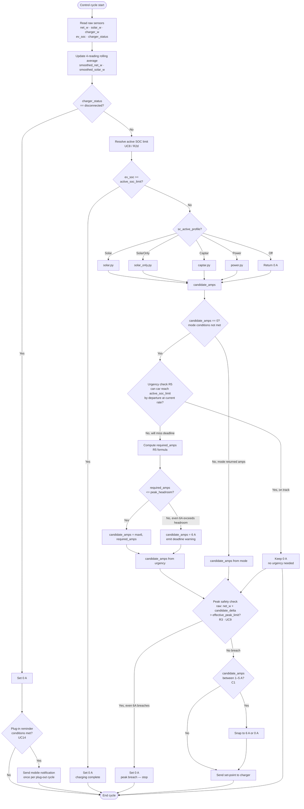
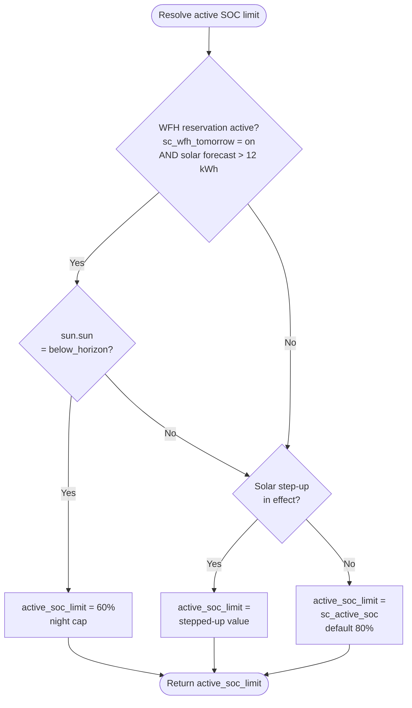
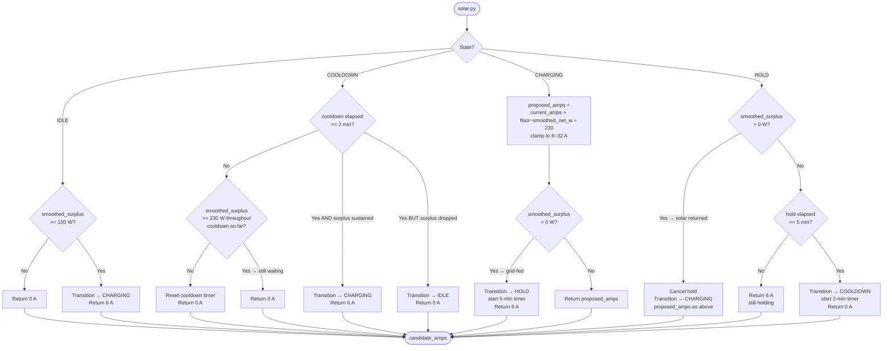
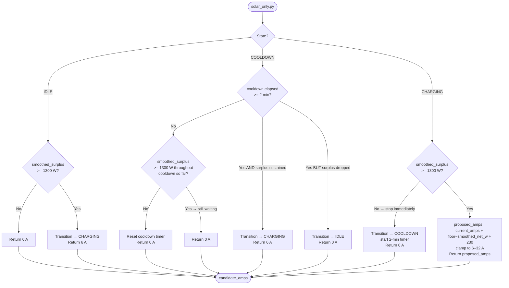
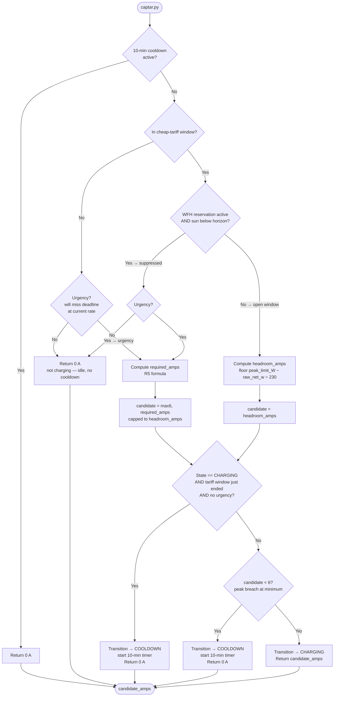
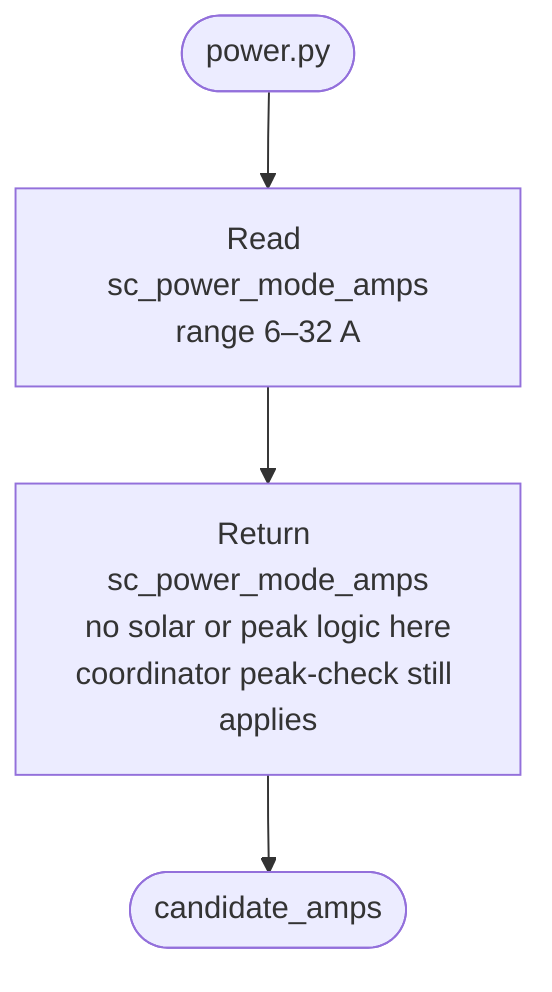
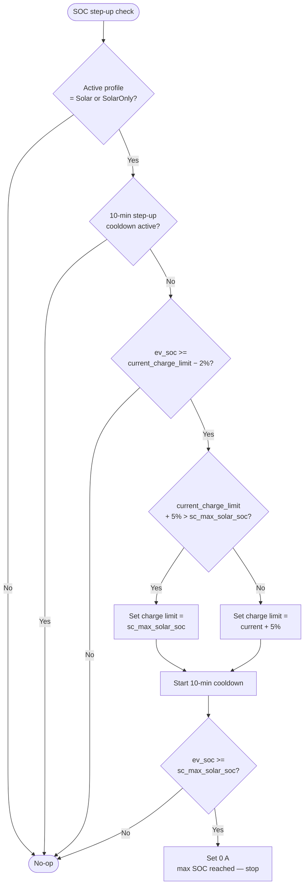
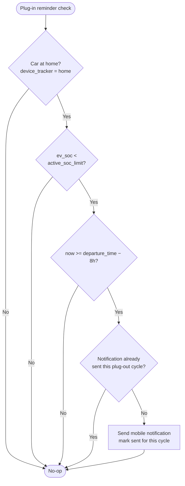
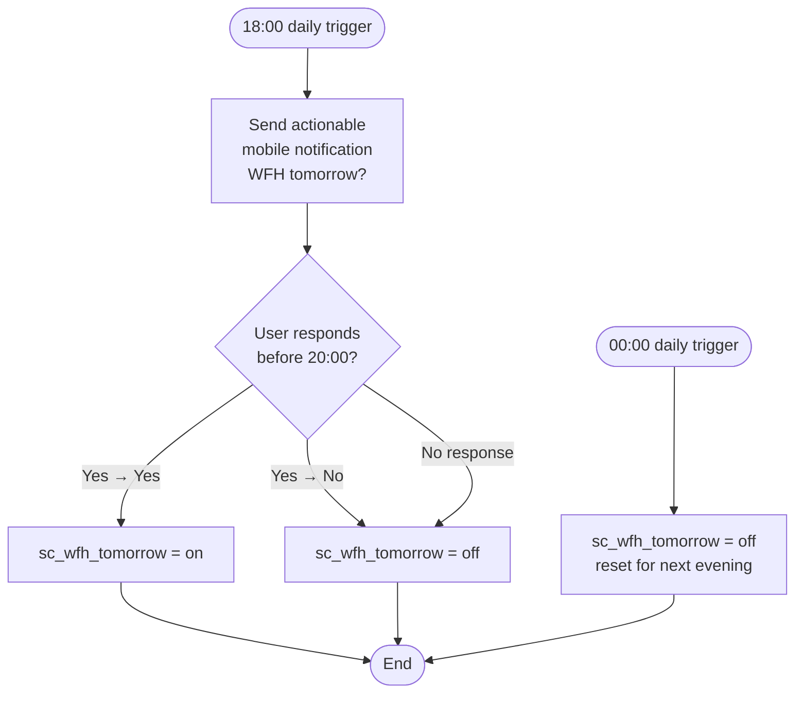

# Smart Charging — Process Flow

Mermaid diagrams for the coordinator control loop and each mode module.
Derived from [smart-charging.requirements.md](smart-charging.requirements.md) and [use-cases.md](use-cases.md).

---

## Coordinator Control Loop

Runs every `sc_control_interval_s` seconds.

---

## Active SOC Limit Resolution (UC8 / R2d)

---

## Solar Mode (`flow/solar.py`)

**State machine:** `IDLE` → `COOLDOWN` → `CHARGING` → `HOLD` → `COOLDOWN` → …

- **Start threshold:** smoothed surplus ≥ 150 W (first start or after cooldown)
- **Restart threshold:** smoothed surplus ≥ 230 W sustained for the full 2-min cooldown
- **Stop trigger:** smoothed surplus = 0 W (charger fully grid-fed)
- **Hold:** 5 min at 6 A before stopping; cancelled if solar recovers during hold
- **Cooldown:** 2 min; surplus must stay ≥ 230 W throughout to qualify for restart

---

## SolarOnly Mode (`flow/solar_only.py`)

**State machine:** `IDLE` → `COOLDOWN` → `CHARGING` → `COOLDOWN` → …

- **Start threshold:** smoothed surplus ≥ 1300 W
- **Restart threshold:** smoothed surplus ≥ 1300 W sustained for the full 2-min cooldown
- **Stop trigger:** smoothed surplus < 1300 W — immediate stop, no hold
- **No grid fallback** — never charges below 1300 W surplus regardless of minimum current

---

## Captar Mode (`flow/captar.py`)

**State machine:** `IDLE` → `COOLDOWN` → `CHARGING` → `COOLDOWN` → …

- **Charging gate:** cheap-tariff window (weekdays 22:00–07:00, weekends all day) OR urgency
- **WFH suppression:** if WFH reservation active AND sun below horizon → treat as outside tariff window (urgency can still override)
- **Current:** max available under peak limit each cycle: `floor((peak_limit_W − raw_net_w) / 230)`, clamped 6–32 A
- **Stop triggers:** (1) peak headroom breach even at 6A, (2) tariff window ends with no urgency — both start 10-min cooldown
- **Cooldown:** 10 min after any stop; restarts only when cooldown done AND gate condition met

---

## Power Mode (`flow/power.py`)

---

## Solar SOC Step-Up (UC6 / R2b)

Runs as a side-effect check within each Solar / SolarOnly cycle, after the main amps calculation.

---

## Plug-In Reminder (UC14 / R8)

Checked at the end of each coordinator cycle when `charger_status = disconnected`.

---

## WFH Evening Notification (UC15 / R2c)

Time-triggered automation — not part of the coordinator loop.

