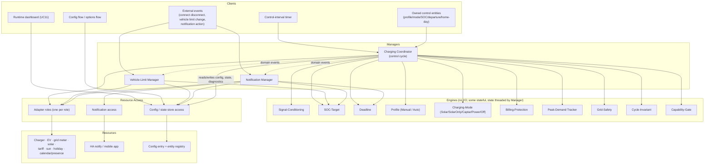
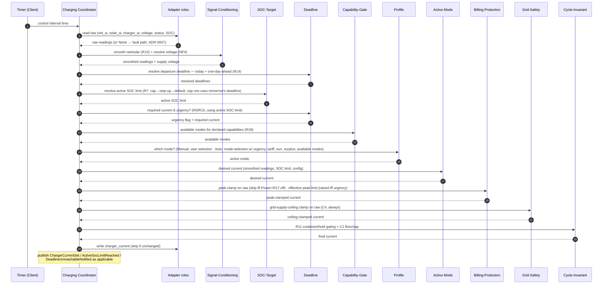
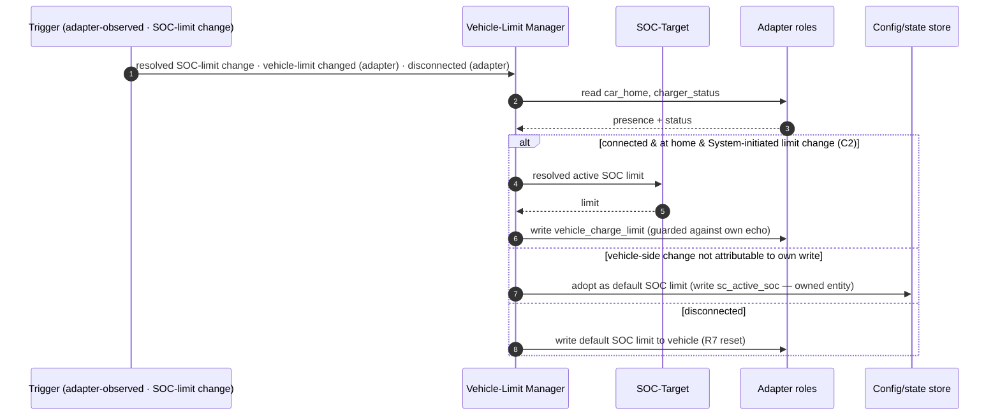
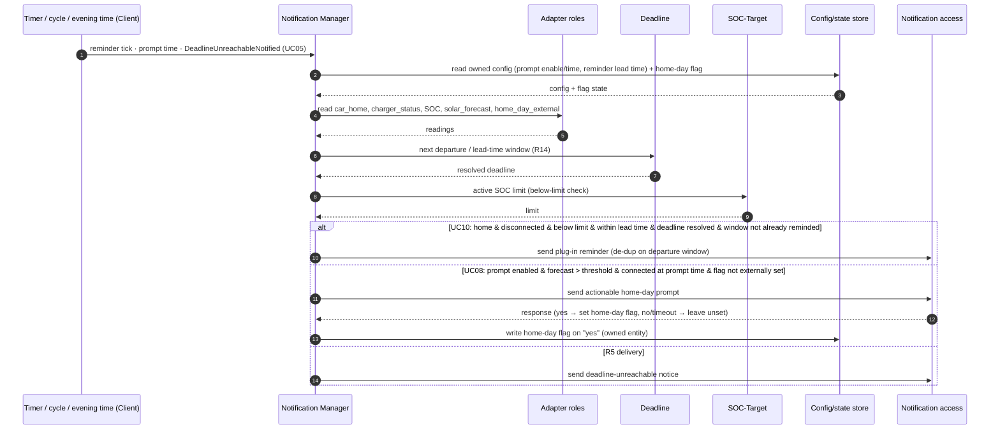

# System design — volatility-based decomposition

This document applies Juval Löwy's IDesign Method (volatility-based decomposition) to the Smart
Charging integration. It derives the **static architecture** (the services and the allowed call
directions between them) and the **dynamic architecture** (how those services collaborate to
realize each use case) from the drafted analysis: `system-overview.md`, `requirements.md`,
`control-cycle.md`, `resolution-rules.md`, `entity-catalog.md`, and the eleven use-cases
(`use-cases/UC01`–`UC11`).

The core discipline of the Method governs everything below: **the use cases validate the
decomposition; they never drive it.** Services encapsulate *areas of volatility* — what is likely
to change and why — not functions or use-case verbs. A use case that mapped one-to-one onto a
single service would be a warning sign, not a success. In this design most use cases cross several
services, and three of them (UC05, UC06, UC07) own no service at all — they are realized entirely
through engines the control-cycle Manager already composes.

Method vocabulary (`Client`, `Manager`, `Engine`, `Resource Access`, `Resource`) is design
vocabulary, not domain vocabulary; every *domain* term used here is already defined in
`system-overview.md`'s Ubiquitous Language glossary and is linked, not restated.

---

## 1. Relationship to the analysis docs and to the ADRs

This design is authoritative for **shape**: which services exist, what volatility each encapsulates,
and the one-way call directions between them. It does not restate behavior — `control-cycle.md`
stays authoritative for the order of operations in one cycle, `resolution-rules.md` for the
priority-ordered lookups, and `entity-catalog.md` for entity/role bindings. Where those documents
describe a *mechanism*, this document places that mechanism in a service and fixes who may call it.

**ADR reconciliation (the inverted order).** CLAUDE.md's prescribed order is *system design first,
then ADRs for the structural decisions it surfaces.* Here that order is inverted: ADRs 0001–0009
were written before this design existed. This document therefore doubles as a **validation pass**
over those nine ADRs against the Method. The reconciliation is in [§8](#8-adr-reconciliation);
in summary, every existing ADR's structural boundary **aligns** with this decomposition (each
names a boundary this design derives independently), and this design opens **no** superseding ADR —
though ADR-0004 carries a pre-existing, still-open entity-naming conflict with `entity-catalog.md`
that this design surfaces but does not resolve. Two structural
decisions this design makes explicit for the first time — treating the profile as a pure
mode-selection Engine invoked by the Coordinator, and modeling cross-Manager coordination as
domain-event publish/subscribe rather than direct calls — are candidates for their own ADRs
(0010, 0011) and are flagged as such, not decided here.

---

## 2. Volatilities (the cut)

Each row is an axis along which the system is likely to change, the reason it will change, and the
one service that encapsulates it. Services are catalogued in [§3](#3-service-catalog); the numbering
(V1…) is referenced from there.

| # | Volatility — *what varies* | Axis / why it changes | Encapsulated in |
| --- | --- | --- | --- |
| **V1** | **Hardware I/O access** — how each external sensor/actuator or signal is reached | Every installation exposes different upstream entities, platforms, and raw state strings; replacing a charger or car must not touch logic (NF3) | Resource-Access layer — one adapter per [adapter role](../analysis/system-overview.md#ubiquitous-language) |
| **V2** | **Charge set-point policy per mode** — the rule turning conditioned readings + targets into a desired current | Modes are added and tuned over time; each must be self-contained (NF2): `Solar`, `SolarOnly`, `Captar`, `Power`, `Off`, and future modes | Charging-Mode Engines |
| **V3** | **Mode-selection strategy** — how the [active mode](../analysis/system-overview.md#ubiquitous-language) is chosen over time | `Manual` vs `Auto` today; user-defined [profiles](../analysis/system-overview.md#ubiquitous-language) later (R16, NF1); the coordinator must never absorb this (NF1) | Profile (Mode-Selection) Engines |
| **V4** | **SOC-target policy** — what charge level to aim for and its lifecycle | Default / [solar step-up](../analysis/system-overview.md#ubiquitous-language) / [solar-reserve cap](../analysis/system-overview.md#ubiquitous-language) rules and thresholds evolve (R6–R9) | SOC-Target Engine |
| **V5** | **Deadline-urgency policy** — how the [departure deadline](../analysis/system-overview.md#ubiquitous-language), [required current](../analysis/system-overview.md#ubiquitous-language), and [urgency](../analysis/system-overview.md#ubiquitous-language) are determined and which levers they pull | Deadline sources (sensor/holiday/home-day/day-of-week), urgency thresholds, and the per-profile lever set (R5, R14, R15) | Deadline Engine |
| **V6** | **Billing-peak protection** — how charging is bounded to protect the CapTar [monthly peak demand](../analysis/system-overview.md#ubiquitous-language) | [Effective peak limit](../analysis/system-overview.md#ubiquitous-language) resolution, [safety margin](../analysis/system-overview.md#ubiquitous-language), grace period, and the `Power` opt-out (R3, C3, R17); tariff-regime specific | Billing-Protection Engine + Peak-Demand Tracker |
| **V7** | **Grid-safety (fuse) protection** — the hard ceiling on total net import | [Grid supply ceiling](../analysis/system-overview.md#ubiquitous-language)/[offset](../analysis/system-overview.md#ubiquitous-language) per installation; a physical-safety limit that is **never** waivable and must stay structurally separate from billing (C4, ADR-0006) | Grid-Safety Engine |
| **V8** | **Signal conditioning** — how raw readings become decision-ready values | [Smoothing](../analysis/system-overview.md#ubiquitous-language) window size (R10) and [supply-voltage](../analysis/system-overview.md#ubiquitous-language) resolution/fallback (NF4) are tunable | Signal-Conditioning Engine |
| **V9** | **Cycle invariants** — how the final set-point is bounded and start/stop churn prevented | Per-mode cooldown/hold durations (R11) and the C1 floor/cap; hardware fault-avoidance timing changes | Cycle-Invariant Engine |
| **V10** | **Capability gating** — which modes/behaviors exist for this installation | Capabilities declared per install (solar now, home battery later) must gate modes/behaviors without altering existing modes (R18, NF2) | Capability-Gate Engine |
| **V11** | **User notification & prompting** — when/what the user is told and how a response is captured | Reminder (R12), evening prompt (R13/UC08), deadline-unreachable (R5) policies and the delivery channel evolve | Notification Manager + Notification Resource Access |
| **V12** | **Vehicle charge-limit ownership** — keeping the car's own limit in sync bidirectionally | Write policy (C2 home-only), manual-adoption + feedback-loop guard, disconnect reset (R6) — a concern distinct from charger-current control | Vehicle-Limit Manager + `vehicle_charge_limit` Resource Access |
| **V13** | **Persistence / config placement** — where setup vs tuning vs user-state live | data (reconfigure-only) vs options (anytime) vs owned entity, and reload-on-change (ADR-0004/0005/0008) | Config/State Store (Resource) |
| **V14** | **Configuration & presentation surface** — install-time flow, options flow, runtime dashboard | Which entity is set where and how it is shown (R19); setup-once vs day-to-day | Clients (config flow, dashboard) |

Two notes on the cut:

- **V6 and V7 are split deliberately.** Billing-peak protection is a configurable *cost* concern
  that `Power` mode may waive (R17); grid-safety is a hard *physical* concern that no mode may
  waive (C4). ADR-0006 requires the two clamps to be distinct call sites so the `Power` opt-out can
  never reach C4; encapsulating them as two engines makes that boundary structural, not a
  convention.
- **V2 (modes) and V3 (profiles) are two volatilities, not one.** A mode decides *how much current
  now*; a profile decides *which mode over time*. NF1 forbids the coordinator from holding either.
  Keeping them separate is what lets a new mode or a new profile be added one at a time (NF2).

---

## 3. Service catalog

Each volatility from [§2](#2-volatilities-the-cut) is owned by exactly one service — or, where a
policy and its persistent state (or a Manager and its Resource Access) split naturally, by one such
pair (V6, V11, V12). Every service is classified as one of the five Method roles.

### Clients — consumers of the system (V14, and every runtime trigger)

| Client | What it does | Realizes |
| --- | --- | --- |
| **Control-interval timer** | Fires the control cycle every [control interval](../analysis/system-overview.md#ubiquitous-language) | `control-cycle.md` trigger |
| **Owned control entities** | The user sets [active profile](../analysis/system-overview.md#ubiquitous-language)/[mode](../analysis/system-overview.md#ubiquitous-language), default SOC limit, [Power target current](../analysis/system-overview.md#ubiquitous-language), departure times, [home-day flag](../analysis/system-overview.md#ubiquitous-language) directly (ADR-0004) | R16, R6, R17, R14, R13 |
| **Runtime dashboard** | Observes charging status + every runtime-classified entity and edits them in place — **UC11** | R19 |
| **Install-time config flow / options flow** | Maps adapter roles, declares capabilities, sets install-time thresholds (data); tunes options anytime | R18, R19, ADR-0003/0005 |
| **External event sources** | Charger connect/disconnect transitions; a user-made vehicle charge-limit change; a mobile-app notification action | UC08, UC09, UC10 |

The config flow and dashboard are Clients, not Managers: they read/write entities and config-entry
buckets, but hold no orchestration or policy. UC11 has no service of its own for exactly this
reason — it is a Client rendering owned entities and adapter-role read-backs (R19's "no
dashboard-specific logic per new entity" is a direct consequence).

Separately from the *user-set* control entities above, the integration also owns **diagnostic
output entities** the Coordinator *writes* (never the user): `sensor.sc_monthly_peak_kw`, the
Fault/OK status sensor (ADR-0007), and any resolved-value read-outs the dashboard surfaces
(e.g. active mode, effective peak limit). These are owned entities written through the Store, not
Clients — the dashboard consumes them read-only.

### Managers — orchestrate one workflow's ordered steps

| Manager | Workflow it orchestrates | Volatilities it composes | Use cases realized |
| --- | --- | --- | --- |
| **Charging Coordinator** | The control cycle (`control-cycle.md`): read → condition → resolve targets → select mode → compute set-point → clamp → enforce invariants → write | V1, V8, V4, V5, V10, V3, V2, V6, V7, V9 | UC01, UC02, UC03, UC04, **UC05, UC06, UC07** |
| **Vehicle-Limit Manager** | Bidirectional [vehicle charge-limit](../analysis/system-overview.md#ubiquitous-language) sync: write on limit change, adopt manual changes, reset on disconnect (C2) | V12, V1 (`vehicle_charge_limit`, `car_home`, `charger_status`), V4 | UC09 |
| **Notification Manager** | Evaluate a time/condition trigger → deliver a message → (for the prompt) capture the response | V11, V1, V5, V4 | UC08, UC10, and delivery of R5's deadline-unreachable notice |

Only **three** Managers realize eleven use cases. UC05/UC06/UC07 are the decisive validation of the
cut: none is a service. Deadline urgency (UC05) is the Deadline Engine plus the Billing-Protection
Engine's ceiling-raise and the Auto profile's escalation, all invoked in the Coordinator's normal
cycle. The solar step-up (UC06) and the solar-reserve cap (UC07) are the SOC-Target Engine writing
rows 1–2 of the active-SOC-limit lookup. All three "happen" inside the one cycle the Coordinator
already runs.

### Engines — reusable policy scoped to one volatility (never orchestrate, never do I/O)

| Engine | Volatility | Decides |
| --- | --- | --- |
| **Charging-Mode Engines** (`Solar`, `SolarOnly`, `Captar`, `Power`, `Off`) | V2 | Desired charger current from conditioned readings + resolved SOC limit + config (per UC01–UC04; `Off` → 0 A) |
| **Profile Engines** (`Manual`, `Auto`) | V3 | Which mode is active, given observable conditions passed in (Manual → the user's selection; Auto → `resolution-rules.md` Auto mode-selection) |
| **SOC-Target Engine** | V4 | The single [active SOC limit](../analysis/system-overview.md#ubiquitous-language) (reserve cap → step-up → default) and its lifecycle transitions (R7/R8/R9) |
| **Deadline Engine** | V5 | Resolved departure deadline, required current, whether urgency is in effect, and what it is willing to spend (R5/R14/R15) |
| **Billing-Protection Engine** | V6 | Effective peak limit and the R3 peak clamp (skippable only by `Power`'s R17 opt-out) |
| **Peak-Demand Tracker** | V6 (state) | The [monthly peak demand](../analysis/system-overview.md#ubiquitous-language) accumulated from net import, reset monthly (`sensor.sc_monthly_peak_kw`) |
| **Grid-Safety Engine** | V7 | The C4 grid-supply-ceiling clamp — no opt-out, runs every cycle |
| **Signal-Conditioning Engine** | V8 | Smoothed `net_w`/`solar_w` (R10) and resolved supply voltage (NF4) |
| **Cycle-Invariant Engine** | V9 | The final current after R11 cooldown/hold gating and the C1 floor/cap |
| **Capability-Gate Engine** | V10 | Whether a given mode/behavior is available for the declared capabilities (R18) |

Engines come in two kinds, but share one hard rule: **no Engine performs Home Assistant / adapter
I/O and no Engine calls another Engine.** Cross-engine composition and all I/O are the Coordinator's
job (it reads once, then feeds each engine) — see the call rules in [§4](#4-static-architecture).

- **Pure/leaf Engines** hold no cross-cycle state: the Charging-Mode Engines, the Profile Engines,
  the SOC-Target, Deadline, Billing-Protection, Grid-Safety, and Capability-Gate Engines. Data in,
  decision out.
- **Stateful Engines** operate over cross-cycle state that the **Manager owns and threads in and
  out** — the state is a parameter, never HA-held inside the engine, so the engine stays testable
  in isolation. Three engines are stateful: **Signal-Conditioning** (the R10 smoothing window),
  **Cycle-Invariant** (the R11 cooldown/hold timers), and the **Peak-Demand Tracker** (the running
  [monthly peak demand](../analysis/system-overview.md#ubiquitous-language)). The Tracker's result
  is surfaced as the owned `sensor.sc_monthly_peak_kw`, but that *write* is the Coordinator's, via
  the Store — the engine only computes the new value.

This two-kind split is what keeps the ADR-0009 test strategy honest: pure and stateful engines
alike are exercised with plain pytest by passing state in, because none of them touches HA — the
same boundary ADR-0002/ADR-0006 draw. (ADR-0006 keeps smoothing as a *coordinator step* over
coordinator-held state; classifying it as a stateful engine here is the same boundary, just named —
the smoothing state is still the Coordinator's, threaded into a conditioning routine.)

**Capability gating (R18) has two realizations, only one of which is the Engine.** At *runtime* the
Coordinator calls the Capability-Gate Engine to constrain `Auto`'s mode-selection and to gate
solar-dependent behaviors. But the **manual mode selector's option list** (`sc_active_mode` offering
only available modes, per `entity-catalog.md`) is not a runtime Client→Engine call — Clients may
only call Managers (rule 1). It is fixed when the owned selector entity is *created*, at setup and
on reload, from the declared capabilities in config-entry **data** (ADR-0005/0008). The same
capability facts drive both; the entity-definition path avoids a forbidden Client→Engine edge.

### Resource Access — encapsulates *how* one resource is reached (no policy)

- **Adapter roles (V1)** — one class per role in `entity-catalog.md`, sharing the `Adapter`
  protocol (`read()` / `write(value)`), ADR-0003: `charger_current` (r/w), `charger_power`,
  `charger_status` (with the raw→canonical translation table), `ev_soc`, `battery_capacity`,
  `vehicle_charge_limit` (r/w), `car_home`, `net_power`, `grid_voltage`, `solar_power`,
  `solar_forecast`, `low_tariff`, `departure_external`, `home_day_external`. Each isolates one
  upstream entity's access mechanics — nothing more. A role returning `None` is the fault signal
  ADR-0007 funnels into the C1/R11 stop path (grid voltage excepted, NF4).
- **Notification Resource Access (V11)** — reaches the HA `notify` service / mobile app to deliver
  a message and receive an actionable response.
- **Config/State Store access (V13)** — reads config-entry **data** (role mappings, translation
  tables, capabilities) and **options** (tunable thresholds, control interval), and reads **and
  writes** owned-entity state via HA's entity registry (ADR-0004/0005): the dashboard/config-flow
  Clients edit runtime entities through it, the Coordinator writes diagnostic outputs
  (`sensor.sc_monthly_peak_kw`, the Fault/OK status sensor per ADR-0007) through it, and the
  Vehicle-Limit and Notification Managers write owned entities (`sc_active_soc`, the home-day flag)
  through it. No custom persistence layer — HA's restore-state carries owned-entity values.

### Resources — the external things reached

The charger, the EV, the grid meter, the solar system, the tariff signal, `sun.sun`, the holiday
source, the external departure sensor, the calendar/presence source, the HA `notify`
service/mobile app, and Home Assistant's own config-entry + entity registry (the state store).
Raw upstream entities are never referenced by logic directly (NF3) — only their adapter reaches
them.

---

## 4. Static architecture

**Allowed call directions (one-way only):**

1. `Client → Manager` — Clients trigger Managers; a Manager never calls a Client. (The dashboard
   and config flow are the exception that proves the rule: they touch only the Store, holding no
   orchestration, so they call no Manager and are called by none.)
2. `Manager → {Engine, Resource Access}` — Managers orchestrate. They read inputs through Resource
   Access, feed them to pure Engines, and write results through Resource Access.
3. `Resource Access → Resource` — adapters/notification/store access reach the external thing.
4. **Engines call nothing below them.** They receive data and return a decision. They do **not**
   call Resource Access (the Manager supplies their inputs) and do **not** call each other — with
   **no exception**. Capability gating is not a Profile→Capability-Gate call: the Coordinator
   invokes the Capability-Gate Engine and passes the set of available modes to the Profile Engine
   as an input, so the Profile stays a pure function of its inputs. No Engine performs I/O.
5. **Managers do not call each other.** Cross-Manager coordination is **publish/subscribe on
   domain events** (dashed edges), which maps one-to-one onto Home Assistant automation triggers
   (the DDD domain-event convention in CLAUDE.md). Today only one such edge rests on an
   **already-defined** event: the Coordinator (via the Deadline Engine's determination) publishes
   `DeadlineUnreachableNotified` (UC05), and the Notification Manager subscribes to deliver R5's
   notice. The Vehicle-Limit and Notification Managers' *other* triggers are **not yet published
   domain events**: they are either HA state changes the Manager observes through an adapter (a
   charger connect/disconnect transition on `charger_status`; a vehicle-side change on
   `vehicle_charge_limit`) or a "resolved active SOC limit changed" signal the analysis docs do not
   yet define as an event. Choosing, for each such trigger, between publishing a new domain event
   and re-deriving the condition per cycle is exactly the structural decision **candidate ADR-0011**
   must settle — this design fixes the *pattern* (no direct Manager→Manager calls; events where
   they exist) but does not invent the missing events.

**What each layer must not hold:** an Engine holding a multi-step orchestration, or a Resource
Access holding a business rule, is a boundary violation. The charger-status adapter, for instance,
translates raw→canonical (mechanics) but never decides what a status *means* for charging (policy —
that lives in the mode/coordinator).

---

## 5. Dynamic architecture

One sequence per major workflow, showing the Manager orchestrating Engines and Resource Access
in the order the corresponding flow document specifies.

### 5.1 Control cycle (realizes UC01–UC04, and UC05–UC07 in passing)

The same sequence realizes every charging mode — only the Profile's answer (step: which mode) and
the active Mode Engine differ. **UC05** rides this sequence: the Deadline Engine returns urgency,
the Billing-Protection Engine raises the effective peak limit, and under `Auto` the Profile
escalates to `Captar`. **UC06/UC07** ride it too: the SOC-Target Engine returns a stepped-up or
capped limit; no other step changes.

### 5.2 Vehicle charge-limit sync (UC09)

### 5.3 Notification: plug-in reminder (UC10) & evening prompt (UC08)

---

## 6. Use-case validation

Each use case walked against the static diagram; every step is reachable end-to-end through the
allowed call directions. A use case crossing several services is the expected, healthy result.

| UC | Realized by | Services crossed (validation) |
| --- | --- | --- |
| **UC01** Solar surplus | Coordinator cycle | Timer→Coordinator→{Adapters, Signal-Conditioning, SOC-Target, Profile, `Solar` Mode, Billing-Protection, Grid-Safety, Cycle-Invariant}→Adapters(write). ✅ crosses 8 services |
| **UC02** Solar only | Coordinator cycle | as UC01 with the `SolarOnly` Mode Engine; clamps typically inert (net ≤ 0). ✅ |
| **UC03** Captar | Coordinator cycle | as UC01 with `Captar` Mode + Billing-Protection doing the real work (peak clamp + effective peak limit) + Peak-Demand Tracker. ✅ |
| **UC04** Power | Coordinator cycle | as UC01 with `Power` Mode; Billing-Protection **skipped iff** R17 off; Grid-Safety still runs; Capability-Gate/selector gate availability. ✅ |
| **UC05** Deadline | Coordinator cycle (no own service) | Deadline Engine (urgency) + Billing-Protection (ceiling raise) + Profile (`Auto` escalation) + Notification Manager (unreachable notice via event). ✅ **spans 4 services, owns none** |
| **UC06** Solar step-up | SOC-Target Engine, within cycle | Coordinator→SOC-Target (writes step-up row); Mode Engines read the resolved limit. ✅ owns no service |
| **UC07** Solar reserve | SOC-Target + Profile, within cycle | Coordinator→SOC-Target (cap row) + `Auto` Profile (declines overnight top-up) gated by Deadline Engine (tomorrow) + Capability-Gate. ✅ owns no service |
| **UC08** Evening prompt | Notification Manager | Trigger→NM→{Adapters, Deadline, Notification access}→writes home-day flag. ✅ |
| **UC09** Charge-limit sync | Vehicle-Limit Manager | event→VLM→{Adapters(`vehicle_charge_limit`, `car_home`, status), SOC-Target}. ✅ |
| **UC10** Plug-in reminder | Notification Manager | Trigger→NM→{Adapters, Deadline, SOC-Target, Notification access}. ✅ |
| **UC11** Dashboard | Client (no service) | Dashboard→Store (owned/runtime entities) + Adapter read-backs; edits flow to the same entities other UCs consume. ✅ correctly owns no Manager/Engine |

No use case maps one-to-one onto a single **Engine**. The three that own no service (UC05–UC07) and
the one that is a pure Client (UC11) confirm the decomposition is volatility-driven, not functional.
The one mapping to watch is **UC09 ↔ Vehicle-Limit Manager**: UC09 is the only use case realized by
a single Manager whose orchestration is essentially that one use case (it reuses the shared
SOC-Target Engine and adapters but adds no second consumer). This is an accepted, deliberate case,
not a functional-decomposition slip — V12 (bidirectional charge-limit ownership: the C2 home-only
write policy, the manual-adoption/echo guard, the disconnect reset) is a genuine volatility distinct
from charger-current control, and folding it into the Coordinator would blur NF-level boundaries.
We record the smell rather than count shared engines to explain it away.

---

## 7. Requirement reachability

Every requirement is reachable from at least one service:

- **R1/R2/R4/R17** → the corresponding Charging-Mode Engine. **NF2** → the Mode + Profile Engine
  families (one unit each). **NF1** → Profile Engine holds selection; Coordinator holds none.
- **R3/C3** → Billing-Protection Engine; **C4** → Grid-Safety Engine (separate, un-waivable);
  monthly peak → Peak-Demand Tracker.
- **R5/R15** → Deadline Engine (+ Billing-Protection ceiling raise + `Auto` Profile escalation +
  Notification for unreachable). **R14** → Deadline Engine's deadline resolution.
- **R6/C2** → Vehicle-Limit Manager. **R7/R8** → SOC-Target Engine. **R9** has two halves:
  SOC-Target Engine (lowering the limit to the reserve cap) **and** the `Auto` Profile Engine
  (declining opportunistic overnight top-up) — one `Auto` decision, two services.
- **R10/NF4** → Signal-Conditioning Engine. **R11/C1** → Cycle-Invariant Engine.
- **R12/R13** → Notification Manager (+ home-day flag as owned state). **R16** → Profile Engines.
- **R18** → Capability-Gate Engine. **R19** → dashboard + config-flow Clients over the Store.
- **NF3** → Resource-Access (adapter) layer. Fault handling (ADR-0007) → Coordinator routing a
  `None`/exception into the Cycle-Invariant stop path **and** setting the owned Fault/OK status
  sensor through the Store.

---

## 8. ADR reconciliation

This design was derived independently of ADRs 0001–0009 and then checked against them. Result:
every ADR's *structural boundary* aligns with a boundary this decomposition arrives at on its own,
and **none is superseded**. One ADR (0004) carries a **pre-existing, still-open naming conflict**
with `entity-catalog.md` that this design surfaces but does not resolve (see its row and the note
below). Two decisions this design makes explicit are candidates for *new* ADRs.

| ADR | Subject | Verdict | Mapping to this design |
| --- | --- | --- | --- |
| 0001 | Use ADRs | Aligns | Process, not structure. |
| 0002 | Package layout (`adapters/`, `modes/`, `profiles/`, `entity.py`, `coordinator.py`) | **Aligns** | `adapters/` = Resource-Access (V1); `modes/` = Charging-Mode Engines (V2); `profiles/` = Profile Engines (V3); `coordinator.py` = the Charging Coordinator Manager; `entity.py` = owned-entity Clients. The remaining Engines (SOC-Target, Deadline, Billing-Protection, Grid-Safety, Signal-Conditioning, Cycle-Invariant, Capability-Gate, Peak-Demand Tracker) need a home — see follow-up below. |
| 0003 | Config-flow entity mapping + Python adapters | **Aligns** | Exactly the Resource-Access layer for V1; one class per role, `Adapter` protocol, translation table = access mechanics with no policy. |
| 0004 | Owned vs mapped entities | **Aligns; open naming conflict** | Structurally exact: mapped = Resources reached via adapters; owned = Client control entities + coordinator-written diagnostic sensors over the Store (V13/V14). **But** ADR-0004 decided owned entities are *native platform entities* under the `smart_charging_` prefix (e.g. `select.smart_charging_profile`, `number.smart_charging_soc_limit_override`), explicitly migrating the `input_*`/`sc_`-prefixed helper rows in `entity-catalog.md` — a reconciliation ADR-0004 itself records as an unresolved follow-up. This design cites the **catalog** names throughout (`sc_active_soc`, `sensor.sc_monthly_peak_kw`) because the catalog is the committed source of truth today; it neither resolves nor deepens that conflict. |
| 0005 | Config-entry data vs options; interval placement | **Aligns** | The Store's two buckets (V13); the control interval configures the Timer Client, not an Engine. |
| 0006 | Coordinator & data flow; two distinct clamps | **Aligns (load-bearing)** | The Charging Coordinator Manager; its ten steps = the [§5.1](#51-control-cycle-realizes-uc01uc04-and-uc05uc07-in-passing) sequence; two clamps = the separate Billing-Protection (V6) and Grid-Safety (V7) Engines; "mode modules are pure, no HA access" = this design's Engine-purity rule. |
| 0007 | Fault handling (force 0 A + Fault) | **Aligns** | The Coordinator routes an adapter `None`/exception into the Cycle-Invariant Engine's C1/R11 stop path; grid-voltage fallback stays in Signal-Conditioning (NF4), not the fault path. |
| 0008 | Reload on reconfigure/options change | **Aligns** | A Store change reloads the entry, recreating the Coordinator + Engines from a clean state; no cross-reload timer preservation. |
| 0009 | Testing strategy | **Aligns** | Pure Engines → plain pytest; Managers + Resource Access → HA harness. This design's Engine-purity rule is what makes the split hold. |

**Follow-up (not decided here):**

- **Candidate ADR-0010 — home for the non-mode/profile Engines.** ADR-0002's layout has
  `adapters/`, `modes/`, `profiles/` but no package for the eight cross-cutting Engines
  (SOC-Target, Deadline, Billing-Protection, Grid-Safety, Signal-Conditioning, Cycle-Invariant,
  Capability-Gate, Peak-Demand Tracker). Whether they live in an `engines/` subpackage (mirroring
  the split) or as top-level modules is a structural choice this design surfaces but leaves to its
  own ADR, since it extends ADR-0002's layout.
- **Candidate ADR-0011 — cross-Manager coordination via domain events.** The publish/subscribe
  rule in [§4](#4-static-architecture) (rule 5) is a structural decision (no direct Manager→Manager
  calls; events map to HA automation triggers). It deserves its own ADR before the Notification and
  Vehicle-Limit Managers are built.

Both are recorded as follow-ups per the write-adr cycle; this design does not open them.

---

## 9. Self-check

- **Every service names its volatility.** [§2](#2-volatilities-the-cut) gives each service a
  *what varies / why* rationale; no service is named after a use-case verb (the Managers are named
  for the resource/workflow they own — "Charging Coordinator", "Vehicle-Limit", "Notification" —
  not for "guarantee-ready" or "remind").
- **No upward calls.** [§4](#4-static-architecture) fixes one-way directions; no Engine performs
  I/O or calls another Engine (pure and stateful engines alike — stateful ones take their state as
  a parameter from the Manager); Managers coordinate only via domain events, not direct calls.
- **Use cases validate, not drive.** UC05/UC06/UC07 own no service; UC11 is a Client; every other
  UC crosses multiple services ([§6](#6-use-case-validation)); the one Manager≈UC mapping (UC09) is
  acknowledged and justified, not hidden.
- **Glossary.** No new *domain* term is introduced; all domain terms link to
  `system-overview.md`. Method terms are design vocabulary, defined in the preamble.
- **ADRs.** All nine structurally align; none superseded; ADR-0004's pre-existing catalog-naming
  conflict is surfaced (not resolved); two follow-up ADRs flagged, not decided
  ([§8](#8-adr-reconciliation)).

Once approved, `write-project-design` consumes this document to produce the implementation task
breakdown (`docs/design/project-plan.md`), and the pre-existing scaffolding plan (PR #31, authored
before this phase) is reconciled against that breakdown.
