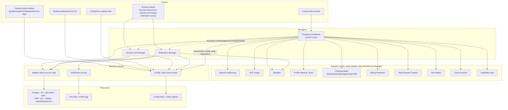
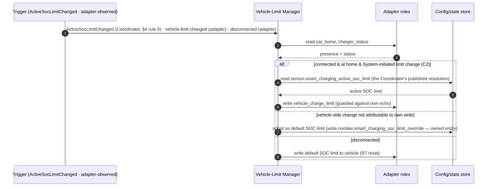
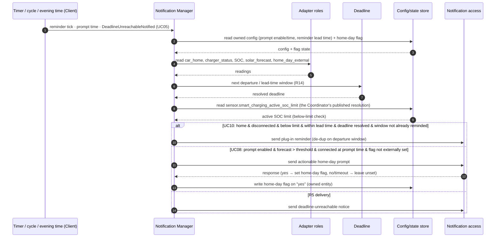

# System design — volatility-based decomposition

This document applies Juval Löwy's IDesign Method (volatility-based decomposition) to the Smart
Charging integration. It derives the **static architecture** (the services and the allowed call
directions between them) and the **dynamic architecture** (how those services collaborate to
realize each use case) from the drafted analysis: `system-overview.md`, `requirements.md`,
`control-cycle.md`, `resolution-rules.md`, `entity-catalog.md`, and the eleven use-cases
(`use-cases/UC01`–`UC11`).

The core discipline of the Method governs everything below: **the use cases validate the
decomposition; they never drive it.** Services encapsulate *areas of volatility* — what is likely
to change and why — not functions or use-case verbs. A use case that mapped one-to-one onto a
single service would be a warning sign, not a success. In this design most use cases cross several
services, and three of them (UC05, UC06, UC07) own no service at all — they are realized entirely
through engines the control-cycle Manager already composes.

Method vocabulary (`Client`, `Manager`, `Engine`, `Resource Access`, `Resource`) is design
vocabulary, not domain vocabulary; every *domain* term used here is already defined in
`system-overview.md`'s Ubiquitous Language glossary and is linked, not restated.

---

## 1. Relationship to the analysis docs and to the ADRs

This design is authoritative for **shape**: which services exist, what volatility each encapsulates,
and the one-way call directions between them. It does not restate behavior — `control-cycle.md`
stays authoritative for the order of operations in one cycle, `resolution-rules.md` for the
priority-ordered lookups, and `entity-catalog.md` for entity/role bindings. Where those documents
describe a *mechanism*, this document places that mechanism in a service and fixes who may call it.

**ADR reconciliation (the inverted order).** CLAUDE.md's prescribed order is *system design first,
then ADRs for the structural decisions it surfaces.* Here that order is inverted for the first nine:
ADRs 0001–0009 were written before this design existed. This document therefore doubles as a
**validation pass** over those nine ADRs against the Method. The reconciliation is in
[§8](#8-adr-reconciliation); in summary, every one of those ADRs' structural boundaries **aligns**
with this decomposition (each names a boundary this design derives independently), and this design
opens **no** superseding ADR. The entity-naming question ADR-0004 once left open is now
**resolved**: `entity-catalog.md` conforms to ADR-0004's native-entity naming (the "keep native
naming" path), so ADR-0004 stands and none is superseded. Two structural decisions this design made
explicit for the first time — the package home for the cross-cutting Engines, and modeling
cross-Manager coordination as domain-event publish/subscribe rather than direct calls — were
surfaced here as follow-ups and have since been **decided** by ADR-0010 and ADR-0011 respectively;
[§8.2](#82-adrs-written-after-this-design-0010-0019) reconciles those and the later ADRs
(0010–0019) that refine this design's mechanisms.

---

## 2. Volatilities (the cut)

Each row is an axis along which the system is likely to change, the reason it will change, and the
one service that encapsulates it. Services are catalogued in [§3](#3-service-catalog); the numbering
(V1…) is referenced from there.

| # | Volatility — *what varies* | Axis / why it changes | Encapsulated in |
| --- | --- | --- | --- |
| **V1** | **Hardware I/O access** — how each external sensor/actuator or signal is reached | Every installation exposes different upstream entities, platforms, and raw state strings; replacing a charger or car must not touch logic (NF3) | Resource-Access layer — one adapter per [adapter role](../analysis/system-overview.md#ubiquitous-language) |
| **V2** | **Charge set-point policy per mode** — the rule turning conditioned readings + targets into a desired current | Modes are added and tuned over time; each must be self-contained (NF2): `Solar`, `SolarOnly`, `Captar`, `Power`, `Off`, and future modes | Charging-Mode Engines |
| **V3** | **Mode-selection strategy** — how the [active mode](../analysis/system-overview.md#ubiquitous-language) is chosen over time | `Manual` vs `Auto` today; user-defined [profiles](../analysis/system-overview.md#ubiquitous-language) later (R16, NF1); the coordinator must never absorb this (NF1) | Profile (Mode-Selection) Engines |
| **V4** | **SOC-target policy** — what charge level to aim for and its lifecycle | Default / [solar step-up](../analysis/system-overview.md#ubiquitous-language) / [solar-reserve cap](../analysis/system-overview.md#ubiquitous-language) rules and thresholds evolve (R6–R9) | SOC-Target Engine |
| **V5** | **Deadline-urgency policy** — how the [departure deadline](../analysis/system-overview.md#ubiquitous-language), [required current](../analysis/system-overview.md#ubiquitous-language), and [urgency](../analysis/system-overview.md#ubiquitous-language) are determined and which levers they pull | Deadline sources (sensor/holiday/home-day/day-of-week), urgency thresholds, and the per-profile lever set (R5, R14, R15) | Deadline Engine |
| **V6** | **Billing-peak protection** — how charging is bounded to protect the CapTar [monthly peak demand](../analysis/system-overview.md#ubiquitous-language) | [Effective peak limit](../analysis/system-overview.md#ubiquitous-language) resolution, [safety margin](../analysis/system-overview.md#ubiquitous-language), grace period, and the `Power` opt-out (R3, C3, R17); tariff-regime specific | Billing-Protection Engine + Peak-Demand Tracker |
| **V7** | **Grid-safety (fuse) protection** — the hard ceiling on total net import | [Grid supply ceiling](../analysis/system-overview.md#ubiquitous-language)/[offset](../analysis/system-overview.md#ubiquitous-language) per installation; a physical-safety limit that is **never** waivable and must stay structurally separate from billing (C4, ADR-0006) | Grid-Safety Engine |
| **V8** | **Signal conditioning** — how raw readings become decision-ready values | [Smoothing](../analysis/system-overview.md#ubiquitous-language) window size (R10) and [supply-voltage](../analysis/system-overview.md#ubiquitous-language) resolution/fallback (NF4) are tunable | Signal-Conditioning Engine |
| **V9** | **Cycle invariants** — how the final set-point is bounded and start/stop churn prevented | Per-mode cooldown/hold durations (R11) and the C1 floor/cap; hardware fault-avoidance timing changes | Cycle-Invariant Engine |
| **V10** | **Capability gating** — which modes/behaviors exist for this installation | Capabilities declared per install (solar now, home battery later) must gate modes/behaviors without altering existing modes (R18, NF2) | Capability-Gate Engine |
| **V11** | **User notification & prompting** — when/what the user is told and how a response is captured | Reminder (R12), evening prompt (R13/UC08), deadline-unreachable (R5) policies and the delivery channel evolve | Notification Manager + Notification Resource Access |
| **V12** | **Vehicle charge-limit ownership** — keeping the car's own limit in sync bidirectionally | Write policy (C2 home-only), manual-adoption + feedback-loop guard, disconnect reset (R6) — a concern distinct from charger-current control | Vehicle-Limit Manager + `vehicle_charge_limit` Resource Access |
| **V13** | **Persistence / config placement** — where setup vs tuning vs user-state live | data (reconfigure-only) vs options (anytime) vs owned entity, and reload-on-change (ADR-0004/0005/0008) | Config/State Store Resource Access (the "Store") |
| **V14** | **Configuration & presentation surface** — install-time flow, options flow, runtime dashboard | Which entity is set where and how it is shown (R19); setup-once vs day-to-day | Clients (config flow, dashboard) |

Two notes on the cut:

- **V6 and V7 are split deliberately.** Billing-peak protection is a configurable *cost* concern
  that `Power` mode may waive (R17); grid-safety is a hard *physical* concern that no mode may
  waive (C4). ADR-0006 requires the two clamps to be distinct call sites so the `Power` opt-out can
  never reach C4; encapsulating them as two engines makes that boundary structural, not a
  convention.
- **V2 (modes) and V3 (profiles) are two volatilities, not one.** A mode decides *how much current
  now*; a profile decides *which mode over time*. NF1 forbids the coordinator from holding either.
  Keeping them separate is what lets a new mode or a new profile be added one at a time (NF2).

---

## 3. Service catalog

Each volatility from [§2](#2-volatilities-the-cut) is owned by exactly one service — or, where a
policy and its persistent state (or a Manager and its Resource Access) split naturally, by one such
pair (V6, V11, V12). Every service is classified as one of the five Method roles.

### Clients — consumers of the system (V14, and every runtime trigger)

| Client | What it does | Realizes |
| --- | --- | --- |
| **Control-interval timer** | Fires the control cycle every [control interval](../analysis/system-overview.md#ubiquitous-language) | `control-cycle.md` trigger |
| **Owned control entities** | The user sets [active profile](../analysis/system-overview.md#ubiquitous-language)/[mode](../analysis/system-overview.md#ubiquitous-language), default SOC limit, [Power target current](../analysis/system-overview.md#ubiquitous-language), departure times, [home-day flag](../analysis/system-overview.md#ubiquitous-language) (ADR-0004), through the Store like the dashboard and config flow below | R16, R6, R17, R14, R13 |
| **Runtime dashboard** | Observes charging status + every runtime-classified entity and edits them in place — **UC11** | R19 |
| **Install-time config flow / options flow** | Maps adapter roles, declares capabilities, sets install-time thresholds (data); tunes options anytime | R18, R19, R20, ADR-0003/0005 |
| **External event sources** | Charger connect/disconnect transitions; a user-made vehicle charge-limit change; a mobile-app notification action. The first two are external states the consuming Manager observes through the `charger_status`/`vehicle_charge_limit` adapter roles, never a minted domain event (ADR-0011) | UC08, UC09, UC10 |

The owned control entities, the config flow, and the dashboard are all Clients, not Managers: they
read/write owned/runtime entities and config-entry buckets through the Store, but hold no
orchestration or policy. UC11 has no service of its own for exactly this reason — it is a Client
rendering owned entities (via the Store) and adapter-role read-backs (via the Adapters, read-only —
R19's "no dashboard-specific logic per new entity" is a direct consequence). None of the three
triggers a Manager directly — the Control-interval timer is the Coordinator's only trigger (§4
rule 1), and the Coordinator reads every owned control entity's current value through the Store on
its own cycle, the same way it reads hardware through the Adapters. A user action here takes effect
on the Coordinator's next scheduled cycle, not immediately — NF1 already requires the coordinator
to hold none of this state itself, and R11's mode-switch timer reset keys off the *active mode*
the Profile Engine returns each cycle (which the Coordinator already diffs against the prior
cycle), not off a push notification, so no use-case loses anything by reading on the next cycle
instead of being pushed to immediately.

The integration also owns **diagnostic output entities** the Coordinator *writes* (never the
user): `sensor.smart_charging_monthly_peak_kw`, the Fault/OK status sensor (ADR-0007), and the
resolved-value read-outs the dashboard surfaces (active mode,
`sensor.smart_charging_effective_peak_limit`, `sensor.smart_charging_active_soc_limit` — the last
being the entity `ActiveSocLimitChanged` fires on, per ADR-0011). These are
written through the Store exactly like the control entities above — the only difference is which
end writes and which end reads, not whether the Store mediates. The dashboard consumes diagnostic
entities read-only through the Store; it can both read and write the control entities above.

### Managers — orchestrate one workflow's ordered steps

| Manager | Workflow it orchestrates | Volatilities it composes | Use cases realized |
| --- | --- | --- | --- |
| **Charging Coordinator** | The control cycle (`control-cycle.md`): read → condition → resolve targets → select mode → compute set-point → clamp → enforce invariants → write | V1, V8, V4, V5, V10, V3, V2, V6, V7, V9 | UC01, UC02, UC03, UC04, **UC05, UC06, UC07** |
| **Vehicle-Limit Manager** | Bidirectional [vehicle charge-limit](../analysis/system-overview.md#ubiquitous-language) sync: write on limit change, adopt manual changes, reset on disconnect (C2) | V12, V1 (`vehicle_charge_limit`, `car_home`, `charger_status`), V13, V4 (consumed as the Coordinator's published resolution, [§5.2](#52-vehicle-charge-limit-sync-uc09)) | UC09 |
| **Notification Manager** | Evaluate a time/condition trigger → deliver a message → (for the prompt) capture the response | V11, V1, V5, V13, V4 (consumed as the Coordinator's published resolution, [§5.3](#53-notification-plug-in-reminder-uc10--evening-prompt-uc08)) | UC08, UC10, and delivery of R5's deadline-unreachable notice |

Only **three** Managers realize eleven use cases. UC05/UC06/UC07 are the decisive validation of the
cut: none is a service. Deadline urgency (UC05) is the Deadline Engine plus the Billing-Protection
Engine's ceiling-raise and the `Auto` Profile Engine's own escalation row, all invoked in the
Coordinator's normal cycle. The solar step-up (UC06) is the only Engine whose *decision* changes —
SOC-Target's, gated by plain input flags the Coordinator already holds (the active profile and the
previous cycle's active mode; R8) — but UC06 still rides the full cycle (conditioning, mode
dispatch, both clamps, invariants), so it is not a one-use-case-to-one-engine mapping either (see
§6's smell note). The solar-reserve cap (UC07) splits across two services: the SOC-Target Engine
writes row 1 of the active-SOC-limit lookup, while declining opportunistic overnight top-up is the
`Auto` Profile Engine declining to match row 4 of its own mode-selection table (R9) — not a second
call, since mode selection is already the Profile Engine's job. The Coordinator evaluates R9's
five-part reserve condition once and passes the resulting flag to both, the same input-not-a-call
pattern capability gating uses (below) — the condition is not independently re-evaluated inside
either engine. All three "happen" inside the one cycle the Coordinator already runs.

### Engines — reusable policy scoped to one volatility (never orchestrate, never do I/O)

| Engine | Volatility | Decides |
| --- | --- | --- |
| **Charging-Mode Engines** (`Solar`, `SolarOnly`, `Captar`, `Power`, `Off`) | V2 | Desired charger current from conditioned readings + resolved SOC limit + config (per UC01–UC04; `Off` → 0 A) |
| **Profile Engines** (`Manual`, `Auto`) | V3 | Which mode is active, given observable conditions passed in — one profile-specific mode-selection table: `Manual` → the user's own selection, no rules table; `Auto` → the full `resolution-rules.md` Auto mode-selection table (row 2 escalates to `Captar`/`Power` under deadline urgency, R5; row 4 declines to match while the reserve cap holds, R9) |
| **SOC-Target Engine** | V4 | The single [active SOC limit](../analysis/system-overview.md#ubiquitous-language) (reserve cap → step-up → default) and its lifecycle transitions (R7/R8/R9) |
| **Deadline Engine** | V5 | Resolved departure deadline, required current, whether urgency is in effect, and what it is willing to spend (R5/R14/R15) |
| **Billing-Protection Engine** | V6 | Effective peak limit and the R3 peak clamp (skippable only by `Power`'s R17 opt-out) |
| **Peak-Demand Tracker** | V6 (state) | The [monthly peak demand](../analysis/system-overview.md#ubiquitous-language) accumulated from net import, reset monthly (`sensor.smart_charging_monthly_peak_kw`) |
| **Grid-Safety Engine** | V7 | The C4 grid-supply-ceiling clamp — no opt-out, runs every cycle |
| **Signal-Conditioning Engine** | V8 | Smoothed `net_w` (R10 — `solar_w` is read raw and never smoothed) and resolved supply voltage (NF4) |
| **Cycle-Invariant Engine** | V9 | The final current after R11 cooldown/hold gating and the C1 floor/cap |
| **Capability-Gate Engine** | V10 | Whether a given mode/behavior is available for the declared capabilities (R18) |

Engines come in two kinds, but share one hard rule: **no Engine performs Home Assistant / adapter
I/O and no Engine calls another Engine.** Cross-engine composition and all I/O are the Coordinator's
job (it reads once, then feeds each engine) — see the call rules in [§4](#4-static-architecture).

- **Pure/leaf Engines** hold no cross-cycle state: the Charging-Mode Engines, the Profile Engines,
  the Deadline, Billing-Protection, Grid-Safety, Capability-Gate, and **SOC-Target** Engines. Data
  in, decision out — SOC-Target's R8 step-up progression (whether a step has already been applied)
  is a plain input flag the Coordinator threads in alongside the profile/mode flags, the same
  shape as any other conditional input, not the cross-cycle *accumulation* (a window, a timer, a
  running total) the three stateful Engines below hold.
- **Stateful Engines** operate over cross-cycle state that the **Manager owns and threads in and
  out** — the state is a parameter, never HA-held inside the engine, so the engine stays testable
  in isolation. Three engines are stateful, per ADR-0010: **Signal-Conditioning** (the R10
  smoothing window), **Cycle-Invariant** (the R11 cooldown/hold timers), and the **Peak-Demand
  Tracker** (the running
  [monthly peak demand](../analysis/system-overview.md#ubiquitous-language)). The Tracker's result
  is surfaced as the owned `sensor.smart_charging_monthly_peak_kw`, but that *write* is the Coordinator's, via
  the Store — the engine only computes the new value.

This two-kind split is what keeps the ADR-0009 test strategy honest: pure and stateful engines
alike are exercised with plain pytest by passing state in, because none of them touches HA — the
same boundary ADR-0002/ADR-0006 draw. (ADR-0006 keeps smoothing as a *coordinator step* over
coordinator-held state; classifying it as a stateful engine here is the same boundary, just named —
the smoothing state is still the Coordinator's, threaded into a conditioning routine.)

**R8's solar step-up is realized entirely inside the SOC-Target Engine, not the Profile Engine.**
Raising the active SOC limit in steps (R8) is a SOC-limit computation, not a mode-selection
decision, so it stays inside SOC-Target's own volatility (V4). Its `Auto`-only gate is plain input
flags the Coordinator already holds — the active profile, and the previous cycle's active mode
(`resolution-rules.md`'s "while charging in a solar mode" condition; the Profile Engine's own mode
for *this* cycle isn't resolved yet at this point in the sequence, so SOC-Target reads a one-cycle-
old value, matching R8's own "next control cycle" framing) — passed to SOC-Target directly, the
same input-not-a-call pattern the capability-gating aside below uses. This is why R8 needs no
Profile→SOC-Target edge, unlike R9's top-up decline, which stays inside Profile because it *is* a
mode-selection outcome (declining to match row 4 of the table above), not a call to another
engine.

**Capability gating (R18) has two realizations, only one of which is the Engine.** At *runtime* the
Coordinator calls the Capability-Gate Engine to constrain `Auto`'s mode-selection and to gate
solar-dependent behaviors. But the **manual mode selector's option list** (`select.smart_charging_mode`
offering only available modes, per `entity-catalog.md`) is not a runtime Client→Engine call — Clients may
only call Managers (rule 1). It is fixed when the owned selector entity is *created*, at setup and
on reload, from the declared capabilities in config-entry **data** (ADR-0005/0008). The same
capability facts drive both; the entity-definition path avoids a forbidden Client→Engine edge.

### Resource Access — encapsulates *how* one resource is reached (no policy)

- **Adapter roles (V1)** — one class per role in `entity-catalog.md`, sharing the `Adapter`
  protocol (`read()` / `write(value)`), ADR-0003: `charger_current` (r/w), `charger_power`,
  `charger_status` (with the raw→canonical translation table), `ev_soc`, `ev_battery_capacity`,
  `vehicle_charge_limit` (r/w), `car_home`, `net_power`, `grid_voltage`, `solar_power`,
  `solar_forecast`, `low_tariff`, `departure_external`, `home_day_external`. Each isolates one
  upstream entity's access mechanics — nothing more. A role returning `None` is the fault signal
  ADR-0007 funnels into the C1/R11 stop path (grid voltage excepted, NF4).
- **Notification Resource Access (V11)** — reaches the HA `notify` service / mobile app to deliver
  a message and receive an actionable response.
- **Config/State Store access (V13)** — reads config-entry **data** (role mappings, translation
  tables, capabilities) and **options** (tunable thresholds, control interval), and reads **and
  writes** owned-entity state via HA's entity registry (ADR-0004/0005): the owned control entities
  and the dashboard/config-flow Clients edit runtime entities through it, and the Coordinator reads
  every owned control entity's current value through it once per cycle (ADR-0018) — the read/write
  direction this section is authoritative for. The diagnostic outputs
  (`sensor.smart_charging_monthly_peak_kw`, `sensor.smart_charging_effective_peak_limit`,
  `sensor.smart_charging_active_soc_limit`, the Fault/OK status sensor per ADR-0007) go the other
  way: they are `CoordinatorEntity` subclasses that pull their state directly from the Coordinator's
  own per-cycle result (ADR-0016's Context, left out of that ADR's scope and unchanged since), not
  values the Coordinator pushes through the Store — "surfaced through the Store" above described
  their *conceptual* home in the Store's owned-entity bucket, not this literal write mechanism.
  The Vehicle-Limit and Notification Managers write owned entities
  (`number.smart_charging_soc_limit_override`, the home-day flag) through the Store on the user's
  behalf, the same ADR-0018 write path as the Coordinator's own reads. Both also **read** one
  diagnostic entity back through it — `sensor.smart_charging_active_soc_limit`, the Coordinator's
  published active-SOC-limit resolution (§5.2's vehicle write, §5.3's UC10 below-limit check) —
  which is a Store read like any other regardless of how the Coordinator surfaces the value. No custom persistence
  layer — HA's restore-state carries owned-entity values. ADR-0019 places the Store class in the
  same package as the hardware adapters.

### Resources — the external things reached

The charger, the EV, the grid meter, the solar system, the tariff signal, `sun.sun`, the holiday
source, the external departure sensor, the calendar/presence source, the HA `notify`
service/mobile app, and Home Assistant's own config-entry + entity registry (the state store).
Raw upstream entities are never referenced by logic directly (NF3) — only their adapter reaches
them.

---

## 4. Static architecture

```mermaid
flowchart TD
    subgraph Clients
        Timer["Control-interval timer"]
        Owned["Owned control entities<br/>(profile/mode/SOC/departure/home-day)"]
        Dash["Runtime dashboard (UC11)"]
        Cfg["Config flow / options flow"]
        Ext["External events<br/>(connect·disconnect, vehicle limit change,<br/>notification action)"]
    end

    subgraph Managers
        Coord["Charging Coordinator<br/>(control cycle)"]
        VLM["Vehicle-Limit Manager"]
        NM["Notification Manager"]
    end

    subgraph Engines["Engines (no I/O; some stateful, state threaded by Manager)"]
        SC["Signal-Conditioning"]
        SOC["SOC-Target"]
        DL["Deadline"]
        Prof["Profile (Manual / Auto)"]
        Mode["Charging-Mode (Solar/SolarOnly/Captar/Power/Off)"]
        Bill["Billing-Protection"]
        PDT["Peak-Demand Tracker"]
        Grid["Grid-Safety"]
        Inv["Cycle-Invariant"]
        Cap["Capability-Gate"]
    end

    subgraph RA["Resource Access"]
        Adapters["Adapter roles (one per role)"]
        NotifyRA["Notification access"]
        Store["Config / state store access"]
    end

    subgraph Resources
        HW["Charger · EV · grid meter · solar ·<br/>tariff · sun · holiday · calendar/presence"]
        NotifySvc["HA notify / mobile app"]
        Persist["Config entry + entity registry"]
    end

    Timer --> Coord
    Owned --> Store
    Ext --> VLM
    Ext --> NM
    Dash --> Store
    Cfg --> Store

    Coord --> SC & SOC & DL & Prof & Mode & Bill & PDT & Grid & Inv & Cap
    NM --> DL

    Coord --> Adapters
    VLM --> Adapters & Store
    NM --> Adapters & NotifyRA & Store
    Coord -->|reads/writes config, state, diagnostics| Store

    Adapters --> HW
    NotifyRA --> NotifySvc
    Store --> Persist

    Coord -. DeadlineUnreachableNotified .-> NM
    Coord -. ActiveSocLimitChanged .-> VLM
```

**Allowed call directions (one-way only):**

1. `Client → Manager` — Clients trigger Managers; a Manager never calls a Client. Every genuine
   trigger source (the Control-interval timer, the Notification Manager's own reminder/evening-time
   checks in [§5.3](#53-notification-plug-in-reminder-uc10--evening-prompt-uc08), and External
   event sources) reaches a Manager this way; the owned control entities, the dashboard, and the
   config flow are the exception that proves the rule — none of the three is a trigger source, and
   none holds orchestration, so none of them calls a Manager and none is called by one. Their state
   access — reading or writing owned/runtime entities and config-entry buckets — goes only through
   the Store (the dashboard additionally reads adapter-role read-backs, read-only, for display). The
   Coordinator (a Manager) reaches the owned control entities' current values itself, through the
   Store (rule 2/3 below) — never the reverse.
2. `Manager → {Engine, Resource Access}` — Managers orchestrate. They read inputs through Resource
   Access, feed them to pure Engines, and write results through Resource Access. The rule permits
   *any* Manager→Engine call; the solid edges above draw only the ones this design realizes, so an
   absent one is an absent use and not a prohibition — see
   [§5.3](#53-notification-plug-in-reminder-uc10--evening-prompt-uc08)'s "What the static diagram
   draws".
3. `Resource Access → Resource` — adapters/notification/store access reach the external thing.
4. **Engines call nothing below them.** They receive data and return a decision. They do **not**
   call Resource Access (the Manager supplies their inputs) and do **not** call each other — with
   **no exception**. Capability gating is not a Profile→Capability-Gate call: the Coordinator
   invokes the Capability-Gate Engine and passes the set of available modes to the Profile Engine
   as an input, so the Profile stays a pure function of its inputs. No Engine performs I/O.
5. **Managers do not call each other.** Cross-Manager coordination is **publish/subscribe on
   domain events** (dashed edges), which maps one-to-one onto Home Assistant automation triggers
   (the DDD domain-event convention in CLAUDE.md). ADR-0011 settled the vocabulary this design left
   open, by a criterion: **publish a domain event iff the trigger is an integration-computed domain
   transition the consumer could not observe without duplicating the producer's computation;
   re-derive it by observing the adapter iff the trigger is an external HA state the consumer
   already reaches through Resource Access.** That leaves exactly **two** genuine Manager→Manager
   edges as of ADRs 0001–0019 (see [§8.2](#82-adrs-written-after-this-design-0010-0019)'s scope
   note; ADR-0024 later adds a third, paired with the first below), both event-based:
   - `DeadlineUnreachableNotified` (UC05) — the Coordinator (via the Deadline Engine's
     determination) publishes it; the Notification Manager subscribes to deliver R5's notice.
   - `ActiveSocLimitChanged` (UC09) — the Coordinator publishes it when the resolved [active SOC
     limit](../analysis/system-overview.md#ubiquitous-language) changes between cycles; the
     Vehicle-Limit Manager subscribes to write the new value to the vehicle. It fires on the owned
     diagnostic entity `sensor.smart_charging_active_soc_limit`, which the Coordinator materializes
     through the Store, so the event maps to an HA state-change trigger. It subsumes the
     cause-specific step-up/reserve-cap transitions into one consumer contract.

   The two remaining Manager triggers are **not** cross-Manager events at all: a charger
   connect/disconnect transition on `charger_status` and a vehicle-side change on
   `vehicle_charge_limit` are external states whose producer is the hardware, reached through their
   adapter (NF3) and already broadcast by HA — each Manager observes them through its own read.

**What each layer must not hold:** an Engine holding a multi-step orchestration, or a Resource
Access holding a business rule, is a boundary violation. The charger-status adapter, for instance,
translates raw→canonical (mechanics) but never decides what a status *means* for charging (policy —
that lives in the mode/coordinator).

---

## 5. Dynamic architecture

One sequence per major workflow, showing the Manager orchestrating Engines and Resource Access
in the order the corresponding flow document specifies.

### 5.1 Control cycle (realizes UC01–UC04, and UC05–UC07 in passing)

```mermaid
sequenceDiagram
    autonumber
    participant T as Timer (Client)
    participant C as Charging Coordinator
    participant S as Config/state store
    participant A as Adapter roles
    participant SC as Signal-Conditioning
    participant SOC as SOC-Target
    participant DL as Deadline
    participant Cap as Capability-Gate
    participant P as Profile
    participant M as Active Mode
    participant B as Billing-Protection
    participant G as Grid-Safety
    participant I as Cycle-Invariant

    T->>C: control interval fires
    C->>S: read owned control-entity values (profile, mode, SOC override, target current, departure times, home-day flag)
    S-->>C: current values (user- or Manager-written since last cycle, if any)
    C->>A: read raw (net_w, solar_w, charger_w, voltage, status, SOC)
    A-->>C: raw readings (or None → fault path, ADR-0007)
    C->>SC: smooth net_w (R10) + resolve voltage (NF4)
    SC-->>C: smoothed net_w + supply voltage
    C->>DL: resolve departure deadline — today + one-day-ahead (R14)
    DL-->>C: resolved deadlines
    C->>SOC: resolve active SOC limit (R7: cap→step-up→default; cap row uses tomorrow's deadline<br/>+ the R9 reserve flag below; step-up row uses active profile + prior cycle's active mode, R8)
    SOC-->>C: active SOC limit
    C->>S: materialize sensor.smart_charging_active_soc_limit (publish ActiveSocLimitChanged if it differs from the prior cycle)
    C->>DL: required current & urgency? (R5/R15, using active SOC limit)
    DL-->>C: urgency flag + required current
    C->>Cap: available modes for declared capabilities (R18)
    Cap-->>C: available modes
    Note over C: evaluate R9's reserve condition once (home-day, forecast, no deadline tomorrow)
    C->>P: which mode? (Manual: user selection · Auto: mode-selection w/ urgency, tariff, sun, surplus,<br/>active SOC limit, available modes, R9 reserve flag)
    P-->>C: active mode
    C->>M: desired current (conditioned readings, SOC limit, config)
    M-->>C: desired current
    C->>B: peak clamp on raw (skip iff Power+R17 off) · effective peak limit (raised iff urgency)
    B-->>C: peak-clamped current
    C->>G: grid-supply-ceiling clamp on raw (C4, always)
    G-->>C: ceiling-clamped current
    C->>I: R11 cooldown/hold gating + C1 floor/cap
    I-->>C: final current
    C->>A: write charger_current (skip if unchanged)
    Note over C: publish ChargerCurrentSet / ActiveSocLimitReached /<br/>DeadlineUnreachableNotified as applicable<br/>(ActiveSocLimitChanged already published above, at the resolution step)
```

The same sequence realizes every charging mode — only the Profile's answer (step: which mode) and
the active Mode Engine differ. **UC05** rides this sequence: the Deadline Engine returns urgency,
the Billing-Protection Engine raises the effective peak limit, and under `Auto` the Profile
escalates to `Captar`. **UC06/UC07** ride it too: the SOC-Target Engine returns a stepped-up or
capped limit; no other step changes.

### 5.2 Vehicle charge-limit sync (UC09)

```mermaid
sequenceDiagram
    autonumber
    participant Ev as Trigger (ActiveSocLimitChanged · adapter-observed)
    participant V as Vehicle-Limit Manager
    participant A as Adapter roles
    participant S as Config/state store

    Ev->>V: ActiveSocLimitChanged (Coordinator, §4 rule 5) · vehicle-limit changed (adapter) · disconnected (adapter)
    V->>A: read car_home, charger_status
    A-->>V: presence + status
    alt connected & at home & System-initiated limit change (C2)
        V->>S: read sensor.smart_charging_active_soc_limit (the Coordinator's published resolution)
        S-->>V: active SOC limit
        V->>A: write vehicle_charge_limit (guarded against own echo)
    else vehicle-side change not attributable to own write
        V->>S: adopt as default SOC limit (write number.smart_charging_soc_limit_override — owned entity)
    else disconnected
        V->>A: write default SOC limit to vehicle (R7 reset)
    end
```

The Vehicle-Limit Manager takes the resolved [active SOC limit](../analysis/system-overview.md#ubiquitous-language)
from the materialized diagnostic entity the `ActiveSocLimitChanged` event fires on, not by
recomputing it: the resolution is a composition of the pure SOC-Target Engine with the
step-up/reserve context the Coordinator threads across cycles, and only the Coordinator holds that
composition (ADR-0011). The Vehicle-Limit Manager therefore makes no SOC-Target call of its own, so
[§4](#4-static-architecture) draws no `VLM → SOC-Target` edge; the edge nonetheless remains legal —
ADR-0011 keeps it available as a shared edge, it is simply not the source of the cross-cycle change
signal. See [§5.3](#53-notification-plug-in-reminder-uc10--evening-prompt-uc08) for what the static
diagram's Manager→Engine edges do and do not assert.

### 5.3 Notification: plug-in reminder (UC10) & evening prompt (UC08)

```mermaid
sequenceDiagram
    autonumber
    participant Trg as Timer / cycle / evening time (Client)
    participant N as Notification Manager
    participant A as Adapter roles
    participant DL as Deadline
    participant S as Config/state store
    participant R as Notification access

    Trg->>N: reminder tick · prompt time · DeadlineUnreachableNotified (UC05)
    N->>S: read owned config (prompt enable/time, reminder lead time) + home-day flag
    S-->>N: config + flag state
    N->>A: read car_home, charger_status, SOC, solar_forecast, home_day_external
    A-->>N: readings
    N->>DL: next departure / lead-time window (R14)
    DL-->>N: resolved deadline
    N->>S: read sensor.smart_charging_active_soc_limit (the Coordinator's published resolution)
    S-->>N: active SOC limit (below-limit check)
    alt UC10: home & disconnected & below limit & within lead time & deadline resolved & window not already reminded
        N->>R: send plug-in reminder (de-dup on departure window)
    else UC08: prompt enabled & forecast > threshold & connected at prompt time & flag not externally set
        N->>R: send actionable home-day prompt
        R-->>N: response (yes → set home-day flag, no/timeout → leave unset)
        N->>S: write home-day flag on "yes" (owned entity)
    else R5 delivery
        N->>R: send deadline-unreachable notice
    end
```

UC10's below-limit check compares state of charge against the resolved [active SOC
limit](../analysis/system-overview.md#ubiquitous-language) (`resolution-rules.md`, R7), so the
Notification Manager takes that value from the materialized diagnostic entity, exactly as
[§5.2](#52-vehicle-charge-limit-sync-uc09)'s Vehicle-Limit Manager does. ADR-0011's reasoning
reaches a point-in-time read as much as a change signal, because it turns on the *input
composition*, not on change-detection: the resolved value composes the pure SOC-Target Engine with
the step-up/reserve context the Coordinator threads across cycles, and a consumer holding only its
own inputs cannot reconstruct that. A bare `N → SOC-Target` call would therefore answer a
*different* question — the limit implied by the Notification Manager's own inputs — than the one
UC10 asks. The Deadline Engine call above is unaffected: R14's deadline resolution takes no
Coordinator-threaded state, so calling it directly returns the answer the Coordinator would get.

The read is unsolicited, unlike §5.2's — nothing guarantees the entity is populated when the
reminder tick fires. Before the Coordinator's first cycle, or while the diagnostic entity is
unavailable, UC10's below-limit precondition is simply not established and no reminder is due; once
populated, the value carries the same one-cycle latency [§3](#3-service-catalog) already accepts for
every Store read. UC10 records no exception flow for the unpopulated case.

**What the static diagram draws.** [§4](#4-static-architecture)'s solid Manager→Engine edges are the
calls this design realizes somewhere — in a §5 sequence, or in [§3](#3-service-catalog)'s and §4's
own prose — not the calls rule 2 permits. Rule 2 permits any Manager to call any Engine, so an
absent Manager→Engine edge records an absent *use*, never a prohibition. (This reading is specific
to that layer: an absent `Client → Manager` edge **is** deliberate, since rule 1 reserves that
direction for genuine trigger sources; and the dashed cross-Manager edges are enumerated by rule 5,
not by this paragraph.) Neither the Notification
Manager (this section) nor the Vehicle-Limit Manager ([§5.2](#52-vehicle-charge-limit-sync-uc09))
calls the SOC-Target Engine any more, so neither edge is drawn; ADR-0011's note that the shared
`VLM → SOC-Target` edge "remains available" is preserved in §5.2's prose and [§6](#6-use-case-validation)'s
smell note, which is where a legal-but-unused edge belongs.

---

## 6. Use-case validation

Each use case walked against the static diagram; every step is reachable end-to-end through the
allowed call directions. A use case crossing several services is the expected, healthy result.

| UC | Realized by | Services crossed (validation) |
| --- | --- | --- |
| **UC01** Solar surplus | Coordinator cycle | Timer→Coordinator→{Store(read owned control entities), Adapters, Signal-Conditioning, SOC-Target, Profile, `Solar` Mode, Billing-Protection, Grid-Safety, Cycle-Invariant}→Adapters(write). ✅ crosses 9 services |
| **UC02** Solar only | Coordinator cycle | as UC01 with the `SolarOnly` Mode Engine; clamps typically inert (net ≤ 0). ✅ |
| **UC03** Captar | Coordinator cycle | as UC01 with `Captar` Mode + Billing-Protection doing the real work (peak clamp + effective peak limit) + Peak-Demand Tracker. ✅ |
| **UC04** Power | Coordinator cycle | as UC01 with `Power` Mode; Billing-Protection **skipped iff** R17 off; Grid-Safety still runs; Capability-Gate/selector gate availability. ✅ |
| **UC05** Deadline | Coordinator cycle (no own service) | Deadline Engine (urgency) + Billing-Protection (ceiling raise) + Profile (`Auto` escalation) + Notification Manager (unreachable notice via event). ✅ **spans 4 services, owns none** |
| **UC06** Solar step-up | SOC-Target Engine, within cycle | Coordinator→SOC-Target (writes step-up row); Mode Engines read the resolved limit. ✅ owns no service |
| **UC07** Solar reserve | SOC-Target + Profile, within cycle | Coordinator→SOC-Target (cap row) + `Auto` Profile (declines overnight top-up) gated by Deadline Engine (tomorrow) + Capability-Gate. ✅ owns no service |
| **UC08** Evening prompt | Notification Manager | Trigger→NM→{Adapters, Deadline, Notification access}→writes home-day flag through Store. ✅ |
| **UC09** Charge-limit sync | Vehicle-Limit Manager | `ActiveSocLimitChanged` (or an adapter-observed vehicle-limit/disconnect change)→VLM→{Store(resolved active SOC limit, default-limit write), Adapters(`vehicle_charge_limit`, `car_home`, status)}. ✅ |
| **UC10** Plug-in reminder | Notification Manager | Trigger→NM→{Adapters, Deadline, Store(owned config + resolved active SOC limit), Notification access}. ✅ |
| **UC11** Dashboard | Client (no service) | Dashboard→Store (owned/runtime entities) + Adapter read-backs; edits flow to the same entities other UCs consume. ✅ correctly owns no Manager/Engine |

No use case maps one-to-one onto a single **Engine**. The three that own no service (UC05–UC07) and
the one that is a pure Client (UC11) confirm the decomposition is volatility-driven, not functional.
The one mapping to watch is **UC09 ↔ Vehicle-Limit Manager**: UC09 is the only use case realized by
a single Manager whose orchestration is essentially that one use case (it reuses the shared Store
and adapters — and the SOC-Target edge remains available to it — but adds no second consumer).
This is an accepted, deliberate case,
not a functional-decomposition slip — V12 (bidirectional charge-limit ownership: the C2 home-only
write policy, the manual-adoption/echo guard, the disconnect reset) is a genuine volatility distinct
from charger-current control, and folding it into the Coordinator would blur NF-level boundaries.
We record the smell rather than count shared engines to explain it away.

---

## 7. Requirement reachability

Every requirement is reachable from at least one service:

- **R1/R2/R4/R17** → the corresponding Charging-Mode Engine. **NF2** → the Mode + Profile Engine
  families (one unit each). **NF1** → Profile Engine holds selection; Coordinator holds none.
- **R3/C3** → Billing-Protection Engine; **C4** → Grid-Safety Engine (separate, un-waivable);
  **R21** (the self-tracked monthly peak demand) → Peak-Demand Tracker.
- **R5/R15** → Deadline Engine (+ Billing-Protection ceiling raise + `Auto` Profile escalation +
  Notification for unreachable). **R14** → Deadline Engine's deadline resolution.
- **R6/C2** → Vehicle-Limit Manager. **R7/R8** → SOC-Target Engine (R8's `Auto`-only gate is plain
  input flags — active profile + previous cycle's active mode — not a Profile call; see §3).
  **R9** has two halves: SOC-Target Engine (lowering the limit to the reserve cap) **and** the
  `Auto` Profile Engine (declining to match row 4 of its own mode-selection table) — one shared
  reserve-condition input (evaluated once by the Coordinator, §3), two services.
- **R10/NF4** → Signal-Conditioning Engine. **R11/C1** → Cycle-Invariant Engine.
- **R12/R13** → Notification Manager (+ home-day flag as owned state). **R16** → Profile Engines
  (its mode-selection table also realizes R5's escalation row and R9's top-up-decline half; R8's
  step-up and R9's cap-lowering half are both realized entirely in SOC-Target Engine, above).
- **R18** → Capability-Gate Engine. **R19** → dashboard + config-flow Clients over the Store.
- **NF3** → Resource-Access (adapter) layer. Fault handling (ADR-0007) → Coordinator routing a
  `None`/exception into the Cycle-Invariant stop path **and** setting the owned Fault/OK status
  sensor through the Store.

---

## 8. ADR reconciliation

[§8.1](#81-adrs-that-predate-this-design-0001-0009) reconciles the nine ADRs written *before* this
design (the inverted order [§1](#1-relationship-to-the-analysis-docs-and-to-the-adrs) describes);
[§8.2](#82-adrs-written-after-this-design-0010-0019) reconciles the ten written *after* it, which
refine this design's mechanisms in the order CLAUDE.md prescribes.

### 8.1 ADRs that predate this design (0001-0009)

This design was derived independently of ADRs 0001–0009 and then checked against them. Result:
every ADR's *structural boundary* aligns with a boundary this decomposition arrives at on its own,
and **none is superseded**. The entity-naming question ADR-0004 once left open is now **resolved**:
`entity-catalog.md` conforms to ADR-0004's native-entity naming (see its row below), so ADR-0004
stands unchanged.

| ADR | Subject | Verdict | Mapping to this design |
| --- | --- | --- | --- |
| 0001 | Use ADRs | Aligns | Process, not structure. |
| 0002 | Package layout (`adapters/`, `modes/`, `profiles/`, `entity.py`, `coordinator.py`) | **Aligns** | `adapters/` = Resource-Access (V1); `modes/` = Charging-Mode Engines (V2); `profiles/` = Profile Engines (V3); `coordinator.py` = the Charging Coordinator Manager; `entity.py` = owned-entity Clients. The remaining Engines (SOC-Target, Deadline, Billing-Protection, Grid-Safety, Signal-Conditioning, Cycle-Invariant, Capability-Gate, Peak-Demand Tracker) needed a home, which ADR-0010 has since given them (`engines/`, §8.2). |
| 0003 | Config-flow entity mapping + Python adapters | **Aligns** | Exactly the Resource-Access layer for V1; one class per role, `Adapter` protocol, translation table = access mechanics with no policy. |
| 0004 | Owned vs mapped entities | **Aligns; naming resolved** | Structurally exact: mapped = Resources reached via adapters; owned = Client control entities + coordinator-written diagnostic sensors over the Store (V13/V14). ADR-0004 decided owned entities are *native platform entities* under the `smart_charging_` prefix (e.g. `select.smart_charging_profile`, `number.smart_charging_soc_limit_override`, `select.smart_charging_mode`, `sensor.smart_charging_monthly_peak_kw`), and `entity-catalog.md` now conforms to that naming — so this design cites the **native** names throughout and there is no remaining conflict to resolve. (The install-time/tuning `sc_`-prefixed *helper* rows are a separate concern, deferred to a future catalog reconciliation; they are not owned control/diagnostic entities and are untouched here.) |
| 0005 | Config-entry data vs options; interval placement | **Aligns** | The Store's two buckets (V13); the control interval configures the Timer Client, not an Engine. |
| 0006 | Coordinator & data flow; two distinct clamps | **Aligns (load-bearing)** | The Charging Coordinator Manager; its ten steps = the [§5.1](#51-control-cycle-realizes-uc01uc04-and-uc05uc07-in-passing) sequence; two clamps = the separate Billing-Protection (V6) and Grid-Safety (V7) Engines; "mode modules are pure, no HA access" = this design's Engine-purity rule. |
| 0007 | Fault handling (force 0 A + Fault) | **Aligns** | The Coordinator routes an adapter `None`/exception into the Cycle-Invariant Engine's C1/R11 stop path; grid-voltage fallback stays in Signal-Conditioning (NF4), not the fault path. |
| 0008 | Reload on reconfigure/options change | **Aligns** | A Store change reloads the entry, recreating the Coordinator + Engines from a clean state; no cross-reload timer preservation. |
| 0009 | Testing strategy | **Aligns** | Pure Engines → plain pytest; Managers + Resource Access → HA harness. This design's Engine-purity rule is what makes the split hold. |

The two structural decisions this design surfaced but did not itself decide — a package home for
the cross-cutting Engines, and the cross-Manager domain-event vocabulary — were opened as ADR-0010
and ADR-0011, and are reconciled below together with the eight ADRs that followed them.

### 8.2 ADRs written after this design (0010-0019)

These ten were written *after* this design, in CLAUDE.md's prescribed order: the design surfaced
the structural question, the ADR decided it. The verdict column therefore reads differently from
[§8.1](#81-adrs-that-predate-this-design-0001-0009)'s — the question is not "does a pre-existing
boundary align?" but "does the decision hold this design's boundary, narrow it, or extend it?" No
ADR in this range contradicts the decomposition; the two that changed a mechanism this document
described (ADR-0011, ADR-0018) are reflected in the text above rather than left as divergences.

| ADR | Subject | Verdict | Mapping to this design |
| --- | --- | --- | --- |
| 0010 | Package home for the cross-cutting Engines (`engines/`) | **Decides a §8.1 follow-up; extends ADR-0002** | The eight Engines [§3](#3-service-catalog) names beyond `modes/`/`profiles/` get one module each under `engines/`, mirrored by `tests/engines/`. The directory boundary *is* this design's Engine-purity rule ([§4](#4-static-architecture) rule 4) made structural, and the stateful Engines need no special home because their state is a Manager-threaded parameter — exactly [§3](#3-service-catalog)'s two-kind split. No service, edge, or volatility changes. |
| 0011 | Cross-Manager coordination via domain events | **Decides a §8.1 follow-up; narrows rule 5** | Keeps the *pattern* this design fixed (no direct Manager→Manager calls) and supplies the vocabulary it declined to invent: publish an event iff the trigger is an integration-computed transition, re-derive it through the adapter iff it is external state. Result: two event edges (`DeadlineUnreachableNotified`, the new `ActiveSocLimitChanged`), and `charger_status`/`vehicle_charge_limit` reclassified as adapter observations, not cross-Manager edges. [§4](#4-static-architecture) rule 5, the static diagram's dashed edges, [§5.2](#52-vehicle-charge-limit-sync-uc09) and [§5.3](#53-notification-plug-in-reminder-uc10--evening-prompt-uc08) are updated to match — the Vehicle-Limit Manager (§5.2) and, for UC10's below-limit check, the Notification Manager (§5.3) both take the resolved active SOC limit from the materialized diagnostic entity rather than recomposing the Coordinator's threaded inputs; the ADR's rationale turns on the Coordinator-owned composition, so it binds a point-in-time read as much as a change signal. |
| 0012 | Coordinator internal decomposition (`CycleContext`, `ModeHandler`, `PeakDemandState`, `SocGateResolver`) | **Below this design's altitude; consistent** | Organizes code *inside* the Charging Coordinator Manager; it adds no service, moves no boundary, and preserves ADR-0006's ten-step order — the [§5.1](#51-control-cycle-realizes-uc01uc04-and-uc05uc07-in-passing) sequence is unchanged. Its extracted units are pure and HA-free, and firing `ActiveSocLimitChanged` stays on the Coordinator side, both of which restate this design's Manager-does-the-I/O rule. |
| 0013 | Stable, locale-independent `object_id`s for owned entities | **Reinforces ADR-0004's row** | Pins each owned entity's `entity_id` to its `entity-catalog.md` suffix rather than a translated display name, so the literal ids this document cites throughout (`number.smart_charging_soc_limit_override`, `sensor.smart_charging_monthly_peak_kw`, `sensor.smart_charging_active_soc_limit`, …) hold in every HA locale. A naming decision inside V13/V14, not a boundary change. |
| 0014 | Setter-method encapsulation for the coordinator's writable fields | **Superseded (by ADR-0016, then ADR-0018)** | Recorded for completeness only. Its held-reference-plus-setter shape is not this design's Client→Store routing; the resolution is ADR-0018's row below. |
| 0015 | Package home for the Managers beyond the Coordinator (`managers/`) | **Extends ADR-0002; consistent** | Gives this design's three-Manager layer a file mapping: `managers/vehicle_limit.py` (M2) and `managers/notification_manager.py` (M3), with `coordinator.py`/`coordinator_cycle.py` (M1) grandfathered at the package root. The package exists precisely to make [§4](#4-static-architecture) rule 5's no-Manager→Manager rule checkable; unlike `engines/` it carries no purity guarantee, which matches this design's Managers-do-the-I/O rule. No Manager is added or removed. |
| 0016 | Entity-to-coordinator writes via HA events | **Superseded (by ADR-0018); the divergence it created is closed** | It decided owned control entities push an inward event to the Coordinator — the opposite of [§4](#4-static-architecture) rule 1, which reserves `Client → Manager` for genuine trigger sources and routes owned control entities through the Store only. ADR-0018 supersedes it in full on exactly that ground, so no divergence from this design remains. |
| 0017 | Mode-selection policy Protocol and registry for `profiles/` | **Confirms V2/V3 and the §3 split; consistent** | Structures `Manual`/`Auto` as registry-keyed `ModeSelectionPolicy` instances inside `profiles/`. It decides only what [§3](#3-service-catalog) already assigns to the Profile Engines — mode selection — and explicitly leaves R8's step-up and R9's cap-lowering inside the SOC-Target Engine, gated by the plain input flags this design describes. It adds no Profile→Engine edge, so rule 4 is untouched. |
| 0018 | Entity-to-coordinator access via RA3's Store (pull read, Manager-initiated write) | **Formalizes this design's own mechanism; supersedes 0016/0014** | Adopts exactly what the static diagram (`Owned --> Store`), rule 1, and the [§5.1](#51-control-cycle-realizes-uc01uc04-and-uc05uc07-in-passing) sequence already show: the Coordinator reads all eight owned control-entity values through the Store each cycle, and a Manager writing an owned entity on the user's behalf writes through the same Store. It accepts the one-cycle-latency consequence this design already accepted, leaves ADR-0006's step order intact (the read step gains a source), and confirms M2/M3 Store writes are Resource Access, not cross-Manager coordination under rule 5. |
| 0019 | Package home for the RA3 Store (`adapters/store.py`) | **Extends ADR-0002/0010/0015; consistent** | Cites this document's own V1/V11/V13 grouping as decisive: the Store is Resource Access, so it joins the hardware roles and `adapters/notify.py` in `adapters/`. It relaxes ADR-0002/0003's "one class per role sharing the `Adapter` protocol" wording if the Store's method surface differs — a fact about one class, not about the layer this design draws. |

ADRs 0020 and later post-date this reconciliation and are not covered here.

---

## 9. Self-check

- **Every service names its volatility.** [§2](#2-volatilities-the-cut) gives each service a
  *what varies / why* rationale; no service is named after a use-case verb (the Managers are named
  for the resource/workflow they own — "Charging Coordinator", "Vehicle-Limit", "Notification" —
  not for "guarantee-ready" or "remind").
- **No upward calls.** [§4](#4-static-architecture) fixes one-way directions; no Engine performs
  I/O or calls another Engine (pure and stateful engines alike — stateful ones take their state as
  a parameter from the Manager); Managers coordinate only via domain events, not direct calls.
- **Use cases validate, not drive.** UC05/UC06/UC07 own no service; UC11 is a Client; every other
  UC crosses multiple services ([§6](#6-use-case-validation)); the one Manager≈UC mapping (UC09) is
  acknowledged and justified, not hidden.
- **Glossary.** No new *domain* term is introduced; all domain terms link to
  `system-overview.md`. Method terms are design vocabulary, defined in the preamble.
- **ADRs.** All nine pre-existing ADRs structurally align and none is superseded by this design;
  ADR-0004's entity-naming question is resolved (`entity-catalog.md` conforms to its native
  naming). The two follow-ups this design surfaced were decided by ADR-0010 and ADR-0011, and
  ADRs 0010–0019 are reconciled in [§8.2](#82-adrs-written-after-this-design-0010-0019) — none
  contradicts the decomposition, and the two that changed a described mechanism (ADR-0011's event
  vocabulary, ADR-0018's Store) are reflected in [§4](#4-static-architecture) and
  [§5](#5-dynamic-architecture) above.

Once approved, `write-project-design` consumes this document to produce the implementation task
breakdown (`docs/design/project-plan.md`), and the pre-existing scaffolding plan
(`docs/plans/2026-07-04-smart-charging-scaffolding.md`, authored before this phase) is reconciled
against that breakdown.
