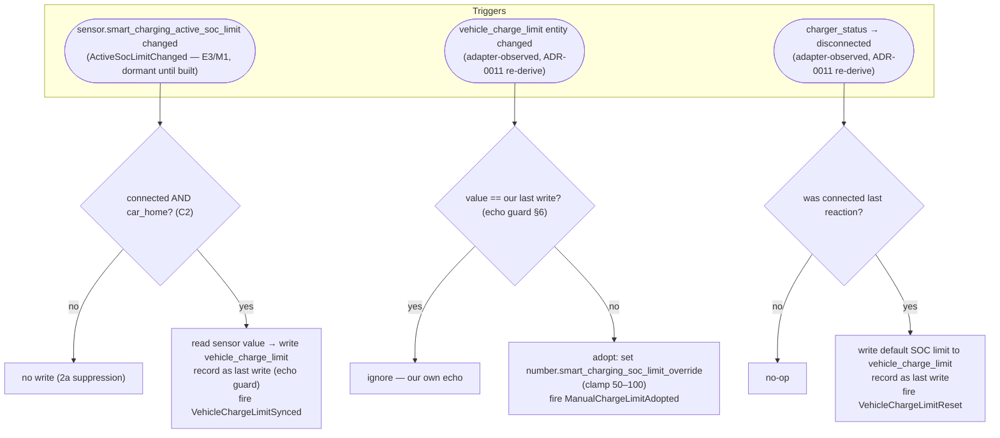

# Vehicle-Limit Manager slice (M2 / V12) — design

**Date:** 2026-07-21
**Status:** draft (issue #303, epic #302)
**Type:** implementation design (a slice of the approved architecture — not a new decision)

This document defines the **Vehicle-Limit Manager** (M2, volatility **V12**) and the read/write
`vehicle_charge_limit` adapter role it consumes (**RA1-VL**): the service that keeps the vehicle's own
charge-limit setting synchronised with the System's [active SOC limit](../analysis/system-overview.md#ubiquitous-language)
in both directions, and resets it to the [default SOC limit](../analysis/system-overview.md#ubiquitous-language)
on disconnect.

It is a deliberate **slice** of the full architecture: every component below is a slice of a service
already named in [`../design/system-design.md`](../design/system-design.md) (§3 catalog, §5.2 sequence)
and sequenced in [`../design/project-plan.md`](../design/project-plan.md) (task **M2**, with the
**RA1-VL** adapter note). Nothing here introduces a new service, call direction, or structural
decision — with two placement/config choices flagged as judgment calls (§9) that the human partner
should confirm or overturn in review.

Behavior is owned by [UC09](../analysis/use-cases/UC09-sync-charge-limit-with-car.md) (R6) and by
[ADR-0011](../adl/0011-cross-manager-coordination-via-domain-events.md), which **refines** UC09's
trigger mechanism. This document **cites** those as test anchors and does **not** restate their rules
as if it owned them. Where UC09 and ADR-0011 differ on how the System→vehicle trigger is obtained,
**ADR-0011 (the later, Accepted decision) wins** — see §5.

---

## 0. Dependency on E3 / M1 — READ FIRST (proceeding ahead of schedule)

**This slice is being authored ahead of its upstream dependency, at the explicit direction of the
human partner, so the design is ready when that dependency lands.** Per epic #302, the SOC-Target
Engine **E3** and the Coordinator wiring **M1** that together *publish* the `ActiveSocLimitChanged`
domain event — the signal this Manager's System→vehicle write branch consumes — are tracked in the
**still-open** epic #255 and are **not built yet in the form M2 needs**.

Concretely, as of this writing (verified against the code, not assumed):

- `custom_components/smart_charging/coordinator.py` already computes the row-3 active SOC limit
  (`resolve_active_soc_limit(self.soc_limit_override)`) inside its cycle, **but does not surface it**:
  there is no `sensor.smart_charging_active_soc_limit` entity and no `ActiveSocLimitChanged` event
  published anywhere.
- `entity-catalog.md` (line for `sensor.smart_charging_active_soc_limit`) and ADR-0011's Consequences
  both specify that entity + event as the contract M2 subscribes to — but ADR-0011 records the
  glossary / producing-flow / entity-catalog changes that introduce it as **follow-up analysis work
  gated by its own issues, not yet done**. The `2026-07-20-captar-design.md` §9 and
  `2026-07-20-solar-solaronly-design.md` §4 both explicitly *defer* materializing that sensor
  because, until this slice, "no consumer exists yet." **M2 is that first consumer.**

**Consequence for this slice (stated out loud, not hidden):** M2's two **adapter-observed** branches
— vehicle-side manual adoption (§5.2) and disconnect reset (§5.3) — depend on **nothing** from E3/M1
and are **fully functional the moment this slice ships**. M2's **System→vehicle write-on-change**
branch (§5.1) is specified against the `ActiveSocLimitChanged` / `sensor.smart_charging_active_soc_limit`
contract, is **unit-tested in the HA harness against a simulated instance of that entity**, and is
**dormant in production until E3/M1 materialize the entity and fire the event** (plus the ADR-0011
analysis follow-ups land). **This slice does NOT build that sensor or that event** — doing so would be
inventing E3/M1's deliverable and performing out-of-band analysis work ADR-0011 assigns to separate,
gated issues. It is recorded here as a hard dependency (§8), not silently absorbed.

M2 must **not** re-derive the resolved active SOC limit itself: ADR-0011 Option B (reconstructing the
Coordinator's threaded step-up/reserve input composition inside a second Manager) was **rejected**.
M2 waits for the published signal. This is the crux of why the write branch is dormant rather than
"temporarily re-derived."

---

## 1. Why this slice is exactly M2 + RA1-VL (+ the roles M2 reads)

| UC09 / R6 needs | Current status | This slice |
| --- | --- | --- |
| A settable vehicle charge-limit output (write the active SOC limit; read it back) | No `vehicle_charge_limit` role in the adapter factory | **In scope** — RA1-VL: the read/write `vehicle_charge_limit` adapter role (§4) |
| To know the car is at home (C2 home-only write gate) | No `car_home` role in the factory | **In scope** — `car_home` read adapter (§4; an RA2-family role built early, M2 being its first consumer — same rationale as RA1-VL) |
| Canonical charger status (disconnect transition; connected-at-home gate) | `charger_status` adapter **already built** (`StatusReadAdapter`) | **Reused unchanged** |
| A default SOC limit to reset to on disconnect / adopt manual changes into | `number.smart_charging_soc_limit_override` **already built** (default 80 %, 50–100, R6) | **Reused unchanged** — no new config field (§3) |
| The resolved active-SOC-limit *change* signal | `ActiveSocLimitChanged` / `sensor.smart_charging_active_soc_limit` **not built** (E3/M1, deferred) | **Out of scope — hard dependency** (§0/§8); the write branch is dormant until it lands |
| The Manager itself (three branches, echo guard, event production) | Does not exist | **In scope** — `managers/vehicle_limit.py` (M2) (§5) |

§8 lists what is deferred (M3 notifications, UC08/UC10; the runtime dashboard C5; broader C6
external-event wiring; automatic capability detection) — none of which UC09 needs to run.

---

## 2. Success criteria (what "works" means)

Anchored to UC09's scenarios and R6's acceptance criteria (cited, not restated):

1. **System→vehicle (dormant until E3/M1, §0).** When `sensor.smart_charging_active_soc_limit`
   changes value while the car is connected (`charger_status ∈ {connected, charging}`) **and**
   `car_home` is true, M2 writes the new value to the vehicle through `vehicle_charge_limit` within one
   reaction, and records that value as its own last write (echo guard, §6). — UC09 MSS step 2; R6 AC 2.
2. **Away-from-home suppression (C2).** When the same change occurs but `car_home` is false, M2 makes
   **no** write to the vehicle; the value is written the next time the car is confirmed connected *and*
   at home. — UC09 alt 2a; R6 AC 4.
3. **Vehicle→System manual adoption.** When `vehicle_charge_limit` reports a value **not attributable
   to M2's own last write** (echo guard, §6), M2 adopts it as the default SOC limit by setting
   `number.smart_charging_soc_limit_override` (clamped to its 50–100 range), rather than overwriting it.
   This holds **regardless of `car_home`** (adoption is a read+adopt, not a vehicle write). — UC09 MSS
   steps 4–6, alt 5a; R6 AC 5.
4. **Echo guard (no feedback loop).** When the vehicle reports back the exact value M2 just wrote, M2
   recognises it as its own echo and does **not** treat it as a manual change. The manual-change →
   adopt → resolved-write-back → echo sequence (§5.1↔§5.2) settles without oscillation. — UC09
   exception flow "A System write reflects back…".
5. **Disconnect reset.** When `charger_status` transitions to `disconnected` from `connected`/
   `charging`, M2 writes the current default SOC limit (`number.smart_charging_soc_limit_override`,
   default 80 %) to the vehicle through `vehicle_charge_limit`. — UC09 MSS steps 7–8; R6 AC 3.
6. **Unmapped vehicle → no-op.** When `vehicle_charge_limit` is not mapped, M2 performs no writes and
   registers no vehicle-side listener; charger-current control (UC01–UC05) is unaffected. — UC09
   exception flow "The vehicle does not expose a settable charge limit"; precondition.
7. **Domain events.** M2 fires `VehicleChargeLimitSynced` / `ManualChargeLimitAdopted` /
   `VehicleChargeLimitReset` on the HA event bus as they occur (past-tense mapped, §7). — UC09 "Domain
   events produced".

---

## 3. Install-time / options additions (minimal config surface)

Extends the existing config/options flow (ADR-0005 data-vs-options split retained). **Two new `data`
keys; zero new options keys; the reset/default value reuses an entity that already exists.**

| Field | Bucket | Role / Notes |
| --- | --- | --- |
| **Vehicle charge-limit entity** (`CONF_VEHICLE_CHARGE_LIMIT_ENTITY`) | **data** — new, **optional** | RA1-VL. Mapped to the vehicle's settable charge-limit entity (a `number`-domain entity, matching `charger_current`'s write path — §4). When blank/absent, UC09 does not apply and M2 is inert (success criterion 6). Data-bucket because remapping a hardware role mid-cycle is reconfigure-only (ADR-0005), exactly like every other role. |
| **Car-home entity** (`CONF_CAR_HOME_ENTITY`) | **data** — new; **required whenever `CONF_VEHICLE_CHARGE_LIMIT_ENTITY` is mapped** | The presence entity (`device_tracker` / `person` / `binary_sensor`) backing C2's home gate. Config-flow validation rejects a save that maps `vehicle_charge_limit` without `car_home` — the C2 home gate is **not** optional, so a vehicle-limit output with no way to check "at home" would be unsafe. Mirrors the existing `required_when_solar_installed` / `required_when_captar_available` guard shape on `ev_soc`. **Judgment call — §9.1.** |
| **Default / reset SOC limit** | — | **No new field.** The value M2 resets to on disconnect and adopts manual changes into **is** the existing `number.smart_charging_soc_limit_override` (config-time default `CONF_DEFAULT_SOC_LIMIT` = 80 %, runtime range 50–100). R6 AC 1/3 and UC09 step 8 name this exact entity ("default SOC limit, default 80 %"). Adding a separate reset value would duplicate it and could drift. **Judgment call — §9.2.** |

No new **options** keys: there is no echo-guard tolerance dial (§6 uses exact-match), no separate
reset value, and no reaction-interval (M2 is event/state-change driven, not polled — §5.4).

---

## 4. Resource Access: RA1-VL and the `car_home` role

Both are built into the existing adapter factory (`adapters/factory.py`), extending — not
restructuring — RA1 per ADR-0003. New role keys go in `const.py` alongside the existing `ROLE_*`.

- **`vehicle_charge_limit` (read/write) — RA1-VL.** Reuses the existing
  **`NumericReadWriteAdapter`** (`adapters/numeric.py`) unchanged — the same class `charger_current`
  already uses, whose `write()` calls the `number.set_value` service. Registered **only when
  `CONF_VEHICLE_CHARGE_LIMIT_ENTITY` is mapped** (optional, like `grid_voltage`/`ev_soc`), so an
  install whose vehicle exposes no settable limit simply has no `ROLE_VEHICLE_CHARGE_LIMIT` key.
  Value unit is percent (mirrors the active SOC limit; `entity-catalog.md`). A `None` read means
  missing/unavailable/non-numeric — for this role that is **not** the ADR-0007 fault path (M2 is not
  in the control-cycle set NF4/ADR-0007 govern); it means "no reliable vehicle value this reaction",
  and M2 skips (§5, edge cases). *Known limitation, inherited from `charger_current`:* the write path
  assumes a `number`-domain target entity; a vehicle whose charge limit is exposed on a different
  platform is out of scope for this adapter (noted in §8).
- **`car_home` (read) — RA2-family role, built early.** A new small boolean read adapter
  (`PresenceReadAdapter`) mapping a presence entity's state to a `bool`: `home` / `on` → `True`;
  `not_home` / `off` → `False`; missing/unavailable/unknown → `None`. Project-plan files `car_home`
  under RA2, but M2 is its only consumer in this slice, so — exactly as the project-plan's **RA1-VL
  note** does for `vehicle_charge_limit` — it is built here, at its first consumer, rather than in a
  separate earlier phase. It is a read-only role; `write()` raises `NotImplementedError`.

`charger_status` is **reused unchanged** (`StatusReadAdapter`, already in the factory).

---

## 5. Control flow (the three branches)

M2 is a **Manager**: it is *triggered* (by HA state changes / a domain event), reads inputs through
Resource Access, and writes results through Resource Access and the Store. It holds **no** control-cycle
logic and **never** calls or is called by the Coordinator (M1) — coordination is one-way via the
published `ActiveSocLimitChanged` event only (system-design §4 rule 5; ADR-0011). Sequence authority is
[system-design §5.2](../design/system-design.md#52-vehicle-charge-limit-sync-uc09), **as refined by
ADR-0011** (M2 reads the materialized entity rather than reconstructing the Coordinator's composition).



### 5.1 System → vehicle: propagate the resolved active SOC limit (dormant until E3/M1)

**Trigger:** a state change on `sensor.smart_charging_active_soc_limit` (the entity ADR-0011 materializes
the `ActiveSocLimitChanged` event on). **Guard (C2):** `charger_status ∈ {connected, charging}` **and**
`car_home` is `True`. **Action:** read the new limit from the sensor's state, write it to the vehicle
through `vehicle_charge_limit`, **record it as the last-written value** (§6), fire
`VehicleChargeLimitSynced`. If the guard fails (away, or disconnected), **no write** — the value is
propagated on the next reaction where the car is confirmed connected-at-home (UC09 alt 2a). This is the
**only** branch that consumes an E3/M1 signal, and the **only** dormant one (§0).

*Why read the sensor, not recompute:* ADR-0011 Decision — the resolved limit is a Coordinator-owned
composition (SOC-Target Engine fed the active profile + threaded step-up/reserve context); M2 reads the
single published resolution rather than duplicating that composition (Option B rejected).

### 5.2 Vehicle → System: adopt a manual change (fully functional now)

**Trigger:** a state change on the mapped `vehicle_charge_limit` entity, read back through the adapter.
**Echo guard (§6):** if the reported value **equals M2's own last write**, it is the System's write
reflecting back — **ignore** (no adoption, no event). **Action otherwise:** the user changed it directly
on the car/app → adopt it as the default SOC limit by setting
`number.smart_charging_soc_limit_override` to the reported value **clamped to 50–100** (the number
entity's own range, R6 AC 1), fire `ManualChargeLimitAdopted`. Holds **regardless of `car_home`** (UC09
alt 5a — C2 restricts only *System writes to the vehicle*, never the System's ability to read+adopt).

*The loop closes cleanly:* adopting sets the override → (once E3/M1 exist) that changes the resolved
limit → `ActiveSocLimitChanged` fires → §5.1 writes the resolved value (now equal to the adopted value)
back to the vehicle → the vehicle echoes it → §6's echo guard suppresses it. No oscillation (UC09
exception flow). Until E3/M1 exist, §5.1 simply doesn't fire and adoption still works standalone.

### 5.3 On disconnect: reset to the default (fully functional now)

**Trigger:** `charger_status` transitions to `disconnected` **from** `connected`/`charging` (M2 holds
the previous canonical status to detect the transition edge, not the level). **Action:** write the
current `number.smart_charging_soc_limit_override` value (default 80 %) to the vehicle through
`vehicle_charge_limit`, record it as the last write (§6), fire `VehicleChargeLimitReset`. Mirrors the
active-SOC-limit reset the disconnect already triggers in the coordinator (R7). Not gated on `car_home`:
for this single home charger a disconnect only ever happens at home (UC09 trigger 3 note), and UC09
step 8 does not gate the reset on presence.

*Edge case, named:* a vehicle may become unreachable the instant it unplugs, so the reset write is
**best-effort** — if the adapter write fails/raises, M2 logs and moves on; the active-SOC-limit reset
(R7, coordinator-side) is unaffected. This is inherent to writing a just-disconnected vehicle and is not
a regression.

### 5.4 How M2 is driven (trigger wiring)

M2 registers HA **state-change listeners** at integration setup (`__init__.py`, via
`async_track_state_change_event` on the *mapped underlying entities*, resolved from config-entry data):
the `charger_status` entity (§5.3), the `vehicle_charge_limit` entity (§5.2), and
`sensor.smart_charging_active_soc_limit` (§5.1). This is the **minimal, M2-scoped slice of C6**
(external-event wiring) — enough to drive M2's own three triggers — and is the same self-wiring pattern
M1 already uses (the Coordinator self-schedules its own control-interval timer rather than waiting for a
separate timer Client, per ADR-0006). The broader C6 (notification-action wiring for M3, etc.) stays
deferred (§8). **This "Manager wires its own triggers vs. a dedicated C6 Client owns them" choice is a
flagged judgment call — §9.5.** Listeners for un-mapped roles are simply not registered (success
criterion 6). Because listeners live only while the entry is loaded, ADR-0008 reload semantics need
nothing special — a reload tears down and re-registers them.

---

## 6. The echo guard (avoiding the write/read feedback loop)

The mechanism required by UC09's exception flow, kept as small as it can be:

- M2 holds one piece of in-memory state: `_last_written_limit: float | None` (the last value it wrote to
  `vehicle_charge_limit`, in canonical percent), set by §5.1 and §5.3, initialised `None`.
- On a vehicle-side change (§5.2): if the reported value **equals** `_last_written_limit`, it is our own
  write reflecting back → ignore. Otherwise → manual change → adopt.
- **Exact match on the canonical percent value** (our side writes and reads whole percents through the
  `number` domain; the value written and the value read back are the same canonical unit). No tolerance
  dial (§3) — a tolerance would risk *swallowing* a genuine small manual nudge. **Judgment call — §9.3.**
  *Boundary, stated:* this assumes the external vehicle entity reports back the value we wrote at the
  same quantization. A vehicle whose charge-limit `number` uses a coarser step (e.g. 5 %) could report a
  rounded value that fails the exact-match and be misread as a manual change → a spurious
  `ManualChargeLimitAdopted` that re-adopts a near-identical default. This is a **correctness edge, not a
  safety issue** (no unsafe current results — M2 issues no set-point), and such non-unit external steps
  are out of scope for this slice; §9.3's tolerance alternative is where to revisit it if a real vehicle
  needs it.
- `_last_written_limit` is **not persisted** across a reload/restart (it is transient loop-guard state,
  not user state). Worst case after a restart: the very first vehicle report that happens to equal the
  reset/override value is treated as an echo and not re-adopted — harmless, because that value already
  *is* the default. Consistent with the project's "cross-cycle state is transient, seeded from
  restore-state only where it is *user* state" convention (ADR-0008; the coordinator's smoothing window
  is likewise not persisted).

This guard is what makes §5.1↔§5.2 a settling loop rather than an oscillation, and it is why a
`ChargerDisconnected` / `VehicleChargeLimitChanged` domain **event** was *not* introduced (ADR-0011:
these are external adapter states M2 observes directly, with the echo guard, not cross-Manager events).

---

## 7. Domain events produced

M2 fires the three UC09 events on the HA event bus (past-tense PascalCase → snake_case HA event type,
the DDD→HA mapping CLAUDE.md prescribes), for observability and future automation triggers. **None is
consumed by another Manager** (ADR-0011: no cross-Manager subscriber needs them), so this is
fire-and-forget — it adds no coordination edge:

| Event (UC09) | HA event type | Fired when |
| --- | --- | --- |
| `VehicleChargeLimitSynced` | `smart_charging_vehicle_charge_limit_synced` | §5.1 wrote the resolved limit to the vehicle |
| `ManualChargeLimitAdopted` | `smart_charging_manual_charge_limit_adopted` | §5.2 adopted a vehicle-side change as the default |
| `VehicleChargeLimitReset` | `smart_charging_vehicle_charge_limit_reset` | §5.3 reset the vehicle to the default on disconnect |

M2 does **not** publish `ActiveSocLimitChanged` — it *consumes* it (§5.1); that event is E3/M1's to
produce (§0/§8).

---

## 8. Deliberately deferred / dependencies

**Hard dependency (blocks only §5.1 in production, not this slice's delivery):**

- **`ActiveSocLimitChanged` + `sensor.smart_charging_active_soc_limit` (E3 / M1, epic #255).** The
  System→vehicle write branch (§5.1) is dormant until the Coordinator materializes the resolved active
  SOC limit as that owned diagnostic entity and fires the event on it (ADR-0011 Consequences), which in
  turn depends on the ADR-0011 **analysis follow-ups** (a glossary entry; listing the event under the
  producing flow in `control-cycle.md`/`resolution-rules.md`; the entity-catalog materialization) —
  each gated by its own issue and **not done**. This slice references that contract and tests §5.1
  against a simulated sensor; it builds none of it. **A follow-up issue should track wiring §5.1 live
  once E3/M1 land** (re-diff the entity id and event type against whatever E3/M1 actually publish).
- **`managers/` subpackage ADR (#330).** §9.4 was confirmed to place M2 under a new `managers/`
  subpackage rather than the package root, but that is a package-layout decision needing its own ADR
  (mirroring ADR-0010's `engines/` call) before the `custom_components/` code lands. Task set 4
  (§10/§11) should not start until that ADR is Accepted.

**Out of scope (later project-plan slices, each independent of M2):**

- **Notification Manager (M3), UC08/UC10** — evening prompt, plug-in reminder, R5 delivery.
- **Runtime dashboard (C5, UC11)** and the **broader C6 external-event wiring** beyond M2's own three
  listeners (§5.4).
- **Automatic capability detection (E9, R18 beyond mapping).** Whether the vehicle exposes a settable
  limit is decided purely by whether `vehicle_charge_limit` is mapped (UC09 precondition) — no automatic
  detection.
- **A vehicle-limit write path for non-`number` target entities** (§4 known limitation) — inherits
  `charger_current`'s `number.set_value` assumption; a different platform would be a separate adapter.
- **A config-entry migration.** The two new `data` keys are read with `.get(...)` fallbacks (unmapped →
  inert), so an entry predating them needs no migration — the same pattern every prior slice used.

**No safety behavior is deferred.** M2 issues no charger-current set-point and touches none of the
control-cycle clamps (E5/E6) or the ADR-0007 fault path; the grid-safety and billing clamps are
entirely M1's and are untouched. C2 (the home-only write gate) — the one safety-relevant rule in M2's
own scope — **is implemented** (§5.1 guard, §3 `car_home` requirement), not deferred.

---

## 9. Flagged judgment calls (please confirm or overturn in review)

Working non-interactively, these are the conservative, spec-faithful defaults chosen at each real fork.
Each is cheap to change if the human partner prefers otherwise.

- **§9.1 — `car_home` required when `vehicle_charge_limit` is mapped.** C2's home gate is not optional,
  so allowing a vehicle-limit output with no presence source would let the System write to the vehicle
  without ever confirming "at home". Chosen: config-flow validation requires `car_home` in that case
  (mirroring `ev_soc`'s existing guard). *Alternative if overturned:* treat a missing/`None` `car_home`
  as "cannot confirm home → suppress the write" at runtime (fail-safe, no config guard) — softer but
  silently disables §5.1 on a misconfigured install.
- **§9.2 — Reuse `number.smart_charging_soc_limit_override` as the reset/default value (no new field).**
  R6/UC09 name "the default SOC limit (default 80 %)" as exactly this entity. *Alternative if overturned:*
  a dedicated `CONF_VEHICLE_RESET_LIMIT` — rejected as duplication that can drift from the SOC default.
- **§9.3 — Echo guard is exact-match, no tolerance dial.** Both directions carry the same canonical
  whole-percent value. *Alternative if overturned:* a small tolerance — rejected because it can swallow a
  genuine ±1 % manual nudge.
- **§9.4 — M2 lives in a new `managers/` subpackage (`managers/vehicle_limit.py`), not the package
  root.** **Confirmed by the human partner in PR review**, overturning this design's original
  root-placement default. ADR-0002 places the Coordinator Manager at the root (`coordinator.py`) but
  names no home for the M2/M3 Managers, so a `managers/` subpackage is a package-layout decision in
  the same family as ADR-0010's `engines/` call — **it needs its own follow-up ADR before the
  `custom_components/` code is written** (tracked as a separate issue; see §8). This design/plan is
  updated to build against `managers/` now so it doesn't drift once that ADR lands; `develop-task`
  should not start Task set 4 (§10/§11) until the ADR is Accepted.
- **§9.5 — M2 self-registers its trigger listeners at setup, rather than a dedicated C6 Client owning
  them.** `project-plan.md` defines **C6 — External-event wiring** as a distinct Client that wires
  charger connect/disconnect, vehicle-limit changes, and notification actions to M2/M3, and which
  *depends on* M2. This slice wires M2's own three triggers inside M2's setup (§5.4) so the adoption and
  disconnect branches ship working now, following the same self-wiring precedent M1 uses for its
  control-interval timer (ADR-0006). Chosen: self-wiring, with C6 scoped down to the *broader*
  app-action wiring (notification responses for M3) that genuinely needs a separate Client. *If the team
  prefers all Manager-trigger wiring to live in a single C6 Client*, M2's listener registration moves
  there when C6 is built — a mechanical relocation, no behavior change. **Flagged so it is not silently
  re-homed later.**

---

## 10. Testing (ADR-0009 harness split)

M2 is a **Manager** and every new adapter is HA-coupled, so **all of this slice's tests use the HA
harness** — there is no pure-logic (`modes/`/`engines/`) module in it, hence no plain-pytest suite. The
one piece of near-pure logic (the echo-guard comparison and the disconnect edge detection) lives inside
M2 and is exercised through the harness against M2's public reactions, not extracted into an engine
(it is orchestration state, not a reusable policy — system-design §3).

- **RA1-VL / `car_home` adapters** (HA harness, `tests/adapters/`): factory builds
  `ROLE_VEHICLE_CHARGE_LIMIT` (read/write) and `ROLE_CAR_HOME` (read) when mapped and omits them when
  not; `vehicle_charge_limit.write()` calls `number.set_value`; `car_home` maps `home`/`on`→True,
  `not_home`/`off`→False, unavailable→None.
- **Config flow** (HA harness, `tests/test_config_flow.py`): mapping `vehicle_charge_limit` without
  `car_home` is rejected (§9.1); mapping neither is accepted (M2 inert); a pre-existing entry without
  the keys reads them as absent (no migration).
- **M2 Manager** (HA harness, `tests/test_vehicle_limit.py`) — one test per UC09 scenario/flow:
  - §5.1 write-on-change **against a simulated `sensor.smart_charging_active_soc_limit`**: connected +
    at home → writes the new value + fires `VehicleChargeLimitSynced`; away (2a) → no write; disconnected
    → no write.
  - §5.2 adoption: a vehicle-side change ≠ last write → sets `soc_limit_override` (clamped) + fires
    `ManualChargeLimitAdopted`; adoption fires **even when away** (5a).
  - §6 echo guard: a vehicle report **equal** to M2's own last write → no adoption, no event; the full
    §5.1→§5.2 reflect-back settles without a second write.
  - §5.3 disconnect reset: `connected`→`disconnected` edge → writes the default + fires
    `VehicleChargeLimitReset`; a `disconnected`→`disconnected` non-edge → no-op; best-effort write
    failure is swallowed.
  - Unmapped `vehicle_charge_limit` → M2 registers no listeners and writes nothing (success criterion 6).
- **Setup wiring** (HA harness, `tests/test_init.py`): M2 is constructed and its listeners registered
  (only for mapped roles) at `async_setup_entry`; torn down on unload/reload (ADR-0008).

Each test names the UC09 step / R6 AC it anchors to in its docstring (traceability, per `write-tests`).

---

## 11. Packaging

```text
custom_components/smart_charging/
  const.py               # + CONF_VEHICLE_CHARGE_LIMIT_ENTITY, CONF_CAR_HOME_ENTITY (data);
                          #   + ROLE_VEHICLE_CHARGE_LIMIT, ROLE_CAR_HOME; + the three HA event-type
                          #   constants (§7); + ACTIVE_SOC_LIMIT_ENTITY id M2 subscribes to (§5.1)
  adapters/
    presence.py           # new — PresenceReadAdapter (car_home): state→bool (RA2 role, built early)
    factory.py            # + vehicle_charge_limit (NumericReadWriteAdapter, reused) + car_home, both
                          #   optional; vehicle_charge_limit gated on its mapping, car_home alongside
  managers/
    vehicle_limit.py       # NEW — M2: the Vehicle-Limit Manager (§5/§6/§7), pending its own
                          #   follow-up ADR for the managers/ subpackage (§9.4). No HA policy
                          #   beyond orchestration.
  config_flow.py          # C4 — + the two data fields + the required_when_vehicle_limit_mapped guard
  __init__.py             # setup — construct M2, register its state-change listeners (§5.4), tear down
```

`tests/` mirrors 1:1 (ADR-0002/0009): `tests/adapters/test_presence.py`, additions to
`tests/adapters/test_factory.py`, `tests/test_config_flow.py`, `tests/test_init.py`, and a new
`tests/managers/test_vehicle_limit.py`.

No `engines/` or `modes/` module is added — M2 composes existing engines (via the published limit) and
adapters; it is not itself a policy engine.

---

## 12. Next step

This design feeds the `writing-plans` skill to produce the ordered, test-driven implementation plan
(`2026-07-21-vehicle-limit-manager.md`). Build order follows `project-plan.md`'s layering: RA1-VL +
`car_home` adapters (Resource Access) → config-flow fields → M2 Manager (composes them) → setup
wiring. No `custom_components/` code is written until the paired plan exists and is approved. §5.1's
live wiring against E3/M1's `ActiveSocLimitChanged` is tracked as a follow-up (§8) to be picked up once
epic #255 lands.
